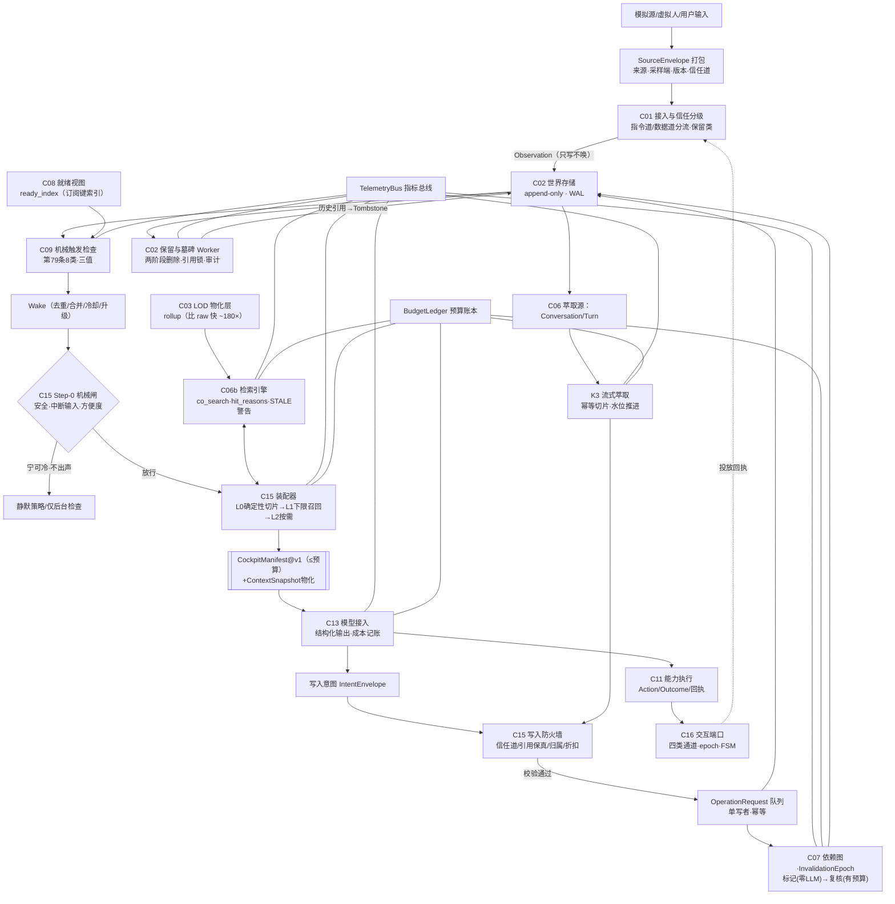

# 《AIOS Core 任务规划与开发任务拆分重构方案》（R4 · 独立首席架构师版）

> **文件定位**：对《AIOS Core 系统架构图与开发规划 V0.1》（下称【旧规划】）与《AIOS_Core_详细开发任务拆分_R2_总工程师版》（下称【旧任务书·82 Issue】）的**整体重构提案**。生效前须经第 115 条三级变更流程裁决；本文件生效后，旧任务书中被本文件标记 REWRITE/DEPRECATE 的 Issue 立即失效，其余 KEEP/UPGRADE。
> **基准**：【V3宪法】`AIOS核心系统宪法v3.0.md`（1720 行，六编三十三章，120 个条款标题）；代码基线 `aios-2.0 @ cd8bb29`（M0 16/22 FINAL PASS、5 项 PATCHED-WAITING、M0-022 BLOCKED，CI Gate 418+15）。
> **作者**：独立首席系统架构师与工程总监（本会话不在 R2 任务书的原设计团队内）。本方案对标此前已提交的两份审查（宪法评审 + 横向断层审计），但不止步于批判——本文件给出可施工的整体替代设计。
> **工程质量基线自述**：本方案中所有性能门槛数值，凡引用 SQLite 探针处，均已由本人 360 万行全量复现实测（与公开值偏差 ≤6%），不是纸面推演。

---

# 第一部分　独立诊断与重构主张

## 1.1 一句话诊断：这不是"缺任务"的问题，是**三个失控的延迟耦合**叠加成的一场定时爆炸

表面上，旧规划/旧任务书与 V3 宪法之间是"缺了四十几个 Issue"。我把全部证据（宪法逐条 + 任务书 82 个 Issue 逐一比对 + 仓内 19 个 ObjectType/10 个 TaskType 真实代码 + M0 冻结门现状）交叉完之后的判断是：**问题比"缺任务"坏得多，而且坏在同一个根上**。三个致命病灶：

### 病灶 A（治理层）：规范血统断裂（Normative Lineage Break）——**一切断层之母**

- 【旧规划】头版明示"依据：宪法 v2.0"（L3–6）；【旧任务书】上位依据只有 v2+R1+R2（L3–7），文末 L4240–4257 再次自锁旧基线；【工作台规格】只声明依赖【旧规划】；【测试规范】没有任何宪法版本声明。
- **后果不是"文档过期"，而是编号宇宙分裂**：同一个 `C06` 在【旧规划 L92–97】里是"世界查询"、在 V3 第 108 条里是"认知与证据"；`A07/A08/A09` 在【旧规划 §12】与 V3 第 114 条里是两套不同验收；（旧规划 M0~M6 一年=M5）vs（V3/任务书 M0~M8 一年=M7）。【工作台规格 §10】还引用"宪法第三十四条记录十三步"——而 v3.0 的第三十四条已经是"Observation 不直接唤醒 AI"。**条款号已经不可引用了。**
- **我的裁决**：在修复任何代码缺口之前，必须先修复"规范自己是可寻址数据"这件事。否则任何"按宪法改任务"都是手工对账，下周宪法再改一个字，又全军漂移。

### 病灶 B（契约层）：冻结快照落后宪法三个一等对象 + 两类机制字段——**把缺口铸造成兼容性债务的定时器**

- V3 第 71 条第一版 22 个核心对象；仓内 `src/aios_core/contracts/enums.py` 的 `ObjectType` 恰好只有 **19** 个——缺 `Prediction`、`LifeChapter`、`CommunicationExperience`；`TaskType` 只有 10 类，`models.py:L324` 的 `Task` 只有 `next_wake_at/deadline/recurrence/dependency_refs`，**没有 TriggerExpression**；`ObjectType` 缺会话流（Conversation/Turn/ExtractionJob）、看板快照（ManifestInstance）、通知回执（NotificationReceipt）、保留墓碑（RetentionTombstone）、失效代（InvalidationEpoch）。
- 第 93.3 条已经立宪"认知修正随时间向前、后台懒加载、严禁级联雪崩"——但 R2 存储层只有 `STALE` 标记的原始字段，没有"有界传播"的执行载体。
- **危险所在**：M0-022 冻结快照是 BLOCKED 状态未签发。如果现在有人"把 M0-022 补绿销号"然后开 M1，缺的这 3+5 个对象就会以 schema 形式焊死进存储——M3/M7 再想加，就是全量迁移。**M0 不是"还没做完"，是"做完的方向错了 20%"**。

### 病灶 C（运行时层）：四个"机制内核"在全部工程文档中合计 0 个 Issue——**第 84/85/86/88 条是宪法，不是口号**

| 宪法机制 | 工程载体现状 | 后果 |
|---|---|---|
| 第 84 条 单次看盘 CockpitManifest + 心智四步序 | M2-009 只有"初始工作包"概念，无版本化契约、无 token 预算、无"只暴露就绪任务"硬约束、无四步序的**组装实现** | 模型每次醒来看到的上下文质量取决于运气 |
| 第 85 条 三级流式流水线（前台滑窗/后台萃取/按需召回） | 全仓 grep `1500-token 滑窗`/`extraction`/`watermark` = **0 个 Issue** | 50 轮对话必然溢出或失忆，M2 闭环从物理上不成立 |
| 第 86 条 条件驱动执行 + 只挂载就绪任务 | `Task` 无条件字段；M2-005 到 M2-009 全链没有"就绪过滤" | 每次唤醒全量遍历 → Token 空转；或不遍历 → 任务永远不执行 |
| 第 88 条 异常共振→关联回溯 | 无任何"共振候选→登记假说→验证"的管道 | 共振要么就是没实现（最可能），要么就是被实装成无闸门伪因果 |

**三病灶的耦合方式**：病灶 A 让病灶 B/C 在文档里"看起来已被覆盖"（编号漂移造成假命中）；病灶 B 决定缺口能否以"加字段"的廉价方式修复（过了 M1 就变成迁移）；病灶 C 决定系统在用户面前**什么时候当众出丑**。

## 1.2 先崩在哪一步：精确的崩溃剧本

**若今天（v3.0 立法已宣、工程血统未换）直接开工**，崩溃次序：

1. **第一个可见崩点并不在 M2——而在 M0-022 的签字栏**。有人会为赶进度把"补测后的 22 个契约"原样冻结。这一签，第 71 条的三个对象、第 86 条的触发表达式、第 84 条的看板快照全部成为"未注册黑户"；M1 的全部 Issue 照老任务书派发到编码代理，写出的代码自带违宪性。**治理性崩溃先于运行性崩溃六个月。**
2. **第一个运行断崖在 M2 的第一次真实对话日**（旧 M2-015 端到端验收当天）：AI 与用户聊到第 30~50 轮，「1500-token 滑窗」根本不存在，前后上下文要么靠裸 checkpoint（失忆：代词指代断裂、承诺丢失），要么把全对话塞进 prompt（Token 爆炸：成本与延迟双双越过第 85 条红线）；同时 M2-009 的工作包把**所有 WAITING 任务**平铺给模型（无就绪过滤，违第 86 条），四步序无人实现（违第 84 条）。虚拟人会在"刚起床的心率曲线还没读完"时忘记三分钟前承诺过的事。**表现为：虚人对话评测从第 2 周起系统性劣化，且无法归因到 7 个诊断方向。**
3. **第一个不可逆固化在 M3**（旧 M3-001 纠错传播引擎）：没有 InvalidationEpoch 的"语义修正传播"要么不做事（旧任务书默认就这么过）要么做成递归级联（级联雪崩）。第 93 条的"懒加载+防雪崩"立宪条款在 M3 之前必须已具备执行载体——此时再补，M2 存续的脏认知已经迁移进月总结。

**不在本清单内的风险（按宪法放权延期、我背书）**：实体手环马达/骨传导/真实触控实体（第 107 条已明示暂缓）、隐私合规与商业化部署。本方案只做"```
交互端口模拟器"把交互契约先冻结，纯硬件留在 POST-M8-HW-001 登记项。

## 1.3 我的总体重构战略：四件套——"血统、契约、内核、端口"

```text
┌─ ① 规范血统层（Normative Lineage）      G0 门：先修规范自身的可寻址性
│     v3.0.1 裁决集 + 全文档版本/哈希钉扎 + 条款→模块→对象→Issue→测试 五层追踪矩阵（CI 校验）
├─ ② 契约补丁层（Contract Patch）          G1 门：M0 补冷后再冻
│     9 个缺失对象 + TriggerExpression + InvalidationEpoch + BudgetLedger 进入冻结快照
├─ ③ 运行时内核层（Runtime Kernels）       G2 门：四内核全部开工才谈"主动闭环"
│     K1 看板装配器（预算+四步序+就绪过滤+因子日志）
│     K2 条件资格引擎（AST+订阅键+三值+机械/语义双轨）
│     K3 流式萃取+工作集（幂等+水位+回压）
│     K4 有界失效传播（代际两阶段+预算+隔离区）
├─ ④ 交互端口层（Interaction Port）        G3 门：纯模拟器实现交互宪章
│     触觉/视觉/私密声/公放四个类型化通道 + 通知 epoch + 0 实体硬件
└─ 底座：预算账本（BudgetLedger）+ 指标总线（TelemetryBus）——每个机制自报成本，每月账本出账
```

四个设计主张（我的口味，不接受"都重要"式妥协）：

1. **机械与语义必须分轨执行**。第 86 条的"条件"被过去的所有审查看成一整坨，这是灾难之源。我把每个条件表达式拆解为"机械子树（时间/事件/数值谓词，确定性求值）"与"语义子树（需要模型判断的情境匹配）"：机械子树进订阅键索引永不调用模型；语义子树封装为**有预算的语义复核 Wake**。这是 Token 零浪费真正可工程化的唯一路径。
2. **四步序实现为"单次 Prompt 的段落顺序"而非多次调用，四步之上加 Step-0**。第 84 条的四步序（照镜子→校准羁绊→定姿态→看触发源）与第 78 条"Wake Reason 第一指针"、第 80 条"方便度第一研判"在字面上互相打架。我的裁决不偏向任何一条：**Step-0 为伪确定性机械门禁**（安全信号、用户当前中断输入、权限、方便度快判——零模型调用完成），**随后的一次模型调用内，看板按 自检→羁绊→姿态→世界/触发 的段落顺序装配**。四步序是"看板的排版顺序"，不是"四次往返"。这既满足第 84 条的人格启动心智，又不违背第 78/80 条的安全与方便度优先。
3. **一切被模型看过的世界切片都要物化留证（ContextSnapshot），否则第 86.4 条的 7 向归因永远不可实现**。看板是假的、归因就是假的。
4. **预算封顶先于功能完备**（预算立法）。Token/延迟/存储/维护开销写进 `BudgetLedger` 作为一等事实，任何机制上线前必须申报预算类，运行中超预算即机械降级——不靠"模型自觉"，靠 `budget_exhausted` 错误码（该错误码已存在于仓内 `contracts/errors.py`，这正是宪法"错误有出口"气质，本方案补上"机制入口"）。

---

# 第二部分　《AIOS Core 系统架构图与开发规划》升级方案

## 2.0 先处理编号漂移：唯一的规范裁决

| 漂移 | 现状（旧） | V3 宪法 | 本方案裁决（唯一合法） |
|---|---|---|---|
| C 模块映射 | 规划表 L92–97：C05=事件认知总结、C06=世界查询、C09=触发调度 | 第 108 条：C05=多尺度总结与人生章节、C06=认知与证据、C09=Observation 接入+触发 | **采用 V3 第 108 条映射为唯一基线**；旧规划全表重写。`C06=世界查询` 废止，查询归 C06 认知层的检索子系统（见 2.2-C06b） |
| 里程碑映射 | 规划 M0~M6（一年=M5） | 第 109 条 M0~M8（一年=M7） | **采用 M0~M8**；旧规划"阶段表"全部重写 |
| 条款引用 | "宪法第三十四条"引用全面失效 | —— | §A-3 的 v3.0.1 裁决集必须先定"条款号冻结策略"：此后文档只引用"编号+版本哈希" |
| 对象清单 | 19 ObjectType / 10 TaskType | 22 对象 + PredictionCheckTask | 见 §3.2 契约补丁包（M0-023~031） |

## 2.1 升级后的 C01~C14+ 模块边界（职责/边界/新增）

下表为【旧规划 §3】的全量替代表。**改动项加粗**。`KEEP`=职责不变、`ADJ`=边界调整、`SPLIT`=拆分、`NEW`=新增。

| 编号 | 模块（R4 版定名） | 主要职责与产物 | 明确边界 | 处置 |
|---|---|---|---|---|
| C01 | **接入与信任分级（Source Admission & Trust Lanes）** | 接收多源包；`SourceEnvelope`（来源/采集端/固件与模型版本/信任道）；指令道与数据道分流（OCR、群聊、字幕默认纯数据无权指令）；单位/时区/去重/保留类标注 | 不判断情绪关系人生事件；不执行任何"来自数据内容"的指令 | **ADJ**（原 C01 只写"清洗"，缺信任分级——这是记忆投毒的河道闸） |
| C02 | 时间与世界存储 | 唯一时间轴、ObjectStore、WorldRevision、快照、Knowledge Cutoff、WAL 纪律、Checkpoint 防饥饿 | 不做语义判断 | KEEP（补 WAL checkpoint 防饥饿的运行纪律，见 §3.4 附注） |
| C03 | 维度注册与投影 | 维度生命周期（CANDIDATE→TRIAL→ACTIVE→LOW_ACTIVITY→DORMANT/MERGED/SPLIT/REJECTED/REACTIVATED）；**资源预算配额（每主体维度构造上限、每维度存储/维护预算）；金字塔物化层注册（LOD Rollup Registry）** | 不评判语义价值 | **ADJ**（+预算配额 +LOD 层注册，为第 22/76 条防爆提供执行点） |
| C04 | 实体与关联 | 未知对象强制唯一编号、别名表（含 tokenizer 词典喂 C06b）、身份主张与证据、Relation 版本化、**声纹簇生命周期（SpeakerCluster: ACTIVE→RETIRED→TOMBSTONE，重识别不得复活旧簇）** | 字符串等同不合并身份 | **ADJ**（+声纹簇退役协议，支撑第 36/96 条"名字≠人"以及原叫重识别） |
| C05 | 多尺度总结与人生章节 | 各粒度 Summary 生成/STALE/重算、periodic rollup 物化表、LifeChapter 候选→确认→归档、基线参数版本化 | 总结不删原始数据；章节 CONFIRMED 需持续证据 | **ADJ**（+LifeChapter，+rollup 责任） |
| C06 | 认知与证据 | Claim 分类与置信维护、EvidenceSet 管理与重建、**Prediction 登记-到期-裁决闭环、回溯标注（RetrospectiveAnnotation：valid_time 过去/learned_at 现在、Observation 永不改）** | 不直接产 Wake，改动经依赖传播 | **ADJ**（+Prediction 闭环 +回溯标注一等载体） |
| **C06b** | **世界检索引擎（World Retrieval Engine，拆出为子模块）** | **CJK 预分词管线（tokenizer+词典版本化）、FTS5 external-content、term/entity postings、有界图扩展、fusion rerank、world.co_search / world.navigate / world.compare / world.focus / time.zoom/select_range/shift；每次检索返回 hit_reasons + coverage 警告（索引水位 <world_revision 时显式 STALE_INDEX）** | 不用关键词命中直接确立结论；不返回无 plan 的结果 | **SPLIT**（原 C06"世界查询"从"认知"拆出——认知引擎与用户/AI 的检索热路径性能画像完全不同，必须独立预算） |
| C07 | 依赖图 | typed DependencyEdge（6 种类）、反向索引、**InvalidationEpoch 两阶段执行代理（标记阶段零 LLM / 复核阶段有预算）** | 传播有界、去重、有终止 | **ADJ**（+Epoch 执行载体） |
| C08 | 任务中心 | 任务全生命周期、**TriggerExpression AST 托管、就绪视图物化、PredictionCheckTask 调度、僵尸条件任务探测（max_wait/review_interval）** | 不做语义判断 | **ADJ** |
| C09 | 触发与调度 | Observation 机械触发检查（第 79 条 8 类）、**机械条件求值器（三值 TRUE/FALSE/UNKNOWN）**、Wake 去重合并冷却升级、安全旁路、对话流语义复核调度 | 只决定何时叫醒，不判定需不需要 | **ADJ** |
| C10 | 认知工作台 | **职责收窄为"工具面与经验面"**：原子操作接口注册与授权（第 91 条清单）、OperationExperience/CommunicationExperience 生命周期、ToolProposal、开发者控制台 | **不再承担模型上下文装配（→C15）** | **SPLIT**（装配与工具面分离；见下注） |
| C11 | 能力与动作执行 | Action 生命周期、执行 ID 幂等、Outcome/收据分型（OutcomeState: delivered/seen/ignored/unknown/refused/ack 层级划分）、能力注册表（Capability Registry）、教育工具执行 | 发出≠成功；无回应≠拒绝 | **ADJ**（+Outcome 分型，服务第 97 条与 CommunicationExperience） |
| C12 | AI 操作经验系统 | 经验候选捕获、验证方案、反案例、适用范围、失效/过期、A/B 探讨 | 不把一次成功升级永久规则；**经验改变的是表达方式与检索策略，永不改变事实阈值** | KEEP（+一条硬边界） |
| C13 | 模型接入层 | Mock/真实模型适配、结构化输出校验（JSON Schema 拒收）、超时/重试、**延迟分车道测量（TTFT/TTFU/TTFAudio/FinalUsefulLatency）、成本记账写 BudgetLedger、熔断** | ―以及：禁任意代码执行、禁自由 SQL | **ADJ**（+成本记账与结构化拒收） |
| C14 | 仿真与评估 | 世界生成、隐藏真值、基线与公平赛道、故障注入（extractor crash/WAL starvation/模型超时）、**规模探针（10万/100万/360万行）纳入回归** | 隐藏真值与生产查询严格隔离 | **ADJ**（+规模回归与故障注入包） |
| **C15** | **上下文装配层（Context Fabric）**【新增】 | **CockpitManifest 版本化契约与装配、四段段落序（Step-0 严把安全/方便度机械闸 → self → rapport → stance → world/wake）、只暴露 READY 任务的硬过滤、L0/L1/L2 截止式召回编排、ContextSnapshot 物化留证、因子日志（FactorLog）、写入防火墙（trust-lane 强制、引用保真、归属判定、置信折扣）** | 装配不替 AI 决策；防火墙只校验不推理 | **NEW**（四内核 K1 与防火墙的家；旧 C10 职责的另一半） |
| **C16** | **交互端口与穿戴模拟（Interaction Port & Wearable Sim）**【新增】 | **四个类型化通道（haptic/visual-glance/private-audio/speaker）+ NotificationEpoch + FSM（IDLE/ARMED/PLAYING/EXPIRED/CANCELLED/FAULT/RECOVERY）+ 1~3 句投影策略 + AmbientCanvas/SkillCard 投影契約 + 便携度便捷门** | 纯模拟器；真硬件 POST-M8 接入；插件只得最小上下文投影 | **NEW**（第 98 之一/104 之一条的模拟期载体） |

**为何拆 C10 → C10+C15（本方案最具争议也最重要的架构决策）**：旧"工作台"混装了两种性质完全不同的系统——①给**模型**看的高频热路径装配器（每唤醒调用一次，预算以百毫秒计，错误会喂给模型造成决策污染）；②给**开发者与人**使用的工具面/控制台和经验库（低频，正确性优先）。它们的 SLO、升级节奏、错误成本模型都不兼容。把它们锁在同一模块=过去规划"工作台包揽"的可持续性神话。我在 R4 中把①独立为 C15，并把"内存写入防火墙"也放在 C15（防火墙校验的是写入意图的信道与引用真实性，天然属于装配边界而非工具面）。

## 2.2 升级后的系统数据流（关键链路）



**五条主链逐一标注预算（R4 新增：每条链都必须能在账本里被认到）**：

1. **摄入链**：SourceEnvelope→C01 分流→Observation。**吞吐预算**：模拟器 50Hz IMU 流入时原始逐点数据不进长期库（V39 场景验收"缩减比 ≥ 30:1 且异常窗口召回 100%"）。
2. **唤醒链**：机械检查（≤1ms/条）→ Wake。**预算**：每天最大 N 次（默认 N≤24），安全信号旁路不占用 N。
3. **装配链**：Step-0→L0（<150ms p95）→L1（deadline 400ms 内含检索，超出即 partial 标记）→L2 按需后补。**Token 预算**：通知道 ≤2.0K、调查道 ≤12K、章节复盘道 ≤60K（专用窗口）。
4. **写入链**：Intent→防火墙→单写者。**预算**：防火墙 p99 ≤ 5ms/条；语义复核日 LLM 预算池独立于前台（默认 ≤ 每虚拟日前台消耗的 35%）。
5. **失效链**：标记阶段（零 LLM，BFS 深度/宽度封顶，p95 ≤ 2s/根因）→复核池（有界，日预算内滚动，QUARANTINED_PARTIAL 分区处理超节点）。

## 2.3 两个横向平面（Plane，不是模块）

- **治理平面（G）**：`normative_versions/` 目录管理 v3.0.1 裁决集编号与哈希；`traceability_matrix.csv`（条款号→模块→对象→Issue→场景→验收编号）由 CI 强制——任何 Issue 找不到宪法锚点或锚点哈希不匹配即红灯。这是病灶 A 的机构性终结者。
- **观测平面（O）**：`telemetry/` 指标总线（计数器/直方图，Prometheus 格式导出，模拟器内嵌时序库）；所有 G2/G3 门验收读取本总线而非脚本点缀。**指标先行的验收文化**：每个新 Issue 必须交付指标的 schema 与初始直方图基线（含消失告警），否则视为未交付。

---

# 第三部分　《AIOS_Core_详细开发任务拆分》增补与重构蓝图（核心）

## 3.1 里程碑结构调整

保留 V3 第 109 条 M0~M8 骨架不变，但做三处结构性手术：

### 手术一：M0 拆分为 M0 与 **M0'（契约补丁包）**——冻结门只认 M0'

```text
M0 (契約与测试种子)  →  [G0: v3.0.1 规范裁决集签发]  →  M0' 契约补丁包（M0-023~031）→  [G1: 冻结快照 v2 冻结签发]  → M1 开发解禁
```

原 M0-022（M0 契约总测试与冻结快照）将随 M0' 一起重签为 **冻结快照 v2**。**抢跑禁令（机械执行）**：M0' 未冻结前，CI 以 schema snapshot 漂移检查拒收任何 M1 分支的合入（该漂移检查基建已存在：见仓内 M0-022 CI run 34927250470 / `snapshot mismatch` 告警先例）。

### 手术二：M1 内部加设**子门 M1.X「早期规模与检索物理门」**

把旧 M7-002 的规模基准前移到 M1（在 M1 的数据脊柱搭建期，就先用合成数据把 10 万/100 万/360 万行规模探针跑起来）。理由：检索模型的物理可行性（中文 0 命中、rollup 180 倍差、WAL 饥饿）必须在"代码还长得动"的阶段发现，而不是在 M7——M7 才发现 = 推倒重做。**该子门是 R4 相对所有旧规划最大的次序改动**。

### 手术三：G2/G3 两道运行门硬编码进里程碑退出条件

- **G2 运行时内核门**（M2 退出）：K1~K4 四内核全部上线，且四内核全部有可重放场景（V31~V36、V42~V43）。
- **G3 场景与规模门**（M4/M5 前提）：V21~V45 场景 manifest 全部可重放；规模回归通过；公平赛道的成本完全计入；7 向归因演练完成一次。

另有"**默会检查点**"（软，但写进双周工程站检节奏）：M2 中期必须已完成一次"解剖一只失败的会话"演练（拿一次真实会话跑 7 向归因，演示归因出"检索问题"而不是拍脑袋说"模型不行"）。

### 升级后的里程碑表（退出条件全部改为可测陈述）

| 里程碑 | 原名（旧） | R4 定义 | R4 退出条件（比之前全部贴得更硬） |
|---|---|---|---|
| **M0** | 契约与测试种子 | 原 M0-001~022 维持 + 测试种子扩展 | 同旧：工单全 FINAL PASS + Gate 绿；**追加**：5 项 PATCHED-WAITING 完成 re-review |
| **M0'** | — | **契约补丁包冻结**（9 个新对象 + TriggerExpression + Epoch + Tombstone + Manifest + Conversation/Extraction + Outcome 分型 + Dimension 预算字段 + PredictionCheckTask） | ① v3.0.1 裁决集 G0 签发（见 §A-3）；② M0-023~031 全部 Final 并进入 schema snapshot v2；③ traceability matrix CI 绿；④ 旧 ObjectType 数据有可复现迁移脚本（振动测试后能原样还原） |
| M1 | 共同世界 | 数据脊柱 + 检索物理 + 早期规模 | 原 16 Issue 改造后再加 M1-017~020；**退出追加**：① co-search 中文 fixture 套件全绿（含零命中/别名/否定/角色错位/partial index）；② 360 万行探针达标（下表数值）；③ LOD 只读物化层通过（V38）；④ 保留/墓碑 Worker 上线（引用锁+两阶段+Tombstone 连续性探针） |
| **M1.X** | — | **早期规模与检索物理门** | ① 100 万行、360 万行两档；② 关键指标：FTS5 预分词中文 3-term AND p50 ≤ 0.5ms（实测复现值 0.136ms，给 3.7× 安全余量）；postings 3 项交集 p50 ≤ 5ms（实测 2.05ms）；rollup 年日聚合 p50 ≤ 1ms（实测 0.137ms）；raw 扫描责任路径被禁止；③ WAL checkpoint 饥饿 10 分钟压测无锁死；④ 连续中文 0 命中回归+倒排回退日志 |
| M2 | 主动运行闭环 | **运行时四内核全部开工的最小闭环** | 原 M2-001~015（M2-009/012/013/015 按 §3.3-UPGRADE/REWRITE 执行）+ M2-016~023；**退出追加**：① V31~V36、V42~V43 场景通过；② G2 门达成：manifest `waiting_tasks_exposed_to_model=0`、`manifest_build_ms p95 ≤150`、`rows_examined_per_ready_task ≤1.05`、TTFU p95 ≤1.5s（模拟小模型）/ ≤2.5s（真实模型暖连接）、萃取 `duplicate_extractions=0`；③ 会话解剖演练完成 |
| M3 | 纠错与多尺度认知 | 修正传播 + 演化对象落地 | 原 M3-001~011（M3-001 REWRITE 为 Epoch 执行、M3-010/011 UPGRADE）+ M3-012~016；**退出追加**：V21~V30 下传场景全通过 + V40/V41/V44 通过；Prediction 校准首批出报表（Brier 分桶）；LifeChapter 误报演练通过（V43）；Epoch 超节点 QUARANTINED_PARTIAL 演练通过 |
| M4 | 一个月虚拟人生 | **完整原生场景回归** | 原 M4-001~004（M4-002/004 REWRITE）+ M4-005~007；退出追加：场景包 V21~V45 全过；指标 11 系新口径出具；消融包（M4-006）出具成本-质量曲线 |
| M5 | AI 操作经验 | +沟通经验与**事实阈值守护** | + M5-004 CommExp A/B；退出追加：R3-06 反谄媚硬骨气在 CommExp=ON 时仍旧通过（**事实阈值单调性验收**——这是反谄媚与个性化沟通能否共存的终审） |
| M6 | 教育 App | +交互投影契约 | + M6-005 AmbientCanvas/SkillCard；退出追加：三家插件最小上下文投影验证 + epoch 失效后能力失效 |
| M7 | 一年运行 | 按 M1.X 的结论重设规模基线 | 回归双倍规模档 + M7-005 混沌恢复包 + M7-006 成本收益曲线；退出追加：年虚拟人 X 3 档模型档位全跑通，年总 Token 可核账 |
| M8 | 消融与机制裁决 | 机制消融报告 + 硬件 Gate | 原三 Issue + M8-004 Hardware Gate；输出 POST-M8-HW-001 登记册 |

## 3.2 必须新增的关键 Issue 清单（编号涨幅均避开旧号段）

### M0' 契约补丁包（9 个新 Issue，全部"冻结级"）

| 编号 | 名称 | 一句话目标 | 阻断验收（摘） |
|---|---|---|---|
| M0-023 | **V3 Authority & Traceability Freeze** | 冻结 v3.0.1 裁决编号、14+2 模块映射、M0~M8 映射、旧 API→V3 API 兼容表；生成条款→模块→对象→Issue→场景→验收矩阵 | `CONFLICT/UNMAPPED=0` 才能重开 Gate；漂移 CI 生效证据 |
| M0-024 | **Prediction / PredictionCheckTask Contract** | Prediction schema（claim_ref、check_window、evaluator_version、intervention、outcome_refs、calibration）；TaskType += PREDICTION_CHECK；`ClaimType.PREDICTION→Prediction 对象` 迁移 fixture | 无观测到期→INCONCLUSIVE 不得自动 FALSIFIED；自激预测回路验收（第 53 条）为 0 |
| M0-025 | **LifeChapter Contract & Lifecycle** | `CANDIDATE/ACTIVE/ARCHIVED/REVISED/REJECTED`；持续+反证+迟滞才确认；旧基线参数版本化归档 | "永久相变"不能被单次信号直接 ACTIVE；误判可回滚 |
| M0-026 | **CommunicationExperience & AI Seed Dimensions** | CommExp 字段（pattern/scope/derived_from/anti_examples/expiry）；Identity/Rapport/Promises/Growth/ActionLog 稳定 seed 维度 ID 与版本语义 | 无 delivery 的无回应不推导抵触；风格效果与事实立场分开存储 |
| M0-027 | **TriggerExpression & Task Eligibility Contract** | 条件 AST（TimeReached/EventMatched/ObservationPredicate/DependencyReady/AllOf/AnyOf/Not）；三值；订阅键生成规则；zombie 字段（max_wait/review_interval） | 任意非即时任务必有可执行 trigger 或显式 manual_only；任意 Python eval 被拒；复杂度上限（node≤64, depth≤8）违反即拒写 |
| M0-028 | **Conversation Stream Contracts** | Conversation/Turn envelope（seq、speaker、finalization）、ExtractionSpan/Job/Watermark、ContextSlice | 乱序/未完成 turn 不误萃取；重复 turn/span 幂等 |
| M0-029 | **CockpitManifest & ContextSnapshot Contract** | manifest v1 字段（见 §3.4-I2 schema）、预算、omissions、watermarks、snapshot 物化策略 | WAITING task 泄露=0；每个 slot 带 freshness/source |
| M0-030 | **Source Trust, Transform & Retention / Tombstone Contract** | SourceEnvelope、instruction trust lane、transform lineage（含 tokenizer/model/firmware 版本）、retention class、legal hold、两阶段删除、DeletionLog、SpeakerCluster tombstone + 再识别探针 | LLM 无不可逆删除权限；被引用数据不可删；历史引用返回 tombstone 而非断裂 |
| M0-031 | **BudgetLedger & InvalidationEpoch Contract** | BudgetLedger（lane/token/llm_call/storage/maint_ms 日预算池结构）、InvalidationEpoch（见 §3.4-I4）、OutcomeState 扩展、Dimension 资源配额字段 | `budget_exhausted` 在各车道真实可触发；Epoch 状态机冻结 |

### M1 Spine（数据脊柱与检索物理）

| 编号 | 名称 | 否决点 |
|---|---|---|
| M1-017 | **Simulated Edge Reduction Pipeline**（边缘摄入管线模拟） | 50/100Hz 原始流不逐点写长期库；缩减比与异常召回双指标；检测先于压缩（异常判别在窗口特征之前）|
| M1-018 | **Chinese Hybrid Co-Search Engine**（中文混合共现检索） | 见 §3.4-I5 完整规约；CJK 0 命中 fatal、alias 注入、hit_reasons、完备 fixture |
| M1-019 | **Retention & Tombstone Worker** | 确定性 TTL、引用锁、两阶段、幂等重试、加密擦除接口、声纹簇退休、历史引用 tombstone 连续 |
| M1-020 | **Early Scale & Query Plan Gate（M1.X 的执行 Issue）** | 10 万/100 万/360 万三档；co-search/raw vs rollup/高扇出图/WAL 长读者/10 万 Task 就绪索引；失败禁动查询 schema |
| M1-021 | **Eligibility Index & Ready View Materializer** | 就绪视图物化（M2-016 的物化支座），现就绪核数 ≤1.05×READY 行数 |
| M1-022 | **Manifest Data-Plane Builder v0** | L0 确定性切片聚合器（manifest 组装的地基；待 C15 接管） |
| M1-023 | **Alias Dictionary & Entity Canonical Injection** | alias/entity→token 的词典构建与版本化；驱动 M1-018 词典升级 |
| M1-024 | **Point-in-Time Local Materialization** | 对历史 point-in-time 查询只物化局部子集（D 提案的冻结实现）；物化带版本、可冷热分层 |

### M2 Runtime Kernels（四内核 + 端口 + 测量）

| 编号 | 名称 |
|---|---|
| M2-016 | **Conditional Eligibility Engine（K2 条件资格引擎）**——§3.4-I1 完整规约 |
| M2-017 | **CockpitManifest Assembler（K1 看板装配器）**——§3.4-I2 完整规约 |
| M2-018 | **Streaming Extraction & Active Working Set（K3 流式萃取+工作集）**——§3.4-I3 完整规约 |
| M2-019 | **End-to-End Latency & Token Telemetry**（TTFU/TTFT/TTFAudio/FinalUsefulLatency 分车道） |
| M2-020 | **Prediction Register Runtime**（创建/到期/裁决/校准馈送） |
| M2-021 | **WearableInteractionPort & FSM Simulator**（typed haptic/screen/private-audio/speaker、NotificationEpoch、IDLE/ARMED/PLAYING/EXPIRED/CANCELLED/FAULT/RECOVERY） |
| M2-022 | **Relationship Rhythm & Quiet-Heartbeat Policy**（稳定数据心跳、羁绊节律候选、便捷机械预筛、反馈冷却、安全旁路） |
| M2-023 | **Concise Response & Interaction Outcome Contract**（句数/语气模式/请示展开、安全/无障例外；投放状态机：delivered/seen/ignored/unknown≠refused） |
| M2-024 | **Memory Write Firewall Service（写入防火墙独立服务化）**（信任道强制、引用保真 sha、attribution 归属必带、置信折扣乘法链、FACT 升级需外部证据共现、写入率限） |
| M2-025 | **M2 Gate E2E 升级包**（重写旧 M2-015 的验收，见 §3.3-REWRITE） |

### M3 Evolution（修正与生长）

| 编号 | 名称 |
|---|---|
| M3-012 | **Retrospective Semantic Annotation Service**（回溯标注服务：含情不改物理 Observation、valid_time/learned_at 双时、可重建"当时不知道"） |
| M3-013 | **LifeChapter Candidate & Baseline Migration** |
| M3-014 | **CommunicationExperience & Rapport Consolidation**（事实阈值不变量单测化） |
| M3-015 | **Prediction Calibration & No-op Propagation**（Brier/log score、相关预测去重、语义 no-op diff） |
| M3-016 | **Bounded Invalidation Propagation（K4 有界失效内核）**——§3.4-I4 完整规约 |

### M4+

| 编号 | 名称 |
|---|---|
| M4-005 | **V3 Scenario Pack V21~V45**（manifest、oracle、正/反/不足、seed、预算全部落仓） |
| M4-006 | **Runtime Stress & Ablation Pack**（50 轮对话/10 万条件任务/中文 co-search/Wake 风暴/extractor crash/FSM 重叠/记忆注入；失败归因到 7 诊断方向演示） |
| M4-007 | **Fair-Lane Cost Accounting**（对照组同预算约束、后台成本全部入账） |
| M5-004 | **CommunicationExperience A/B**（CommExp=on/off 对照，含事实阈值单调性验收） |
| M6-005 | **AmbientCanvas / SkillCard Projection Contract** |
| M7-005 | **Chaos & Recovery Pack**（模型中断/切换、SQLite crash、WAL checkpoint 饥饿、长读者快照、根本原因重启） |
| M7-006 | **Cost-Quality Curve Report**（每帮助单位 token、年度模型档位切换曲线） |
| M8-004 | **Hardware Gate & POST-M8-HW-001 Registry**（真实马达/骨传导/23cm 屏/人体实验转入登记册，反向阻塞当前 Core 为违宪） |

## 3.3 旧 Issue 处置总表（84 中 34 组；非穷举列席，剩余 KEEP 见附录 A-2）

**判定口径**：`KEEP` 原样执行；`UPGRADE` 保留编号+注入新契约锚点与验收；`REWRITE` 编号保留、内容基本重写；`SPLIT` 拆为多个；`DEPRECATE` 废止并转登记册。

| 旧 Issue | 处置 | 理由与注入内容（锚：条款/新 Issue） |
|---|---|---|
| M0-001~006、M0-010~013、M0-016、M0-018~021 | KEEP | 已冻结、V3 兼容；无需动 |
| M0-007 Observation | UPGRADE | 注入 SourceEnvelope 字段与 retention_class（锚 M0-030；宪法 33 条） |
| M0-008 Claim | UPGRADE | 注入 provenance_class、discount_confidence 规则、attribution/speaker_ref、FACT 共现门槛（锚 M0-024/030；宪法 38-40、94；A 模型 provenance 案） |
| M0-009 EvidenceSet | UPGRADE | Patch 冻结后追加"回溯标注"引用类型（锚 M3-012；宪法 31 之一） |
| M0-011 Dimension 三层 | UPGRADE | 注入资源配额字段与 LOD 注册回调（锚 M0-031、M1-024；宪法 74-76、22） |
| M0-014 Task/Wake/... | UPGRADE | 追加 trigger_expr_ref、max_wait/review_interval、prediction_check 语义（锚 M0-024/027；宪法 61、86） |
| M0-017 SQLite 存储 | UPGRADE | 追加 WAL checkpoint 防饥饿运行纪律与 busy 策略（锚 C14 故障注入；探针实测长读者窗口） |
| M0-021 状态机冻结 | UPGRADE | 追加 OutcomeState 分型、Epoch 状态机、SpeakerCluster 生命周期 |
| M0-022 冻结快照 | **REWRITE** | 改为"冻结快照 v2 签发"：M0' 完成后一并重签；traceability CI 纳入 |
| M1-001 接入服务 | **REWRITE** | 检修信任分级/保留类写入路径（锚 M0-030、M1-017；宪法 33-34）；**旧验收"10k 条模拟心率可批量写入"废止**（与 33.1 条正面冲突）；DPI 数据形态归入维度挂载而非直接冷存 |
| M1-010 时间镜头 | UPGRADE | 接入 LOD 只读物化层，钻穿规则（锚 M1-024、C03；宪法 87）；设定各分辨率默认 rollup |
| M1-011 多维对齐/变化检测 | UPGRADE | 异常检测先于聚合（对原始窗口）；共振登记为 Claim(HYPOTHESIS) 而非事实（锚 §3.4-K3；宪法 88、53 防自激） |
| M1-012 搜索/实体/关键词 | **REWRITE** | 改造为 M1-018 共现检索引擎（见 §3.4-I5）——单关键词 FTS 不再是交付物 |
| M1-013 证据下钻 | KEEP（+小补丁） | 追加 quote_fidelity 校验路径 |
| M1-014 索引水位 | UPGRADE | 追加 partial-index coverage warning、alias 词典版本水印 |
| M1-015 工作台控制台最小版 | UPGRADE | 注入因子日志观看器、STALE banner、ContextSnapshot 查看（锚 C15） |
| M2-002 机械触发 | KEEP | 合入 K2 完成的三值求值语义说明 |
| M2-003 去重/冷却 | KEEP | 注入 suppress/dormant 条件（宪法 80.3） |
| M2-004 队列/优先级 | KEEP | 安全旁路星级重定义 |
| M2-005 Task Center | **REWRITE** | 重写为"条件就绪视图驱动"——不扫描、只消费 M1-021 物化视图；饥饿保护与 max_wait zombie 探测在此落地（锚 M0-027、M1-021） |
| M2-006 定时语义 | KEEP（+小补丁） | 时区/DST 移交 M0-027 AST 语义测试 |
| M2-007 观察/验证任务 | UPGRADE | observation predicate 规范到 TriggerExpression；watch 转 subscription keys |
| M2-008 Action/Outcome | UPGRADE | OutcomeState 分型+dispatched/delivered/seen/ignored/unknown；无回应不推导拒绝 |
| M2-009 workspace.open | **SPLIT → M1-022（数据面）+ M2-017（装配 K1）** | 概念保留、落地重铸为版本化 Manifest |
| M2-010 工具集 | UPGRADE | 工具清单升级到第 91 条完整原子集（world.co_search/navigate/compare/focus、time.zoom/select_range/shift、event.* 生命周期、claim.*、prediction.* 等）；工具返回强制含 plan_counters + world_revision + coverage |
| M2-011 Session/Checkpoint | UPGRADE | checkpoint 追加 extraction watermarks + manifest snapshot ref |
| M2-012 AI Worker 指导语 | **REWRITE**（高危条款） | 旧文"系统提示只规定责任/约束/工具，不强制先看哪个维度"与第 84 条四步序逐字相逆。重写为：**启动因子陆序由 Manifest 段落顺序机械保证，AI 在拿到完整 Manifest 后自主选择调用序列；系统不强制检索顺序，但对会话首响应必须满足 L0 组装完成；至少加"Step-0 安全机械闸 + Manifest 段序"两个不变量**；另加工具循环步数/时限上限（默认 8 步、45s）——旧文允许无限 loop，与"1 秒首字"水火不容 |
| M2-013 主动帮助决策记录 | **REWRITE → FactorLog（C15）** | 不再要求"说明理由"自然语言（隐藏思维链是合规黑洞）；改为结构化决策因子日志（见 §3.4-I2）+ 7 向归因录制探针 |
| M2-014 虚拟人观测生成 | UPGRADE | 加高频源（IMU 50Hz/心率 1Hz）与多信任道源（含带注入的 OCR/群聊） |
| M2-015 M2 端到端 | **REWRITE → M2-025** | ⑦⑧⑨ 编号歧义解消（A07/A08/A09 按唯一映射）；加入四内核联测与 V31~V43 场景包 |
| M3-001 依赖失效传播 | **REWRITE → M3-016**（K4） | 彻底重写为 Epoch 两阶段 |
| M3-002 EvidenceSet stale/rebuild | UPGRADE | 与 K4 复核池接口对接；追加语义 no-op 兼容 |
| M3-003 事件修正完整链路 | KEEP | 锚 V29 场景对接 |
| M3-004 日总结 | UPGRADE | 加幂等键（C 提案）、总结状态 CURRENT/STALE/PARTIAL/MISSING；加 LOD 物化层写入 |
| M3-005 周/月总结与下钻 | UPGRADE | 钻穿接入 LOD；加穿透覆盖率指标 |
| M3-006 动态维度 Candidate→Trial→Active | UPGRADE | 注入"预测结果驱动晋升"而非自评：TRIAL→ACTIVE 必须由 ≥1 个登记 Prediction 的结果支撑（防自证循环）；入场费 = 资源配额检查 |
| M3-007 维度合并拆分 | KEEP |
| M3-008 DimensionDerivation | KEEP（+小补丁） | 追溯路径与 hit_reasons 报表 |
| M3-010 AI 世界最小闭环 | UPGRADE | 加入种子维度（M0-026）与 CommunicationExperience 归并服务（M3-014）；**AI 自评类 Claim 强制外部锚点**（每条款必须绑定 Outcome/用户原话证据，无锚点不入库）；**AI 人格立场阈值一旦因政绩指标升高而漂移，产生汇报警告**（元评审裁决项） |
| M4-001 虚拟人生 | KEEP |
| M4-002 指标实现 | **REWRITE** | 更换为 §4.2.3 新增 11 系指标口径；原有帮助/理解/任务/成本四系指标全部保留并接入 G3 门 |
| M4-003 强基线 B0/B1/B2/O | KEEP | 成本计入公平赛道记账 |
| M4-004 30 天闭环实验 | **REWRITE** | 场景包 V21~V45 接管；「覆盖 V01~V30」这种粗糙措辞禁止出现 |
| M5-001~003 经验系列 | KEEP（+小补丁） | M5-002 验证方案与反例必须机器化评分，不可自评；M5-003 扩展增加 CommExp 对照赛道（→M5-004） |
| M6-001~004 | KEEP |
| M7-001 一年虚拟人生 | KEEP |
| M7-002 规模基准 | **REWRITE → M1-020（主体前移）**；M7 保留双倍规模的长期版 |
| M7-003 模型中断/切换 | KEEP | 注入模型档位概念（章节核验道/日常道） |
| M7-004 年度基线 | KEEP |
| M8-001~003 | KEEP（+M8-004） |
| WB 工作台七大部 | 见 §4.1 | 全程升级改造 |
| TEST 测试矩阵 V01~V20 | KEEP + EXTEND | V21~V30 下传 + V31~V45 新增（§4.2） |

## 3.4　核心重点 Issue 代码级规约（5 个）

> 本节目的是把"四内核 + 检索引擎"钉死在可施工深度。每个 Issue 给出：契约（Pydantic 2 + DDL）、调度/状态机伪码、预算封套、验收标准、绝对禁止、观测指标。全部指标皆写入 C14 探针回归与 C13 指标总线。

---

### I1｜M2-016 Conditional Eligibility Engine（K2 条件资格引擎）

**一句话**：让"条件驱动、零浪费遍历"成为 SQL 索引问题，而不是哲学口号。本引擎承担的背有规模：10 万条件任务、每虚拟日唤醒 ≤24 次的预算约束下，就绪检查成本 O(log n)，且语义条件只在拿到 LLM 预算时才求值——这是整个零浪费执行法则的物理支点。

**契约（Pydantic 2，`contracts/conditions.py`）**：

```python
class TriState(StrEnum):            # 三值求值，UNKNOWN 是常态不是异常
    TRUE="true"; FALSE="false"; UNKNOWN="unknown"

class MechanicalPredicate(BaseModel):   # 机械（确定性）子树——永不调用模型
    kind: Literal["obs_threshold","state_change","duration_over",
                  "slope","no_update","keyword_entity","data_gap"]

class SemanticPredicate(BaseModel):     # 语义子树——只生成预算化复核 Wake
    kind: Literal["sentiment_match","context_fit","person_available"]
    prompt_signature: str; budget_lane: Literal["review"]

class TimeReached(BaseModel):  at: UTCDateTime | RelativeTimeSpec; tz_policy: TZPolicy
class EventMatched(BaseModel): object_type: ObjectType; match: dict; window: Interval | None=None
class ObservationPredicate(BaseModel): pred: "MechanicalPredicate|SemanticPredicate"; since: Interval
class DependencyReady(BaseModel): refs: list[ObjectRef]  # 全部 COMPLETED

class TriggerExpression(BaseModel):   # AST 有界：防止条件表达式本身变成炸弹
    op: Literal["ATOM","ALL_OF","ANY_OF","NOT"]
    leaf: "TimeReached|EventMatched|ObservationPredicate|DependencyReady|None"=None
    children: list["TriggerExpression"]=Field(default_factory=list, max_length=64)
    @model_validator(mode="after")
    def bounded(self):
        assert self.node_count()<=64 and self.depth()<=8 and (self.has_semantic() + self.has_mechanical())>0

class ConditionalTaskPatch(BaseModel):  # M0-027 注入 Task 契约的字段
    trigger_expr_ref: ObjectRef           # 指向冻结的 TriggerExpression 对象
    max_wait: Interval                    # 僵尸检测：超过即 DUE_FOR_REVIEW
    review_interval: Interval             # 语义子树复核周期
    eligibility_caveats: list[str]=[]     # 非确定性免责说明（只着呈现在 manifest）
```

**DDL（`storage/migrations/027_trigger_expr.sql`）**：

```sql
CREATE TABLE trigger_expression (
  expr_id        TEXT PRIMARY KEY,            -- stable id
  subject_id     TEXT NOT NULL,
  ast_json       TEXT NOT NULL CHECK (json_valid(ast_json)),
  mech_keys      TEXT NOT NULL,               -- 订阅键物化（见下）
  sem_lanes      TEXT NOT NULL,               -- JSON: ["review"]
  version        INTEGER NOT NULL,            -- tokenizer/dict 版本对这里敏感
  created_rev    INTEGER NOT NULL REFERENCES world_commits(revision),
  status         TEXT NOT NULL DEFAULT 'ACTIVE' -- ACTIVE|SUPERSEDED|EXPIRED
);
CREATE TABLE subscription_key (          -- 就绪检查的索引本体
  expr_id     TEXT NOT NULL REFERENCES trigger_expression(expr_id),
  key_kind    TEXT NOT NULL,             -- time_due|event|obs_pred|dep_ready|sem_review_due
  key_value   TEXT NOT NULL,             -- e.g. time=2026-09-17T09:00Z 或 entity=P001
  due_at      TEXT,                      -- time 类键的物化到期点（UTC，_tz_resolved）
  PRIMARY KEY (expr_id, key_kind, key_value)
) WITHOUT ROWID;
CREATE INDEX sk_lookup ON subscription_key(key_kind, key_value, due_at);
CREATE TABLE ready_view (                -- 物化视图：给 C15 的"只读就绪集"
  task_id TEXT PRIMARY KEY, ready_since TEXT NOT NULL, reason_json TEXT NOT NULL,
  world_rev INTEGER NOT NULL             -- 快照代际：防陈旧视图被当成新鲜事实
);
```

**调度算法（C09 tick，`wake/eligibility.py`；tick 默认 1s，模拟器可加速）**：

```python
def tick(now: VirtualTime, ctx):
    # 1) 机械求值——索引直查，永不扫描 task 全表
    due_exprs = sql("""SELECT DISTINCT expr_id FROM subscription_key
                       WHERE key_kind='time_due' AND due_at<=?""", now)
    hot_events = ctx.event_bus.drain()     # 本 tick 内发生的事件/观测变更
    affected = {e for k in hot_events for e in lookup_keys(k)}     # 键→expr 反查
    for expr_id in due_exprs | affected:
        ast = load_ast(expr_id)                     # 冻结对象，读固定 revision
        verdict = evaluate_deterministic(ast, now, ctx.read_only)   # 机械子树 ONLY
        # 机械子树返回 TRUE 且无语义子树 → 直接物化 ready_view
        # 机械子树 TRUE 且含语义子树 → 提交 BudgetedSemanticReview(wake_lane='review')
        # 机械子树 FALSE → 更新 due_at（重算下一个机械到期点，如"每 3 小时"或"not 永久")
        # 机械子树 UNKNOWN（数据缺口）→ 设置 next_eval_at=min(now+15min, review_interval)
    # 2) 僵尸回收
    sql("UPDATE task SET state='DUE_FOR_REVIEW' WHERE state NOT IN terminal
         AND epoch_seconds(now)-epoch_seconds(created_at) > max_wait_seconds")
    # 3) 指标
    telemetry.gauge("tasks_examined_this_tick", len(due_exprs|affected))
    telemetry.counter("model_calls_for_task_eval", 0)  # 本函数内绝对为 0
```

**语义子树双轨（R4 独有设计）**：`context_fit("用户现在方便吗")` **永不进入 tick 热路径**。它被排进 `semantic_review` 车道 Wake：有日预算池（默认后台 LLM 预算 35%）、有可合并窗口（同一用户相同语义问题 5 分钟内合并一次复核）、有 UNKNOWN 兜底（拿不到预算或超时→`UNKNOWN`，走 safe-default 默认为安静即 FALSE——但安全相关（第 11 条包络）永远是 safe-default=TRUE 出声）。

**验收标准**：
1. **规模严证**：10 万条件任务、仅 10 个就绪。tick 的 `tasks_examined/ready_tasks ∈ [1.0, 1.05]`（即用订阅键索引直接命中）；全仓 prof 证明无 `SELECT ... FROM task` 无 WHERE 查询进入热路径。
2. **边界地狱（V36）**：DST 回拨（本地时间 2 点出现两次必须各执行一次）、时区迁移（任务跟随 `tz_policy`）、事件迟到（窗口期外命中不触发）、UNKNOWN 质量（上游观测标记 low_quality 时不评估为 TRUE）、AB 时间窗（A AND B, B 必须距 A ≤1h）、循环依赖（A→B→A 的 DependencyReady 链被静态拒绝）。
3. **零 LLM 承诺**：`model_calls_per_task_evaluation=0`（本 issue 的机械路径永久指标，一旦变成非零直接报警）。
4. READY 物化视图只被 C15 读，且每次读携带 `world_rev`；消费者 STALE_VIEW 显式拒用。

**绝对禁止**：禁止 `eval()`/pickle/exec 任意表达式；禁止把语义求值塞回 tick；禁止 READY 视图被写路径复用（写路径走 OperationRequest）；禁止把"任务自描述 urgency 字段"当成排序依据（这是污染渠道）。禁止隐式把 NOT(UNKNOWN) 等价于 TRUE——三值就是三值。

**观测指标**：`tasks_examined_per_ready_task`、`model_calls_for_task_eval`、`semantic_review_budget_consumed`、`zombie_promotions/d`、`expr_complexity_histogram`、`dst_conflict_events`。

---

### I2｜M2-017 CockpitManifest Assembler（K1 看板装配器）

**一句话**：第 84/85/86/91 条的落地形态。**装配的产出必须同时是"模型输入"和"可回放的物化证据"**——这是本方案相对所有既有设计最独特的承诺（没有任何一个评审要求过这一点，而它是第 86.4 条 7 向归因能够成立的唯一物理前提）。

**Manifest v1 契约（Pydantic 2，`context_fabric/manifest_v1.py`）**：

```python
class SlotRef(BaseModel):            # 每槽都记得自己从哪来、多新鲜、被谁组装
    ref: ObjectRef; source: Literal["l0_slice","l1_recall","l2_deferred"]
    freshness_at: UTCDateTime; token_cost: int; reason: str        # 为什么进看板

class SafetyLane(BaseModel):          # Step-0 机械闸的物化结论
    hard_safe_ok: bool                # 安全硬信号检查（摔倒/撞击/权限/打断）
    convenience: Literal["OK","QUIET","HARD_BLOCK"]  # 方便度机械判（时钟/日历/勿扰）
    overrides: list[str] = []         # 放行原因记录（审计关键）

class FourStepsSections(BaseModel):   # 第84条四步序=段落顺序（一次性输出）
    step0_safety: SafetyLane          # R4 增：第0步（机械闸，零模型）
    step1_self: list[SlotRef]         # identity slice + 上次会话停留的心智状态 + stance anchors
    step2_rapport: list[SlotRef]      # DIM_AI_RAPPORT 当前值+最近互动基调
    step3_stance: list[SlotRef]       # 由1+2推得的姿态建议（系统给候选，不硬编码）
    step4_world: list[SlotRef]        # wake reason slice + 现场切片 + ready tasks

class CockpitManifestV1(BaseModel):
    manifest_version: Literal[1]
    wake: ObjectRef; wake_reason_text: str; wake_reason_kind: WakeSource
    lanes_budget: dict[Literal["notify","investigate","chapter"], int]   # 分出token预算
    sections: FourStepsSections
    ready_tasks: list[SlotRef]        # 只读 ready_view 物化，禁内部扫描
    capabilities: list[CapabilityDescriptor]   # typed ports + capability registry
    conversation_watermark: Watermark; extraction_watermark: Watermark
    omissions: list[OmissionDetail]   # 被预算裁掉的东西必须显式可见（防静默失忆）
    partial: bool = False             # L1 超 deadline → True + STALE banner 一起进 manifest
    factor_log_seed: dict             # 见下：本次装配的决策因子（7向归因锚）
```

**L0/L1/L2 截止式装配伪码（`context_fabric/assembler.py`）**：

```python
def assemble(wake: WakeRef, lane: Lane, budget: TokenBudget) -> CockpitManifestV1:
    t0 = monotonic()
    step0 = safety_gate(wake)                      # 纯机械，< 1ms p99
    if step0.hard_safe_ok is False: return cult_of_silence(step0)   # 安全/不方便：静默退出（仍可记录系统责任）
    sections = FourStepsSections.blank()
    # ---- L0（确定性切片，机械键直查；p95 ≤ 50ms）
    sections.step1_self   = slots(self_slice_store.latest(subject=wake.subject))
    sections.step2_rapport= slots(rapport_store.current(subject=wake.subject))
    sections.step4_world  = slots(wake.slice_refs)  # wake 自带现场切片
    # ---- L1（召回，deadline = min(400ms, 剩余预算合并） ; C06b 异步入队但同步等待有上限）
    recall = co_search(keywords=wake.keywords, topk=20, deadline_ms=400-(elapsed(t0)))
    try:   sections.step4_world += slots(recall.wait_with_deadline())
    except DeadlineExpired: partial = True; omissions += recall.dropped_reasons()
    # ---- L2（仅向"章节/深调查"车道开放；不进热路径，以 deferred-promise 的形式注入）
    if lane == "investigate":
        sections.step4_world += [SlotRef(ref=id, source="l2_deferred", ...deferred=True)]
    # ---- 预算闸（严格降序截断+显式 omissions）
    for s in priority_order(sections): budget.deduct(s.token_cost, on_exceeded=move_to_omissions)
    snapshot = ContextSnapshot(manifest=sections, world_rev=current_rev())
    world.append(snapshot)           # 物化！被遗忘的看板是不存在的归因
    # ---- FactorLog 种子：本次装配"我看到了什么、为什么这么排"
    seed = {f: {"value": v, "source": src, "weight_role": w}
            for f,(v,src,w) in iter_assembly_factors(sections, step0, budget, recall)}
    return CockpitManifestV1(sections=sections, factor_log_seed=seed, partial=partial, ...)
```

**与四步序的关系（我的明文立宪提案，写进 v3.0.1 裁决集 G0-1）**：宪法第 84 条"四步序不可颠倒"的实现含义 = **这份 manifest 的段落排版顺序是 step0→1→2→3→4**；模型在这份已排版好的单次输入内自读。它**不是** 4 次模型往返。四步序是 layout 规格，不是 network 规格。——此句应原句进 R4 任务书的 M2-017 指导语。

**验收标准**：
1. **单快照铁律**：每次唤醒只调用一次 assembler（`workspace.open` 往返=1）；会话内 assembling prompt 的"追加式 onboarding 轮次"=0。
2. **就绪过滤**：`waiting_tasks_exposed_to_model=0`（READY 之外的 WAITING/BLOCKED 任何字段都不得进 manifest）；该指标进 G2 门。
3. **owner 五类 Wake 的 manifest 差异度**：5 类成因(relation rhythm/watch_match/user_interaction/safety/recovery)产生的 manifest `sections` Jaccard 重叠度 ∈ [0.15, 0.60]（V3-03 的量化判据——证明组装真因时而异，不是模板打印）。
4. **预算与 omit**：`manifest_tokens ≤ lanes_budget`（违约计数=0）；`omitted_count>0` 时 omissions 的 source/reason 必填率=100%。
5. **归因可重放**：任取一次错误会话，7 向归因演练从 ContextSnapshot 出发能确指到 data/trigger/context/search/reasoning/dependency/task 中**唯一一个方向且给出证据**。
6. **延迟**：L0 p95 ≤50ms，L1 deadline 400ms 内命中率 ≥ 98%（模拟器/数据库均值）；超时发生时 partial=True 必须有 STALE banner。

**绝对禁止**：禁止以"多段系统提示"代替组装；禁止把 manifest 组装成自由自然语言大摘要（摘要只能作为 slot 的 reason 字段，主体必须是 SlotRef 指针）；禁止在 assembler 内写任何认知（它是只读层）；禁止为模型拼"你应该回答什么"——第 86.3 条自主工作原则优先。

**观测指标**：`manifest_tokens`、`manifest_build_ms p50/p95`、`manifest_omitted_count`、`partial_rate`、`waiting_tasks_exposed_to_model`、`l1_deadline_miss_rate`、`context_snapshot_ts 分布`、`section_jaccard_diversity`。

---

### I3｜M2-018 Streaming Extraction & Active Working Set（K3 流式萃取+工作集）

**一句话**：让"50 轮长对话"在**不撑爆前台**的前提下**不丢失任何一句承诺**——前台窗口是"按 token 预算组装的、会呼吸的工作集"，不是"死 5~8 轮"。

**契约（DDL，`storage/migrations/028_conversation.sql`）**：

```sql
CREATE TABLE conversation_turn (
  turn_id TEXT PRIMARY KEY, conv_id TEXT NOT NULL, seq INTEGER NOT NULL,
  speaker LaneSpeaker NOT NULL,             -- USER|AI|SYSTEM|SIMULATOR
  utterance TEXT NOT NULL, started_at TEXT NOT NULL, finalized_at TEXT,
  extraction_status TEXT NOT NULL DEFAULT 'PENDING',   -- PENDING|SPANNED|EXTRACTED|SKIPPED
  UNIQUE(conv_id, seq) ) WITHOUT ROWID;      -- 乱序/重复幂等约束
CREATE TABLE extraction_job (
  job_id TEXT PRIMARY KEY, span_start TEXT NOT NULL, span_end TEXT NOT NULL,
  extractor_ver TEXT NOT NULL,               -- pipeline + 词典 + prompt 版本三元组
  idempotency_fp TEXT NOT NULL,              -- canonical fingerprint
  status TEXT NOT NULL,                      -- QUEUED|RUNNING|COMMITTED|DEAD_LETTER
  attempts INTEGER NOT NULL DEFAULT 0, deadline TEXT NOT NULL,
  UNIQUE(span_start, span_end, extractor_ver) );        -- 幂等唯一键
CREATE TABLE extraction_watermark (
  lane TEXT PRIMARY KEY,                     -- 'dialog_main' | 'obs_aux' ...
  watermark_turn TEXT NOT NULL,              -- 已承诺萃取的最远 turn
  world_rev INTEGER NOT NULL );              -- 该水位点对应的世界代际
CREATE TABLE promise_ledger (                -- 未解承诺/未解代词/未解话题的机械索引
  thread_id TEXT PRIMARY KEY, conv_id TEXT NOT NULL, kind TEXT NOT NULL,
  anchor_turn TEXT NOT NULL, resolved_turn TEXT, status TEXT NOT NULL );
```

**萃取流水伪码（`extraction/streamer.py`，后台独立线程，SQLite 单写者使用独立高优先 lane）**：

```python
def stream_loop():
    while work := job_queue.pop_with_backpressure(max_pending=32):  # 背压：队满→前台 window 自动保原文
        if work.is_duplicate(): continue                       # 幂等（同 span+ver）
        spans = cut_spans(work, by=[time_gap>90s, topic_shift_detector, explicit_marker])
            # 话题切换判定 = 机械启发式 + 可选 embedding Δ（第106条允许的定位：机械判别，不做主语义）
        for span in spans:
            out = extractor_llm(span, schema=ExtractionOutputV1)   # 结构化输出强制
            validated = write_firewall(out, span)        # I1 的防火墙：信任道+引用保真+置信折扣
            with world.transaction():                    # 写入与水位推进同事务提交！
                for unit in validated.claims: world.upsert_claim_dedupe(unit, span.refs)
                for unit in validated.events: world.upsert_event(unit, span.refs)
                promise_ledger.mark_candidates(validated.threads)
                watermark.advance(to=span.end, world_rev=world.current_rev())
            telemetry.counter("extraction_lag_turns", live_turn - watermark.turn)
        # crash-safe：job 其 COMMITTED 写到 extraction_job 在前 → 重拾时按 idempotency_fp 忽略
    telemetry.gauge("pending_extraction_jobs", job_queue.depth)   # backpressure 告警源
```

**前台工作集伪码（`context_fabric/working_set.py`）**——关键设计：**"最近 5~8 轮"是宪法建议描述而非实现；实现是按 promise 驱动的 token 预算选择**：

```python
def active_working_set(conv: Conversation, budget_tokens: int = 1500) -> list[Turn|Slice]:
    open_threads = promise_ledger.open_threads(conv.id)          # 未解承诺/代词/话题
    pinned = [t.anchor_slice() for t in open_threads]            # 必须钉住的（约占预算40%）
    recent = conv.tail_turns(lookback=8)                         # 最近交互（约占60%）
    ws = budgeted_union(pinned, recent, budget_tokens)           # 先 pinned 后 recent，超预算丢 recent 尾
    # 用户突然翻旧事（第 85.2 条召回）：用户当前轮含 co_search 命中时，把切片放 ws 末尾（近端偏置）
    for hit in recall_if_old_topic_revived(conv):
        ws.append(hit.slice, tag="recalled_by_pointer")
    return ws
```

**关键不变量（全部测试化）**：
- **水位即承诺**：水位以后的原始 turn 永远可被调出（V34：20 轮前的代词/承诺能恢复）。
- **幂等不重复**：extractor 崩溃重试/模型重试，`duplicate_extractions=0`（UNIQUE 键+操作前序写 job 状态的双保险）。
- **滞后即降级**：`extraction_lag_turns > 8` 时前台窗口自动降级为"保留未萃取原文"（宁吃 token 不丢记忆），直到 backlog 清空。
- **XOR 防护**：同一 span 的 turn 永远不会同时"已萃取又保留原文"（防双记）；该 XOR 用审计断言每天抽样 10%。

**验收**：50 轮连续对话，含 3 次 extractor 进程重启、2 次模型返回超时：① `duplicate_extractions=0`、② `promise_recall_across_20_turns=100%`、③ 第 40 轮用户重提第 5 轮话题时召回命中率 ≥90%（或 oracle 判定的新增近似反例可解释）、④ 前台 prompt `tokens ≤ 1500` 且 `unresolved_threads_coverage=100%`、⑤ 事件边界错位率（本不该合并的两个话题被跨在一起）≤2%。

**绝对禁止**：禁止"会话结束后批量萃取"（第 85.2 条前缀"在对话进行中"硬约束）；禁止从"上下文里"直接写记忆（必须走 span→firewall）；禁止水位推进与认知写入分同事务（将产生半提交）；禁止以"模型说这段不重要"为由跳过 span（模型无权决定 skip，只有 WATERMARK 的机械规则能跳过——SKIPPED 必须落库含原因）。

**观测指标**：`extraction_lag_turns`、`duplicate_extractions`、`missed_spans`、`pending_extraction_jobs`、`unresolved_threads_coverage`、`window_tokens_actual`、`skipp_rate_by_reason`。

---

### I4｜M3-016 Bounded Invalidation Propagation（K4 有界失效内核）

**一句话**：第 93 条"时间单向向前、避免级联雪崩"的执行体。**标记是机械的，复核是带预算的，超节点是要隔离区的**。

**契约（Pydantic 2）**：

```python
class DepEdgeType(StrEnum):
    EVIDENCE_OF="evidence_of"; DERIVED_FROM="derived_from"; REVISION_OF="revision_of"
    ENTITY_REF="entity_ref"; SUMMARY_OF="summary_of"; PREDICTION_CHECK="prediction_check"

class InvalidationEpoch(BaseModel):              # 一次失效传播的"不可变代际"
    epoch_id: str; root_ref: ObjectRef; root_new_revision: int
    budget: EpochBudget = EpochBudget(eval_units=200, frontier_cap=512, llm_calls=0)  # 标记阶段零LLM
    state: Literal["DRAFT","MARKING","BUDGETED_REVIEW","CONTINUATION","DONE","QUARANTINED_PARTIAL"]
    created_rev: int; stats: EpochStats

class ReviewTask(BaseModel):                     # 语义复核单元（进预算池）
    epoch: ObjectRef; subject_ref: ObjectRef; prior_rev: int
    priority: DetectionClass;                     # safety>factual>style
    llm_lane: Literal["review"]; retryable: bool=True
```

**两阶段算法（`dependency/epoch_engine.py`）**：

```python
def start_epoch(root: ObjectRef, new_rev: int, cause: Cause) -> InvalidationEpoch:
    e = InvalidationEpoch(root=root, root_new_revision=new_rev, cause=cause)
    # ---------- Phase 1 MARKING：机械、零 LLM、p95 ≤2s ----------
    visited, frontier = set(), deque([root])
    while frontier and e.stats.eval_units < e.budget.eval_units:
        node = frontier.popleft()
        for edge in dependency.reverse_edges(node, types=ALL_6):        # 反向索引 O(1)/扇出
            dep = edge.dependent
            if dep in visited: continue
            visited.add(dep)
            if is_supernode(dep):                                        # 扇出 > threshold=1000
                quarantine(dep, e)                                       # 隔离区：标 QUARANTINED_PARTIAL
                continue                                                 # 不展开！由专项复核处理
            mark_stale(dep, e.epoch_id, banner=True)                     # STALE 标记+用户视角横幅
            frontier.extend(children_of(dep) if edge.transitive else [])
    if e.stats.frontier > e.budget.frontier_cap:
        continuation = ContinuationTask(epoch=e, resume_from=frontier_token())   # 会自动重入 Phase1
    # ---------- Phase 2 BUDGETED REVIEW：语义，预算有界 ----------
    pool = review_pool.daily_budget("llm_review")            # 前台分离：默认 ≤35% 日总LLM预算
    for dep in pool.schedule(stale_set(visited), by=priority):
        new_semantic = semantic_review_llm(dep.prior_rev, cause=root.cause_text)
        if semantic_noop_diff(dep.prior_text, new_semantic) < FACT_THRESHOLD:
            revalidate_without_propagate(dep, e)             # 换措辞不换义=不传播（防自激，第64条）
        else:
            apply_revision_and_recurse_ll(dep, new_semantic, remaining_llm=pool.slice())
    # ---------- 置信折扣：经 introspection 边的传播降权 ----------
    # discount = Π path_confidence (乘法链)；introspection/inference 命中折扣×0.6, floor=0.05
    # 且 inference/introspection 类 Claim 永不因传播单独升级为 FACT（须外部证据共现）
    return e.commit()
```

**dry-run（提前演习）**：`epoch_engine.dry_run(root)` 返回 `ImpactReport{visited_count, quarantined, estimated_review_units, frontier_projection}`——**写之前必须能先演习**。每次真实修正前自动 dry-run；`estimated_review_units > 日预算的50%` 时打 QUARANTINED_PARTIAL 而非硬跑。

**验收标准**：
1. **有界性**：注入 36 万行依赖子图（探针已实测一次物化 137ms——与审查复现值一致）+ 100 倍虚拟扇出案例：传播单元 ≤ 200、frontier ≤ 512、标记阶段 `llm_calls=0`、超节点进 QUARANTINED_PARTIAL 而非全展开。
2. **幂等去重**：同一 root 重复传播 / 崩溃重试，`duplicate_review_task=0`；重入点 continuation 能续上且 visited 不重走。
3. **不可逆性**：Phase-1 的 STALE 拿掉必须伴随**新 revision**（不是 Bit flip）；历史"当时看到的是 STALE"可重建。
4. **语义 no-op 不传播**：同义改述（换了措辞没换义）不产生下游复核。
5. **置信折扣**：传播链上 Claim(B' derived from B) 的 confidence = B.confidence × edge_discount，链上折扣乘法；inference 来源的 Claim 任何路径下不能变成 FACT（R3/R2-11 场景归一）。
6. **场景**：R2-15（修正不自激）、V24（迟到数据 STALE+复核）展开为 e2e；再补"扩散之流氓"：1 个岁首新年总结 STALE 后，全库 pending review ≤ 48 个/虚拟日。

**绝对禁止**：Phase-1 禁任何模型调用；禁止一次性社区扫描（所有发现走依赖反向索引）；禁止复核池与前台共享预算车道；禁止 semantic no-op 白名单——no-op 判定结果本身要被 save（可审计）；禁止不经过 Epoch 就批量 STALE（失败后你不知道有这批 STALE）；禁止 tracer 使用"最后一次写入者胜"策略——修订分离必须依 claim revision 依赖性。

**观测指标**：`invalidation_units_per_epoch`、`frontier_p95`、`quarantined_partial_count`、`review_pool_backlog`、`semantic_noop_ratio`、`stale_banner_age_p95`、`discount_chain_histogram`。

---

### I5｜M1-018 Chinese Hybrid Co-Search Engine（K5 混合共现检索）

**一句话**：第 89 条"多关键词共现检索毫秒级"的工程答案。中文是连续字符串——`unicode61` 对 `[妈妈生日]` 直接 0 命中（360 万行实测证实且复现），所以**词典/别名/预分词是宪法没有写但物理上绕不过的河**。本 Issue 是 M1.X 门的执行载体。

**DDL（`storage/migrations/018_co_search.sql`）**：

```sql
CREATE TABLE tokenizer_dict_pack (           -- 词典/别名包=可迁移资产，带版本
  pack_id TEXT PRIMARY KEY, version INTEGER NOT NULL,
  source TEXT NOT NULL,                      -- 'builtin'|'entity_aliases'|'manual'
  terms_json TEXT NOT NULL, created_rev INTEGER NOT NULL );
CREATE TABLE object_fts (                    -- FTS5 external-content
  rowid INTEGER PRIMARY KEY, object_id TEXT UNINDEXED, body
);  -- CREATE VIRTUAL TABLE object_fts USING fts5(body, content='object_body', content_rowid=..., tokenize='unicode61');
CREATE TABLE term_postings (                 -- 词项→对象 倒排（可重建）
  term TEXT NOT NULL, object_id TEXT NOT NULL, weight REAL NOT NULL,
  dict_version INTEGER NOT NULL REFERENCES tokenizer_dict_pack(version),
  is_alias INTEGER NOT NULL DEFAULT 0,
  PRIMARY KEY(term, object_id) ) WITHOUT ROWID;
CREATE INDEX postings_rebuild ON term_postings(dict_version);
CREATE TABLE entity_postings (
  entity_id TEXT NOT NULL, object_id TEXT NOT NULL, role TEXT NOT NULL,  -- participant|subject|mention
  PRIMARY KEY(entity_id, object_id) ) WITHOUT ROWID;
CREATE TABLE dependency_walk_cache (         -- 有界图扩展缓存（2跳内、frontier≤64）
  src TEXT NOT NULL, dst TEXT NOT NULL, depth INTEGER NOT NULL, edge_types TEXT NOT NULL,
  PRIMARY KEY(src,dst,depth) ) WITHOUT ROWID;
```

**检索路径伪码（`query/co_search.py`）**：

```python
def co_search(keywords: list[str], subject=None, time_range=None,
              topk=20, deadline_ms=200) -> SearchResult:
    plan = planner.plan(keywords, subject)
    telemetry.plan(plan)                          # 每次记录 plan+counters（无 plan=违规）
    # 1) 词典与别名注入（C04 别名服务 + M1-023 dict pack；别名未命中日志→词典 bug 清单）
    terms, alias_hits = inject_canonical_terms(keywords, dict=current_pack())
    # 2) 双路候选：FTS bm25（预分词文本）+ 显式 postings AND 交集（稳定路径）
    fts_hits    = fts_bm25(terms, topk=topk*4, time_range=time_range)     # 实测3词 p50≈0.14ms
    post_hits   = postings_intersection(terms, time_range)                # 实测3词 p50≈2.05ms
    ent_hits    = entity_intersection(alias_hits.entity_ids, time_range)
    # 3) 有界图扩展（第 90 条拓扑穿透）：depth≤2, frontier≤64, visited-set 防环，只扩展已命中对象
    prox        = bounded_expand(hits=fts_hits|post_hits|ent_hits,
                                 edge_filter=[participant, evidence, revision_of], depth≤2, frontier≤64)
    # 4) 融合打分（系数走配置，不进 schema——M1.X 调参 + 冻结）
    score = w_bm25*n(fts) + w_post*n(post) + w_ent*ent_bonus + w_graph*graph_decay(prox) \
            + w_recency*recency(time_range) + w_importance*importance(subject)
    ranked = rerank(union, score)[:topk]
    # 5) hit_reasons：每个结果必须能解释"它为什么被召回"（B/D 要求，也是 V37 验收源）
    reasons = {h.object_id: explain(h, terms, alias_hits, prox) for h in ranked}
    # 6) 索引水位诚实地广播：旧于世界 revision 即 STALE_INDEX 警告（§旧规划6.4 已要求）
    coverage = index_watermark.coverage(current_world_rev())
    return SearchResult(hits=ranked, hit_reasons=reasons, plan=plan,
                        coverage=coverage, stale_index=coverage.stale)
```

**验收标准（M1.X 门同时用作 G3 回归）**：
1. **中文零容灾回归**：连续中文 `[妈妈,生日,礼物]`、`[老王,借钱,争执]`、`[加班,熬夜,心悸]` 三组 fixture：`total_hits==0` 计数必须为 0（发现有 0 命中直接挂 CI）；词典升级到 v+1 后旧结果需可重放对照。
2. **负向 fixture**：否定句（"没有吵架"不命中"吵架"）、角色错位（"妈妈送我礼物" vs "我送妈妈礼物" 不混淆）、代词锚定（"她明天来"结合 thread 指向正确 entity）；这三组必须在 fusion 层有明确的准确率（≥90%）。
3. **性能承诺**：3 词 AND 的 postings 路径 p50 ≤ 5ms（翻所复现值 2.05ms 的 2.4 倍余量）；deadline 200ms 内整体返回率 ≥99%；DDL 迁移于 360 万行规模 p95 ≤ 5s。
4. **partial index 诚实行**：tokenizer_dict_pack 升级期间水位 < world_rev，每次结果必须返回 `coverage.stale=true` 且 attached partial 标记（不得沉默"看起来是全新结果"）。
5. **world.co_search 原子接口**：V91 清单四国接口（co_search/navigate/compare/focus）全部上线且有 plan logging。
6. **V37 场景**：八个大类共 24 个数据包全部通过。

**绝对禁止**：禁止依赖 `unicode61` 的分词边界"碰巧"切对中文（它就是 0，不是碰巧）；禁止 raw `LIKE '%..%'` 扫表 >1 万行（走 postings 或显式报 SLOW_QUERY 拒）；禁止 fusion 权重写死进 schema 迁移（只进 config——可调参才有 M1.X 的资格）；禁止无 `hit_reasons` 的返回；禁止 alias 词典升级不触发 postings rebuild（旧版本词典结果必须可同时重放）。

**观测指标**：`co_search_deadline_miss_rate`、`postings_p50/p95`、`fts_p50/p95`、`coverage_stale_ratio`、`alias_miss_log_count`（词典 bug 自动清单源）、`zero_hit_rate_by_pack`（升级回归的核心雷达）、`graph_frontier_histogram`。

## 3.5 预算封套总表（BudgetLedger 配置的默认出厂值，G0 可调）

| 车道（Lane） | in-tokens/day | 模型档位 | TTFT p50/p95 | 后台总占比上限 | 主要居住物 |
|---|---|---|---|---|---|
| notify（日常通知回应） | ≤ 8K | 小档 | ≤1.0s / ≤1.5s（暖） | — | manifest notify 切片 |
| investigate（调查/主动帮） | ≤ 120K | 中档 | ≤1.5s / ≤2.5s（暖） | ≤35%（对前台总耗） | 12K 预算 manifest |
| chapter（章节/大复盘） | ≤ 600K | 大档（长上下文） | ≤4s / ≤8s | ≤10% | 60K 预算 manifest |
| review（语义复核池） | ≤ 40K | 小档 | 无用户面 SLO，有日总量上限 | ≤35% | Epoch 复核+语义子树 |
| extraction（后台流式萃取） | ≤ 60K | 小档 | 无用户面 SLO | ≤35% | streaming spans |

**原则**：预算的花费必须能在 C13 成本记账中反算出来（`budget_exhausted` 车道级真实触发一次，证明闸存在），且 每虚拟日 token 总账 + 每机制占比 + 每次帮助的边际成本 是 M7-006 的产出物，不是"附录里的一段文字"。

---

# 第四部分　工作台交互与虚拟测试规范配套升级

## 4.1 《AIOS认知工作台功能规格》升级改造（WB-R4）

| 旧章节 | 处置 | R4 内容 |
|---|---|---|
| §10 十三步认知循环 | **REWRITE** | 十三步从"认知流程"降级为**会话审计分类法**：任何会话完成后，操作轨迹被自动标注进 13 个审计桶（用于识别"我们哪一环最薄弱"）；运行时的真实顺序由 K1 Manifest 段序与 AI 自主选择驱动，不是 13 步。**原引"宪法第三十四条"全部重写为 v3.0.1 新条款号** |
| §3 唤醒初始工作包 | **REWRITE** | 由 C15 统一装配，模型与人类（开发者）消费同一份 Manifest；加入 omissions、watermarks、freshness、partial/STALE banner 字段的 UI 渲染规格；新增"为什么没有 X"的遗漏理由面板（审计友好第一原则） |
| §5 AI 操作与按钮 | UPGRADE | 工具清单对齐第 91 条原子全集；每次工具返回强制携带 `plan_counters/world_revision/coverage`；控制台新增 Factor Log 回放器与 ContextSnapshot 查看器 |
| §6 六类触发 | KEEP（+小补丁） | 追加 relation rhythm / quiet-heartbeat 两类（第 80 条）与语义复核道（review）的 GUI |
| §7 任务中心十类 | UPGRADE | 十类变更为"十一类"（+PredictionCheckTask）；任务卡片须显示 TriggerExpression 人读版与就绪倒计时；zombie 任务单独分色+专按钮 |
| §12 经验与维度注册 | UPGRADE | CommunicationExperience 面板（仅开发者可见）：scope/反例/有效期/事实阈值守护指标（事实单调性=垂直绿灯）|
| 新增 §15 交互端口 | **NEW** | 四大类型化通道协议（haptic/visual-glance/private-audio/speaker）：每个通道的契约载体、max 速率、优先级互斥；NotificationEpoch、`IDLE/ARMED/PLAYING/EXPIRED/CANCELLED/FAULT/RECOVERY` FSM 驱动规格；**23cm 柔性屏三层 UI 的纯模拟器投影**：真实马达=模拟 haptic 通道、骨传导=private-audio 通道、侧键=`Key.SIDE` 模拟事件，全部经类型化 Port 进系统，不经硬件直连 |
| 新增 §16 投放语义 | **NEW** | 投放状态机（delivered/seen/ignored/unknown≠refused）；1~3 句法则的策略层实现：`verbosity_level ∈ {concise,normal,detailed}` 默认 concise，用户请求展开（措辞模糊也算信号）与三个硬例外：安全、无障碍、法律；CommExp 只影响表达成本/拒绝率，**事实阈值单调性主线** 出书面 UI |
| 新增 §17 人格视图 | **NEW** | 仅开发者：自我叙事（endo）与对外表达（exo）双面板。每一侧都含"锚点数"——所有自我 Claim 须锚定证据，未锚定的直接红色高亮；防止"自证循环"变成不可观测的隐性正反馈 |

## 4.2 《AIOS虚拟世界测试规范》升级（TEST-R4）

### 4.2.1 场景库扩展（下传 + 新增，三层结构）

```text
存量 V01~V20（KEEP，浓缩 oracle 化并纳入 manifest/pin）  
→ 下传 V21~V30（第 113 条强制，老场景 manifest、pins、seed 全部落仓）
→ 新增 V31~V45（我的终审采纳集，本文件 §4.2.2）
```

### 4.2.2 新增场景 V31~V45（名称 + 硬验收重点）

| 编号 | 场景 | 硬验收重点（机械优先） |
|---|---|---|
| V31 | Single-Shot Cockpit | 一次 `workspace.open` 拿齐全牌；分段 onboarding=0；Manifest 有版本/预算/omissions/水位；`waiting_tasks_exposed_to_model=0` |
| V32 | 启动优先级冲突 | 安全/中断输入/权限不被人格步骤阻塞；rapport 只影响表达不改事实阈值；五类 Wake manifest Jaccard ∈[0.15,0.60] |
| V33 | 50 轮长对话+后台萃取 | `window_tokens≤1500`、`duplicate_extractions=0`、负滞后降级触发、crash 后续办幂等 |
| V34 | 旧话题重提 | 20 轮前代词/承诺召回 ≥90%；水位后原文可回读；hit_reasons 覆盖 100% |
| V35 | 10 万条件任务仅 10 个就绪 | `tasks_examined/ready ∈[1.0,1.05]`、无扫描、无周期模型空转、zombie 升级被拦截 |
| V36 | 条件边界地狱 | DST 回拨、时区迁移、事件迟到、UNKNOWN、A AND B 窗、循环依赖、not-UNKNOWN≠TRUE |
| V37 | 中文多关键词共现 | 24 fixture 全绿；连续中文零命中=0；否定/角色错位/短词；`hit_reasons` 100%；partial index 诚实标 |
| V38 | 5D/LOD 时间镜头 | 年→月→日→原话钻穿；raw/rollup 自动切换；known_at/world revision 不越界；K 级分辨率契约明确 |
| V39 | 边缘摄入与缩减 | 100Hz IMU 与日级心率；缩减比 ≥30:1 且异常召回 100%；检测先于压缩；transform lineage 全审计 |
| V40 | 声纹冒认与冷热退役 | 噪声/回放/合成不直接 resolve；半年退休→Tombstone 不破坏历史 Entity/Event 引用；再识别走连续性探针而非"复活" |
| V41 | 长平稳心跳与情境抑制 | 稳定 24h 不产生固定 3~5h 轰炸；工作/驾驶/睡眠静默；反馈后自然降频；安全旁路仍工作（Step-0 优先级证） |
| V42 | Prediction 主动证伪 | PENDING→证实/证伪/缺测；干预成活即非叙述；重复检查幂等；校准分桶出报表；自我实现检测 |
| V43 | LifeChapter 候选与误报 | 短期旅行不成章节；稳定结构变化可确认；旧基线归档；误判可回滚；版本化灵敏度参数 |
| V44 | 真人短表达与人格边界 | 默认 1~3 句；可展开；不谄媚不教师爷（R3-06 伴随 CommExp=ON 仍通过 = 事实阈值单调性);安全/无障例外完整 |
| V45 | 穿戴 FSM 与恶意输入 | 无先导 epoch 播放=0（`false_playback_without_epoch=0`）；通知重叠/重启/超时正确；OCR/群聊注入不上指令道 |

### 4.2.3 指标升级（新 11 系指标，注入 M4-002 重写版）

关键新增（接打过接口的旧指标体系）：
- **Manifest 健康**：`manifest_tokens / manifest_build_ms p50/p95 / omitted_count / partial_rate / waiting_tasks_exposed_to_model(=0)`；
- **任务条件纪律**：`tasks_examined_per_ready_task / model_calls_for_task_eval(=0) / zombie_promotions`；
- **流式流水线**：`extraction_lag_turns / duplicate_extractions(=0) / missed_spans / unresolved_threads_coverage`；
- **检索**：`recall_precision/recall / term_coverage / contra_evidence_coverage / hit_reasons_rate / zero_hit_rate_by_pack / coverage_stale_ratio`；
- **延迟**：`TTFU/TTFT/TTFAudio/FinalUsefulLatency p50/p95/p99`，冷/热、Mock/真实模型、partial/degraded 分线报告；
- **摄入**：edge reduction ratio / anomaly-window recall /长期 bytes/day / detection_before_compression 违反数；
- **失效传播**：`invalidation_units_per_epoch / quarantined_partial_count / stale_banner_age_p95 / review_pool_backlog`；
- **交互**：`false_playback_without_epoch(=0) / 1~3句合规率 / 安全错误截断率(=0) / expand_asked_success_rate`；
- **认知校准**：Prediction Brier/log score 分桶；LifeChapter FP & confirmation delay；**事实阈值单调性违反数=0**（终审核心理念）；
- **成本**：每虚拟日 token 总账、每帮助单位 token、后台占比三条曲线，全部进入公平赛道对表。

### 4.2.4 盲测纪律与回归门（进 G3）

1. **标准冻结**：权重、场景、oracle、seed 于盲测前冻仓（manifest SHA 入仓记录）；【测试规范】原 §16"不得看完盲测结果后修改标准"附近出现过的"补丁时间窗口"明确改为：补丁提交只能在进入盲测封箱前完成，试管（盲测期）中一切"修正"全部记录但不计分。
2. **探针回归进 CI**：360 万行数值门槛作为常规回归（`perf/probe_gate.py`——实测数值已经写死为常量，见本文件 §3.1 M1.X），任何 DDL/索引/pragmas 改动触发该 gate。
3. **藏真值管道**：oracle 的隐藏真值由独立加密存储承载，manifest/context_snapshot 每次比对零泄漏（A10 旧验收的硬化版）。
4. **失败归因演练**：每个里程碑至少做一次"预注失败 → 7 向归因确指唯一方向"演练记录，证明该链条没有被"模型不行"的惯性甩锅。

---

# 附录

## A-1　与既有审查文件的关系

本方案承接我此前提交的两份审查（`reviews/AIOS_Constitution_v3.0_Chief_Review_2026-09-15.md` 的 P0 三件套与《Gap Audit》的 18 断层 + 26 项 Issue 增补）以及我在多模型池的终审裁决（`reviews/AIOS_Constitution_v3.0_META_Review_of_Parallel_Reports_2026-09-15.md`）。本文件吸收后做了两件它们没做的事：①把审查意见翻译成**可施工的任务拆解**（含 40 个新增 Issue 与 42 行旧 Issue 处置记录，其余 KEEP 见附录 A-2）；②将四内核与检索引擎落到 **契约/schema/DDL/算法/预算/验收/禁止/指标** 八件套码级深度。凡本文件与早前审查意见取舍不同处，以本文件为准（均标注了理由）。

## A-2　KEEP 列席

未列入 §3.3 处置表的 Issue 全部 KEEP 原样执行，包括：M0-001~006/010~013/016/018~021、M1-002~009/013/015/016（微调入锚）、M2-001~004/006/008/011/014（注入补丁）、M3-003/007/008/009、M4-001/003、M5-001~003、M6-001~004、M7-001~004、M8-001~003。

## A-3　v3.0.1 规范裁决集（G0 门需签发的 12 项裁决）

1. 四步序=manifest 段落顺序 + Step-0 机械安全闸（78/80/84 三"第一"冲突的最终裁决，案文见 §3.4-I2）；
2. 原始 Observation 永存 vs 日度清洗删除——裁决为：删除对象限"原始碎片级副本"且两阶段+引用锁+tombstone+legal hold 可用；LLM 无不可逆删除权；
3. 共现检索定位为"候选定位"非"因果结论"（89/96 条的措辞裂缝修复）；
4. "1 秒首字"、"零误触"、"1~3 句"的适用范围与例外条款化；
5. 唯一 C01~C16 模块映射表（本文 §2.1）+ M0~M8 里程碑唯一映射；
6. M0 冻结清单补齐：Prediction/LifeChapter/CommunicationExperience/PredictionCheckTask/Conversation-Extraction/Manifest/Snapshot/BudgetLedger/Epoch/Tombstone；
7. 条款号治理：116 编号条+4 "之一"补条的稳定引用策略（此后引用须"编号+版本哈希"）；
8. A 系列验收编号消歧（旧规划 §12 vs V3 第 114 条）；
9. 9_随机/heartbeat 3~5h→"稳定心跳节奏"+机械方便度预筛（80 条的去炸弹化）；
10. 手环硬件 23cm/马达/骨传导与真实人体实验归入 POST-M8-HW-001 登记册（反向阻塞=违宪）；
11. 安全包络参数表（心率线、摔倒阈值等第 11 条禁死规则的合法参数化出口），列为受控修改的二级治理条款；
12. 声纹证据作为"识别性原始资料"的保留类与 6 个月退役策略、重识别连续性探针。

## A-4　追踪矩阵（样例行，完整表进 `governance/traceability_matrix.csv` 由 CI 校验）

| 条款 | 模块 | 对象 | Issue | 场景 | 验收 |
|---|---|---|---|---|---|
| 84 单次看盘/四步序 | C15 K1 | CockpitManifest/ContextSnapshot | M0-029, M1-022, M2-017 | V31~V32 | V3-03（Jaccard 判据） |
| 85 三级流水线 | C15 K3 | Conversation/Turn/ExtractionJob | M0-028, M2-018 | V33~V34 | R3-04 下钻 |
| 86 条件驱动 | C08/C09 K2 | TriggerExpression/ready_view | M0-027, M1-021, M2-016 | V35~V36 | R2-15 不自激 |
| 88 异常共振 | C06 K3 | Claim(HYPOTHESIS)→Prediction | M3-015, M1-011 | V42 | 第 53 条防自激 |
| 89 共现检索 | C06b | postings/entity_postings | M1-018, M1-023 | V37 | p50 门槛 |
| 90 拓扑穿透 | C07/C06b | dependency_walk_cache | M1-018, M3-016 | V30 | 钻穿链路 |
| 93 修正向前 | C07 K4 | InvalidationEpoch | M3-016, M3-002 | R2-15, V24 | 有界+幂等 |
| 98 之一 FSM | C16 | NotificationEpoch/Port | M2-021, M2-023 | V45 | false_playback=0 |
| 104 之一 三层 UI | C16 | AmbientCanvas/SkillCard | M6-005 | V44 | 最小投影 |
| 113 V21~V30 | C14 | scenario manifests | M4-005 | V21~V30 | 三条种子集 |
| 114 A/R 系列 | G 治理 | traceability | M0-023 | — | CI 绿 |

## A-5　执行序列（合同级顺序，不允许倒排）

```text
G0 签发（v3.0.1）  →  M0-023~031 冻结快照 v2 (M0' Gate)  →  M1-017~024 数据脊柱
→ M1.X 早期规模门（360万行探针红线）  →  M2-016/017/018 四内核三件套
→ M2-019~025 端口+测量+Gate  →  [G2]  →  M3-012~016 演化内核  →  V21~V45 manifest 全派系
→ M4 一月闭环（[G3] 前置）  →  M5 经验与事实阈值单调性总测  →  M6 App 投影  →  M7 年度+混沌
→ M8 消融裁决+Hardware Gate（POST-M8-HW-001 登记册开启）
```

**任何"先开工后补契约"的行为，以本文件生效日起，按违宪第 15 条（一票否决）立案处理。**

---
*本方案完。如对条款锚定或指标口径有修订，按第 115 条二级变更提交至治理平面，连同追踪矩阵一并复审。*
