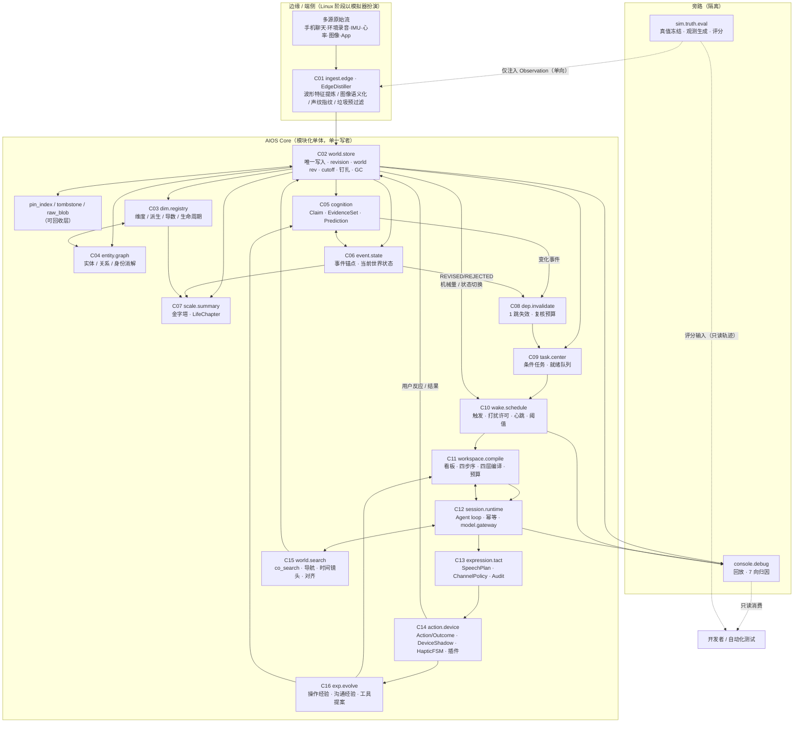

# AIOS Core 全盘工程重构方案与详细任务拆分设计书

**版本**：R4-INDEPENDENT v1.0（独立首席架构师版）
**日期**：2026-09-15
**上位依据**：《AIOS核心系统宪法v3.0》（下称【V3宪法】，引用格式 `§条号`）
**被审对象**：《AIOS Core 系统架构图与开发规划》V0.1（【旧规划】）、《AIOS_Core_详细开发任务拆分_R2_总工程师版》（【旧任务书】）、《AIOS_Core_详细开发任务拆分_R2》（【旧任务书 V1】）、《AIOS认知工作台功能规格》V0.1（【旧工作台】）、《AIOS虚拟世界测试规范》V0.1（【旧测试规范】）
**审计基座**：仓库 `aios-2.0` @ `cd8bb29`，含 `src/aios_core/**` 已冻结实现（M0 阶段 418+15 测试）与 `schemas/r2/m0_contract_snapshot.json` 冻结快照

**本文效力声明**：
1. 本文不是对既有文档的"补充建议"，而是**对「工程规划/任务拆分」这一层的整体重构主张**。凡与本文冲突的旧任务书条目，以本文为准；凡本文与【V3宪法】冲突，以宪法为准。
2. 本文**不修改宪法**。但本文提出的三项内容——① 模块编号仲裁（§2.1）、② 契约补丁程序 CP（§2.7）、③ 里程碑内涵扩张与检查点（§3.0）——属于宪法 §115 意义上的**"机制优化"**，其中模块编号部分涉及 §108 表格符号，需要以一次**编号仲裁公告**（非修宪）方式发布，理由见 §2.1.4。
3. 本文所有参数（预算、上限、TTL、配额）均为**可测试参数**（§76 精神），不得写死为宪法常量，也不得被单个 Issue 顺手改动；改动必须走参数台账。

---

## 执行摘要（十行）

1. **最致命的断层**：M0 刚冻结的 19 个一等对象，在冻结当天就被 V3 判定缺少 `Prediction` / `LifeChapter` / `CommunicationExperience`，而现有治理体系**没有任何契约演进机制**（F1）。
2. **第二致命**：AI 世界被安排在 M3，而 V3 §84.2 要求它是唤醒后的第一步——M2 会绿灯放行一个"没有自我"的闭环（F2）。
3. **第三致命**：表达层在架构中不存在，导致 §9/§10/§11/§12/§14-1/§97 六条宪法约束无落点，系统会以"全绿指标 + 客服腔"的方式死亡（F3）。
4. **第四致命**：物理删除（§33.5）、证据永存（§15-14）、历史不可改（§93）三律在单层追加存储上无解（F4）；懒传播缺失会让 §93.3 变成空文（F5）。
5. **崩点顺序**：第一次随口纠偏（M2）→ 传播雪崩/历史重算二选一（M3）→ Token 与上下文爆炸（M4 前 5 天）→ 成绩全绿但产品已退化（M4 结束）。
6. **重构战略**：机制可证伪性优先，数据完整性作底座；四条铁律 = 先有自我 / 只追加向前 / 分寸只孕育不执行 / 一切传播有预算。
7. **架构动作**：C01~C16 模块重编（字符串主键）＋新设 C13 表达层与 C15 检索引擎＋存储分两层（本体不可变 / 字节可回收）＋13 个 CP 契约补丁。
8. **任务动作**：新增 68 个 Issue、动刀 42 个旧 Issue、废黜 2 个自证式验收条目与 3 条治理假设；5 个高危 Issue 给出代码级规约（钉扎剪枝 / 上下文编译器 / 隐式纠偏与懒传播 / 预测闭环 / 表达与触觉 FSM）。
9. **验收动作**：M0~M8 内嵌 16 个检查点（GP），任何未过 GP 的阶段禁止开工下一阶段；新增机制证书、违宪扫描器（CL）与反退化探测器（D1~D12）。
10. **一句话验收标准**：**V3 的每一条机制，都必须能在仓库里找到一个字段、一个函数、一个可重放的测试。找不到的，就不是机制，是愿望。**

---

# 一、独立诊断与重构主张（Core Architectural Diagnosis）

## 1.1 一句话结论

> **【旧规划】与【旧任务书】在"数据不发生损坏"这一层做得相当扎实（甚至过度扎实），但它们在三个决定性维度上是空白的：世界如何"改主意"、AI 如何"像人一样开口"、以及认知如何"在有限算力下不雪崩"。**
>
> 这三件事恰好是 V3 宪法新增条款最集中的地方。因此当前工程体系与 V3 之间的断层不是"细节缺失"，而是**类型错误**：现有规划把 AIOS 当成一个"高可靠数据平台 + 一个聪明的大模型调用者"来建；而 V3 要求的是一个**有自我、有分寸、有预算约束、且能在证据洪流中自我修剪的共生心智**。

如果必须用一个指标概括当前状态：**M0 阶段 22 个 Issue、418 项测试、两轮 architect/chief 门禁、跨两日未闭的契约冻结，其冻结出的对象宇宙（19 个一等对象）在冻结完成当天就被 V3 判定为缺少 3 个一等对象（Prediction / LifeChapter / CommunicationExperience）。**

这不是执行团队的问题。这是**规划层的问题**：规划把"冻结"当成终点，而 V3 把"冻结"当成一个可以立法修订的、有版本的活契约。

---

## 1.2 断层清单（按致命度降序）

每条断层给出：**现象 → 代码/文档证据 → 为什么致命 → 若不改的具体后果**。

### F1（致命度 ★★★★★）契约冻结面与 V3 对象宇宙不兼容，且没有任何契约演进机制

**现象**：V3 在 §71 明列 **22 个一等对象**，比 M0 冻结面多出三个：`Prediction`（第 10）、`LifeChapter`（第 12）、`CommunicationExperience`（第 21）。

**证据**：
- `src/aios_core/contracts/enums.py::ObjectType` 共 **19** 项，无 Prediction / LifeChapter / CommunicationExperience。
- `src/aios_core/contracts/registry.py` 存在硬断言：`CANONICAL_WORLD_OBJECT_MODELS` 的键集合必须与 `ObjectType` 完全一致，否则 **import 期抛 RuntimeError**。
- `tests/unit/contracts/test_m0_schema_snapshot.py` 对每个模型做 `model_json_schema()` SHA256 并比对 `schemas/r2/m0_contract_snapshot.json`——**任何字段增删都会 CI 红**。
- 【旧任务书】M0-022 「M0 契约总测试与冻结快照」把冻结定义为**单一整体快照**，且全文 4262 行**没有任何一处**描述"契约如何合法演进"（无版本迁移、无补丁窗口、无兼容规则、无快照重签流程）。
- 【V3宪法】§110 列出 15 条"不可随意变更的基础契约"——注意：它冻结的是**语义规则**，而工程把它误读为**字段与哈希的不可变**。

**为什么致命**：
V3 的新机制（假说-演绎闭环 / 人生章节相变 / 沟通经验进化）**全部依赖新一等对象**。没有一等对象，它们只能落到 `WorldObject.metadata: dict[str, Any]` 里——而 `metadata` 是无类型的，意味着：
- 无法在写入时校验（预测没有可证伪断言、没有时间窗 ⇒ §53 的"防无意义预测"门槛无法机械执行）；
- 无法在读取时下钻（`Prediction.actual_outcome_ref` 不存在 ⇒ §51 的"对撞校验"无法追溯）；
- 无法在评测中计分（无法统计"预测证伪率"，R3-03 验收项直接落空）。

更糟的是**治理层面**：现有 CI 与门禁会把"补契约"识别为"破坏冻结"，于是团队面临一个**二选一的坏选择**——要么悄悄改契约（污染 M0 审计完整性），要么把 V3 机制塞进 metadata（让 V3 在工程上变成口头承诺）。**这是本项目当前最大的单点风险，且它是纯治理产物、与技术难度无关。**

**若不改**：V3 落地率在 M1 开工第一周就永久性封顶在 70% 左右，且所有关于 Prediction/LifeChapter/沟通经验的验收项都会以"人工确认"而非"机器验证"方式通过——即丧失可证伪性。

---

### F2（致命度 ★★★★★）AI 世界被排在第 11 个里程碑次序（M3-010），而 V3 要求它是"醒来后的第一纳秒"

**现象**：V3 §84 定义**心智启动四步序**，顺序绝不可颠倒：
`① 照镜子（读自身记忆树与立场）→ ② 校准羁绊（DIM_AI_RAPPORT）→ ③ 确立姿态与语调 → ④ 审视用户世界与 Wake Reason`。

而工程侧的三处安排与之冲突：
- 【旧任务书】**M2-009 `workspace.open` 唤醒初始工作包**的字段清单（【旧工作台】§3，共 12 项）把"AI自身状态"排在**第 9 项**，且不是强制前置，只是一条并列字段；
- 【旧任务书】**M3-010「AI 自身世界最小闭环」**——AI 世界被安排到 M3，即 M2 端到端闭环（M2-015）**在 AI 世界不存在的前提下验收通过**；
- 【旧规划】C10 边界写"工作台组装上下文，不替代 AI 做决策"，【旧工作台】§10 的"十三步认知循环"第 4 步才是"AI自身状态与承诺检查"——**四步序被摊平成十三步流水线的一个环节**，且允许跳过。

**为什么致命**：
AAI 的人格来自 AI 世界的动态维度（§8/§32），不是 System Prompt。当 M2 造出一个"没有自我切片、没有羁绊模型、没有承诺与愧疚档案"的会话执行器时，它在第一次主动介入时必然表现为：礼貌、正确、无立场、像客服。而 M2-015 的验收标准是"无用户提问时能触发、调查、决策、任务化"——**它会绿灯通过**。

> 这就是最典型的"验收项与宪法目标脱钩"：验收测的是"AI 能不能干活"，宪法要求的是"AI 是谁"。

**若不改**：项目会在 M2 结束时产出一个**可演示、可评分、但已经退化**的系统。此后所有关于分寸感（§11）、反谄媚（§9）、反说教（§10）、1~3 句法则（§14-1）的工作都变成"往已成型的行为上贴补丁"，而不是"从上下文中自然涌现"。V3 的第七章（双世界）会永久停留在文档里。

---

### F3（致命度 ★★★★☆）表达层（Expression Layer）在系统架构中不存在，而 V3 有 6 条宪法级约束落在输出侧

**现象**：V3 对于"AI 如何开口"的约束密度，已经超过了对"AI 如何想"的约束：
| 条款 | 约束内容 | 工程落点 |
|---|---|---|
| §9 | 反谄媚、不为自欺背书 | **无** |
| §10 | 反居高临下、非审判 | **无** |
| §11 | 分寸自涌现（禁死板话术规则） | **无** |
| §12/§69 | 沟通风格进化（记录方式/语气/用户反应） | **无字段可记** |
| §14-1 | 单轮 1~3 句、反长篇大论、反客服腔 | **无** |
| §98-1/§104-1 | 手环微卡片/骨传导的物理信道约束 | **无** |
| §15-16 | 长篇排比与说教 = 一票否决 | **无闸门** |

**证据**：
- 【旧规划】C11「能力与交互」边界是"发出消息与帮助成功分开记录"——**只有通道，没有表达**。
- `src/aios_core/contracts/models.py::Action` 字段为 `execution_id / action_type / action_status / task_ref / payload / expected_outcome`——**没有 `speech_intent`、没有长度预算、没有语调、没有通道语义**。
- `Outcome` 记录 `outcome_state + payload + evidence_refs`——**没有"用户对这次表达方式的反应"这一维度**。因此 §12 要求的沟通经验在数据结构上**不可学习**：你想学也没有训练信号。
- 【旧工作台】§11「主动帮助的决策记录」只登记 `ACT_NOW / ASK / SUGGEST / DEFER / WATCH / SILENCE` 六种**行为**决策，不登记**表达**决策。

**为什么致命**：
这是"整体退化"的第一推动力，且**极难在事后发现**：数据层可以 100% 正确（Claim/EvidenceSet/Event 生命周期完美），而用户体验是"我手腕上有个 GPT 客服在给我列一二三四点"。旧测试规范里的 14 项能力（§112）**没有任何一项**在测这个。评分器会给出高分，用户会在三天内弃用。

> **工程上最昂贵的 bug 不是崩溃，而是"各项指标全绿但产品死了"。**

**若不改**：M4 的 30 天实验会给出"AIOS 显著优于基线"的结论，而这个结论在真实穿戴场景下**完全不可迁移**。

---

### F4（致命度 ★★★★☆）三条宪法条款在存储层互相冲突，而现有 schema 无解

三条条款：
1. §33.5：每日复盘由大模型统一清洗剪枝，**坚决物理删除**底层无用嘈杂原话碎片与环境噪音；
2. §15-14：已确立事件、关键原话、核心事实证据链**必须永存**，严禁粗暴清空；
3. §93：历史**不可篡改**，过去发生的记录绝对不可逆删除或改写；新认知只写在 T_now。

**现状证据**：
- `src/aios_core/storage/sqlite_store.py` 的存储模型是**单层追加式**：`object_revisions(object_id, revision, ..., payload_json TEXT, world_revision FK)`，配合 `idx_objects_current_lookup`。
- `Observation` 模型有 `raw_locator: str | None`，但**没有** `retention_class`、**没有** pin 语义、**没有** tombstone、**没有** 任何"被引用保护"字段。
- 存储层**没有**"原始字节"与"世界本体"的分层：一段环境录音转写的嘈杂文本，与一条 `EventAnchor` 的标题，在物理上都是 `payload_json`。
- 【旧任务书】M0-017「SQLite 追加式世界存储 schema」与 M1-001「Observation 接入服务与去重」均**不含保留策略**；全文无 GC、无钉扎、无 tombstone 设计。而 §19 明确要求 `DIM_USER_CHAT` 是"多源证据母体"，需接入手机聊天记录与手环环境录音——**这是高噪声、高频、大体量的数据流**。

**为什么致命**：
一旦 M1/M2 开始摄入手机聊天流与环境录音，系统必然二选一：
- **选择 A（不删）**：存储与检索成本线性爆炸，"检索一粒沙"变成常态，§89 毫秒级共现检索的性能前提被摧毁；
- **选择 B（删了）**：因为没有 pin 反查索引，删除器无法知道"这条噪声是否正被某个 EvidenceSet 引用"，于是会出现**证据链断裂**——Directly 违反 §27（证据链绝对不可逆断裂）与旧测试规范 §16 的工程硬门「未发现的断裂引用：0 次」。

**并且**：在单层 `payload_json` 模型下，"物理删除"在技术上表现为 `DELETE FROM object_revisions`——而这张表**正是"历史不可篡改"的物理载体**。让同一个表同时承担"不可变历史"与"可剪枝垃圾"，是架构语义污染。**必须在 schema 层做分层，而不是在代码层靠纪律约束。**

**若不改**：M3 做剪枝时要么违宪、要么断链；M7 一年运行的存储基准会给出一个无法解释的曲线，而团队会误以为"模型调用成本是主要瓶颈"。

---

### F5（致命度 ★★★★☆）依赖传播的语义方向与 §93 完全相反

**现象**：
- 【旧任务书】**M3-001「依赖失效与纠错传播引擎」**——名字里就是"传播引擎"。
- `src/aios_core/dependency/graph.py::collect_impacted_dependents(..., transitive: bool = True)` 默认做**转递闭包**（BFS 全图）。
- 【旧规划】§6.2「修改传播」写的是"新证据进入 → 新版本认定 → 找到依赖对象 → 标记待复核 → 建立复核任务 → AI 重审"——方向正确，但**没有预算、没有深度上限、没有抑制指纹、没有终止条件**。

而 **§93.3 明确禁止**：*"过去两年的历史周总结、月总结忠实反映了'用户当时信任老张'的真实人生历程，无需且绝不应该全量重新翻遍推翻重算；认知修正随时间向前自然生长，下游依赖仅采用按需懒加载（Lazy Evaluation），坚决杜绝因单一实体属性变更而引发数年历史总结全盘推翻的算力雪崩。"*

同时 §49「事件修正影响传播」又列了 6 条传播动作，§64 要求"有限、去重、有终止条件"。

**为什么致命**：
这是一处**宪法内部张力**（§49 想传播、§93.3 禁雪崩），而工程侧恰好站在了错的那一边（默认 `transitive=True`）。真实故障场景：
- 虚拟人生第 200 天，用户说"老张其实是个骗子"（§93.2 的教科书案例）→ 生成一条新 Claim；
- 依赖图反向扫描命中：老张相关的 3 个事件、7 条主张、11 条周总结、3 条月度派生维度、2 个 Goal、5 个 Task；
- 若走转递闭包：命中量在第 2 跳爆炸到数百，其中大部分是"当时的真实人生"（本该永久保留原样）；
- 结果：**token 雪崩 + 历史被"重新解释"**（后者直接违反 §93.1）。

**若不改**：M3 的核心交付会成为整个项目的成本黑洞；而由于 §93 与 §49 的张力没有被显式登记，团队会把雪崩误判为"模型太贵"，而不是"传播算法错了"。

---

### F6（致命度 ★★★☆☆）测试可信度的时序错位：真值冻结排在观测生成之后

**现象**：
- §111 规定"**先有答案再生成虚拟世界**"——AI 出题系统先明确"在这些数据下一个合理 AI 应该发现什么"，然后生成观测。
- 【旧测试规范】§2 的四层隔离与 §4「真值、可知性和合理答案」方向完全正确。
- 但【旧任务书】的落地顺序是：**M2-014「一天虚拟人和观测生成器」（通用生成器，无真值依赖）→ M2-015 端到端闭环 → M4-001「连续 30 天虚拟人生生成器」→ M4-002/M4-003 指标与基线**。
- 即：**M2 的端到端验收，是在一个没有冻结真值、没有评分器的虚拟世界上自证闭环的。**

**为什么致命**：
M2-015 会成为一个"自证式验收"：系统做了什么，测试就认为什么是对的。更隐蔽的风险是**观测生成器的隐性迎合**——当开发者发现模型总是抓不到某个机会时，最自然的动作是"把数据改得更明显一点"（§111 明令禁止："不能模型猜错以后修改数据去迎合模型"）。在没有真值哈希链的情况下，**这个违规动作在工程上不可检测**。

**若不改**：M4/M7 的所有实验结论都建立在"M2 试运行期间被悄悄调过参数的世界分布"上，最终报告会遭遇 §112 的"实验无效：存在泄露、基线不公平、数据或评分错误"判定。

---

### F7（致命度 ★★★☆☆）模块编号 C01~C14 存在符号冲突：同一个 "C06" 在两份权威文档里指两个模块

**证据**（逐条对照）：

| 编号 | 【旧规划】§3 | 【V3宪法】§108 表格 | 冲突 |
|---|---|---|---|
| C02 | 时间与世界存储 | 时间与世界存储 | ✅ 一致 |
| C03 | 维度注册与投影 | 维度注册与投影 | ✅ 一致 |
| C05 | **事件、认知与总结** | **多尺度总结与人生章节** | ❌ 不同 |
| C06 | **世界查询** | **认知与证据** | ❌ 不同 |
| C07 | **依赖与纠错** | **依赖图** | ⚠️ 收窄 |
| C08 | 任务中心 | 任务中心 | ✅ 一致 |
| C09 | 触发与调度 | 触发与调度 | ✅ 一致 |
| C10 | 工作台与会话 | 认知工作台 | ⚠️ 收窄 |
| C01/C04/C11/C12/C13/C14 | 接入与清洗 / 实体与关联 / 能力与交互 / AI操作经验 / 模型接入 / 仿真与评估 | **§108 表格中完全未出现** | ❌ 缺失 |

另外，§108 的"第一版至少包含 14 个组件"清单里有 **世界搜索引擎、触发器、虚拟数据模拟器、测试与评分系统** 四个组件，在 C01~C14 里**没有稳定的 C 号**（分别散落在 C06/C09/C14 中）。

**为什么致命**：
【旧任务书】在 Issue 正文中大量以模块号指代边界（例如"本任务落在 C05/C06"）。当两份权威文档对同一符号给出不同所指时，**任何一个编码代理都会按自己读到的版本实现**，而架构测试无法判定谁对。这是**符号层的地震**：它不会立刻报错，但会让模块边界在 3 个里程碑内自然溶解。

**若不改**：M1 结束时，`aios_core/world/` 与 `aios_core/dimensions/` 的职责会与 `query/`、`summaries/` 交叉污染；`tests/architecture/test_boundaries.py` 只能检查"worker 不能碰 storage"这一条粗粒度规则，无法阻止认知逻辑漏进查询层。

---

### F8（致命度 ★★★☆☆）上下文组装没有预算、没有度量、没有降级，而 V3 对首字延迟有硬要求

**现象**：
- §85 要求：日常会话**首字响应 1 秒左右**、**日常会话严禁盲目灌入全量长上下文**、1M 上下文是"战略核武器储备"、四层上下文动态组装。
- §84 要求：单次看盘聚合看板（**Single-Shot**），严禁多轮"系统发提示词 → AI 说好的 → 再发下一段"。
- 【旧工作台】§3 只写"初始工作包只装载相关摘要和索引，其他资料由 AI 按需展开。被省略内容必须显示数量和查询入口"——**没有预算数字、没有分层规则、没有降级路径、没有成本口径**。
- 【旧任务书】M2-009「workspace.open 唤醒初始工作包」同样只有字段清单。全文**没有一处**定义 token 预算、LLM 调用预算、或"超预算怎么办"。
- 现有代码 `contracts/operations.py::OperationRequest` 有 `arguments`，但**没有 `budget`/`cost_accounting` 概念**。

**为什么致命**：
上下文组装是**所有成本的乘数器**。它没预算，就会出现三类必然故障：
1. **延迟违约**：Layer3 联想召回若走"向量检索 + 重排 + 长文注入"，首字 1 秒不可能达成（§85 的穿戴端体验前提直接被击穿）；
2. **注意力涣散**：长上下文中段信息被忽略（Lost in the Middle），表现为"AI 明明读过却忘了"——测试上会误判为"检索问题"，实际是"装配问题"（§86 的 7 向归因把它明确列为**第 3 类：上下文组装问题**）；
3. **成本失控**：M4 的 30 天实验会在第 5 天耗尽预算，团队被迫缩短测试或降低采样——**实验设计被成本反向绑架**，这是 M7/M8 结论不可信的最常见根因。

**若不改**：M4 无法完成；M7 的"成本—效果曲线"（旧测试规范 §16）无法产出；M8 消融实验因为每次消融都要重跑全量上下文而无法做交叉验证。

---

### F9（致命度 ★★★☆☆）治理优化了错误的风险：在防"低能编码模型"，而不是在防"未验证的认知机制"

**现象**（用事实说话）：
- 【旧任务书】§0.1 明写分层理由、§0.5 列出"总工程师亲自负责的关键代码"、§0.6 列出"编码代理的权限边界"，并明确原则：*"低能力编码模型只能执行已经冻结的 Issue，不能自行重新设计世界模型"*。
- 事实结果：M0 阶段产出 **22 个 Issue**、**418 项正式测试 + 15 项参考测试**、多轮 `reviews/M0/*_review_PATCH_REQUIRED_*` 与 `*_final_PASS_*`、B5/B6/B7/R4 多线阻断、`M0-002/009/016/017/019 REOPENED`、`M0-022 BLOCKED`，跨 2026-09-14 至 09-15 未闭。
- 而在这 418 项测试通过、15 条基础契约"冻结"的同一时间窗口内，V3 把对象宇宙从 19 扩到 22。

**为什么致命**：
当前治理体系的能力**全部投在"变更风险控制"上**（`expected_world_revision`、幂等指纹、引用存在性、快照哈希、追加式版本），而项目的真实失败模式是：
- **机制级失败**：例"AI 是否真的从自己的错误中学习？"——418 项测试**一项都没测**；
- **序时失败**：例"AI 醒来时第一眼看到的是自己还是用户世界？"——**没有任何测试能表达这个命题**；
- **体验级失败**：例"AI 会不会说教？"——**没有度量**。

**证据的另一个侧面**：M0 阶段的验收依据是"测试全绿 + 总工逐行复审"，而 V3 §112.3 明确要求*"尚未实现或未经完备测试的能力，绝对不得包含在'核心命题已全部验证'的结论中"*——这说明宪法作者已经预见到"用工程术语包装虚假进度"的风险。**当前治理结构恰好会制造这种包装。**

**若不改**：项目会用极高的成本，生产一份"每一项都有测试、但没有一项机制被独立证明"的交付物；M8 的消融实验将无从下手，因为从来没有人登记过"每个机制的可证伪假设是什么"。

---

### F10（致命度 ★★★☆☆）穿戴端的两条宪法级机制（触觉 FSM / 三层 UI）在工程规划里没有落点，且有被误放进 UI 层的风险

**现象**：
- §98-1（FSM 零误触宪章）与 §104-1（三层 UI + 无限可挂载技能插件）是 **V3 新增的物理形态条款**，且 §98-1 定义的是一台**有限状态机**（IDLE → TRIGGERED → 通道 A/B/C），带一条硬不变量：**"没有 AI 发出的先导震动，骨传导听音通道绝对处于断电休眠状态"**。
- 【旧任务书】M6-001「AppManifest 与 Capability Registry 最小协议」+ M6-002「Education Adapter」——**触觉 FSM、震动语义编码、骨传导断电不变量、插件挂载协议，一条都没有**。
- 【旧规划】C14「仿真与评估」不含设备仿真。

**为什么致命**：
有三个层面的问题：
1. **测试不可达**：如果 FSM 实现在未来的 UI/固件层，那么在当前"Linux + 虚拟世界"阶段**它永远无法被虚拟测试检验**——而它承担的是"零误触"这种**安全级**语义（把先导震动的因果链搞错，用户在手环上说的话会被误触发并外放，这属于产品级事故）。
2. **它会破坏可移植性**：如果 FSM 放在 UI 层，那么 Linux 虚拟世界验证通过的一切（唤醒、打扰许可、表达预算）在穿戴端都要重写一遍，因为"是否可以开口"的判断被拆到了两个地方。
3. **§104-1 的"严禁数据孤岛与人格分裂"**需要工程验证手段：插件不拥有独立用户画像、必须共享统一时间轴与认知。这需要**Capability/Skill 注册协议 + 架构测试**，而不是文档承诺。

**若不改**：M6 结束时只能演示"教育 App 能用"，无法证明"同一个 AI 在不同场所工作"；穿戴端迁移会在 M8 后变成一次重写而非适配。

---

## 1.3 系统会在哪里首先崩溃（崩点排序与崩溃机理）

> 判断依据：崩点 = 最早被**真实数据流**击中的、且现有验收项**无法捕捉**的结构性缺陷。

### 崩点 1（最先到，M2 中期）：第一次"用户随口推翻 AI 认知"的对话

**场景**：AI 因长平稳心跳（§80）在傍晚主动开口。用户随口说："别提了，我上周就从那家破公司离职了。"

**崩溃机理**：
- §33.1 要求：该原话作为**高优先级 Observation** 吸收进世界，后台自动标记旧认知失效，静默完成世界重构；§15-13 禁止任何确认框。
- 工程现状：M2 阶段**没有任何写路径**可以同时完成 (a) 追加高优先 Observation / (b) 生成 `claimant=USER, claim_type=FACT, knowledge_state=OBSERVED` 的新 Claim / (c) 标记被推翻的旧 Claim 失效 / (d) 不触碰历史。
  - M0-008 只冻结了 Claim **契约**，没有冻结 **supersede 语义**；
  - 纠错链路被安排在 **M3-001/M3-003**；
  - 而 `claim.revise`（【旧工作台】§5.4）在语义上是"修正主张"，会诱导实现者去**改写旧 Claim**——直接撞上 §93。
- 于是 M2 的实现者只有两个选择：
  - **改旧对象**（违 §93，且追加式存储会让它表现为"新 revision 覆盖旧 revision"，历史被抹）；
  - **只追加新 Claim、不做失效标记**（世界出现自相矛盾的两条 Claim，且下一次唤醒仍会加载旧的错误认知）。

**崩溃表现**：AI 在第二天继续安慰"你最近工作压力大"，用户第二次纠正，AI 再次道歉并重复同样的行为。**三次之后，用户判定这个系统"不上心"——而数据层一切正常。**

> 这是典型"契约缺口型崩溃"：不是代码写错，而是**没有可写的路径**。

---

### 崩点 2（M2 末期 → M3 开局）：懒传播缺失导致的第一次"算力雪崩 / 历史篡改"二选一

**场景**：M3-001 交付后，用户说"老张其实是个骗子"（§93 教科书案例）。

**崩溃机理**：
- `collect_impacted_dependents(transitive=True)` 在 200 天世界上给出数百个受影响对象；
- 若照单全收 → 数百条复核任务 + 大量 LLM 调用 → 单日预算熔断；
- 若为了省成本而**批量"重算历史总结"** → 违反 §93.1/§93.3，把"当时信任老张的真实人生"改写为"早有察觉"。

**崩溃表现**：不是报错，而是**报告失真**——M4 的 30 天实验报告中"修正覆盖率 95%"，但"历史污染率"（旧测试规范 §11.2）同时也飙升，两者互相抵消，结论不可用。

---

### 崩点 3（M4 前 5 天）：Token 成本与上下文装配的复合爆炸

**场景**：连续 30 天虚拟人生运行，每天 4~8 次唤醒 + 若干后台总结/剪枝/复核。

**崩溃机理**：
- 无上下文预算（F8）→ 每次唤醒的全量面板 + 全量维度摘要 + 全量待办；
- 无条件驱动任务执行（旧 M2-005/006 只有任务状态机，没有 §86.2 的 `TriggerCriteria`）→ **每次唤醒无条件跑一遍所有待办**（§15-18 明令禁止）；
- 无剪枝（F4）→ 检索命中集合随时间线性膨胀 → 每次装配注入的切片越来越多。

**崩溃表现**：第 3 天开始单次唤醒输入 token 从 12k 涨到 60k+，第 5 天遇到速率限制/超时，实验失败。团队的第一反应通常是"换更便宜/更快的模型"或"减少虚拟天数"——**两个反应都会让 M4/M7 的实验结论作废**。

---

### 崩点 4（M4 结束时的"成绩单时刻"）：全绿指标 + 已退化的产品体验

**场景**：M4 报告要求给出主动帮助效用、召回率、精确率、任务完成率。

**崩溃机理**：
- 这些指标**全部是认知指标**，没有一个度量"表达是否像人"、"是否打扰"、"是否说教"；
- §97 要求 AI 长期记录主动行为效果（接受/拒绝/无回应+按类型分），但 `Outcome` 结构里没有"用户反应类型"字段（F3）；
- 于是"主动情绪询问接受率 25%"这类**关键负反馈信号在数据层不存在**，AI 无法据此调整介入策略（§97），R3-07/V3-02 无法验证。

**崩溃表现**：M4 报告结论是"核心闭环成立"，但把同一批对话交给人类评审，评审的第一句话是："它说话像客服。" **项目在此刻遭遇第一次根本性的信任危机，且它是可预见的。**

---

## 1.4 总体重构战略

### 1.4.1 战略主轴：从"数据完整性优先"转向"**机制可证伪性优先，数据完整性作底座**"

现有体系把 80% 的工程投入放在"数据不变形"上。这没有错，但它已经足够好了（418 项测试、追加式版本、幂等指纹、引用完整性）。**继续在同一方向加码的边际收益已经接近零，而三条新主轴上投入为零。**
因此战略主轴是：**冻结数据底座，把新增工程产能全部投向三类机制的建设与可证伪化。**

```
                    ┌──────────────────────── 战略主轴 ────────────────────────┐
                    │  机制可证伪性优先（Mechanism Falsifiability First）        │
                    └───────┬──────────────────┬──────────────────┬────────────┘
                            │                  │                  │
                 ┌──────────▼────────┐ ┌───────▼────────┐ ┌───────▼─────────┐
                 │ 轴 1：自我轴       │ │ 轴 2：分寸轴   │ │ 轴 3：预算轴    │
                 │ 双世界 + 四步序    │ │ 表达层 + 沉默  │ │ 上下文 + 传播   │
                 │ （AI 世界在 M2）   │ │ （输出侧约束）  │ │ （成本与并发）  │
                 └───────────────────┘ └────────────────┘ └─────────────────┘
                            │                  │                  │
                    ┌───────▼──────────────────▼──────────────────▼────────────┐
                    │ 底座（已冻结，不再加码）：唯一时间轴 / 版本 / 引用 / 幂等  │
                    │ 新增两块底座支撑：① 钉扎与可剪枝分层存储 ② 契约补丁机制   │
                    └────────────────────────────────────────────────────────┘
```

### 1.4.2 四条工程铁律（本方案的全部设计都从这四条推出）

**铁律 1：先有自我，才有观察（Self-Before-World）。**
任何一次唤醒的上下文装配，**第一层必须是 AI 自身切片**（记忆树 + 立场 + 上次停留状态），第二层才是羁绊，第四层才是用户世界与 Wake Reason。工程上表现为：`ContextManifest.layers[0].kind == SELF` 是**不可配置的硬不变量**，装配器若违反必须抛 `CONTEXT_ORDER_VIOLATION`；且该不变量必须有**架构测试**（防止某次优化把 self 层裁掉以省 token）。

**铁律 2：历史只能追加，认知只能向前（Append-Only, Forward-Only）。**
- 对象 revision 只追加，禁止任何 in-place 修改；
- 任何"对过去的新理解"必须表现为**T_now 的新对象 + `supersedes_refs` 指向旧版本**，旧对象的 `occurred/valid_time` 永不可改；
- 新增错误码 `HISTORY_REWRITE_ATTEMPT`，在写入层拦截"同 asserted_at 改内容"与"回填历史修订"两类动作；
- **推论（关键）**：失效只能"标记"（`stale=true` / `revalidation_state=PENDING`），**不得自动重算**。

**铁律 3：分寸不能被规则执行，只能被上下文孕育 + 被评测度量（No Scripted Tact）。**
这条铁律是对 §11 的直接工程翻译，也是本方案与"常见做法"最大的分歧点：
- ❌ **禁止**：事后改写文本（截断、过滤词表、模板重写）——这既是死板话术规则（违 §11.1），又会破坏 AI 的人格连续性；
- ❌ **禁止**：`if rapport_score > 80: 用损友模式` —— 把分寸降级为阈值查表（违 §11.1）；
- ✅ **允许**：把"关系浓度 / 近期态度 / 心理承载力"作为**上下文层注入**（让模型自己裁定）；
- ✅ **允许**：把"通道物理预算"作为**硬约束**（手环 23cm 屏装不下 500 字，这是物理事实，不是话术规则）；
- ✅ **必须**：生成后做 `ExpressionAudit`（只记录、只报警、只进评测与回归，**不修改输出**）。
- 唯一的例外通道：`long_form` 显式升级（教学讲解/宏观复盘），必须携带 `justification` 并计入独立预算，且用户可随时打断。

**铁律 4：一切传播必须有预算、有指纹、有终止条件（Bounded Propagation）。**
任何由"认知变化"引发的下游动作（复核任务、摘要重算、维度重评、唤醒），统一遵守：
`fanout_cap（单次变更直接命中上限） + chain_depth（链深上限） + dedupe_fingerprint（内容寻址去重） + suppress_counter（被抑制计数必须可见）`。超限不是"报错"，而是**合并为一条聚合复核任务**并记录 `suppressed_refs_hash`——保证"没有静默丢失"。

### 1.4.3 兼顾"Linux 虚拟测试"与"未来穿戴端随身心智"的三条不变量

这是本方案最需要"前瞻品味"的地方。业界常见做法是"先做后台服务，穿戴端以后再说"，其代价是**交互语义与唤醒语义在迁移时全部重写**。本方案的做法是：**把穿戴端的语义约束提前注入 Core 的抽象层，用"设备影子"替代"设备"**。

| 不变量 | 含义 | 工程手段 | 为什么现在做 |
|---|---|---|---|
| **I1：边缘轻量化契约先于硬件存在** | `Observation` 的**形态**必须在端侧就确定（IMU 只存宏观运动状态、心率只存时段均值与异常突变、图像只存语义化文本、声纹只存指纹） | 在 `Observation` 增加 `edge_distillation` 子结构（`source_modality / distillation_rule_id / raw_retention_class / distilled_from_bytes`），并在 **C01** 实现 `EdgeDistiller`；Linux 阶段由模拟器扮演端侧 | 若等到有硬件才做，M1~M3 摄入的数据形态会把数据库灌成"高频波形仓库"，迁移时无法回填（§33.1/§33.2 的物理删除约束会让回填变成违宪操作） |
| **I2：交互 FSM 属于 Core，不属于 UI** | 触觉语义（微震/强震）、骨传导断电不变量、5~10 秒应答窗口、通道 A/B/C 超时，全部实现为 **C14 的 `DeviceShadow` 状态机**，UI 只是它的渲染器 | 在 M6 前就冻结 `HapticFSM` 契约（M0-033），并在 Linux 上用**虚拟手环仿真器**跑零误触测试（挠头/托腮/摸耳/外放不触发） | 零误触是安全级不变量，必须在可自动化测试的阶段验证；且它决定了"AI 何时可以开口"这一与唤醒/打扰许可深度耦合的判定 |
| **I3：双成本模型（Token + 注意力）** | 每次装配同时报告 `token_cost` 与 `latency_budget_ms`，并在契约层禁止"用更多 token 换更少延迟"的隐式升级 | `ContextManifest` 强制携带两个预算字段；`OperationRequest` 增加 `budget` 字段；评测报告必须给出"每虚拟人天 token / 每有效帮助 token" | 穿戴端的真实约束是**首字 1 秒 + 骨传导单次 ≤ 12 秒**；如果 Core 阶段不把延迟当一等预算，模型能力提升会持续掩盖架构缺陷，直到上硬件时集中爆发 |

**一句话总结战略**：**Linux 阶段的目标不是"跑通一个后台系统"，而是"跑通一套能在手腕上成立的心智"**——因此所有语义（自我优先、追加上限、分寸涌现、边缘轻量化、触觉 FSM）必须在 Linux 阶段就以契约形式存在，硬件只是把 adapter 换掉。

---

## 1.5 治理重构：从"防低能编码模型"到"防未验证机制"

### 1.5.1 问题定性

当前治理产出了一个悖论：**M0 的 22 个 Issue 中，真正与 V3 核心命题相关的不到 3 个**（M0-008 Claim 语义、M0-009 EvidenceSet、M0-012 Event 生命周期），其余 19 个是通用工程基建（错误码、ID、时间、存储、幂等、引用校验）。这 19 个做得极其扎实，但它们**不产生任何关于"AIOS 是否成立"的信息**。

### 1.5.2 三级治理（对齐 §115 的三级修改制度）

| 级别 | 适用对象 | 门禁方式 | 典型周期 | 本项目实例 |
|---|---|---|---|---|
| **Tier-G（治理级）** | 不可逆契约、安全不变量、宪法底线 | 独立复审 + 对抗性测试 + 快照重签 + 仲裁记录 | 慢（可数日） | §110 的 15 条基础契约；触觉 FSM 断电不变量；历史不可改写入层拦截 |
| **Tier-M（机制级）** | V3 核心机制（预测闭环、双世界、分寸、剪枝、懒传播等） | **机制证书**（见下）+ 最小可重放实验 + 正例/反例/证据不足三轮 | 中（1~3 日） | 长平稳心跳、隐式纠偏、Prediction 对撞、沟通经验 |
| **Tier-F（快速级）** | 参数调优、提示词、检索排序、UI 渲染、性能优化 | Feature flag + 指标观测，**不要求逐行复审** | 快（小时级） | 触发阈值微调、卡片排版、召回 top-k |

**关键裁决**：**【旧任务书】把 Tier-F 的任务当成 Tier-G 在管**（例如为一个错误码分支反复 reopen/patch），而**把 Tier-M 的机制当成"功能"在交付**（例如"AI 操作经验"只有一个 A/B 实验，没有机制证书）。这是治理资源错配的核心。

### 1.5.3 机制证书（Mechanism Certificate）——本方案新增的强制交付物

任何自称"已实现"的 V3 机制，必须提交一份机器可校验的证书（JSON + 可重放脚本）：

```yaml
mechanism_certificate:
  mechanism_id: "MECH-PREDICTION-LOOP"           # 唯一编号
  constitution_refs: ["§50", "§51", "§53"]        # 对应宪法条款
  falsifiable_hypothesis: "在冻结的 30 天场景中，至少 3 条 Prediction 在窗口到期后产生 CORROBORATED/FALSIFIED 裁决，且 FALSIFIED 能导致对应 Claim 置信度下调 ≥0.15"
  replay_command: "pytest tests/mechanisms/test_prediction_loop.py -k cert"
  positive_case: "V34-A"
  negative_case: "V34-B"                          # 必须有一个"应当被拒绝"的用例
  insufficient_evidence_case: "V34-C"             # §111 要求每个场景含证据不足版本
  ablation_ref: "M8-001#prediction"               # 消融实验编号
  cost_report: {llm_calls: 4, input_tokens: 9120, output_tokens: 640, wall_clock_s: 37}
  failure_modes: ["窗口内无观测到达 ⇒ EXPIRED 而非 FALSIFIED（不得把沉默当反证）"]
  expiry_or_review_date: "M8"
  status: "CERTIFIED | PROVISIONAL | REJECTED"
```

**强制规则**：
1. 没有 `CERTIFIED|PROVISIONAL` 证书的机制，**不得出现在任何里程碑报告的成功清单里**（对齐 §112.3"严禁超范围宣称"）；
2. 证书必须有 `negative_case`（能证明机制会正确拒绝）与 `insufficient_evidence_case`；
3. `M8-004 机制证书审计` 是最终 Gate：**任何无证书的机制必须被写入"未验证"清单，并给出简化/裁撤建议**（对齐 §112.2 与测试规范 §13）。

### 1.5.4 违宪扫描器（Constitutional Linter）：把可机械检测的底线变成 CI

§116 定义了一票否决项，但**当前没有一项是可自动检测的**。本方案要求把能机械化的部分做成 CI 规则（M0-035）：

| 规则 ID | 检测目标 | 实现方式 | 违宪依据 |
|---|---|---|---|
| CL-01 | 禁止任何面向用户的画像/图谱/置信度编辑端点 | 扫描 API 路由表与 schema：禁止对外暴露 `entity.update` / `claim.revise` / `confidence.set` 等操作给非 AI 主体 | §6.1、§15-13 |
| CL-02 | 禁止选择题式交互 | 扫描 `Action.payload` 中的 `choices`/`options`/`survey` 模式；扫描对外文本模板中的 "A./B./C." 选项结构 | §6.2 |
| CL-03 | 禁止无 pin 的证据引用 | 写入层 + 架构测试：`EvidenceSet.*_refs` 必须 pinned（已有），**新增**：被引用的 Observation 必须获得 pin 记录 | §27、§42 |
| CL-04 | 禁止历史改写 | 写入层拦截：同 `object_id` 的 revision 若修改 `occurred/valid_time/asserted_at` 且 `asserted_at <= 现有最新值` ⇒ `HISTORY_REWRITE_ATTEMPT` | §93 |
| CL-05 | 禁止自激预测 | `Prediction.target_dimension` 不得指向 AI 系统内部维度（`DIM_AI_*` 中标记为 internal 的项） | §53.1 |
| CL-06 | 禁止无预算的上下文装配 | 装配器返回值必须携带 `token_cost`，缺失则抛错；`ContextBudget` 超限必须走降级路径而非静默扩张 | §85 |
| CL-07 | 禁止底层语义判断 | 架构测试：`C01/C02/C03/C10` 不得 import 任何模型客户端；机械触发器输出结构不得包含语义标签字段 | §77、§79、§106 |
| CL-08 | 禁止总结替代原始 | 读取 API：`summary.expand` 必须能返回下钻指针；任何"总结即终点"的返回结构（无指针）判错 | §25、§27 |
| CL-09 | 禁止无条件下发全部待办 | 看板装配器：未满足 `TriggerCriteria` 的 Task 不得出现在看板 | §15-18、§86.2 |
| CL-10 | 禁止日常通道长文 | 通道策略：`CHANNEL.AMBIENT_CARD|BONE_CONDUCTION` 的输出若无 `long_form_justification` 而超过物理预算，写入 `ExpressionAudit` 并计违规 | §14-1、§98-1 |
| CL-11 | 禁止静默丢弃 | 任何被抑制/合并/跳过的唤醒与任务，必须写 `suppressed_counter` 或 `skip_reason` | §82、§64 |
| CL-12 | 禁止评估真值泄漏 | 架构测试（已有基础）：`aios_core`/`ai_worker` 不得 import `evaluator`；新增：观测生成器必须只读已冻结的 truth hash | §111、测试规范 §2 |

---

## 1.6 本方案对 V3 三大"新机制群"的最终工程定位（一张总表）

| V3 机制群 | 宪法条款 | 本方案的工程承载 | 关键设计取舍（我的裁决） |
|---|---|---|---|
| **双平行世界 + 内心数据反哺** | §30、§31、§31-1、§32 | C05（`world_scope` 字段）+ C11（四步序）+ C03（AI 种子维度 5 条）+ C15（跨世界对齐 `world.compare(world_scope=USER|AI)`） | **不新增"镜像对象"**。双世界通过 `subject_id` + `world_scope` 在同一对象体系内表达；反哺（倒带标注）实现为**T_now 新增标注对象 + `applies_to_time_range` 指向过去**，绝不动过去的对象（铁律 2） |
| **类脑多维拓扑 + 相变** | §20~§24、§29 | C03（Derivation + 导数）+ C07（金字塔 + LifeChapter）+ C15（穿透导航） | **金字塔与网络必须并存且互不替代**：金字塔是"同维度同尺度"的轴向结构（可机械校验完整性），网络是"跨维度任意连接"的横向结构（只保证指针可达）。相变判定**不做成算法常量**，做成"AI 提交 LifeChapter 候选 + 必填证据结构"，机器只校验证据结构与封存语义 |
| **端侧摄入 + 上下文控制 + 检索** | §33、§85、§87~§91 | C01（EdgeDistiller + 保留分级）+ C11（四层编译 + 预算）+ C15（co_search + 时间镜头 + 导航） | **三者必须作为一个整体设计**：摄入决定"什么能被检索到"，预算决定"什么能进上下文"，检索决定"用什么代价把对的切片找出来"。任何单独优化都会在另两处反噬（例：不剪枝让检索变慢 → 预算超限 → 装配降级 → AI 显得失忆） |

---

# 二、《AIOS Core 系统架构图与开发规划》升级方案

## 2.1 模块编号仲裁：Module Registry v2

### 2.1.1 裁决原则

1. **模块主键必须是稳定字符串**（如 `world.store`），C 号**仅作为人读别名**存在。这样即便未来模块合并/拆分，引用不会失效（与 §35 稳定 ID 精神一致：名称可变，ID 不变）。
2. **编号必须在两份权威文档之间唯一**。若与宪法 §108 表格冲突，以本表为准，并发布编号仲裁公告（§2.1.4）。
3. **模块边界四元组必须可机器校验**：`唯一职责 / 禁止事项 / 允许依赖白名单 / 写权限`。写成表、落成架构测试，而不是散文。

### 2.1.2 新模块表（C01–C16 + 一个旁路体系）

| 新号 | 稳定 ID | 模块名 | 唯一职责（一句话） | 明确禁止 | 写权限 |
|---|---|---|---|---|---|
| **C01** | `ingest.edge` | 摄取与边缘净化 | 把多源原始流（对话/传感器/图像/声纹/App）在**端侧语义前**净化为轻量 Observation | ❌禁止生成任何语义结论（情绪/关系/事件）；❌禁止直接产生 Wake；❌禁止保存原始大图/高频波形 | 仅写 Observation（走 C02） |
| **C02** | `world.store` | 唯一时间轴与世界存储 | 时间基准、稳定 ID、revision、world revision、原子提交、快照、knowledge cutoff、**钉扎与物理回收（GC）** | ❌禁止语义解释；❌禁止在无审计记录的情况下物理删除任何字节 | 唯一写入口 |
| **C03** | `dim.registry` | 维度注册与投影 | DimensionDefinition/Membership/Derivation、生命周期流转、种子维度模板、**认知层导数** | ❌禁止把所有维度数值化；❌禁止复制底层事实（只允许指针）；❌禁止用规则判定维度语义价值 | 写维度对象 |
| **C04** | `entity.graph` | 实体、关系与身份消解 | 未知对象编号、别名、身份主张、关系版本化、声纹↔实体绑定 | ❌禁止字符串相同即合并身份；❌禁止删除历史身份主张 | 写 Entity/Relation |
| **C05** | `cognition` | 认知与证据 | Claim、EvidenceSet、**Prediction**、置信度维护、来源多样性规则 | ❌禁止把低置信主张升级为事实；❌禁止无证据主张；❌禁止只存支持证据 | 写 Claim/EvidenceSet/Prediction |
| **C06** | `event.state` | 事件锚点与世界状态 | EventAnchor 生命周期、当前世界状态（地点/人物/主事件/心理生理基线） | ❌禁止由底层机械规则生成事件；❌禁止复制底层数据（只允许指针） | 写 EventAnchor |
| **C07** | `scale.summary` | 多尺度总结与人生章节 | 日/周/月/季/年/多年总结金字塔、LifeChapter 相变与归档 | ❌禁止用总结替代/删除原始记录；❌禁止编造填充缺口；❌禁止重算被封存章节 | 写 Summary/LifeChapter |
| **C08** | `dep.invalidate` | 依赖、失效与复核 | 依赖图、**1 跳失效标记**、复核任务生成（带预算与指纹） | ❌禁止转递级联重算；❌禁止直接修改被依赖对象；❌禁止递归产生 Wake | 写 Dependency/复核 Task |
| **C09** | `task.center` | 任务中心与条件执行 | 任务生命周期、`TriggerCriteria` 求值、就绪队列、周期性实例 | ❌禁止做认知判断；❌禁止到点即视为完成；❌禁止无条件下发全部待办 | 写 Task |
| **C10** | `wake.schedule` | 触发、唤醒与调度 | 机械触发、合并/冷却/抑制、**打扰许可研判**、长平稳心跳、阈值档案、安全旁路 | ❌禁止语义结论；❌禁止用抑制器屏蔽安全信号；❌禁止策略修改递归触发自身 | 写 Wake/阈值档案 |
| **C11** | `workspace.compile` | 认知工作台与上下文编译 | **Cockpit Manifest 单次看板**、四步序强制、四层装配、预算与降级、检查点 | ❌禁止多轮对话式装配；❌禁止生成"驱动 AI 逐项汇报"的字段；❌禁止替代 AI 做决策 | 只读世界，写 Session/Checkpoint |
| **C12** | `session.runtime` | 会话执行与工具循环 | Agent loop、原子操作调度、幂等、超时、接续、模型算力网闸 | ❌禁止绕过 C02 写世界；❌禁止把模型自由文本直接入库；❌禁止在会话中直接对外发声（必须经 C13/C14） | 写 Session/Audit |
| **C13** | `expression.tact` | **表达与分寸（新设）** | SpeechPlan（生成前意图与预算）、ChannelPolicy（通道与物理预算）、ExpressionAudit（生成后度量） | ❌禁止事后改写文本；❌禁止阈值式话术规则；❌禁止在未过审计的情况下记录"已表达" | 写 SpeechPlan/CommunicationExperience/ExpressionAudit |
| **C14** | `action.device` | 能力、行动与设备影子 | Capability Registry、Action/Outcome 收据、**手环 DeviceShadow + 触觉 FSM**、技能插件挂载 | ❌禁止把"已送达"当"已接受"；❌禁止在无先导震动下开启骨传导通道；❌禁止插件私建记忆/画像 | 写 Action/Outcome/DeviceShadow |
| **C15** | `world.search` | **检索与导航引擎（独立出来）** | 多关键词共现检索、超链接拓扑穿透、5D 时间镜头、跨世界/跨维度对齐比较、证据追溯 | ❌禁止关键词命中即确立结论；❌禁止相关当因果；❌禁止隐藏"空结果 vs 查询未完成"的区别 | 只读 |
| **C16** | `exp.evolve` | **经验与工具进化（独立出来）** | OperationExperience、**CommunicationExperience**、ToolProposal、经验验证/过期/反例 | ❌禁止把一次成功升级为永久规则；❌禁止 AI 直接改代码 | 写经验对象/提案 |

**旁路体系（不占 C 号，但必须有明确归属）**：

| 旁路 | 归属 | 说明 |
|---|---|---|
| 模型算力网闸 `model.gateway` | C12 子件 | 路由、结构化输出强制、超时、成本账本、供应商可替换（§105）。**唯一允许调用大模型的地方** |
| 观测生成/真值/评分 `sim.truth.eval` | 独立进程 + 独立存储 | 四层隔离（测试规范 §2）；`aios_core`/`ai_worker` 禁止 import |
| 认知调试控制台 `console.debug` | 只读消费 C11/C12 trace | 回放、时间滑条、多维浏览、证据链、**7 向归因标注**（§86） |
| 记忆卫生执行器 `hygiene.gc` | C02 子件（独立 worker） | 剪枝判定输入来自 AI（C05 的 tidier 任务），**执行权只在 C02** |

### 2.1.3 与宪法 §108「14 个组件」的对齐

| §108 组件 | 新归属 |
|---|---|
| 1 世界数据库 | C02 |
| 2 用户世界 / 3 AI 世界 | `world_scope` 字段（C02 承载，C03/C05/C07 分别按 scope 落位） |
| 4 维度注册表 | C03 |
| 5 世界搜索引擎 | **C15** |
| 6 事件锚点系统 | C06 |
| 7 多尺度总结系统 | C07（含 LifeChapter） |
| 8 任务中心 | C09 |
| 9 触发器（六种 + 关系节奏） | C10 |
| 10 AI 认知工作台 | C11 |
| 11 世界修改与版本记录 | C02（+C12 audit） |
| 12 AI 操作经验系统 | **C16** |
| 13 虚拟数据模拟器 | `sim.truth.eval` |
| 14 测试与评分系统 | `sim.truth.eval` |

### 2.1.4 编号仲裁公告（发布动作，非修宪）

```
公告：MODULE-REGISTRY-v2 · 生效日期 2026-09-15
效力：自本公告起，AIOS Core 全部文档、Issue、代码注释、架构测试，
      模块引用一律使用「稳定 ID」（如 world.store），C 号仅作人读别名。
对 §108 表格的影响：§108 的 C02/C03/C08/C09 编号与本表一致，予以保留；
      §108 的 C05/C06/C07/C10 与旧规划的 C05/C06/C07/C10 存在语义冲突，
      统一以 MODULE-REGISTRY-v2 为准。
理由：符号冲突会使模块边界在跨里程碑协作中自然溶解，且架构测试无法判定对错。
      本公告不改变任何宪法机制、对象语义或验收标准，属 §115 意义上的"实现优化"。
```
> 附注：若治理层认为 §108 表格符号变更应走更正式流程，则采用**兼容策略**——保留旧 C 号作为 `alias` 字段写入注册表，冻结期为两个里程碑（M1、M2），M3 起旧别名只读。

---

## 2.2 V3 核心机制在数据流中的具体落位（机制 → 对象 → 操作 → 存储 → 测试）

这是本方案最关键的映射表：**每一个 V3 机制都必须找到它的"物理位置"，否则它就是文档里的一个名词。**

| # | V3 机制 | 承载模块 | 一等对象/字段 | 关键操作 | 存储落位 | 可证伪测试 |
|---|---|---|---|---|---|---|
| 1 | 双平行世界（§30–32） | C03/C05/C11/C15 | `world_scope ∈ {USER, AI, SHARED}`；AI 种子维度 5 条 | `world.compare(world_scope=A,B)`、`workspace.open`（self 层） | `dimension_definition.world_scope`；`claim.world_scope` | V31（AI 世界生长）、B3 基线对照 |
| 2 | 内心数据反哺（§31-1） | C05/C06/C15 | **标注对象**：`RetroAnnotation`（用 Claim + `applies_to_time_range` 表达，不新增对象类型） | `claim.create(applies_to_time_range=<过去区间>)` | 同 Claim 表；`applies_to_time_range` 字段 | V32（倒带标注不篡改历史） |
| 3 | 类脑多维拓扑（§21–22） | C03/C07/C15 | DimensionDerivation + 金字塔 Summary + 指针 | `dimension.derivation.*`、`world.navigate` | `derivation` + `summary.parent_ref` | V25、V30 |
| 4 | 认知层导数（§23） | C03 | `CognitiveTrend {direction, velocity, acceleration}` **仅允许存在于认知维度对象** | `dimension.trend.inspect` | `dimension_definition.cognitive_trend` | CL-07 架构测试 + V33 |
| 5 | 人生章节相变（§29） | C07 | `LifeChapter`（新一等对象） | `life_chapter.propose/seal` | `life_chapter` 表 | V35 |
| 6 | 端侧轻量摄入（§33.1–33.3） | C01 | `Observation.edge_distillation` | `ingest.distill` | `observation` + `raw_blob`（可回收层） | V21、V36 |
| 7 | 每日复盘剪枝（§33.5） | C02+C05 | `retention_class` + `pin` + `tombstone` | `hygiene.plan`（AI）/`hygiene.execute`（C02） | `raw_blob` + `pin_index` + `tombstone` | V37（剪枝后证据链零断裂） |
| 8 | 长平稳心跳（§80） | C10 | `HeartbeatProfile` | `wake.heartbeat.tick` | `threshold_profile` | V38 |
| 9 | 打扰许可（§80.2） | C10+C13 | `InterruptibilityAssessment` | `wake.assess_interruptibility` | `wake` 记录内嵌 | V38、V39 |
| 10 | 阈值自进化（§83） | C10 | `ThresholdProfile.evolution_log` + `safety_floor` | `threshold.evolve`（仅非安全项） | `threshold_profile` | V40（安全地板不可下调） |
| 11 | 单次看盘看板（§84.1） | C11 | `CockpitManifest`（单次交付） | `workspace.open(one_shot=True)` | Session 内嵌快照 | W01 升级版 + V41 |
| 12 | 四步序（§84.2） | C11 | `ContextManifest.layers[0..3]` 顺序不变量 | `workspace.open` | `context_manifest` 表 | V41（顺序违反即抛错） |
| 13 | 四层上下文（§85.3） | C11 | `ContextBudget` + `ContextManifest` | `context.compile` | `context_manifest` | V42（分层差异可测）+ 成本报告 |
| 14 | 活跃滑动窗 + 增量萃取（§85.2） | C11+C05 | `RollingWindow` + `ExtractionJob` | `stream.extract`（后台异步） | `session_buffer` + 萃取产物 | V43 |
| 15 | 条件驱动任务（§86.2） | C09 | `TriggerCriteria{time_reached, context_matched, event_occurred, dependency_ready}` | `task.create_conditional`、`task.inspect_ready` | `task.trigger_criteria` | V44（无条件下发必须被拦截） |
| 16 | 5D 时间镜头（§87） | C15 | `TimeLens{scale, window, offset}` | `time.zoom/shift/select_range` | 无（只读） | A07、V30、V45 |
| 17 | 多维共振对齐（§88） | C15 | `AlignmentView` | `world.align/compare` | 无（只读） | V30 |
| 18 | 多关键词共现检索（§89） | C15 | `CoSearchResult{keyword_set, resonance_bundles[], pointer_bundles[]}` | `world.co_search(keywords=[...])` | 倒排索引 + 指针表（可重建） | V46（复合意图单次检索召回） |
| 19 | 图谱拓扑穿透（§90） | C15 | 指针链（Entity→Event→EvidenceSet→Observation→Claim→Task） | `world.navigate(pointer)` | 无（只读） | A05、V47 |
| 20 | 原子操作清单（§91） | C12 | 操作注册表（读/写/预算分类） | 见 §2.2.1 | — | 操作覆盖度测试 |
| 21 | 历史单向（§93） | C02+C08 | `HISTORY_REWRITE_ATTEMPT` 拦截 + 懒失效 | 写入层钩子 | `object_revisions` 追加式 | V48（改写尝试必须失败） |
| 22 | 预测闭环（§50–53） | C05+C09 | `Prediction` + `PredictionCheckTask` | `prediction.create/inspect/resolve` | `prediction` 表 | V34（正/反/证据不足） |
| 23 | 沟通经验（§12/§69） | C13+C16 | `CommunicationExperience`（承载表达记录与学习结论） | `expression.plan/audit`、`experience.record` | `communication_experience` 表 | V49（风格随反馈演化） |
| 24 | 分寸涌现（§11） | C11+C13 | TactContext 三要素（关系浓度/近 24h 态度/心理承载力）注入层 | `context.compile(tact=True)` | `context_manifest.layers` | V39、V49 |
| 25 | 反谄媚/反说教（§9/§10/§14-1） | C13 | `ExpressionAudit{verbosity, preachiness, sycophancy, disclaimer, sentence_count}` | `expression.audit` | `expression_audit` 表 | V50（荒谬输入硬骨气）、V51（说教探测） |
| 26 | 触觉 FSM 零误触（§98-1） | C14 | `HapticFSM` + `DeviceShadow` | `device.vibrate`、`device.arm_channel` | `device_shadow` 表 | V52（误触注入为零） |
| 27 | 三层 UI / 技能插件（§104-1） | C14+C13 | `SkillPluginManifest` + 通道策略 | `plugin.mount/unmount` | `plugin_manifest` 表 | V53（插件无独立画像） |
| 28 | 人机边界/零 UI（§6、§15-13） | C11+C13 | 禁止项（无字段即无能力） | CL-01/CL-02 扫描 | — | V54（违宪回归） |
| 29 | 主动帮助效果记录（§97） | C13+C14+C16 | `Outcome.user_reaction` 扩展 + 分类型统计 | `help.effectiveness.report` | `outcome` 扩展 + `communication_experience` | V55（接受率按类型分层） |
| 30 | 记忆卫生 vs 永存（§15-14/§27） | C02+C05 | pin 反查 + tombstone | `hygiene.verify` | `pin_index`/`tombstone` | V37（零断裂硬门） |

### 2.2.1 原子操作注册表（对齐 §91，并补齐 V3 新增机制）

| 操作 | 类型 | 模块 | 幂等要求 | 预算类别 |
|---|---|---|---|---|
| `workspace.open(one_shot=True)` | 读 | C11 | — | 唤醒预算 |
| `workspace.changes(since_rev)` | 读 | C11 | — | 唤醒预算 |
| `self.inspect(scope)` | 读 | C11 | — | 唤醒预算（**第一层，不可省**） |
| `world.co_search(keywords[], time_window, entity_hints)` | 读 | C15 | — | 调查预算（**最贵，必须分页**） |
| `world.navigate(pointer, depth)` | 读 | C15 | — | 调查预算 |
| `world.focus(entity_id)` | 读 | C15 | — | 调查预算 |
| `world.compare(a, b, world_scope)` | 读 | C15 | — | 调查预算 |
| `time.zoom(scale)` / `time.shift(offset)` / `time.select_range(start,end)` | 读 | C15 | — | 轻 |
| `evidence.read(ref)` / `evidence.trace(claim_id)` | 读 | C15 | — | 调查预算 |
| `summary.expand(summary_id, target_scale)` | 读 | C07 | — | 调查预算 |
| `claim.create/revise/inspect/compare_versions` | 写 | C05 | ✅ | 写预算 |
| `evidence_set.create/inspect/rebuild/mark_stale` | 写 | C05 | ✅ | 写预算 |
| `prediction.create/inspect/resolve` | 写 | C05 | ✅ | **预测配额**（独立桶） |
| `event.candidate_create/revise/reject/merge/split/resolve` | 写 | C06 | ✅ | 写预算 |
| `dimension.derivation.create/inspect/revise/trace` | 写 | C03 | ✅ | 写预算 |
| `dimension.propose/transition` | 写 | C03 | ✅ | 写预算 |
| `life_chapter.propose/seal` | 写 | C07 | ✅ | 写预算 |
| `task.create_conditional/inspect_ready/execute/update` | 写 | C09 | ✅ | 写预算 |
| `dependency.inspect` | 读 | C08 | — | 轻 |
| `trigger.update(profile_delta)` | 写 | C10 | ✅ | 参数台账 |
| `speech.plan` / `expression.audit` | 写 | C13 | ✅ | 表达配额 |
| `device.vibrate(pattern)` / `device.arm_channel(which)` | 写 | C14 | ✅ | 通道预算 |
| `action.propose/status` | 写 | C14 | ✅ | 行动预算 |
| `experience.record/search` | 写 | C16 | ✅ | 写预算 |
| `tool.propose` | 写 | C16 | ✅ | 写预算 |
| `hygiene.plan`（AI 提交剪枝判定） | 写 | C05→C02 | ✅ | 维护预算 |

**操作哲学约束（§91 末条，必须落成测试）**：系统**不得**强制固定顺序；AI 可以在任意步骤终止；`session.trace` 必须能证明"存在 A 路径与 B 路径都能完成同一任务"（对齐 R1-01"AI 可以跳过无必要工作项仍正确完成任务"）。

---

## 2.3 更新后的模块关系图



**图的读法（三条必须被架构测试保护的依赖方向）**：
1. **C01/C02/C10 绝不可依赖 C05/C12/C13**（禁止底层语义化）→ 测试：`no model client, no semantic labels`；
2. **C12 绝不可绕过 C02 写世界，也绝不可绕过 C13/C14 对外发声** → 测试：`session.runtime` 的出口只有 `expression.tact` / `action.device` 两个白名单；
3. **`sim.truth.eval` 只能单向注入 Observation，且不得被 CORE 或 ai_worker import**（已有基础，需扩展到"观测生成器只读冻结 truth hash"）。

---

## 2.4 四条关键数据流（时序级）

### 流 1：端侧摄入 → 钉扎 → 剪枝（解决 F4）

```text
[端侧] 原始流（环境录音 30min / 手机聊天 200 条 / IMU 50Hz / 心率 1Hz）
   │
   ▼ C01 EdgeDistiller
   ├─ IMU: 50Hz → {静止|平缓走动|剧烈跑动|疑似摔倒} + 显著波形特征        (§33.1)
   ├─ 心率: 平稳段 → 单点时段均值；异常突变 → 独立 Observation          (§33.1)
   ├─ 图像: 原图 → 语义化文本（场景/物品/人物/OCR），原图不入库          (§33.2)
   ├─ 语音: 音频 → 文本 + 声纹指纹(小字节) + voiceprint_entity_binding   (§33.3)
   └─ 文本: 规则预过滤（验证码/营销/群刷屏）→ 其余交大模型智能研判        (§33.4)
   │
   ▼ C02 world.store.commit()  ← 同事务
   ├─ observation 行（本体，追加式，永不删）
   │     retention_class = EPHEMERAL(48h) | SHORT(7d) | STANDARD(90d) | PINNED_FOREVER
   └─ raw_blob 行（可回收层，含 compression / bytes / sha256）
   │
   ▼ 引用即钉扎（同一事务内，关键不变量）
   任何 EvidenceSet/EventAnchor/Claim 引用该 Observation → 写 pin 记录
   pin(blob_id, pinned_by_ref, pin_kind, created_at)  ← 只增不删
   │
   ▼ 每日复盘（T+1，由 AI 在维护会话中执行）
   AI 输出结构化剪枝判定：{blob_id, noise_class, keep|drop, reason, extracted_into_refs[]}
   │
   ▼ C02 hygiene.execute（唯一执行者）
   1) 计算 drop 集合  D = { b | 判定=drop }
   2) 安全闸位检查    D' = D \ { b | 存在有效 pin }      ← 硬拦截，违者计入 VIOLATION
   3) dry-run         输出 manifest（bytes/条数/按 noise_class 分布/涉及维度）
   4) quarantined     标记 not_before = now + 7 虚拟天（可回滚窗口）
   5) 到期物理删除     写 tombstone(blob_id, sha256, bytes, dropped_by, reason, extracted_into_refs)
   6) 不变式校验       evidence_chain_reconstructible == True  且  dangling_ref_count == 0
                      任一失败 ⇒ 立即 restore_from_quarantine + 报警（不得静默）
```

**为什么这个流程是对的**：物理删除权（§33.5）与永存义务（§15-14）之间的冲突，被转化为一条**可机械判定的规则**——"**能被删的只有零引用的字节**"。而"零引用"是**同事务钉扎**保证的强不变量，不依赖任何人的判断力。

### 流 2：唤醒 → 看板 → 四步序 → 装配 → 开口（解决 F2/F3/F8）

```text
[C10 触发] 机械命中 / 任务到期 / 心跳 / 用户交互 / 安全信号
   │  ├─ 去重·合并·冷却（抑制器不得屏蔽安全信号，§82）
   │  ├─ 打扰许可研判：MECHANICAL_NO_GO 命中 ⇒ outcome=SILENT, reason=...  (§80.2)
   │  └─ 阈值档案：个性化阈值（安全地板不可下调，§83）
   ▼
[C11 唤醒预算] chat_turn / wake_session / macro_review 三档预算
   ▼
[C11 CockpitManifest 单次交付]（禁止多轮渐进式喂料，§84.1）
   ├─ L0 SELF 层   ← AI 记忆树/立场/上次停留状态        【四步序① 照镜子】
   ├─ L1 RAPPORT 层 ← 关系厚度/近 24h 态度/冷战标记      【四步序② 校准羁绊】
   ├─ L2 POSTURE  层 ← 由 ①② 推导出的姿态候选（非规则） 【四步序③ 确立姿态】
   ├─ L3 WORLD 层   ← Wake Reason 第一指针 + 用户世界切片 + 就绪任务【四步序④】
   ├─ L4 TOOLS    层 ← 能力清单 + 权限 + 剩余预算
   └─ L5 OMITTED  层 ← 被省略内容的**数量与查询入口**（禁止静默省略）
   ▼
[C12 session.runtime] Agent 自主调查（可跳过/可终止/无固定顺序，§86.3）
   ├─ 读：world.co_search / navigate / time.* / evidence.trace / summary.expand
   ├─ 写：claim/evidence_set/prediction/event/task/dimension（经 C02 提交）
   └─ 预算熔断 ⇒ checkpoint 并挂起，创建接续任务（不得静默截断）
   ▼
[C13 expression.tact]
   ① speech.plan：{tone, sentence_budget, why_now, is_long_form, justification}
   ② C12 生成候选表达（**受 plan 约束，而非事后裁剪**）
   ③ expression.audit：{sentence_count, chars, preachiness, sycophancy,
                        disclaimer_rate, question_probe, concrete_refs[]}
   ④ channel.route：AMBIENT_CARD | BONE_CONDUCTION | LONG_FORM | SILENT
   ⑤ C14 action.propose → DeviceShadow 先导震动 → FSM 开启 5~10s 窗口
   ⑥ outcome 记录：{delivered, acknowledged, user_reaction, communication_experience_id}
```

**注**：审计**只写不拦**（唯一例外是通道物理预算，见铁律 3）。若审计发现违规（如说教），写 `expression_audit.violation_flags`，供 C16 学习与评测计分——**让系统"知道自己在说教"，而不是被外部阉割。**

### 流 3：认知写入 → 1 跳失效 → 预算化复核（解决 F5/F1）

```text
用户随口纠正 / 新证据到达 / 预测被证伪
   │
   ▼ C05 写入（同事务）
   ├─ 新 Observation（原话，高优先，retention=PINNED_FOREVER）
   ├─ 新 Claim（claimant=USER, claim_type=FACT, knowledge_state=OBSERVED）
   │     applies_to_time_range 可指向过去（内心反哺，§31-1）
   └─ 可选：新 Claim.supersedes_refs → 旧 Claim 的**精确 revision**
   │
   ▼ C08 失效标记（**1 跳，仅直接依赖**）
   D1 = reverse_dependents(变更 ref, depth=1)      ← 生产路径只允许 depth=1
   ├─ 对 D1 中每个对象：写入 invalidation_mark（stale=true, reason, since_ref）
   ├─ 传函（transitive）逻辑**仅保留在诊断工具中**，生产 API 移除该参数
   └─ 若 |D1| > fanout_cap(默认 32)：
         ⇒ 生成 1 条 AggregateRevalidationTask，记录 suppressed_refs_hash 与计数
   │
   ▼ C09 生成复核任务（带预算）
   dedupe_fingerprint = sha256(变更ref + 目标ref + 复核类型)
   规则：同指纹 24 虚拟小时内只允许 1 条；chain_depth ≤ 3；
        每日复核任务上限 200；超限 ⇒ 合并进聚合任务（禁止静默丢弃）
   │
   ▼ AI 复核（可能延后数天才被唤醒处理）
   ├─ 确认成立  ⇒ 新版本对象（supersedes_refs 指向旧版）+ 解除 stale
   ├─ 确认不成立 ⇒ 撤销新 Claim（status=WITHDRAWN）+ AI 世界记录本次误判（§49.5）
   └─ 证据不足  ⇒ 保留 CANDIDATE/CONFLICT，转观察/验证任务（**允许"仍不确定"**）
   │
   ▼ 历史文件永不重算
   被封存的旧 Summary / LifeChapter 保持原样，只在读取时返回
   `based_on_world_revision` + `superseded_by`（§93.3）
```

### 流 4：预测闭环（解决 F1 的 Prediction 缺口）

```text
C05 形成候选主张
   │
   ▼ prediction.create（强制门槛，§53）
   ├─ falsifiable_statement（必须可证伪，非"用户心情会好起来"这类）
   ├─ source_claim_ref（必须指向已存在 Claim）
   ├─ target_dimension（**禁止指向 AI 内部维度** ⇒ 防自激）
   ├─ time_window {start, end}
   ├─ confidence ∈ [0,1]
   ├─ decision_use（**这条预测被证实/证伪后会改变什么动作**）← 无此字段直接拒
   └─ reasoning（立项理由，人类可读）
   配额：默认 ≤ 20 条/虚拟人月，超出需 macro_session 审批
   │
   ▼ C09 生成 PredictionCheckTask（到期唤醒，属 §61.10）
   ▼ 到期对撞
   actual_outcome_ref ← 目标维度在 time_window 内的真实观测
   ├─ 与预期一致 ⇒ CORROBORATED ⇒ 强化 source Claim 权重（有限增幅 +0.10 上限/次）
   ├─ 与预期矛盾 ⇒ FALSIFIED   ⇒ source Claim.confidence -= Δ(默认 0.15)
   │                              + 生成"自校正"任务（写 AI 世界：误判档案 + 教训）
   └─ 窗口内无观测 ⇒ EXPIRED   ⇒ **不得**当作反证（沉默 ≠ 反证，§93 精神）
```

---

## 2.5 存储架构升级：两层存储 + 钉扎索引 + 墓碑

### 2.5.1 为什么必须改 schema（而不是靠代码纪律）

现有 `object_revisions.payload_json` 单层结构让三类语义挤在同一个表里：
1. **永不可变的认知历史**（§93）；
2. **可物理剪枝的环境噪声**（§33.5）；
3. **必须永存的证据原话**（§15-14）。

在单表模型下，"删除噪声"与"保护历史"是同一个 `DELETE` 的两种用法——**语义污染必然导致实现事故**。因此升级为：

```sql
-- ─────────────────────────────────────────────────────────────────────
-- 层次 1：世界本体（追加式，永不可变，禁止任何 UPDATE/DELETE）
--   现有 object_revisions 保持不变，仅新增列
-- ─────────────────────────────────────────────────────────────────────
ALTER TABLE object_revisions ADD COLUMN world_scope TEXT NOT NULL DEFAULT 'user';
    -- 'user' | 'ai' | 'shared'（§30 双世界）
ALTER TABLE object_revisions ADD COLUMN schema_version INTEGER NOT NULL DEFAULT 1;
    -- 契约版本（配合 CP 机制，见 §2.7）

CREATE INDEX IF NOT EXISTS idx_objects_scope_type
    ON object_revisions(world_scope, object_type, world_revision DESC);

-- ─────────────────────────────────────────────────────────────────────
-- 层次 2：原始字节（可回收层）—— 唯一允许物理删除的地方
-- ─────────────────────────────────────────────────────────────────────
CREATE TABLE IF NOT EXISTS raw_blob (
    blob_id            TEXT PRIMARY KEY,           -- blob_<uuid4hex>
    observation_id     TEXT NOT NULL,              -- 所属 Observation（逻辑外键）
    observation_rev    INTEGER NOT NULL,
    media_type         TEXT NOT NULL,              -- audio | image_semantic | text | waveform_feature
    content_ref        TEXT NOT NULL,              -- 文件系统相对路径（大对象不入 SQLite）
    content_sha256     TEXT NOT NULL,
    bytes              INTEGER NOT NULL,
    retention_class    TEXT NOT NULL,              -- EPHEMERAL|SHORT|STANDARD|PINNED_FOREVER
    noise_class        TEXT,                       -- AMBIENT_NOISE|MARKETING|OTP|GROUP_SPAM|SILENCE|CONTENT
    not_before         TEXT NOT NULL,              -- 最早可删时刻（quarantine 边界）
    state              TEXT NOT NULL DEFAULT 'live',  -- live|quarantined|dropped|restored
    created_at         TEXT NOT NULL,
    FOREIGN KEY(observation_id, observation_rev)
        REFERENCES object_revisions(object_id, revision)
);
CREATE INDEX IF NOT EXISTS idx_raw_blob_gc
    ON raw_blob(state, not_before, retention_class);

-- ─────────────────────────────────────────────────────────────────────
-- 钉扎索引（同事务写入，只增不删；物理删除前必须查它）
-- ─────────────────────────────────────────────────────────────────────
CREATE TABLE IF NOT EXISTS pin_index (
    blob_id       TEXT NOT NULL,
    pinned_by_id  TEXT NOT NULL,     -- EvidenceSet/EventAnchor/Claim 的 object_id
    pinned_by_rev INTEGER NOT NULL,  -- 精确 revision（禁止浮动）
    pin_kind      TEXT NOT NULL,     -- EVIDENCE_MEMBER|EVENT_ANCHOR|CLAIM_SUPPORT|
                                     -- USER_VERBATIM|SAFETY|PROMISE|LEGAL_HOLD
    world_revision INTEGER NOT NULL,
    created_at    TEXT NOT NULL,
    PRIMARY KEY(blob_id, pinned_by_id, pinned_by_rev, pin_kind),
    FOREIGN KEY(blob_id) REFERENCES raw_blob(blob_id)
);
CREATE INDEX IF NOT EXISTS idx_pin_by_blob ON pin_index(blob_id);

-- ─────────────────────────────────────────────────────────────────────
-- 墓碑（删除的审计凭证；不是"删除后再留一份数据"）
-- ─────────────────────────────────────────────────────────────────────
CREATE TABLE IF NOT EXISTS tombstone (
    blob_id             TEXT PRIMARY KEY,
    observation_id      TEXT NOT NULL,
    content_sha256      TEXT NOT NULL,
    bytes               INTEGER NOT NULL,
    noise_class         TEXT NOT NULL,
    dropped_by          TEXT NOT NULL,          -- 'hygiene.gc' 或人工标识
    dropped_at          TEXT NOT NULL,
    world_revision      INTEGER NOT NULL,
    reason              TEXT NOT NULL,
    extracted_into_refs TEXT NOT NULL,          -- JSON 数组：该噪声被提炼去哪了
    quarantine_started  TEXT,
    restore_count       INTEGER NOT NULL DEFAULT 0
);

-- ─────────────────────────────────────────────────────────────────────
-- 记忆卫生计划与执行账（AI 出判定，C02 出执行，两权分离）
-- ─────────────────────────────────────────────────────────────────────
CREATE TABLE IF NOT EXISTS hygiene_run (
    run_id             TEXT PRIMARY KEY,
    plan_world_revision INTEGER NOT NULL,
    planned_by_session TEXT NOT NULL,            -- AI 会话
    planned_at         TEXT NOT NULL,
    dry_run            INTEGER NOT NULL DEFAULT 1,
    candidate_count    INTEGER NOT NULL,
    candidate_bytes    INTEGER NOT NULL,
    protected_by_pin   INTEGER NOT NULL,         -- 被拦截的候选数（>0 说明 AI 有过删证据倾向）
    dropped_count      INTEGER NOT NULL DEFAULT 0,
    dropped_bytes      INTEGER NOT NULL DEFAULT 0,
    invariant_result   TEXT NOT NULL,            -- PASS|FAIL
    executed_at        TEXT
);
```

### 2.5.2 三条存储级不变量（写成测试，不是写成文档）

| 不变量 | 断言 | 违规后果 |
|---|---|---|
| **SI-1 本体不可变** | `object_revisions` 无 `UPDATE`/`DELETE` 语句可达（SQL 审计 + 文件权限双保险） | Tier-G 阻断 |
| **SI-2 引用必须钉扎** | 任何 `EvidenceSet` 成员引用的 Observation，其所有 blob 在 `pin_index` 有对应记录 | Tier-G 阻断 |
| **SI-3 删除不改可重建性** | 执行 hygiene 前后：对全部 pinned 对象做证据链重建，结果必须逐字节一致（除被删 blob 之外的引用集） | Tier-G 阻断 + 自动回滚 |

### 2.5.3 存储增长预算（给 M7 一个可测的基线）

| 数据类别 | 增长驱动 | 目标（每虚拟人年，压缩后） | 剪枝后目标 |
|---|---|---|---|
| 世界本体对象（`object_revisions`） | 认知活动 | ≤ 1.5 GB | 不适用（永不删） |
| 原始字节（`raw_blob`） | 环境录音 + 聊天 + 波形特征 | ≤ 8 GB（未剪枝） | **≤ 1.2 GB**（§33.5 使命） |
| 索引（倒排/指针/时间桶） | 可重建 | ≤ 0.8 GB | 随原始层缩小 |
| 审计与轨迹（`operations`/`tombstone`） | 低 | ≤ 0.3 GB | 不适用 |

> 关键结论：**剪枝的价值不在"省磁盘"，而在"让 §89 毫秒级共现检索在一年后仍然成立"**。M7 报告必须同时给出"剪枝净收益"与"剪枝后检索质量变化"，否则"删了就快"这种结论毫无意义。

---

## 2.6 契约演进机制：CORE-CONTRACT-PATCH（CP）

### 2.6.1 设计动机

【旧任务书】M0-022 把冻结实现为**一元快照**（单一 gate_version + 全模型哈希）。这在"不再变更"的前提下是优点，在"必须演进"的前提下是**制度性阻塞**。CP 机制的目标是：**让契约可以合法演进，同时让每一次演进都留下不可否认的审计痕迹。**

### 2.6.2 CP 流程（六步，缺一不可）

```text
CP-NN 提案
  │ 1. 动机（引用宪法条款 + 触发它的 Issue/机制证书编号）
  │ 2. 契约差异（新增对象/字段/枚举的完整 delta；向前/向后兼容性判定）
  │ 3. 迁移策略（已有数据如何解释；是否需要 backfill；backfill 是否改变历史
  │     ——若会改变历史，则该 CP 直接驳回）
  │ 4. 快照重签（分片快照：models / enums / state_machines / error_codes 各自 hash）
  │ 5. 对抗性测试（必须包含：旧 version payload 在新代码下可读；非法写入被拒）
  │ 6. 回滚点（回滚时数据可解释；已写入的新对象如何被旧代码忽略而不报错）
  ▼
Tier-G 评审（仅限：新增一等对象、修改语义规则、触碰 §110 的 15 条）
  或 Tier-M 快速通道（仅限：新增可选字段、新增枚举值、新增错误码）
  ▼
合并 + 快照重签 + 更新 CP 台账（附录 B）
```

### 2.6.3 兼容性判定规则（防止 CP 变成随意扩张的借口）

| 变更类型 | 兼容性 | 允许通道 | 示例 |
|---|---|---|---|
| 新增**可选**字段（带默认值） | 向后兼容 | Tier-M | `Observation.retention_class` |
| 新增**枚举值** | 向后兼容（旧写入可读），但**读方必须容忍未知值** | Tier-M | 新增 `ErrorCode.HISTORY_REWRITE_ATTEMPT` |
| 新增**一等对象** | 向前兼容性破坏（registry 强校验） | **Tier-G** | `Prediction` / `LifeChapter` / `CommunicationExperience` |
| 修改**既有字段语义** | ❌ 默认驳回 | 仅"修宪级" | 修改 `knowledge_cutoff` 含义 |
| 删除字段 | ❌ 默认驳回 | 仅"修宪级" | — |
| 新增**不可为空**字段（无默认） | 破坏兼容 | 需 backfill 计划 + 历史可解释证明 | `Claim.world_scope` |

### 2.6.4 必须随本方案发布的 13 个 CP（M0-023~M0-035，详见 §3.2）

| CP | 目标 | 兼容性 |
|---|---|---|
| CP-01 | 契约补丁程序本身 + 快照分片 | 工具链 |
| CP-02 | `Prediction` 一等对象 + 枚举 | **Tier-G** |
| CP-03 | `LifeChapter` 一等对象 | **Tier-G** |
| CP-04 | `CommunicationExperience` 一等对象（承载表达记录与学习结论） | **Tier-G** |
| CP-05 | `SpeechPlan` / `TactContext` / `ChannelPolicy` | Tier-M |
| CP-06 | `Observation` 保留分级 + `pin_index` + `tombstone` 契约 | Tier-M（schema 扩展） |
| CP-07 | 认知层导数约束 + `world_scope` 字段 | Tier-M |
| CP-08 | `ContextBudget` / `ContextManifest` | Tier-M |
| CP-09 | `RevalidationTask` 扩展 + 传播预算契约 | Tier-M |
| CP-10 | `ThresholdProfile` + `safety_floor` | Tier-M |
| CP-11 | `DeviceShadow` / `HapticFSM` 契约 | Tier-M |
| CP-12 | 新增错误码（8 个，见附录 A） | Tier-M |
| CP-13 | 模块注册表 + 违宪扫描器接入 CI | 工具链 |

---

# 三、《AIOS_Core 详细开发任务拆分》增补与重构蓝图

## 3.0 里程碑结构裁决

### 3.0.1 裁决结论：**M0~M8 的编号与宪法语义保留，重构发生在"内涵"与"检查点"两层**

**理由（法理层）**：§109 是宪法条款，它同时规定了 M0~M8 的**数量、顺序与每阶段含义**。任何"把 AI 世界整体挪到 M2 之前"或"新增 M2.5 里程碑"的做法都构成 §115 意义上的架构修改，需要修宪。**本方案不这么做。**

**但存在必须解决的三个真问题**：
1. **M2 的"工作台最小闭环"在 V3 定义下天然包含 AI 世界最小切片**（因为 §84.2 的四步序把"照镜子"置于第一步，而工作台是 M2 的交付物）。因此 **AI 世界最小切片不是"提前"，而是"M2 内涵的应有之义"**。→ M2 交付物扩张，M3-010 升级为完整五维版（M3-020）。
2. **M2 与 M3 之间存在无人看守的真空地带**（见 §3.0.2）。→ 在 M2 内部增设三个检查点（GP-M2A/B/C），不新增里程碑。
3. **M0 已冻结的契约必须能合法演进**。→ 在 M0 收口处增设 **GP-M0.5 契约补丁窗口**（属 M0 的收尾动作，不是新里程碑）。

### 3.0.2 最容易脱节的阶段：**M2 → M3 的交接处（"闭环已通、机制未立"）**

**为什么是这里**（四条独立理由，每条都来自真实工程动力学）：

| # | 脱节机理 | 具体表现 | 现有检查点为何捕捉不到 |
|---|---|---|---|
| 1 | **M2 的验收句子是"能"（capability），M3 的验收句子是"会改"（correction）**，中间无人检查"世界是否已经被污染" | M2 期间 AI 写入的错误认知（无证据主张、被拒绝的帮助、错误的实体绑定）会**静默进入世界**，成为 M3 纠错逻辑的输入 | M2-015 只测"发现→调查→决策→任务化"一条成功路径，不测写入质量 |
| 2 | **AI 世界在 M2 缺席**（旧 M3-010），于是 M2 的 AI 没有"自我"，却已经在产生"行动" | `Outcome` 里没有表达反馈、`Action` 里没有表达意图，"沟通经验"永远没有训练信号 | 没有任何验收项检查"AI 是否记得自己上周说错过什么" |
| 3 | **M3-001 一旦开工，第一批被纠错的对象就是 M2 期间写入的脏数据** | 开发者会把"纠错效果不佳"归因为"传播引擎不行"，实际是"输入质量不行" | 没有"写入质量标准"的门（如：无证据主张比例、来源多样性分布） |
| 4 | **M3 是第一个引入"物理删除"的阶段**（剪枝），而删除的**安全性依赖 M2 期间建立的钉扎习惯** | 如果 M2 的 EvidenceSet 写入没有同事务钉扎，M3 的剪枝会删掉证据 | 无 pin 覆盖率的机械检查 |

**结论**：M2 结束时必须新增三个强制检查点（GP-M2A/B/C），**任一未过则禁止启动 M3-001**。这是本方案对里程碑结构最重要的一处修改。

### 3.0.3 里程碑内涵扩张与检查点全表

| 阶段 | 内涵（调整后） | 检查点 GP | 阻断判据（任一不满足 ⇒ 不许进入下一阶段） |
|---|---|---|---|
| **M0** 世界契约冻结 | 契约冻结 **+ 契约演进机制** | **GP-M0.5 契约补丁窗口** | ① 13 个 CP 全部合并；② 快照分片重签；③ 旧 payload 在新代码下可读（迁移演练）；④ 违宪扫描器 CL-01~CL-12 接入 CI 且全绿；⑤ 模块注册表 v2 发布 + 架构测试落地 |
| **M1** 共同世界内核 | 内核 **+ 检索引擎 + 钉扎索引 + 当时已知视图** | **GP-M1A 证据可重建性**<br>**GP-M1B 成本金标准** | ① 证据重建证明器在 3 类区间证据上零漂移；② 种子维度装载且解耦校验通过；③ `co_search` 在 10 万节点规模下 p95 < 120 ms；④ 读操作成本记账覆盖 100% |
| **M2** 唤醒/任务/工作台最小闭环 | 闭环 **+ 双世界最小切片 + 上下文编译 + 表达层最小闭环 + 隐式纠偏写路径** | **GP-M2A 四步序与预算**<br>**GP-M2B 隐式纠偏**<br>**GP-M2C 分寸与沉默门** | ① `ContextManifest.layers[0].kind==SELF` 不可配置且违反即抛错；② 单次看板完成率 100%（无多轮喂料）；③ "用户随口纠正"在零确认框下完成 supersede + 1 跳失效，且历史零改写；④ 沉默判定正确率 ≥ 阈值（测试 V39）；⑤ 日常通道长文违规率 = 0（无 justification 时长文）；⑥ 首字延迟 p95 ≤ 1.2 s（虚拟时钟口径） |
| **M3** 纠错/证据/总结/派生维度 | **+ 剪枝与永存三律 + 懒传播 + 预测闭环 + 沟通经验 + 双世界完整版** | **GP-M3A 三律零违宪**<br>**GP-M3B 传播有界**<br>**GP-M3C 机制证书** | ① 剪枝后证据链可重建 = 100%，dangling ref = 0；② 单次修订的复核任务数 ≤ fanout_cap 或已聚合；③ 无递归 Wake 风暴（同指纹 24h 内 ≤ 1）；④ Prediction 正/反/证据不足三态均可产出；⑤ 至少 4 份机制证书 CERTIFIED |
| **M4** 一个月虚拟人生 | **+ 真值优先 + 双预算闸 + 沉默评分 + 双世界镜像** | **GP-M4A 真值与盲测纪律**<br>**GP-M4B 成本闸** | ① 所有场景的 truth 冻结早于观测生成（哈希链可验）；② 每虚拟人天 token 与延迟在预算内；③ 与 B0/B1/B2/**B3** 的配对比较有置信区间；④ 沉默被计分而不是默认通过 |
| **M5** AI 操作经验 | **+ 沟通经验 + 检索路径经验 + 漂移检测** | **GP-M5A 三条独立收益** | ① 操作经验/沟通经验/检索经验各自有 A/B 正向结论；② 经验过期与反例机制可复现；③ "更少调用但更多遗漏"必须判为退步 |
| **M6** 教育 App 与跨域适配 | **+ 设备影子与 FSM + 插件挂载协议 + 长格式通道** | **GP-M6A 零误触**<br>**GP-M6B 人格统一** | ① 误触注入 1000 次全部不触发（挠头/托腮/摸耳/抬手不开启骨传导）；② 插件无独立画像（架构测试）；③ 日常通道与教学通道预算分离且可中断 |
| **M7** 一年运行 | **+ 长期漂移 + 剪枝净收益 + 阈值进化 + 报告边界** | **GP-M7A 一年连续性**<br>**GP-M7B 安全地板** | ① 一年从起始状态逐步形成认知（禁止预装年度总结）；② 十年合成资料只能报"导航测试"（§112.3）；③ 安全阈值历次进化单调不下调（回归测试）；④ 剪枝后检索质量下降 ≤ 阈值 |
| **M8** 消融与机制裁决 | **+ 机制证书审计 + 违宪回归 + 迁移裁决** | **GP-M8A 机制裁决**<br>**GP-M8B 穿戴端迁移** | ① 每个机制有证书或明确"未验证/裁撤"结论；② 违宪回归套件全绿；③ Core 与硬件耦合度审计通过（迁移为换 adapter 而非重写） |

---

## 3.1 必须新增的 Issue 清单（68 项）

> **编号规则**：沿用现有 `M{milestone}-{NNN}` 体系，新 Issue 编号从各里程碑现有最大值 +1 开始，避免与任何已冻结编号冲突。
> **交付证据列**：每一 Issue 的"完成"必须包含该列内容（对齐 §109 的 12 要素与机制证书要求）。

### 3.1.1 M0 新增（13 项）——契约补丁窗口

| 编号 | 名称 | 目的（一句话） | 依赖 | 交付证据 |
|---|---|---|---|---|
| **M0-023** | 契约补丁程序（CP）与分片快照再冻结 | 让契约可以合法演进：CP 提案模板、兼容性判定器、分片快照（models/enums/FSM/error_codes 各自 hash）、迁移演练脚本 | M0-022 | CP 台账 + 一次演练报告（v1 payload 在 v2 代码下可读） |
| **M0-024** | `Prediction` 一等对象契约 | 使 §50~§53 在数据层成立：必填 `falsifiable_statement`/`time_window`/`decision_use`/`reasoning`/`verification_state` | M0-023 | Schema + 拒收用例（不可证伪/无 decision_use/自激） |
| **M0-025** | `LifeChapter` 一等对象契约 | 承载 §29 相变：相变证据结构、封存语义（`sealed_at`/`baseline_refs`/`supersedes_refs`）、禁止重算旧章节 | M0-023 | Schema + "旧章节不可重算"写入拦截测试 |
| **M0-026** | `CommunicationExperience` 一等对象（**承载表达记录与学习结论**，不另设 ExpressionRecord） | 让 §12/§69 可学习：记录方式/语气/长度/时机/用户反应/情境指纹 | M0-023 | Schema + 反应枚举（ACCEPTED/IGNORED/REJECTED/ANNOYED/LAUGHED/UNKNOWN） |
| **M0-027** | `SpeechPlan` / `TactContext` / `ChannelPolicy` 契约 | 把"分寸"从散文变成结构：生成前声明意图与预算；禁忌：事后改写 | M0-023 | Schema + "计划先于生成"状态机测试 |
| **M0-028** | `Observation` 保留分级、钉扎与墓碑契约 | 解 F4：`retention_class`/`noise_class`/`pin_kind`/`tombstone` 字段与写入规则 | M0-017, M0-023 | DDL 迁移 + 同事务钉扎测试 + 删除拦截测试 |
| **M0-029** | 认知层导数约束与 `world_scope` 字段 | 落地 §23（导数只在认知维度）与 §30（双世界可在同一对象体系表达） | M0-023 | Schema + 架构测试（Observation 不得含 velocity/acceleration） |
| **M0-030** | `ContextBudget` / `ContextManifest` 契约 | 落地 §85：三档预算、四层结构、省略清单、成本字段（缺失即报错） | M0-023 | Schema + CL-06 扫描规则 |
| **M0-031** | `RevalidationTask` 扩展与传播预算契约 | 落地 §64/§93.3：`dedupe_fingerprint`/`fanout_cap`/`chain_depth`/`suppress_counter`/`aggregate_ref` | M0-023 | Schema + 超限聚合测试 |
| **M0-032** | `ThresholdProfile` 与 `safety_floor` 契约 | 落地 §83：个性化阈值可取、安全地板不可下调、进化留痕 | M0-023 | Schema + 单调性测试 |
| **M0-033** | `DeviceShadow` / `HapticFSM` 契约 | 落地 §98-1：状态枚举、震动语义、骨传导断电不变量、5~10s 窗口 | M0-023 | Schema + FSM 不变量测试 |
| **M0-034** | 模块注册表 v2 与架构测试 | 落地 §2.1：字符串主键、依赖白名单、写权限四元组机器校验 | M0-001 | 架构测试 + 编号仲裁公告 |
| **M0-035** | 违宪扫描器（CL-01~CL-12）接入 CI | 把 §116 的一票否决项中可机械检测的部分变成 CI 规则 | M0-023 | CI job + 12 条规则的阳性/阴性用例 |

### 3.1.2 M1 新增（10 项）——世界内核补齐

| 编号 | 名称 | 目的 | 依赖 | 交付证据 |
|---|---|---|---|---|
| **M1-017** | 钉扎反查索引与同事务钉扎写入路径 | pin_index 写入与反查；保证"引用即钉扎"是同事务强不变量 | M0-028 | 事务性测试（引用写失败 ⇒ pin 不得残留） |
| **M1-018** | 多关键词共现检索引擎 `world.co_search` | 落地 §89：倒排 + 实体指针 + 时间分桶 + 共振密度评分 + 分页 + 成本估计 | M1-012, M1-014 | 复合意图召回测试（`[妈妈,生日,礼物]` 单次返回四类切片） |
| **M1-019** | 5D 时间镜头引擎 | 落地 §87：zoom/shift/window/select + 生物尺度分级 + 允许跨级下钻 | M1-010, M1-011 | A07 + 从 10 年直达某夜的三跳用例 |
| **M1-020** | 图谱拓扑穿透导航 `world.navigate` | 落地 §90：双向穿透 + 因果链 + 深度/扇出限制 + 环路安全 | M1-013 | 运动会→奖品→遗失→吐槽原话的完整链路回放 |
| **M1-021** | 当时已知世界（AI 视图）双绑定 | `world snapshot + knowledge_cutoff` 双绑定，禁止未来信息泄漏进当时视图 | M0-020 | 反例测试：注入 cutoff 后数据，当时视图不可见 |
| **M1-022** | 证据可重建性证明器 | 在 cutoff 下重建 selector 成员并输出 diff（coverage/missingness/member set） | M1-006, M0-009 | R2-04 零漂移自动化证据 |
| **M1-023** | 种子维度装载器与解耦校验 | 落地 §19：两组种子维度；情绪≠心理、人物≠社交、指针不复制 | M1-004 | 解耦校验测试（禁止把社交事件写进人物实体字段） |
| **M1-024** | 派生维度一键穿透 API | `derivation → inputs → EvidenceSet → 原始原话`单次调用链 | M1-008, M1-013 | 高中生学习能力判断的下钻链路证据 |
| **M1-025** | 来源多样性与置信上限规则 | 防"单源绝对化"（§19.1）：`source_diversity` 计算 + 高置信 FACT 的多源/原话门槛 | M0-008, M1-001 | R2-02 扩展：单源未来结果不得获得高置信 |
| **M1-026** | 读操作成本计量与查询金标准 | 每个读操作记 token/时延/命中量；建立 p95 基线供 M4/M7 对照 | M1-018, M1-019 | 成本基线报告（含 co_search 分页成本曲线） |

### 3.1.3 M2 新增（16 项）——共生闭环（本里程碑的核心重写区）

| 编号 | 名称 | 目的 | 依赖 | 交付证据 |
|---|---|---|---|---|
| **M2-016** | Cockpit Manifest 单次看板聚合器 | 落地 §84.1：一次性交付、结构化、可引用、**禁止多轮喂料** | M2-009(重写) | W01 升级版：单次调用完成唤醒准备 |
| **M2-017** | 心智启动四步序执行器与偏离检测 | 落地 §84.2：**顺序不可颠倒**（SELF→RAPPORT→POSTURE→WORLD） | M1-023, M2-016 | 违反顺序抛 `CONTEXT_ORDER_VIOLATION`；trace 可证明四步序 |
| **M2-018** | 上下文编译器与四层装配 + 预算 + 降级 | 落地 §85.3：四层组装、三档预算、省略清单、超限降级为指针 | M0-030, M2-016 | 分层差异可测（不同 Wake 类型装配差异显著）+ 超限降级用例 |
| **M2-019** | 主动联想召回器 | 落地 §85.2「拒绝弱智失忆」：实体档案/历史事件/承诺/心理基线四类召回 + 排序去噪 | M1-018, M2-018 | "你今晚真去见她啊？"场景：跨越时空记忆贯通 |
| **M2-020** | 活跃滑动窗口与增量流式萃取 | 前台 5~8 轮；后台异步萃取 Claim/Event；话题跃迁即触发；不积压到会话结束 | M2-011, M0-008 | 50 轮对话后：前台 ≤ 1500 tokens，后台产出 ≥ N 条结构化认知 |
| **M2-021** | 长会话防溢出策略（指针化优先） | 禁止用摘要替代原始（§25）；溢出时写指针、不写摘要 | M2-020 | 溢出后仍可从任意轮次下钻至原话 |
| **M2-022** | 隐式纠偏写路径（含 supersede） | 落地 §7/§15-13：零确认框的事实注入 → supersede → 1 跳失效 | M0-024, M0-031 | **GP-M2B 的核心证据**：三次随口纠正全部静默自愈 |
| **M2-023** | 打扰许可与情景方便度研判 | 落地 §80.2：机械判定（会议/驾驶/睡眠/免打扰）与模型研判的分工 | M0-034(CL-07), M2-016 | V38/V39：不该出声的场景 0 次出声 |
| **M2-024** | 长平稳心跳 | 落地 §80.1：3~5h + jitter + 结合作息；"没有事件也是事件" | M2-002(重写) | 全天平稳曲线下产生 ≥1 次轻量心跳且非必出声 |
| **M2-025** | 用户反馈驱动的主动频率自适应 | 落地 §80.3：抬高阈值/拉长冷却；**后台静默巡检绝不停转**；可回滚 | M2-003(重写), M0-032 | V39：连续"别烦我"后发言频率下降且巡检仍在 |
| **M2-026** | 条件驱动任务执行与就绪清单 | 落地 §86.2：四类 TriggerCriteria + 就绪清单 + 禁止无条件遍历 | M2-005, M0-031 | CL-09 扫描 + 未就绪任务不进看板的测试 |
| **M2-027** | 表达层最小闭环（plan→generate→audit） | 落地 §14-1/§9/§10 的**可度量**：生成前计划、生成后审计、**禁止改写** | M0-027, M2-028 | 长文违规率 0；审计字段齐备；"未改写"的字节级证据 |
| **M2-028** | 通道策略与手环渲染预算 | 落地 §98-1/§104-1：微卡片/骨传导/长格式/静默四通道 + 物理预算 | M0-033, M2-027 | 通道预算表 + 超限必须升级或降级（不可静默截断） |
| **M2-029** | 会话运行日志与"零增量不写占位" | 落地 R1-02：无认知增量时不得写"本次无新反思" | M2-011 | 空会话的写入量为零的断言 |
| **M2-030** | 真值优先的一天生成器（重写旧 M2-014） | 落地 §111：先冻结 ScenarioTruth，再由 truth 派生观测（哈希链） | M4-005 前置, M0-035(CL-12) | truth hash 早于观测 hash；修改数据迎合模型在工程上不可达 |
| **M2-031** | M2 端到端：无提问主动闭环 **+ 沉默正确性** | 扩展旧 M2-015：把"正确沉默"与"发现帮助"并列为通过条件 | M2-016~M2-030 | GP-M2A/B/C 全部证据 |

### 3.1.4 M3 新增（12 项）——纠错、剪枝、预测、双世界

| 编号 | 名称 | 目的 | 依赖 | 交付证据 |
|---|---|---|---|---|
| **M3-012** | 记忆卫生执行器（剪枝 + 墓碑 + 隔离窗） | 落地 §33.5 与 §15-14 的共存：pin 安全闸 + dry-run + 7 天隔离 + 不变式校验 | M1-017, M0-028 | V37：剪枝后证据链可重建 100% + 自动回滚演示 |
| **M3-013** | 懒失效传播引擎（移除生产 transitive） | 落地 §93.3：1 跳标记 + 预算 + 指纹 + 超限聚合 | M0-031, M3-001(重写) | 老张案例：单次修订产生 ≤ fanout_cap 任务，历史总结零重算 |
| **M3-014** | 历史不重算读取语义 | 旧总结返回 `based_on_world_revision` + `superseded_by`，不重算 | M3-004/005(重写) | R2-13 扩展：旧版本永存且可解释 |
| **M3-015** | 认知层导数计算 | 落地 §23：仅在认知维度计算 trend/velocity/acceleration | M0-029, M3-008 | Burnout 维度示例 + Observation 层禁止测试 |
| **M3-016** | 假说-演绎闭环运行 | 落地 §51：到期对撞 → CORROBORATED/FALSIFIED/EXPIRED → 置信裁决 → 自校正 | M0-024, M2-026 | V34 三态 + R3-03 |
| **M3-017** | 预测滥用门槛与配额 | 落地 §53：立项理由强制、自激拒绝、月度配额、无价值拒绝 | M0-024, M3-016 | 拒绝原因统计（SELF_REFERENTIAL/NO_DECISION_USE/UNFALSIFIABLE/TRIVIAL/DUPLICATE） |
| **M3-018** | 人生章节相变与封存 | 落地 §29：相变判定（结构性断裂证据）+ 旧章节封存 + 基线重置 | M0-025, M3-005(重写) | V35：破产/大病场景产生新章节且旧章节不可重算 |
| **M3-019** | 沟通经验闭环 | 落地 §12/§69：表达 → 用户反应 → 策略；不靠规则预设 | M0-026, M2-027 | V49：同一用户在两种风格下反应差异被记录并影响后续 |
| **M3-020** | AI 世界完整闭环（五维） | 落地 §19.2/§32：行为日志、成长、羁绊、承诺契约、身份边界 + 愧疚档案 | M2-0xx 切片, M0-026 | 人格三支柱（羁绊/愧疚承诺/独立边界）各自有可回放证据 |
| **M3-021** | 表达审计评分器（独立于被测模型） | 度量说教率/谄媚率/冗长率/免责声明率，防自我打分 | M2-027 | 与人类盲审的一致性报告 |
| **M3-022** | 事件修正链路重写版 | 落地 §49：MERGED/SPLIT 父引用、已执行行动只追加、6 条传播动作**全部有界** | M0-031, M3-003(重写) | R2-11 + "已执行行动不可撤回"证据 |
| **M3-023** | M3 贯穿测试（纠错+剪枝+派生+双世界） | 扩展旧 M3-011：四机制交叉的重放案例 | M3-012~M3-022 | 单案例重放脚本 + 7 向归因标注 |

### 3.1.5 M4 新增（5 项）

| 编号 | 名称 | 目的 | 依赖 | 交付证据 |
|---|---|---|---|---|
| **M4-005** | 真值优先生成管线与哈希链 | 落地 §111 的流程门：`truth → 观测 → 评分` 的哈希链与不可篡改证明 | M2-030 | 任何一次数据微调都会破坏哈希链，CI 直接红 |
| **M4-006** | 双预算闸（Token + 延迟）与熔断 | 落地 §85 的成本与体验约束：per-vt-day 预算、熔断、降级、成本曲线 | M2-018, M1-026 | 预算报告 + 熔断后的可续办证明 |
| **M4-007** | 主动帮助效用与打扰率评分升级 | 落地 §97：按类型分层（提醒/情绪/学习…）的接受率与打扰率 | M2-013(重写), M0-026 | 接受率矩阵 + 打扰率分场景 |
| **M4-008** | 沉默正确性评分 | 让"不出声"成为被评分的输出（而非默认通过） | M2-031, M2-023 | 沉默四项分解：不该出声未出声 / 该出声未出声 / 出声但用户忙 / 出声且有效 |
| **M4-009** | 双世界镜像实验 | 落地 §31-1：用户世界变化 → AI 世界震动；AI 介入 → 用户世界涟漪 | M3-020, M4-001 | 双向因果链的可回放证据（非相关性宣称） |

### 3.1.6 M5 新增（3 项）

| 编号 | 名称 | 目的 | 依赖 | 交付证据 |
|---|---|---|---|---|
| **M5-004** | 沟通经验独立收益 A/B | 证明 §12 的沟通进化不是提示词幻觉 | M3-019, M4-003(含 B3) | 配对结论 + 置信区间 |
| **M5-005** | 检索路径经验与 co_search 路径优选 A/B | 证明 §67 的"越用越会查"成立 | M1-018, M5-001 | 同类任务成本下降且**召回不下降** |
| **M5-006** | 经验过期、反例与漂移检测 | 防"经验越学越僵化" | M5-002 | 过期经验被识别并降权的回放 |

### 3.1.7 M6 新增（3 项）

| 编号 | 名称 | 目的 | 依赖 | 交付证据 |
|---|---|---|---|---|
| **M6-005** | 手环设备影子与触觉 FSM 仿真器 | 落地 §98-1 零误触：在 Linux 上跑 1000 次误触注入 | M0-033, M2-028 | 误触触发率 = 0；骨传导断电不变量回归 |
| **M6-006** | 技能插件挂载协议与人格统一验证 | 落地 §104-1：插件无独立画像与记忆，共享统一认知 | M6-001, M0-034 | 架构测试 + 跨插件认知复用演示 |
| **M6-007** | 长格式通道（教学/复盘）升级与中断 | 落地铁律 3 的例外通道：显式升级 + 独立预算 + 可中断 | M2-028, M2-027 | 教学中长格式不触发违宪告警；日常通道不受污染 |

### 3.1.8 M7 新增（3 项）

| 编号 | 名称 | 目的 | 依赖 | 交付证据 |
|---|---|---|---|---|
| **M7-005** | 报告边界：十年导航 ≠ 十年生活 | 落地 §112.3，防止成果夸大 | M7-001 | 报告中两类实验严格分节 |
| **M7-006** | 阈值自主进化与安全地板回归 | 落地 §83.2：个性化阈值可取，安全阈值不可下调 | M0-032, M2-025 | 1000 次进化模拟中安全项单调不下调 |
| **M7-007** | 穿戴端迁移可行性裁决（adapter 审计） | 提前验证"迁移 = 换 adapter"这一主张 | M6-005 | 硬件耦合度审计报告 + 迁移清单 |

### 3.1.9 M8 新增（3 项）

| 编号 | 名称 | 目的 | 依赖 | 交付证据 |
|---|---|---|---|---|
| **M8-004** | 机制证书审计 | 落地 §112.2/§112.3：无证书机制的裁决 | M3-023, M5-005 | 机制台账（CERTIFIED/PROVISIONAL/REJECTED） |
| **M8-005** | 违宪回归套件 | 把一票否决项做成常量回归（CL 规则 + 场景断言） | M0-035, M4-008 | 违宪回归全绿 + 违规注入必须失败 |
| **M8-006** | 契约 v2 → 真实设备/用户的门禁 | 决定是否进入真实原型，附数据兼容与隐私前的技术边界 | M7-007, M8-003 | 门禁决议书 + 未决风险清单 |

---

## 3.2 必须重写 / 废黜 / 提前 / 扩展的旧 Issue 清单（42 项 + 3 条治理条目）

> **判定分类**：`废黜`（删除并重建）· `重写`（保留编号，语义重写）· `拆分`（一个变多个）· `提前`（挪到更早里程碑）· `扩展`（保留并加约束）
> **注意**：下表所有"重写"都**不改变编号**，以便治理层做 diff 审计；被废黜的编号必须显式标记 `ABOLISHED` 并在任务母表中保留一行墓碑（避免"任务凭空消失"）。

### 3.2.1 M0 层

| 旧编号 | 名称 | 判定 | 致命理由 | 改造方向 |
|---|---|---|---|---|
| M0-017 | SQLite 追加式世界存储 schema | **重写** | 单层 `payload_json` 让"永不可变历史"与"可剪枝噪声"共用同一 DELETE 语义（F4） | 按 §2.5 升级为两层存储 + pin_index + tombstone；原表加 `world_scope`/`schema_version` |
| M0-022 | M0 契约总测试与冻结快照 | **重写** | 一元快照把"冻结"变成不可演进的教条，导致 V3 三个一等对象无合法入口（F1） | 分片快照 + CP 台账；快照重签成为常规动作而非事故 |
| M0-014 | Task/Wake/Session/Action/Outcome 基础契约 | **扩展** | `Action` 缺表达意图、`Outcome` 缺用户反应，使 §12/§97 无法落地（F3） | 加 `speech_plan_ref`/`channel`/`user_reaction`/`expression_ref`（CP-05/CP-12） |
| M0-016 | OperationRequest、审计与幂等 | **扩展** | 无预算字段，无法承载 §85 与 §86.2 的成本控制 | 加 `budget{token, latency_ms, llm_calls}` 与 `cost_report` 回执 |
| M0-009 | EvidenceSet 契约 | **扩展** | 缺少"来源多样性"与"pin 关系"，使 §19.1 与 F4 的剪枝安全性无保证 | 加 `source_diversity` 与 pin 写入钩子（M1-017/M1-025） |

### 3.2.2 M1 层

| 旧编号 | 名称 | 判定 | 致命理由 | 改造方向 |
|---|---|---|---|---|
| M1-011 | 多维对齐、比较和机械变化检测 | **拆分** | 把"机械量检测"与"维度对齐/比较"耦合，且未禁止底层输出语义标签（违 §77/§79） | 拆为 `M1-011A 机械变化检测（仅输出幅度/斜率/状态切换/时长）` 与 `M1-011B 维度对齐与比较（返回覆盖率，禁止相关性⇒因果）` |
| M1-012 | 世界搜索、实体解析与关键词超链 | **重写** | 只做到"关键词+实体+时间"，不满足 §89 的多关键词共现交集（F8 的成本前提也依赖它） | 升级为 `world.co_search`（M1-018）：共振密度评分 + 指针束 + 成本估计 |
| M1-013 | 证据下钻与事件展开 | **扩展** | 单向下钻不满足 §90 的双向穿透与因果链 | 加 `world.navigate(pointer,depth)`（M1-020）+ 环路安全 |
| M1-016 | M1 贯穿案例：运动会→体育测试 | **扩展** | 只覆盖"支持证据"与"一次修正"，不足以验证 §44/§43/§48 | 扩为三态（支持/反对/缺失）+ 迟到数据 + 身份与事件双重修正 |
| M1-015 | 开发者控制台最小版 | **扩展** | 缺 7 向归因与时间滑条，无法支撑 §86 的调试器要求 | 对齐 §86 的控制台 6 个视图 + 归因标签落地 |

### 3.2.3 M2 层（重写密度最高）

| 旧编号 | 名称 | 判定 | 致命理由 | 改造方向 |
|---|---|---|---|---|
| M2-009 | `workspace.open` 唤醒初始工作包 | **废黜→重建** | 字段并列式的"工作包"会诱导渐进式多轮喂料；且 AI 自身状态排第 9 位（F2） | 由 **M2-016 Cockpit Manifest** 取代，四步序由 **M2-017** 强制 |
| M2-010 | AI 世界操作工具集 | **重写** | 未对齐 §91 原子清单（缺 co_search/time.lens/prediction/navigate/focus），且无"可跳过、可终止"的机械证明 | 以 §2.2.1 操作注册表为准；补"两条路径都能完成同一任务"的测试（R1-01） |
| M2-002 | 机械触发引擎 | **重写** | 缺 §80（长平稳心跳）、§80.2（打扰许可）、§83（阈值进化）三项 V3 机制 | 拆为 M2-023（打扰许可）+ M2-024（心跳）+ M2-025（自适应）+ M0-032（阈值档案） |
| M2-003 | Wake 去重、时间窗合并、冷却与升级 | **重写** | 抑制器缺"期限/重激活条件"、缺"策略修改不得递归触发自身"、缺"安全信号不受抑制"的显式不变量（§82） | 补三条不变量 + `suppress_counter` 必须可见（CL-11） |
| M2-004 | Wake 队列、优先级、抢占和饿死保护 | **扩展** | 无预算令牌桶；心跳类唤醒缺优先级定义，会与安全/用户交互抢槽 | 加优先级表（SAFETY 100 > USER 90 > TASK_DUE 60 > WATCH 55 > MECHANICAL 40 > HEARTBEAT 30 > MAINT 20）与令牌桶 |
| M2-006 | 定时/截止/周期/待办/跟进具体语义 | **扩展** | 无 `TriggerCriteria`，导致 §15-18（禁止无条件下发全部待办）无落点 | 由 **M2-026** 承载四类触发条件（time_reached/context_matched/event_occurred/dependency_ready） |
| M2-013 | 主动帮助决策记录 | **重写** | 只记行为决策（ACT_NOW/SILENCE…），不记打扰许可结论与表达计划，导致 §97 的"效果"无数据（F3） | 三字段绑定：`interruptibility_ref` + `speech_plan_ref` + `expression_ref` |
| M2-014 | 一天虚拟人和观测生成器 | **废黜→重建** | 违反 §111 的顺序（真值后置），导致 M2 自证式验收（F6） | 由 **M2-030 真值优先生成器**取代，truth 先行 + 哈希链 |
| M2-015 | M2 端到端：无用户提问主动闭环 | **重写** | 只测"能发现机会"，不测"正确沉默"与表达合规，会绿灯放行违宪系统（F2/F3） | 由 **M2-031** 取代：发现 + 沉默 + 表达合规三条件并列 |
| M2-011 | Session 快照、Checkpoint 与跨会话接续 | **扩展** | 无预算熔断后的接续语义（超预算时是截断还是挂起未定义） | 加"预算熔断 ⇒ checkpoint + 接续任务"（M4-006 前置） |
| M2-001 | 离散事件虚拟时钟 | **扩展** | 未绑定"真值可见性时间线"，无法支持 §111 与测试规范 §6 的可知性约束 | 时钟推进必须联动 `truth.visible_after` 与 `knowledge_cutoff` |

### 3.2.4 M3 层

| 旧编号 | 名称 | 判定 | 致命理由 | 改造方向 |
|---|---|---|---|---|
| M3-001 | 依赖失效与纠错传播引擎 | **重写（最高优先级）** | 名称与默认 `transitive=True` 的语义方向与 §93.3 相反（F5）；会引发算力雪崩与历史重算 | 改为 **M3-013 懒失效传播引擎**：1 跳 + 预算 + 指纹 + 聚合；transitive 能力**仅保留在诊断工具** |
| M3-002 | EvidenceSet stale/rebuild | **重写** | 未区分"标记失效"与"重建证据"；未禁止历史区间漂移（R2-04 的失效点） | 两个独立动作 + 重建必须携带"原 cutoff vs 新 cutoff"的 member diff |
| M3-004 | 日总结生成机制 | **重写** | 缺"缺口必须显式、禁止编造填充"；缺跨尺度一致性（父断言可被下钻证伪） | 加缺口枚举（MISSING/INSUFFICIENT/COVERED）+ 一致性检查器 |
| M3-005 | 周/月总结与跨层下钻 | **重写** | 只到月；未覆盖 §26 的多年尺度与 §27 的跨级跳转；未禁止重算封存章节 | 加多年尺度骨架（可后置真实生成）+ 跨级跳转 + 封存章节只读 |
| M3-010 | AI 自身世界最小闭环 | **提前 + 拆分** | 排序致命：AI 世界缺席会放行无自我的 M2 闭环（F2） | 最小切片**提前进 M2**（并入 M2-016/017/019/027）；完整五维版重写为 **M3-020** |
| M3-006/007 | 动态维度生命周期 / 合并拆分休眠 | **扩展** | 缺 §73 的候选十项记录与 §74 的 TRIAL→ACTIVE"独立收益"硬门 | 候选必填十项；TRIAL→ACTIVE 必须有收益证据（对照 V26） |
| M3-008 | DimensionDerivation 高层认知服务 | **扩展** | 缺"一键穿透到底层原话"的硬门与导数落位 | 加 M1-024 穿透 API + M3-015 导数 |
| M3-009 | Goal 进度评估与状态历史 | **扩展** | 缺 §57：帮助决策与 Goal 的关联（帮助服务于哪个 Goal、是否冲突） | 加 `help_goal_link` 与冲突检查 |
| M3-011 | M3 贯穿测试 | **扩展** | 只覆盖纠错+总结+派生+AI 世界，缺剪枝与预测 | 由 **M3-023** 取代（+剪枝 +预测 +双世界） |

### 3.2.5 M4 及以后

| 旧编号 | 名称 | 判定 | 致命理由 | 改造方向 |
|---|---|---|---|---|
| M4-001 | 连续 30 天虚拟人生生成器 | **重写** | 真值后置（F6）；缺少"人格压力"事件（拒绝/冷战/忙时/荒谬断言），无法测 §9/§10/§80.3 | 真相先行 + 注入 5 类人格压力事件 + 反说教测试点 |
| M4-002 | 评价指标实现 | **重写** | 指标全为认知类，无表达类/沉默类/成本类/预测滥用类（F3/F8） | 新增 20+ 指标（见 §4.5.3） |
| M4-003 | B0/B1/B2/O 强基线 | **扩展** | **缺 B3**：无法消融"人格是否来自 AI 世界，还是来自提示词"——这是 V3 第八条/第三十二条的核心主张 | 新增 **B3 = 强人格提示词 + 长上下文 + 全量对话历史 + 同样工具**；若 A 与 B3 无显著差异 ⇒ AI 世界机制不成立 |
| M4-004 | 30 天闭环实验与固定回放 | **扩展** | 缺"沉默评分"与"表达合规评分"的独立报告节 | 报告分节：认知 / 表达 / 沉默 / 成本 |
| M5-003 | 操作经验 A/B 与"恋爱经历查询"实验 | **拆分** | 单一实验无法覆盖 §67/§68/§69 三类经验 | 拆为 M5-004（沟通经验）/ M5-005（检索经验）/ M5-006（漂移与过期） |
| M6-002 | Education Adapter + 数学/英语场景 | **扩展** | 缺"今天是否应该缩短课程甚至休息"（§102）的负向能力；缺日常/教学通道预算切换 | 加负向能力用例 + M6-007 长格式通道 |
| M6-003 | 跨维度状态适配教学 | **重写** | "用睡眠/情绪数值调节教学强度"会同时踩两条底线：数值化一切（§15-3）与死板规则（§11.1） | 改为：把状态**作为上下文注入**，由模型自主裁定强度；只提供证据指针，不提供阈值 |
| M7-002 | 规模、索引、世界版本和存储增长基准 | **重写** | 只看"增长"，不看剪枝净收益与检索质量变化 | 加双曲线（未剪枝 vs 剪枝）+ 检索质量回归 |
| M7-004 | 年度强基线、公平赛道与成本效果曲线 | **重写** | 未显式约束 §112.3 的报告边界（十年合成 vs 一年连续） | 报告的"连续生活"与"历史导航"分节 + 盲测纪律声明 |
| M8-001 | 机制消融实验 | **重写** | 只"逐项移除"，无机制证书、无独立收益与成本的联合裁决，无法判"机制是否有价值" | 三联裁决：证书 + 独立收益 + 成本曲线；区分"机制收益"与"提示词收益"（B3） |
| M8-003 | 是否进入真实设备/真实用户原型的 Gate | **扩展** | 缺硬件耦合度审计与数据兼容裁决 | 并入 M7-007 / M8-006 |

### 3.2.6 治理条目废黜（文本级，但影响巨大）

| 旧条目 | 判定 | 理由 | 替代 |
|---|---|---|---|
| 【旧任务书】§0.1 / §0.5 / §0.6：「低能力编码模型只能执行已冻结 Issue」的**全部治理假设** | **废黜** | 该假设把工程产能投向"变更风险控制"，而真实风险是"机制未验证"（F9）。事实证据：22 Issue / 418 测试 / 两日门禁，换来 3 个一等对象的缺口 | §1.5 三级治理 + 机制证书 |
| 【旧任务书】§0.2「每个 Issue 的关闭条件」第 8~10 条 | **扩展** | 缺"机制证书"与"违宪扫描"两项 | 加入证书与 CL 规则全绿 |
| 【旧规划】§8「第一版每个虚拟人默认只有一个普通认知会话负责世界语义修改」 | **保留（好设计）** | 单写者模型正确，应延续 | 扩展为"单写者 + lease + 预算令牌桶" |
| 【旧规划】§10 的 M0~M6 表格（与宪法的 M0~M8 不一致） | **废黜** | 同一文档内两套里程碑序列（§10 是 M0~M6，宪法是 M0~M8），会造成派单混乱 | 一律以 §109 的 M0~M8 + 本方案 GP 检查点为准 |

---

## 3.3 核心重点 Issue 的代码级详细规约（5 项）

> 选取标准：**最高杠杆 × 最高失败代价 × 当前完全空白**。五项分别对应 F4（剪枝与永存）、F8（上下文与成本）、F2+F5（自我与纠偏）、F1（预测）、F3+F10（表达与通道）。

---

### SPEC-1 · `M0-028 + M1-017 + M3-012`：Observation 保留分级、钉扎与记忆卫生（三律共存）

#### 1) 数据契约（Pydantic 2）

```python
from __future__ import annotations
from datetime import datetime
from enum import StrEnum
from typing import Literal
from pydantic import BaseModel, ConfigDict, Field, model_validator

from aios_core.contracts.base import WorldObject
from aios_core.contracts.enums import ObjectType
from aios_core.contracts.refs import ObjectRef


class RetentionClass(StrEnum):
    EPHEMERAL       = "ephemeral"        # 默认 48h：环境噪声、无内容波形
    SHORT           = "short"            # 默认 7d：普通闲聊、低价值文本
    STANDARD        = "standard"         # 默认 90d：有上下文价值的日常记录
    PINNED_FOREVER  = "pinned_forever"   # 永存：被引用/原话/安全/承诺/证据源


class NoiseClass(StrEnum):
    CONTENT    = "content"      # 有实质内容（默认不可删）
    AMBIENT    = "ambient"      # 商圈嘈杂、街头噪声、无意义路人闲聊（§33.5 明列）
    MARKETING  = "marketing"    # 营销推送
    OTP        = "otp"          # 验证码
    GROUP_SPAM = "group_spam"   # 群聊刷屏
    SILENCE    = "silence"      # 无语音片段
    SYSTEM     = "system"       # 系统提示音等


class PinKind(StrEnum):
    EVIDENCE_MEMBER = "evidence_member"    # 被 EvidenceSet 引用
    EVENT_ANCHOR    = "event_anchor"       # 作为事件锚点的核心证据
    CLAIM_SUPPORT   = "claim_support"      # 作为主张证据
    USER_VERBATIM   = "user_verbatim"      # 用户关键原话（§33.5 必存项 2）
    SAFETY          = "safety"             # 安全信号（永不删）
    PROMISE         = "promise"            # 承诺相关
    LEGAL_HOLD      = "legal_hold"         # 预留


class EdgeDistillation(BaseModel):
    """§33 端侧轻量化：记录"这条 Observation 是如何从原始多模态降维而来的"。"""

    model_config = ConfigDict(extra="forbid", frozen=True)

    source_modality: str                      # imu | heart_rate | camera | audio | phone_chat | app
    distillation_rule_id: str                 # 规则版本（可审计）
    distilled_from_bytes: int = Field(ge=0)   # 原始字节量（用于核算剪枝收益）
    sampling_policy: Literal["event_only", "window_mean", "feature_extract", "semantic_only"]
    voiceprint_bound_entity_ref: ObjectRef | None = None   # §33.3 声纹↔实体绑定
    voiceprint_last_seen_at: datetime | None = None        # §33.3 冷热淘汰依据


class RetentionDecision(BaseModel):
    """写在 Observation 上的保留结论（由 C01 在写入口给出，C02 校验）。"""

    model_config = ConfigDict(extra="forbid", frozen=True)

    retention_class: RetentionClass
    noise_class: NoiseClass
    raw_ttl_seconds: int | None = Field(default=None, ge=0)
    rationale: str = Field(min_length=1)


class Observation(WorldObject):  # 扩展既有契约（CP-06）
    object_type: Literal[ObjectType.OBSERVATION] = ObjectType.OBSERVATION
    source_kind: str
    modality: str
    value: object = None
    unit: str | None = None
    data_quality: dict = Field(default_factory=dict)
    raw_locator: str | None = None

    # ── 新增 ──────────────────────────────────────────────────────────
    edge: EdgeDistillation | None = None
    retention: RetentionDecision
    blob_refs: list[str] = Field(default_factory=list)   # blob_<uuid4hex>

    @model_validator(mode="after")
    def validate_retention_rules(self) -> "Observation":
        # 规则 R1：CONTENT 类噪声不得使用 EPHEMERAL（防止把有内容的话当垃圾删）
        if self.retention.noise_class is NoiseClass.CONTENT and \
           self.retention.retention_class is RetentionClass.EPHEMERAL:
            raise ValueError("CONTENT observations cannot be EPHEMERAL")
        # 规则 R2：波形类 Observation 必须携带 edge 描述（§33.1 禁止裸高频入库）
        if self.edge is not None and self.edge.source_modality in {"imu", "heart_rate"} \
           and self.edge.sampling_policy not in {"event_only", "window_mean", "feature_extract"}:
            raise ValueError("sensor observations must be distilled, not raw streams")
        return self


class PinRecord(BaseModel):
    model_config = ConfigDict(extra="forbid", frozen=True)

    blob_id: str = Field(min_length=1)
    pinned_by_id: str = Field(min_length=1)
    pinned_by_rev: int = Field(ge=1)         # 精确 revision，禁止浮动引用
    pin_kind: PinKind
    world_revision: int = Field(ge=0)
    created_at: datetime


class Tombstone(BaseModel):
    """删除的审计凭证。注意：它不含被删内容，只有可验证的指纹与去向。"""

    model_config = ConfigDict(extra="forbid", frozen=True)

    blob_id: str
    observation_id: str
    content_sha256: str
    bytes: int = Field(ge=0)
    noise_class: NoiseClass
    dropped_by: str
    dropped_at: datetime
    world_revision: int = Field(ge=0)
    reason: str
    extracted_into_refs: list[ObjectRef] = Field(default_factory=list)
    quarantine_started_at: datetime | None = None
    restore_count: int = Field(default=0, ge=0)


class HygienePlanEntry(BaseModel):
    """AI 提交的剪枝判定（C05 生成，C02 执行；两权分离）。"""

    model_config = ConfigDict(extra="forbid", frozen=True)

    blob_id: str
    decision: Literal["keep", "drop"]
    noise_class: NoiseClass
    reason: str = Field(min_length=1)
    extracted_into_refs: list[ObjectRef] = Field(default_factory=list)
    confidence: float = Field(ge=0.0, le=1.0)

    @model_validator(mode="after")
    def validate_drop_requires_extraction(self) -> "HygienePlanEntry":
        # §33.5：删除"已被提炼为高层事件"的底层噪声时，必须给出提炼去向
        if self.decision == "drop" and self.noise_class is NoiseClass.CONTENT \
           and not self.extracted_into_refs:
            raise ValueError("dropping CONTENT requires extracted_into_refs")
        return self


class HygienePlan(BaseModel):
    model_config = ConfigDict(extra="forbid", frozen=True)

    plan_id: str
    session_id: str
    world_revision: int = Field(ge=0)
    window_start: datetime
    window_end: datetime
    entries: list[HygienePlanEntry]
    declared_by: str = Field(min_length=1)     # 必须是 AI 会话（禁止系统自判）


class HygieneRunResult(BaseModel):
    model_config = ConfigDict(extra="forbid")

    run_id: str
    candidate_count: int
    candidate_bytes: int
    pin_blocked_count: int          # 被 pin 拦截的候选数（>0 必须进入审计告警）
    quarantined_count: int
    dropped_count: int
    dropped_bytes: int
    invariant_pass: bool
    restored_count: int = 0
    failure_reason: str | None = None
```

#### 2) 核心算法（伪代码）

```python
# ─────────────────────────────────────────────────────────────────
# 阶段 A：写入口（C01 + C02，同一事务）
# ─────────────────────────────────────────────────────────────────
def ingest(distilled: list[DistilledItem], op: OperationRequest) -> CommitResult:
    objects: list[WorldObject] = []
    blobs:   list[RawBlob]     = []
    pins:    list[PinRecord]   = []

    for item in distilled:
        obs = Observation(...,
                          edge=item.edge,
                          retention=decide_retention(item),   # 见下方规则表
                          blob_refs=[b.blob_id for b in item.blobs])
        objects.append(obs)
        blobs.extend(item.blobs)

        # ── 钉扎规则表（机械，禁止语义判断）──────────────────────────
        #   任一命中 ⇒ 立刻写 pin，且 retention 强制升为 PINNED_FOREVER
        if item.is_user_verbatim:                pin(PinKind.USER_VERBATIM)
        if item.is_safety_signal:                pin(PinKind.SAFETY)
        if item.is_promise_text:                 pin(PinKind.PROMISE)      # 由 C05 在后续对话中补
        if item.referenced_by_evidence_set:      pin(PinKind.EVIDENCE_MEMBER)
        # 注意：不在这里判断"是否有价值"——那是 §77/§106 禁止的底层语义判断。
        #      这里的全部输入都是 C01 的结构化标记，不含模型语义结论。

    commit(objects, blobs, pins, op)   # 同事务；任一失败全部回滚
    return result


def decide_retention(item: DistilledItem) -> RetentionDecision:
    """纯查表：规则表是数据，不是代码分支。"""
    if item.has_pin_trigger:      return PINNED_FOREVER
    if item.noise_class in {OTP, MARKETING}:            return (EPHEMERAL, 48h)
    if item.noise_class == AMBIENT:                     return (EPHEMERAL, 48h)
    if item.noise_class == GROUP_SPAM:                  return (SHORT, 7d)
    if item.noise_class == CONTENT and item.is_daily_chat: return (STANDARD, 90d)
    return (STANDARD, 90d)


# ─────────────────────────────────────────────────────────────────
# 阶段 B：每日复盘（AI 侧，C05 维护任务；批量、结构化、单次调用）
# ─────────────────────────────────────────────────────────────────
def plan_hygiene(candidates: BlobSample, event_summaries, now) -> HygienePlan:
    """
    输入：T-1 日的候选噪声采样（不是全量！采样上限 2k 条）
          以及当日已被提炼的事件/主张（用于填 extracted_into_refs）
    输出：结构化判定，禁止自由文本 —— 必须能被 json_schema 校验
    成本口径：1 次 LLM 调用 / 每虚拟日（禁止逐条调用）
    """
    prompt_payload = {
        "candidate_blobs": candidates.slim(),        # 只给文本/描述，不给二进制
        "extracted_events": event_summaries.slim(),
        "constitution_rules": ["MUST_KEEP: 事件锚点证据/关键原话/安全/承诺",
                               "MAY_DROP: 环境嘈杂/营销/验证码/群刷屏/无意义闲聊"],
    }
    plan = llm.structured(prompt_payload, schema=HygienePlan)
    return plan


# ─────────────────────────────────────────────────────────────────
# 阶段 C：执行（C02 hygiene.execute；纯机械；两阶段删除，防 TOCTOU）
# ─────────────────────────────────────────────────────────────────
def execute_hygiene(plan: HygienePlan, *, dry_run: bool) -> HygieneRunResult:
    assert_plan_declared_by_ai_session(plan)          # 禁止系统自判
    lease = acquire_hygiene_lease()                   # 与 commit 串行；单写者
    try:
        with transaction() as tx:
            # ── C1：候选集合 ────────────────────────────────────────
            candidates = tx.select_blobs(
                state="live",
                not_before__lte=now(),
                observation_id__in=[blob_ids([e.blob_id for e in plan.entries])],
            )

            # ── C2：pin 安全闸（硬拦截）─────────────────────────────
            blocked, allowed = [], []
            for b in candidates:
                if tx.exists_active_pin(b.blob_id):        # pin_index 反查
                    blocked.append(b)                       # 绝不删除
                else:
                    allowed.append(b)

            # ── C3：dry-run 输出 manifest（必须人类可读且可核对）─────
            if dry_run:
                return HygieneRunResult(
                    candidate_count=len(allowed),
                    candidate_bytes=sum(b.bytes for b in allowed),
                    pin_blocked_count=len(blocked),
                    quarantined_count=0, dropped_count=0, dropped_bytes=0,
                    invariant_pass=True,
                )

            # ── C4：进入隔离窗（7 虚拟天，可回滚）───────────────────
            for b in allowed:
                tx.update_blob_state(b.blob_id, state="quarantined",
                                     quarantine_started_at=now())

            # ── C5：到期物理删除（在**最终删除事务内重新校验 pin**）──
            to_drop = tx.select_blobs(state="quarantined",
                                      quarantine_started_at__lte=now() - 7 days)
            for b in to_drop:
                if tx.exists_active_pin(b.blob_id):     # TOCTOU 二次校验
                    tx.update_blob_state(b.blob_id, state="restored",
                                         restore_count_inc=1)
                    continue
                tx.insert_tombstone(Tombstone(
                    blob_id=b.blob_id, observation_id=b.observation_id,
                    content_sha256=b.content_sha256, bytes=b.bytes,
                    noise_class=b.noise_class, dropped_by="hygiene.gc",
                    dropped_at=now(), world_revision=tx.world_revision(),
                    reason=plan.reason_for(b.blob_id),
                    extracted_into_refs=plan.extracted_for(b.blob_id),
                    quarantine_started_at=b.quarantine_started_at,
                ))
                tx.delete_blob_bytes(b.blob_id)          # 唯一允许的物理删除
                tx.update_blob_state(b.blob_id, state="dropped")

            # ── C6：不变式校验（失败 ⇒ 自动回滚，绝不静默）─────────
            check = verify_invariants(tx)      # SI-2 / SI-3（见下）
            if not check.pass_:
                tx.rollback()
                alert_governance("HYGIENE_INVARIANT_FAILURE", check.detail)
                return HygieneRunResult(..., invariant_pass=False,
                                        failure_reason=check.detail)
            tx.commit()
    finally:
        lease.release()
```

**三条不变式的具体检查方式**：

```python
def verify_invariants(tx) -> CheckResult:
    # SI-2：所有 pinned 对象引用的 Observation blob 必须有 pin 记录
    dangling = tx.query("""
        SELECT r.blob_id FROM raw_blob r
        WHERE r.state = 'dropped'
          AND EXISTS (SELECT 1 FROM object_revisions o
                      WHERE o.object_type IN ('evidence_set','event','claim')
                        AND o.payload_json LIKE '%' || r.blob_id || '%')
    """)
    # SI-3：对全部 pinned 对象做证据链重建，结果必须与删除前完全一致
    rebuild_before = load_rebuild_digest(tx, snapshot_revision=tx.world_revision() - 1)
    rebuild_after  = load_rebuild_digest(tx, snapshot_revision=tx.world_revision())
    return CheckResult(
        pass_=not dangling and rebuild_before == rebuild_after,
        detail=f"dangling={len(dangling)} rebuild_diff={diff(rebuild_before, rebuild_after)}",
    )
```

#### 3) 验收标准（Acceptance Criteria）

| # | 断言 | 测试手段 |
|---|---|---|
| AC-1 | 引用即钉扎：EvidenceSet 成员引用的 Observation，其全部 blob 在 `pin_index` 有记录 | 事务性测试（引用写失败 ⇒ pin 不得残留；pin 写失败 ⇒ 引用不得写入） |
| AC-2 | **零断裂**：执行 hygiene 后，全部 pinned 对象的证据链重建结果与删除前逐字节一致 | SI-3 + 1000 次随机注入的 fuzz 测试 |
| AC-3 | 环境噪声剪枝有效：模拟"全天商圈嘈杂录音 30 分钟"，复盘后 `raw_blob` 字节下降 ≥ 95%，同时事件锚点仍可下钻到"某商圈休闲游玩"的证据 | V37 |
| AC-4 | 隔离窗可回滚：7 天内调用 restore，字节级恢复且 tombstone 标记 `restore_count+1` | 回滚演练 |
| AC-5 | pin 拦截可见：AI 若提交删除被 pin 的 blob（越权判定），`pin_blocked_count > 0` 且进入审计告警 | 对抗性用例 |
| AC-6 | TOCTOU 安全：dry-run 之后、删除之前注入新 pin，删除必须被拦下并 restore | 并发注入测试 |
| AC-7 | 成本：每日复盘剪枝 ≤ 1 次 LLM 调用 / 每虚拟人日（含采样） | 调用计数断言 |
| AC-8 | 频率类任务兼容：`DIM_USER_CHAT` 的多源（微信/环境/AI 对话）在剪枝后仍满足 §19.1 的"各源平等互证"（每源剩余样本数不得为 0） | 多源覆盖率断言 |

#### 4) 绝对禁止事项（Prohibitions）

| # | 禁止 | 违宪依据 |
|---|---|---|
| P-1 | ❌ 禁止在没有 pin 反查的情况下删除任何字节 | §15-14、§27 |
| P-2 | ❌ 禁止由系统/规则引擎自行决定"哪条对话没价值"（剪枝判定**只能来自 AI 的结构化输出**，或来自噪声类别的机械分类） | §33.5、§77、§106 |
| P-3 | ❌ 禁止用 `UPDATE`/`DELETE` 修改 `object_revisions` 任何行（SI-1） | §93 |
| P-4 | ❌ 禁止对 `CONTENT` 类噪声使用 `EPHEMERAL` 保留级别 | §15-14 |
| P-5 | ❌ 禁止静默丢弃：dry-run 必须可核对；`pin_blocked_count`、`candidate_bytes` 必须上报 | §64、CL-11 |
| P-6 | ❌ 禁止一次事务删除超过 **单日上限（默认 200k blob 或 2GB）**——超限必须分批并留痕（防止"一口气清空"式事故） | §14 风险控制 |
| P-7 | ❌ 禁止把剪枝结果反向用作"世界已清洁"的语义声明（剪枝是资源行为，不是认知结论） | §77 |
| P-8 | ❌ 禁止在剪枝路径上调用第二个模型做"是否垃圾"的二审（防成本与双标） | §105、§106 |

---

### SPEC-2 · `M0-030 + M2-016 + M2-017 + M2-018`：Cockpit Manifest 与上下文编译器

#### 1) 数据契约（Pydantic 2）

```python
class LayerKind(StrEnum):
    SELF        = "self"         # L0 照镜子（§84.2 第一步，不可省）
    RAPPORT     = "rapport"      # L1 校准羁绊（第二步）
    POSTURE     = "posture"      # L2 姿态素材（第三步，由模型裁定，非规则）
    TRIGGER     = "trigger"      # L3 触发指针（Wake Reason 第一任务指针，§78）
    WORKSTATE   = "workstate"    # L3' 当前世界状态（地点/人物/主事件/生理心理）
    RECALL      = "recall"       # L3'' 主动联想召回（§85.2）
    DIALOGUE    = "dialogue"     # L4 近期对话缓冲（5~8 轮）
    TOOLS       = "tools"        # 能力清单与权限
    OMITTED     = "omitted"      # 被省略内容的数量与查询入口


# 【铁律 1】的物理形态：不可配置的规范序
CANONICAL_ORDER: tuple[LayerKind, ...] = (
    LayerKind.SELF, LayerKind.RAPPORT, LayerKind.POSTURE,
    LayerKind.TRIGGER, LayerKind.WORKSTATE, LayerKind.RECALL,
    LayerKind.DIALOGUE, LayerKind.TOOLS, LayerKind.OMITTED,
)


class BudgetProfile(StrEnum):
    AMBIENT_CHAT = "ambient_chat"     # 手腕日常对话
    TURN_WITH_TOOLS = "turn_with_tools"
    WAKE_SESSION = "wake_session"     # 主动唤醒调查
    MACRO_REVIEW = "macro_review"     # 宏观复盘（战略武器级，需 escalation）


class ContextBudget(BaseModel):
    model_config = ConfigDict(extra="forbid", frozen=True)

    profile: BudgetProfile
    max_input_tokens: int = Field(gt=0)
    max_output_tokens: int = Field(gt=0)
    max_llm_calls: int = Field(gt=0)
    max_latency_ms_first_token: int = Field(gt=0)
    max_latency_ms_total: int = Field(gt=0)
    reserve_ratio: float = Field(default=0.15, ge=0.0, lt=0.5)
    per_layer_cap: dict[LayerKind, int]
    degradation_policy: Literal["pointer_only", "drop_lowest_rank", "abort_with_checkpoint"]

    @model_validator(mode="after")
    def validate_caps(self) -> "ContextBudget":
        missing = set(CANONICAL_ORDER) - set(self.per_layer_cap)
        if missing:
            raise ValueError(f"per_layer_cap missing: {sorted(missing)}")
        if sum(self.per_layer_cap.values()) > self.max_input_tokens / (1 - self.reserve_ratio):
            raise ValueError("layer caps exceed budget envelope")
        return self


class SourceSpec(BaseModel):
    model_config = ConfigDict(extra="forbid", frozen=True)

    kind: str                      # "dimension" | "object_type" | "index_query" | "self_tree"
    selector: dict                 # 结构化选择器（可重建，禁止裸 SQL 字符串）
    limit: int = Field(ge=1, le=200)
    rank_expr: str                 # 排序键名（可解释）
    pinned_only: bool = True       # 默认只允许钉扎对象进入上下文


class ContextManifest(BaseModel):
    """一次装配的完整可回放凭证。没有它，禁止调用模型。"""

    model_config = ConfigDict(extra="forbid")

    manifest_id: str
    session_id: str
    profile: BudgetProfile
    world_revision: int = Field(ge=0)
    knowledge_cutoff: datetime
    order_signature: str                    # sha256(",".join(layer kinds in order))
    layers: list[ManifestLayer]
    total_input_tokens: int = Field(ge=0)
    budget: ContextBudget
    degradations: list[str] = Field(default_factory=list)
    cache_hits: dict[str, bool] = Field(default_factory=dict)
    compiled_at: datetime
    compile_ms: int = Field(ge=0)


class ManifestLayer(BaseModel):
    model_config = ConfigDict(extra="forbid")

    kind: LayerKind
    tokens: int = Field(ge=0)
    item_refs: list[ObjectRef] = Field(default_factory=list)
    summary_line: str | None = None
    omitted_count: int = Field(default=0, ge=0)
    omitted_query: str | None = None
    truncated: bool = False
```

#### 2) 编译算法（伪代码 + 降级阶梯）

```python
FIXED_LAYER_CAPS = {
    BudgetProfile.AMBIENT_CHAT: {
        SELF: 400, RAPPORT: 250, POSTURE: 120, TRIGGER: 350, WORKSTATE: 300,
        RECALL: 1200, DIALOGUE: 900, TOOLS: 400, OMITTED: 80,
    },
    BudgetProfile.WAKE_SESSION: {
        SELF: 700, RAPPORT: 350, POSTURE: 160, TRIGGER: 700, WORKSTATE: 900,
        RECALL: 6000, DIALOGUE: 600, TOOLS: 1200, OMITTED: 120,
    },
    # MACRO_REVIEW 见运行配置（默认 input 200k，且必须 escalation）
}


def compile_context(session, profile, wake=None) -> ContextManifest:
    budget = load_budget(profile, wake_priority=wake.priority if wake else 0)
    layers: list[ManifestLayer] = []
    degradations: list[str] = []

    # ── L0 SELF：照镜子（§84.2 第一步）────────────────────────────
    #   内容：AI 记忆树摘要 + 上一次会话停在哪 + 当前立场/原则底线 + 未结承诺
    self_layer = build_self_layer(
        subject=AI_SUBJECT_ID,
        sources=[self_tree(limit=12), open_promises(limit=5), last_session_checkpoint()],
        cap=budget.per_layer_cap[SELF],
    )
    if self_layer.tokens == 0:
        # 冷启动不是例外：从 DIM_AI_IDENTITY 种子构建最小自我切片（绝不允许空自我）
        self_layer = bootstrap_self_layer_from_seed()
    layers.append(self_layer)

    # ── L1 RAPPORT：校准羁绊（第二步）─────────────────────────────
    layers.append(build_rapport_layer(
        user=session.subject_id, window=hours(24),
        sources=[rapport_dimension(), recent_attitude_signals(), cold_war_flags()],
        cap=budget.per_layer_cap[RAPPORT],
    ))

    # ── L2 POSTURE：姿态素材（第三步，**只给素材不给规则**）────────
    layers.append(build_posture_layer(
        derived_from=[SELF, RAPPORT],
        supplies=["relation_depth_desc", "recent_attitude_desc", "user_load_desc"],
        # 必须显式标注：由模型裁定语调/字数/烈度（§11.2）
        note="tone/verbosity/intensity are for the model to decide",
        cap=budget.per_layer_cap[POSTURE],
    ))

    # ── L3 TRIGGER：Wake Reason 第一指针（§78）───────────────────
    if wake is not None:
        layers.append(build_trigger_layer(wake, cap=budget.per_layer_cap[TRIGGER]))
    else:
        layers.append(ManifestLayer(kind=TRIGGER, tokens=0,
                                    summary_line="user_initiated"))

    # ── L3' WORKSTATE ────────────────────────────────────────────
    layers.append(build_workstate_layer(
        current_state=["location", "people", "main_event", "psych_baseline"],
        cap=budget.per_layer_cap[WORKSTATE],
    ))

    # ── L3'' RECALL：主动联想召回（§85.2 拒绝弱智失忆）────────────
    recall = recall_engine.recall(
        cues=extract_semantic_cues(last_dialogue_turns(2), wake),
        top_k=12,                       # 先按指针取，不取正文
        budget_tokens=budget.per_layer_cap[RECALL],
    )
    layers.append(build_recall_layer(recall, cap=budget.per_layer_cap[RECALL]))

    # ── L4 DIALOGUE：活跃滑动窗口（5~8 轮 / ~1500 tokens 上限）────
    layers.append(build_dialogue_layer(
        window=session.active_window(last_n_turns=8),
        cap=budget.per_layer_cap[DIALOGUE],
    ))

    # ── TOOLS ───────────────────────────────────────────────────
    layers.append(build_tools_layer(
        registry=capability_registry, channel=session.planned_channel,
        cap=budget.per_layer_cap[TOOLS],
    ))

    # ── OMITTED：省略清单（禁止静默省略）──────────────────────────
    layers.append(build_omitted_layer(layers, cap=budget.per_layer_cap[OMITTED]))

    # ── 预算裁决与降级阶梯（**绝不静默超限**）────────────────────
    total = sum(l.tokens for l in layers)
    while total > budget.max_input_tokens:
        rule = pick_degradation(total, budget, layers)
        if rule is None:
            # 铁律：宁可挂起并接续，也不静默塞爆上下文
            raise BudgetExhausted(
                code="BUDGET_EXHAUSTED",
                action="abort_with_checkpoint",
                detail=render_degradation_trace(degradations),
            )
        layers, total, deg = apply_degradation(layers, rule, budget)
        degradations.append(deg)

    manifest = ContextManifest(...)
    assert_context_invariants(manifest)          # INV-C1..C7
    persist_manifest(manifest)                   # 可回放
    return manifest


def pick_degradation(total, budget, layers) -> DegradationRule | None:
    """
    降级阶梯（严格顺序，且**永不动 SELF/RAPPORT/TRIGGER**）：
      D1  RECALL 层按 rank 从低到高丢弃非 pinned 切片
      D2  RECALL 剩余切片"正文 → 指针"化（pointer_only）
      D3  WORKSTATE / TOOLS 层收缩（只留标题与指针）
      D4  降低 max_output_tokens（表达侧收紧，由 C13 承接）
      D5  返回 None ⇒ abort_with_checkpoint
    """
    if has_droppable_recall(layers):        return D1
    if has_inline_recall(layers):           return D2
    if has_shrinkable_aux(layers):          return D3
    if budget.max_output_tokens > 120:      return D4
    return None


def assert_context_invariants(m: ContextManifest) -> None:
    kinds = [l.kind for l in m.layers]
    # INV-C1：第一层必须是 SELF
    if kinds[0] is not LayerKind.SELF:
        raise ContextOrderViolation("CONTEXT_ORDER_VIOLATION: layer[0] must be SELF")
    # INV-C2：规范序必须是 CANONICAL_ORDER 的前缀（允许缺层，禁止乱序）
    if tuple(kinds) != CANONICAL_ORDER[:len(kinds)]:
        raise ContextOrderViolation(f"CONTEXT_ORDER_VIOLATION: {kinds}")
    # INV-C3：SELF / RAPPORT 永不被降级掉
    for l in m.layers:
        if l.kind in {LayerKind.SELF, LayerKind.RAPPORT} and l.tokens == 0:
            raise ContextOrderViolation("SELF/RAPPORT layer cannot be empty")
    # INV-C4：超预算必须留下降级痕迹
    if m.total_input_tokens > m.budget.max_input_tokens and not m.degradations:
        raise ContextBudgetViolation("silent budget overflow")
    # INV-C5：省略必须可查
    for l in m.layers:
        if l.omitted_count > 0 and not l.omitted_query:
            raise ContextBudgetViolation(f"layer {l.kind} omitted without query entry")
    # INV-C6：知识截止不得越界（禁止未来信息进入当时视图）
    if m.knowledge_cutoff > m.compiled_at:
        raise ContextBudgetViolation("knowledge_cutoff in the future")
```

#### 3) 预算基线表（可直接落地为配置）

| Profile | input cap | output cap | LLM 调用 | 首字延迟 | 总时延 | 典型场景 |
|---|---|---|---|---|---|---|
| `AMBIENT_CHAT` | 4,096 | 160 | 1 | ≤ 1,200 ms | ≤ 4 s | 手腕日常两句对话 |
| `TURN_WITH_TOOLS` | 8,192 | 400 | ≤ 4 | ≤ 1,500 ms | ≤ 8 s | 用户提问＋少量检索 |
| `WAKE_SESSION` | 24,576 | 800 | ≤ 12 | ≤ 3,000 ms | ≤ 60 s | 主动唤醒调查与决策 |
| `MACRO_REVIEW` | 200,000 | 2,500 | ≤ 24 | ≤ 10,000 ms | ≤ 300 s | 相变复盘（**必须 escalation**） |

**层内上限（`AMBIENT_CHAT`）**：SELF 400 / RAPPORT 250 / POSTURE 120 / TRIGGER 350 / WORKSTATE 300 / RECALL 1200 / DIALOGUE 900 / TOOLS 400 / OMITTED 80，reserve 15%。

**缓存键**：`sha256(world_revision, layer_kind, subject_id, knowledge_cutoff, selector_fingerprint)`
- L0/L1 允许同一次唤醒内复用（TTL 300 s）；
- **TRIGGER 层禁止缓存**（每次唤醒原因不同，缓存会导致"醒来看到的是上一次的触发源"——这会直接破坏 §78 的"唤醒即聚焦"）。

#### 4) 验收标准（Acceptance Criteria）

| # | 断言 | 测试手段 |
|---|---|---|
| AC-1 | 四步序不可颠倒：篡改层序 ⇒ `CONTEXT_ORDER_VIOLATION` | 注入非法 order 的对抗用例 |
| AC-2 | **不同唤醒原因产生显著不同的装配**：同一虚拟日内 20 次不同类型的唤醒，RECALL+TRIGGER 层内容差异率 ≥ 80% | V42（对齐 V3-03 验收） |
| AC-3 | 无静默超限：任一 profile 下 `total ≤ cap` 或 `degradations ≠ ∅`；走 abort 时必有 checkpoint 与接续任务 | 预算压测 |
| AC-4 | 省略可查：每个 `omitted_count > 0` 的层都有可执行的 `omitted_query`，且执行后能取回至少 1 条被省略项 | 端到端下钻测试 |
| AC-5 | 成本：`AMBIENT_CHAT` p50 input ≤ 3.2k tokens，p95 ≤ 4.1k；`WAKE_SESSION` p95 ≤ 22k tokens | 成本报告（M1-026 基线对照） |
| AC-6 | 首字延迟：`AMBIENT_CHAT` p95 ≤ 1.2 s（虚拟时钟口径，注入统一模型时延模型） | 延迟基准 |
| AC-7 | 可回放：给定 `manifest_id` 可重建装配摘要（层/refs/tokens/降级轨迹） | 回放测试 |
| AC-8 | "模型看不到未声明内容"：模型收到的 payload 与 manifest 的 `item_refs` 白名单做集合比对，差集必须为空 | 反向校验测试 |
| AC-9 | 冷启动不空自我：首次运行的 SELF 层由 `DIM_AI_IDENTITY` 种子构建，`tokens > 0` | 冷启动用例 |

#### 5) 绝对禁止事项（Prohibitions）

| # | 禁止 | 依据 |
|---|---|---|
| P-1 | ❌ 禁止多轮渐进式喂料（"系统发提示词 → AI 说好的 → 再发下一段"） | §84.1 |
| P-2 | ❌ 禁止在没有 `ContextManifest` 的情况下调用模型 | §85、CL-06 |
| P-3 | ❌ 禁止为省 token 裁剪 SELF 或 RAPPORT 层 | §84.2、铁律 1 |
| P-4 | ❌ 禁止缓存 TRIGGER 层 | §78 |
| P-5 | ❌ 禁止静默省略（必须给数量与查询入口） | §85.1 |
| P-6 | ❌ 禁止用"灌入超长上下文"掩盖检索失败（§85.1 的战略武器定位不得日常化） | §85.1 |
| P-7 | ❌ 禁止在装配阶段做语义判断（装配只做选择与排序，不做结论） | §77 |
| P-8 | ❌ 禁止把 L2 POSTURE 写成阈值规则（"亲密度 > 80 ⇒ 损友模式"） | §11.1、CL-10 |
| P-9 | ❌ 禁止让看板要求 AI 逐项复述或汇报 | §86.1 |

---

### SPEC-3 · `M2-022 + M3-013`：会话隐式纠偏写路径 + 懒失效传播

> 这是解决**崩点 1 与崩点 2** 的核心规约，也是全项目最容易被做错的一处。

#### 1) 数据契约（Pydantic 2）

```python
class SupersedeMode(StrEnum):
    NONE            = "none"            # 仅新增，不失效任何对象（并列共存）
    INVALIDATE_OLD  = "invalidate_old"  # 标记旧认知失效（**不修改旧对象本体**）
    REPLACE_CURRENT = "replace_current" # 更新"当前有效认知"指针（仍不修改历史）


class InvalidationMark(BaseModel):
    """失效标记：写在被影响对象的新 revision 上，或被影响对象自身的标记记录。

    关键设计：**标记不等于修改语义内容**。它只追加"自 T_now 起本对象需要复核"这一事实。
    """

    model_config = ConfigDict(extra="forbid", frozen=True)

    mark_id: str
    target_id: str
    target_rev: int = Field(ge=1)            # 精确版本（禁止浮动）
    caused_by_ref: ObjectRef                 # 触发失效的对象（精确版本）
    reason: str = Field(min_length=1)
    mark_kind: Literal["stale", "conflict", "pending_revalidation"]
    marked_at: datetime
    chain_depth: int = Field(default=1, ge=1, le=3)
    resolved_by_ref: ObjectRef | None = None
    resolved_at: datetime | None = None


class RevalidationTaskSpec(BaseModel):
    """复核任务规格（CP-09 扩展 M0-014 的 Task）。"""

    model_config = ConfigDict(extra="forbid", frozen=True)

    target_ref: ObjectRef
    cause_ref: ObjectRef
    revalidation_kind: Literal[
        "claim_recheck", "event_recheck", "summary_recheck",
        "derivation_recheck", "goal_recheck", "task_recheck",
    ]
    dedupe_fingerprint: str          # sha256(cause_ref + target_ref + kind)
    chain_depth: int = Field(ge=1, le=3)
    fanout_parent: str | None = None  # 若来自聚合，记录聚合任务 ID
    ttl_hours: int = Field(default=72, ge=1)
    suppressed_refs_hash: str | None = None  # 被聚合抑制的兄弟集合指纹
    suppressed_count: int = Field(default=0, ge=0)


class ImplicitCorrection(BaseModel):
    """会话隐式纠偏的可审计记录（§7.1 被动倾听 + §31-1 内心反哺）。"""

    model_config = ConfigDict(extra="forbid", frozen=True)

    correction_id: str
    session_id: str
    utterance_ref: ObjectRef              # 用户原话（PINNED_FOREVER）
    observation_ref: ObjectRef            # 高优先 Observation
    new_claim_ref: ObjectRef              # claim_type=FACT, knowledge_state=OBSERVED
    supersede_mode: SupersedeMode
    superseded_refs: list[ObjectRef] = Field(default_factory=list)
    applies_to_time_range: TemporalExtent | None = None   # §31-1 内心反哺（指向过去）
    user_facing_confirmations: int = Field(default=0, ge=0, le=0)  # 恒为 0（违者拦截）
    detected_at: datetime
```

#### 2) 状态机（纠偏与失效）

```text
                        ┌──────────────────────────────────────────┐
                        │  S0 对话进行中（前台活跃窗口）             │
                        └───────────────┬──────────────────────────┘
   用户陈述与现有认知相悖的事实            │
                                        ▼
                        ┌──────────────────────────────────────────┐
                        │  S1 事实注入（同事务，全有或全无）         │
                        │  ① Observation(PINNED_FOREVER, 保留原话)   │
                        │  ② Claim(claimant=USER, FACT, OBSERVED)   │
                        │  ③ supersedes_refs → 旧 Claim 精确版本     │
                        └───────────────┬──────────────────────────┘
                                        ▼
                  ┌─────────────────────┴─────────────────────┐
                  ▼                                           ▼
    ┌───────────────────────────────┐          ┌───────────────────────────────┐
    │ S2a 直接依赖（depth=1）失效标记 │          │ S2b 无直接依赖 ⇒ 结束           │
    │  · 写 InvalidationMark         │          │  （不产生任何复核任务）         │
    │  · 不修改旧对象本体             │          └───────────────────────────────┘
    └───────────────┬───────────────┘
                    ▼
    ┌───────────────────────────────────────────────────────────────────┐
    │ S3 复核任务生成（预算裁决）                                        │
    │   if |D1| ≤ fanout_cap:  逐条生成 RevalidationTask                 │
    │   else:                  生成 1 条 AggregateRevalidationTask        │
    │                          + suppressed_refs_hash + suppressed_count │
    │   · 同 dedupe_fingerprint 在 24h 内已存在 ⇒ 复用，不新建（计数+1）  │
    │   · chain_depth ≥ 3 ⇒ 停止扩展（记 suppressed）                    │
    └───────────────┬───────────────────────────────────────────────────┘
                    ▼
    ┌───────────────────────────────────────────────────────────────────┐
    │ S4 调度与执行（C09/C10；可延后数日，允许"仍不确定"）               │
    └───────────────┬───────────────────────────────────────────────────┘
                    ▼
    ┌───────────────────────────────────────────────────────────────────┐
    │ S5 复核结论（三种，全部合法）                                      │
    │  CONFIRMED      ⇒ 新版本对象 + supersedes_refs + 解除 mark         │
    │  NOT_CONFIRMED  ⇒ 撤销新 Claim(WITHDRAWN) + AI世界记误判(§49.5)    │
    │  INSUFFICIENT   ⇒ 保持 CANDIDATE/CONFLICT + 转观察/验证任务        │
    └───────────────────────────────────────────────────────────────────┘
```

#### 3) 核心算法（伪代码）

```python
# ─────────────────────────────────────────────────────────────────
# 会话内：隐式纠偏（前台，必须 < 1 轮，禁止确认框）
# ─────────────────────────────────────────────────────────────────
def handle_utterance(session, utterance: Utterance) -> ImplicitCorrection | None:
    conflicting = find_conflicting_claims(subject=session.user, text=utterance.text)

    if not conflicting:
        return None                       # 普通闲聊：只入 Observation，不触发纠偏

    # ── 铁律 2：历史只能追加，认知只能向前 ──────────────────────────
    with world.transaction(expected_revision=session.world_revision) as tx:
        # ① 原话永存（§33.5 必存项 + §7.1）
        obs = tx.append(Observation(
            modality="user_speech", source_kind="wearable_mic",
            value=utterance.text, raw_locator=utterance.audio_ref,
            retention=RetentionDecision(
                retention_class=PINNED_FOREVER, noise_class=CONTENT,
                rationale="conversational fact injection (§7.1)"),
            learned_at=session.now, created_by="session.runtime",
        ))

        # ② 新 Claim：只说"用户今天说了什么"，不越界断言现实（§40.3/§94）
        new_claim = tx.append(Claim(
            claimant_id=session.user, claim_type=ClaimType.FACT,
            knowledge_state=KnowledgeState.OBSERVED,
            content=normalize(utterance.text),
            asserted_at=session.now,                      # ★ T_now，不可回填
            valid_time=parse_relative_time(utterance.text),  # "上周" ⇒ 区间
            confidence=0.95,
            support_evidence_set_refs=[evidence_from(obs)],
            supersedes_refs=[ref_of(c, revision=c.revision) for c in conflicting],
        ))

        # ③ §31-1 内心反哺：允许把新认知标注到**过去的时间切片**上，
        #    但只以"T_now 的标注对象"形式存在，绝不修改过去对象
        if utterance.has_inner_state:
            tx.append(RetroAnnotation(         # 用 Claim + applies_to_time_range 表达
                kind="retro_annotation",
                applies_to_time_range=parse_relative_time(utterance.text),
                content=extract_inner_state(utterance.text),
                asserted_at=session.now,       # ★ 断言时间 = 现在
                source_refs=[ref_of(obs)],
            ))

        # ④ 失效传播（1 跳 + 预算；见下）
        plan = plan_invalidation(
            cause=ref_of(new_claim),
            mode=SupersedeMode.INVALIDATE_OLD,
            budget=load_propagation_budget(),
        )
        tx.append_all(plan.marks)
        tx.append_all(plan.tasks)

        tx.commit()

    # ── 禁止事项的运行时拦截 ────────────────────────────────────────
    assert_no_confirmation_prompt(session)     # CL-02：不得出现"是否更新记忆？"
    assert_no_history_mutation(tx.audit_log)   # CL-04
    return ImplicitCorrection(...)


# ─────────────────────────────────────────────────────────────────
# 失效传播（C08；生产路径**只有 1 跳**，transitive 仅供诊断）
# ─────────────────────────────────────────────────────────────────
FANOUT_CAP   = 32
CHAIN_DEPTH  = 3
DEDUPE_HOURS = 24
DAILY_CAP    = 200


def plan_invalidation(cause, mode, budget) -> PropagationPlan:
    if mode is SupersedeMode.NONE:
        return PropagationPlan.empty()

    # ★ 1 跳：只取直接依赖者（旧实现 collect_impacted_dependents(transitive=True)
    #   在生产路径被禁用，仅保留为 console.debug 的诊断函数）
    d1 = dependency_index.direct_dependents(cause)          # depth == 1

    marks, tasks, suppressed = [], [], []
    if len(d1) > budget.fanout_cap:
        agg = RevalidationTaskSpec(
            target_ref=cause, cause_ref=cause,
            revalidation_kind="claim_recheck",
            dedupe_fingerprint=fp("aggregate", cause, len(d1)),
            chain_depth=1,
            suppressed_refs_hash=sha256_of_sorted_refs(d1),
            suppressed_count=len(d1) - budget.fanout_cap,
        )
        tasks.append(agg)
        d1 = d1[: budget.fanout_cap]
        suppressed = d1[budget.fanout_cap:]

    for target in d1:
        marks.append(InvalidationMark(
            target_id=target.object_id, target_rev=target.revision,
            caused_by_ref=cause, mark_kind="pending_revalidation",
            reason=f"dependency on {cause.object_id} revised",
            marked_at=now(), chain_depth=1,
        ))
        spec = RevalidationTaskSpec(
            target_ref=target, cause_ref=cause,
            revalidation_kind=kind_of(target),
            dedupe_fingerprint=fp("reval", cause, target, kind_of(target)),
            chain_depth=1,
            ttl_hours=budget.ttl_hours,
        )
        # 去重：同指纹在窗口内已存在 ⇒ 复用（计数 +1，不新建任务）
        if task_index.exists_recent(spec.dedupe_fingerprint, hours=budget.dedupe_hours):
            task_index.bump(spec.dedupe_fingerprint)
            continue
        tasks.append(spec)

    # 日内总量闸
    if daily_task_count(now()) + len(tasks) > budget.daily_cap:
        tasks = merge_into_aggregate(tasks, daily_task_count(now()), budget.daily_cap)
        suppressed.extend(...)

    assert len(tasks) <= budget.daily_cap
    return PropagationPlan(marks=marks, tasks=tasks, suppressed=suppressed)
```

**关键实现细节（生产级）**：

1. **`collect_impacted_dependents(transitive=True)` 的生产禁用方式**：不是删函数，而是把生产入口改成一个**没有 transitive 参数**的薄封装，并在原函数上加 `@diagnostic_only` 装饰器 + 架构测试（扫描 `src/` 下是否存在对它的生产调用）。这样既保留调试能力，又让"误用"在 CI 层不可能通过。
2. **并发**：失效计划与 `commit` 在同一事务内生成；`task_index.exists_recent` 必须在同一事务的快照上判断（否则两个并发修订会各自建一条同指纹任务）。
3. **幂等**：`dedupe_fingerprint = sha256(cause.object_id@rev + target.object_id@rev + kind)`；同一次会话重放（模型重试）必须命中同一指纹，不产生重复任务。
4. **可观测**：`suppressed_count` / `suppressed_refs_hash` **必须**上报到 wake 看板与调试控制台（对齐 CL-11"禁止静默丢弃"）。

#### 4) 验收标准（Acceptance Criteria）

| # | 断言 | 测试手段 |
|---|---|---|
| AC-1 | **零确认框**：纠偏全流程 `user_facing_confirmations == 0`，且对外输出中不出现"是否更新记忆/请确认"类问句 | 会话级断言 + CL-02 扫描 |
| AC-2 | **历史零改写**：纠偏后旧 Claim 的所有历史 revision 逐字节不变（哈希对比） | `HISTORY_REWRITE_ATTEMPT` 回归 |
| AC-3 | **向前生长**：新 Claim 的 `asserted_at == T_now`，且 `supersedes_refs` 精确指向旧版本（pinned） | 契约校验 |
| AC-4 | **三次随口纠正自愈**：`Company→Resign`、`Psych→Dental`（§7.2 智齿案例）、`Entity identity` 三场景各 3 轮，全部完成静默重构并在下一轮不再复用旧认知 | V32/V48 |
| AC-5 | **传播有界**：单次修订产生的复核任务 ≤ fanout_cap；超限必须有聚合任务且 `suppressed_count > 0` | 老张案例（200 天世界） |
| AC-6 | **无递归风暴**：同指纹 24 虚拟小时内任务数 ≤ 1；单日复核任务 ≤ 200；不产生 Wake 风暴（Wake 数不与 Task 数发散） | R2-15 + 计数器断言 |
| AC-7 | **历史总结不重算**：被标记的来源总结在读取时返回 `based_on_world_revision` + `superseded_by`，且其正文零变化 | R2-13 扩展 |
| AC-8 | **允许不确定**：证据不足时复核结论可为 `INSUFFICIENT`，且任务转观察/验证而非强制二选一 | §44、R2-03 |
| AC-9 | **误判留痕**：`NOT_CONFIRMED` 路径必须在 AI 世界写入误判档案（供 §49.5 自省） | M3-020 断言 |

#### 5) 绝对禁止事项（Prohibitions）

| # | 禁止 | 依据 |
|---|---|---|
| P-1 | ❌ 禁止向用户弹出任何确认（"是否更新记忆？""请选择…"） | §7.1、§6.2、§15-13 |
| P-2 | ❌ 禁止修改、删除或"重写"任何既有对象的历史 revision | §93.1、CL-04 |
| P-3 | ❌ 禁止把"用户说过 X"直接升格为"X 是真的"（除用户原话本身） | §40.3、§94、R2-02 |
| P-4 | ❌ 禁止生产路径使用传递闭包传播（`transitive=True`） | §93.3 |
| P-5 | ❌ 禁止无预算、无指纹、无终止条件的复核任务生成 | §64、铁律 4 |
| P-6 | ❌ 禁止"因为新认知出现就重算历史总结" | §93.3 |
| P-7 | ❌ 禁止把证据不足的复核结论强制二值化（必须允许 `INSUFFICIENT`） | §44、§92 |
| P-8 | ❌ 禁止在失效传播中调用大模型做语义判定（传播是机械动作，语义判定属于后续复核会话） | §77 |

---

### SPEC-4 · `M0-024 + M3-016 + M3-017`：Prediction 一等对象、假说-演绎闭环与滥用门槛

#### 1) 数据契约（Pydantic 2）

```python
class VerificationState(StrEnum):
    PENDING      = "pending"
    CORROBORATED = "corroborated"
    FALSIFIED    = "falsified"
    EXPIRED      = "expired"
    WITHDRAWN    = "withdrawn"        # AI 主动撤回（例如前提消失）


class PredictionRejectReason(StrEnum):
    SELF_REFERENTIAL = "self_referential"     # 预测 AI 自身系统行为（§53.1 禁止）
    UNFALSIFIABLE    = "unfalsifiable"        # 无法证伪
    NO_DECISION_USE  = "no_decision_use"      # 证伪也不改变任何动作（§53.2 禁止）
    TRIVIAL          = "trivial"              # 无帮助价值的琐碎长尾
    DUPLICATE        = "duplicate"            # 与在册预测重复
    WINDOW_INVALID   = "window_invalid"       # 窗口不合法（过去/超长/无边界）
    QUOTA_EXCEEDED   = "quota_exceeded"       # 超出配额


class Prediction(WorldObject):
    object_type: Literal[ObjectType.PREDICTION] = ObjectType.PREDICTION

    source_claim_ref: ObjectRef                 # 支撑假设（必须 pinned）
    falsifiable_statement: str = Field(min_length=8)   # 必须可证伪（§50 expected_change）
    target_dimension_ref: ObjectRef             # 预期验证的目标维度
    expected_change: str = Field(min_length=1)  # 结构化现象描述
    time_window: TemporalExtent                 # 闭环检验窗口（必须有边界）
    confidence: float = Field(ge=0.0, le=1.0)

    reasoning: str = Field(min_length=20)       # §53.2 立项理由（人类可读）
    decision_use: str = Field(min_length=10)    # ★ 证伪后会改变什么动作

    verification_state: VerificationState = VerificationState.PENDING
    actual_outcome_ref: ObjectRef | None = None
    resolved_at: datetime | None = None
    resolution_note: str | None = None
    check_task_ref: ObjectRef | None = None     # §61.10 PredictionCheckTask

    @model_validator(mode="after")
    def validate_prediction(self) -> "Prediction":
        # ① 窗口必须有边界
        if self.time_window.unknown or self.time_window.start is None \
           or self.time_window.end is None:
            raise ValueError("Prediction requires a bounded time_window")
        # ② 窗口必须在未来（预测≠事后总结）
        if self.time_window.end <= self.learned_at:
            raise ValueError("Prediction window must end in the future")
        # ③ 禁止自激（§53.1）：目标维度不得是 AI 内部维度
        if self.target_dimension_ref.revision is None:
            raise ValueError("target_dimension_ref must be pinned")
        # ④ 已裁决状态必须有结果引用或解释
        if self.verification_state in {CORROBORATED, FALSIFIED} and self.actual_outcome_ref is None:
            raise ValueError("resolved Prediction requires actual_outcome_ref")
        if self.verification_state is EXPIRED and not self.resolution_note:
            raise ValueError("EXPIRED requires resolution_note (沉默≠反证)")
        return self


class PredictionQuota(BaseModel):
    model_config = ConfigDict(extra="forbid", frozen=True)

    subject_id: str
    period: Literal["day", "month"]
    limit: int = Field(gt=0)
    used: int = Field(ge=0)
    rejected: dict[PredictionRejectReason, int] = Field(default_factory=dict)
```

#### 2) 状态机与闭环算法

```text
   [候选假设 Claim/HYPOTHESIS]
              │  prediction.create
              ▼
   ┌───────────────────────┐   门槛拒绝（写 PredictionRejectRecord，不入册）
   │  GATE 滥用门槛检查      │──────────────────────────────► [REJECTED]
   │  ①非自激 ②可证伪       │
   │  ③有 decision_use      │
   │  ④窗口合法 ⑤配额 ⑥去重  │
   └───────────┬───────────┘
               ▼ 通过
          [PENDING] ──── 生成 PredictionCheckTask（到期唤醒）────┐
               │                                                │
               │ ① 窗口内出现与预期一致的观测                     │
               ├────────────────────────► [CORROBORATED] 强化 source Claim（有限增幅）
               │ ② 出现与预期矛盾的观测                            │
               ├────────────────────────► [FALSIFIED]   下调 source Claim 置信 + 自校正任务
               │ ③ 窗口结束仍无观测                                │
               ├────────────────────────► [EXPIRED]     ★ 不得视为反证
               │ ④ 前提消失（source Claim 被撤）                   │
               └────────────────────────► [WITHDRAWN]   记录原因，不计对错
```

```python
QUOTA = {"day": 5, "month": 20}     # 默认；可测参数，进入统一参数台账


def create_prediction(candidate, session) -> Prediction | RejectRecord:
    # ── 门槛（全部机械可判，禁止用"感觉有没有价值"来挡）──────────────
    if is_internal_dimension(candidate.target_dimension_ref):
        return reject(SELF_REFERENTIAL)
    if not is_falsifiable(candidate.falsifiable_statement):        # 结构化校验 + LLM 复核
        return reject(UNFALSIFIABLE)
    if len(candidate.decision_use.strip()) < 10:
        return reject(NO_DECISION_USE)
    if not bounded_future_window(candidate.time_window, now()):
        return reject(WINDOW_INVALID)
    if predictions.duplicate_fingerprint_exists(candidate):
        return reject(DUPLICATE)
    if quota_exceeded(candidate.subject_id, QUOTA):
        return reject(QUOTA_EXCEEDED)

    p = Prediction(..., verification_state=PENDING)
    with world.transaction() as tx:
        tx.append(p)
        check_task = tx.append(Task(
            task_type=TaskType.SCHEDULED,
            title=f"prediction check: {p.object_id}",
            trigger_criteria={"time_reached": p.time_window.end.isoformat()},
            reason_refs=[ref_of(p)],
            completion_condition={"kind": "prediction_resolved",
                                  "prediction_ref": ref_of(p)},
        ))
        tx.link(p.check_task_ref, check_task)
        tx.commit()
    return p


def resolve_prediction(p: Prediction, observed: list[Observation]) -> Resolution:
    """到期对撞（§51）：只做机械比对 + 结构化裁决，语义解释由模型给出但必须落成字段。"""
    matched, contradicted = classify(observed, p.expected_change)

    if matched and not contradicted:
        delta = +min(0.10, 0.10 * (1 - p.source_claim.confidence))     # 有限增幅
        return Resolution(CORROBORATED, claim_delta=delta,
                          outcome_ref=matched[0].ref)
    if contradicted and not matched:
        delta = -0.15                                                   # 默认降幅
        return Resolution(FALSIFIED, claim_delta=delta,
                          outcome_ref=contradicted[0].ref,
                          selftask=create_self_correction_task(p))
    if not observed:
        # ★ 沉默 ≠ 反证：EXPIRED 不得下调置信度（§93 精神 + §50）
        return Resolution(EXPIRED, claim_delta=0.0, note="no observation in window")
    return Resolution(CONFLICT_NEEDS_REVIEW, claim_delta=0.0)           # 需人工/复核会话裁定


def assert_no_self_agitation(p: Prediction) -> None:
    """CL-05：目标维度不得属于 AI 内部系统维度集合。"""
    if p.target_dimension_ref.object_id in INTERNAL_AI_DIMENSIONS:
        raise StoreError(ErrorCode.INVALID_ARGUMENT, "self-referential prediction is forbidden",
                         context={"reason": "SELF_REFERENTIAL", "prediction_id": p.object_id})
```

#### 3) 验收标准（Acceptance Criteria）

| # | 断言 | 测试手段 |
|---|---|---|
| AC-1 | 三态闭环：同一场景下可分别产出 `CORROBORATED / FALSIFIED / EXPIRED`，且三者对 source Claim 置信度的影响分别为 ↑ / ↓ / **不变** | V34-A/B/C |
| AC-2 | 证伪触发自校正：`FALSIFIED` 后 1 个会话内产生自校正任务，且 AI 世界写入反思（§51 末支） | R3-03 |
| AC-3 | 门槛可拒：构造 6 类非法预测，全部被对应 reason 拒绝且写入 `PredictionRejectRecord` | 对抗用例 |
| AC-4 | 自激预测零发生：`INTERNAL_AI_DIMENSIONS` 作为目标维度的请求 100% 被拒 | CL-05 |
| AC-5 | 配额生效：超配额时拒绝而非静默降级；月度配额可在宏观会话中显式申请提升 | 配额测试 |
| AC-6 | 沉默≠反证：窗口内无观测时 `claim_delta == 0.0` | 显式断言 |
| AC-7 | 成本可控：单条预测的全生命周期成本 ≤ 4 次 LLM 调用、≤ 12k tokens（默认档） | 成本报告 |
| AC-8 | 预测与 Claim 分离：`Claim(claim_type=PREDICTION)` 仍可用于表达"用户说了会考上"，但**不得**替代 Prediction 登记（两者语义：前者是"用户的说法"，后者是"AI 的探针"） | 契约测试 |

#### 4) 绝对禁止事项（Prohibitions）

| # | 禁止 | 依据 |
|---|---|---|
| P-1 | ❌ 禁止预测 AI 自身系统内部行为 | §53.1 |
| P-2 | ❌ 禁止无 `decision_use` 的预测进入 register | §53.2 |
| P-3 | ❌ 禁止把 `EXPIRED` 当作 `FALSIFIED` | §50、§93 |
| P-4 | ❌ 禁止用"语气强烈/用户确信"抬高预测的初始置信度 | §40.3、§94 |
| P-5 | ❌ 禁止用预测替代验证任务（两者共存：Prediction 是探针，验证任务带具体证据缺口） | §61.8、§61.10 |
| P-6 | ❌ 禁止在无时间窗的"永久预测"上挂探针 | §50 |
| P-7 | ❌ 禁止把预测结果反向写回隐藏真值或修正虚拟世界数据（评测纪律） | 测试规范 §2 |
| P-8 | ❌ 禁止为凑 KPI 批量登记无价值预测 | §53.2、§112.3 |

---

### SPEC-5 · `M0-027 + M0-033 + M2-027 + M2-028 + M6-005`：表达层、触觉 FSM 与"真人老友"的可度量实现

> 本规约是【铁律 3】的完整落地：**分寸只被孕育与度量，不被规则执行**。
>
> **对象合并裁决**：下述 `ExpressionRecord` 在最终契约中合并进 `CommunicationExperience`（`record_id` ≡ `CommunicationExperience.object_id`；生命周期为 `delivered` → `reaction_recorded` 两条 revision）；`ExpressionAudit` 作为其伴生审计记录。**禁止**为表达单独新增一等对象（见附录 A.1）。

#### 1) 数据契约（Pydantic 2）

```python
# ───────────────────────────── 通道 ─────────────────────────────
class Channel(StrEnum):
    AMBIENT_CARD    = "ambient_card"       # 柔性大屏微卡片（§98-1 通道 A）
    BONE_CONDUCTION = "bone_conduction"    # 指骨传导私密听音（通道 B）
    LOUD_SPEAKER    = "loud_speaker"       # 侧键外放（通道 A 延伸）
    LONG_FORM       = "long_form"          # 教学/复盘例外通道（需 justification）
    SILENT          = "silent"             # 沉默也是合法输出


class ChannelPolicy(BaseModel):
    """通道物理预算：**这是物理事实，不是话术规则**（不违 §11.1）。"""

    model_config = ConfigDict(extra="forbid", frozen=True)

    channel: Channel
    max_chars: int = Field(gt=0)                 # 微卡片 44 / 骨传导 40 / 长格式 3000
    max_sentences: int = Field(gt=0)             # 日常 3 / 长格式 60
    max_duration_seconds: int = Field(gt=0)       # 骨传导 ≤ 12
    rendering: dict = Field(default_factory=dict) # {"lines": 2, "chars_per_line": 11}

    @model_validator(mode="after")
    def validate_channel(self) -> "ChannelPolicy":
        if self.channel is Channel.AMBIENT_CARD and self.max_sentences > 3:
            raise ValueError("ambient card cannot exceed 3 sentences (physical scan budget)")
        if self.channel is Channel.BONE_CONDUCTION and self.max_duration_seconds > 12:
            raise ValueError("bone conduction single utterance cannot exceed 12s")
        return self


# ─────────────────────── 表达计划（生成前）───────────────────────
class TactContext(BaseModel):
    """§11.2 的三要素：**只注入素材，不给规则**。由模型裁定时机/字数/语调/烈度。"""

    model_config = ConfigDict(extra="forbid", frozen=True)

    relation_depth_desc: str        # "从礼貌陌生到默契协作的演进摘要"（自然语言，非分数）
    recent_attitude_desc: str       # 近 24h 用户热情/抵触/无视的表现摘要
    user_load_desc: str             # 当前心理承载力（巨创/日常犯懒/心流）
    evidence_refs: list[ObjectRef]  # 三者的证据指针（禁止无证据的情绪断言）


class SpeechPlan(BaseModel):
    model_config = ConfigDict(extra="forbid", frozen=True)

    plan_id: str
    session_id: str
    wake_ref: ObjectRef | None
    intent: Literal["answer", "ask_probe", "care", "nudge", "tease", "refuse", "report", "silence"]
    tone: str                                   # 由模型自述（"损友调侃"/"正经关切"…）
    sentence_budget: int = Field(ge=0, le=60)   # 自声明预算（默认 1~3）
    why_now: str = Field(min_length=6)          # 为什么现在说（§5 时机判断留痕）
    is_long_form: bool = False
    long_form_justification: str | None = None
    tact_context_ref: ObjectRef | None = None
    planned_channel: Channel
    created_at: datetime

    @model_validator(mode="after")
    def validate_speech_plan(self) -> "SpeechPlan":
        if self.is_long_form and not self.long_form_justification:
            raise ValueError("long_form requires explicit justification")
        if self.intent == "silence" and self.sentence_budget != 0:
            raise ValueError("silence intent must have sentence_budget == 0")
        return self


# ─────────────────────── 表达记录与审计 ──────────────────────────
class UserReaction(StrEnum):
    ACCEPTED = "accepted"; IGNORED = "ignored"; REJECTED = "rejected"
    ANNOYED = "annoyed"; LAUGHED = "laughed"; ASKED_MORE = "asked_more"
    UNKNOWN = "unknown"


class ExpressionRecord(BaseModel):  # ← 最终契约合并入 CommunicationExperience（见对象合并裁决）
    """§12/§69 沟通经验的学习信号载体（合并后其 object_id 即 record_id）。"""

    model_config = ConfigDict(extra="forbid", frozen=True)

    record_id: str
    session_id: str
    speech_plan_ref: ObjectRef
    action_ref: ObjectRef | None
    channel: Channel
    text_excerpt: str = Field(max_length=200)   # 只留摘要，全文在 Action/Outcome
    sentence_count: int = Field(ge=0)
    char_count: int = Field(ge=0)
    style_features: dict[str, float] = Field(default_factory=dict)
    #   e.g. {"teasing":0.7,"warmth":0.6,"directness":0.8,"profanity":0.0}
    situation_fingerprint: str                  # 情境指纹（时间段/关系态/心理态/触发类型）
    user_reaction: UserReaction = UserReaction.UNKNOWN
    reaction_evidence_refs: list[ObjectRef] = Field(default_factory=list)
    delivered_at: datetime


class ExpressionAudit(BaseModel):
    """生成后度量。**只写不拦**（唯一例外：通道物理预算）。"""

    model_config = ConfigDict(extra="forbid", frozen=True)

    audit_id: str
    record_id: str
    sentence_count: int = Field(ge=0)
    char_count: int = Field(ge=0)
    exceeds_channel_budget: bool
    preachiness: float = Field(ge=0.0, le=1.0)      # 说教度（道德/人生道理/训导）
    sycophancy: float = Field(ge=0.0, le=1.0)       # 谄媚度（无依据认同/过度赞美/"你说得对"）
    disclaimer_rate: float = Field(ge=0.0, le=1.0)  # 免责声明填充率
    listicle_like: bool                              # "一二三四点"结构
    ack_then_negate: bool                            # "我理解你，但是…"客服模板
    question_probe: bool                             # 是否是隐式探话（§7.2 的正当形态）
    concrete_refs_count: int = Field(ge=0)           # 引用具体人事物的数量（真老友的证据）
    violation_flags: list[str] = Field(default_factory=list)
    auditor_version: str
```

#### 2) 手环设备影子与触觉 FSM（§98-1 的机器可测形态）

```python
class HapticPattern(StrEnum):
    NONE      = "none"
    SINGLE    = "single_pulse"      # 一声单次微震：常规提示语义
    URGENT    = "urgent_burst"      # 急促/连续强震：紧急高危语义


class FsmState(StrEnum):
    IDLE        = "idle"            # 骨传导断电 + 手势检测深度休眠（绝对杜绝误触）
    TRIGGERED   = "triggered"       # 已发先导震动，5~10s 应答窗口开启
    ARM_SCREEN  = "arm_screen"      # 通道 A：柔性大屏点亮文字摘要
    ARM_BONE    = "arm_bone"        # 通道 B：骨传导听音（仅此状态允许音频输出）
    ARM_SPEAKER = "arm_speaker"     # 通道 A'：侧键外放
    TIMEOUT     = "timeout"         # 通道 C：窗口销毁，回 IDLE
    RESOLVED    = "resolved"


class DeviceShadow(BaseModel):
    model_config = ConfigDict(extra="forbid")

    device_id: str
    subject_id: str
    fsm_state: FsmState = FsmState.IDLE
    window_opened_at: datetime | None = None
    window_closes_at: datetime | None = None
    pending_action_ref: ObjectRef | None = None
    haptic_pattern_last: HapticPattern = HapticPattern.NONE
    bone_conduction_powered: bool = False       # ★ 必须由 FSM 派生，不可外部置位
    wrist_lifted_at: datetime | None = None
    finger_to_ear_at: datetime | None = None
    last_transition_reason: str
    updated_at: datetime
```

**FSM 转移与三条不变量**：

```text
                        ┌──────────────────────────────────────────┐
                        │ IDLE  (bone=OFF, gesture detection=deep)  │
                        └───────┬──────────────────────────────────┘
    AI 触发主动沟通意图          │  ❌ 用户抬手 / 摸耳 / 挠头 / 托腮 —— 不得转移
   （经由 C10 打扰许可 + C13 通道策略）│
                                ▼
                        ┌──────────────────────────────────────────┐
                        │ TRIGGERED  (haptic=SINGLE|URGENT)         │
                        │ ×××× 5~10s 应答窗口开启 ××××               │
                        └───┬──────────────┬──────────────┬────────┘
            抬手翻腕        │    手指按耳   │    侧键外放   │  窗口超时
                            ▼              ▼              ▼
                   ┌─────────────┐ ┌─────────────┐ ┌──────────────┐
                   │ ARM_SCREEN  │ │ ARM_BONE    │ │ TIMEOUT      │
                   │ bone=OFF    │ │ bone=ON ★   │ │ bone=OFF     │
                   └──────┬──────┘ └──────┬──────┘ └──────┬───────┘
                           └───────────────┴───────────────┘
                                           ▼
                                   ┌──────────────┐
                                   │ RESOLVED     │  → 写 Outcome(user_reaction=…)
                                   │ bone=OFF     │  → 回 IDLE
                                   └──────────────┘
```

```python
def on_device_event(shadow: DeviceShadow, ev: DeviceEvent) -> DeviceShadow:
    s = shadow.fsm_state

    # ── 不变量 I-FSM-1：无先导震动 ⇒ 骨传导永不供电（零误触铁律）──
    if s is FsmState.IDLE and ev.kind in {"wrist_lift", "finger_to_ear", "scratch_head",
                                          "chin_rest", "touch_band", "palm_cover"}:
        return shadow.evolve(fsm_state=FsmState.IDLE, bone_conduction_powered=False,
                             last_transition_reason=f"ignored:{ev.kind}")

    # ── 不变量 I-FSM-2：只有 TRIGGERED 才能开启任一应答通道 ────────
    if s is not FsmState.TRIGGERED and ev.kind in {"wrist_lift", "finger_to_ear", "side_key"}:
        return shadow.evolve(fsm_state=s, last_transition_reason="no_pending_trigger")

    if s is FsmState.TRIGGERED and now() > shadow.window_closes_at:
        s = FsmState.TIMEOUT  # 窗口销毁

    match (s, ev.kind):
        case (FsmState.TRIGGERED, "wrist_lift"):
            return shadow.evolve(fsm_state=FsmState.ARM_SCREEN, bone_conduction_powered=False,
                                 last_transition_reason="channel:A:screen")
        case (FsmState.TRIGGERED, "finger_to_ear"):
            return shadow.evolve(fsm_state=FsmState.ARM_BONE, bone_conduction_powered=True,
                                 last_transition_reason="channel:B:bone_conduction")
        case (FsmState.TRIGGERED, "side_key"):
            return shadow.evolve(fsm_state=FsmState.ARM_SPEAKER, bone_conduction_powered=False,
                                 last_transition_reason="channel:A':speaker")
        case (FsmState.TIMEOUT, _):
            # 超时必须留痕（"用户未响应"是重要反馈，不是无事发生）
            record_outcome(user_reaction=UserReaction.UNKNOWN, reason="response_window_timeout")
            return shadow.evolve(fsm_state=FsmState.IDLE, bone_conduction_powered=False,
                                 pending_action_ref=None)
        case (FsmState.ARM_BONE, "audio_finished" | "user_stops"):
            return shadow.evolve(fsm_state=FsmState.RESOLVED, bone_conduction_powered=False,
                                 last_transition_reason="bone_conduction_done")
        case _:
            return shadow


def vibrate(shadow, pattern: HapticPattern, reason: str) -> DeviceShadow:
    if pattern is HapticPattern.NONE:
        raise ValueError("explicit NONE vibration is a no-op; use SILENT channel instead")
    if shadow.fsm_state is not FsmState.IDLE:
        raise StoreError(ErrorCode.INVALID_ARGUMENT,
                         "haptic trigger refused: device not idle",
                         context={"reason": "haptic_reentrancy", "state": shadow.fsm_state})
    w = 10 if pattern is HapticPattern.URGENT else 5
    return shadow.evolve(fsm_state=FsmState.TRIGGERED, haptic_pattern_last=pattern,
                         window_opened_at=now(), window_closes_at=now() + seconds(w),
                         bone_conduction_powered=False)


def assert_fsm_invariants(shadow) -> None:
    # I-FSM-1：bone 只能与 ARM_BONE 共存
    if shadow.bone_conduction_powered and shadow.fsm_state is not FsmState.ARM_BONE:
        raise FsmInvariantViolation("bone conduction powered outside ARM_BONE")
    # I-FSM-3：安全信号可以打断一切（§78.4 最高优先级）
    #          —— 但在 FSM 上表现为 URGENT 震动 + 强制报警，与普通通道解耦
    pass
```

#### 3) 老友语调的可度量定义（"真人感"的操作化）

**日常通道硬预算表**（**物理事实，不是话术规则**）：

| 通道 | 最大字符 | 最大句数 | 最大时长 | 渲染 | 允许场景 |
|---|---|---|---|---|---|
| `AMBIENT_CARD` | 44 | 3 | — | 2 行 × 11 字 | 日常问候、非紧急提醒、建议卡片 |
| `BONE_CONDUCTION` | 40 | 3 | 12 s | 语音 | 私密听音（指骨传导） |
| `LOUD_SPEAKER` | 60 | 3 | 15 s | 语音 | 侧键盲操外放 |
| `LONG_FORM` | 3,000 | 60 | 300 s | 滚动/分段 | 教学讲解、宏观复盘（**必须 justification + 用户可中断**） |
| `SILENT` | 0 | 0 | — | — | 打扰许可不通过 / 无需介入（§5） |

**9 个"退化为机械 Chatbot"的探测器（写入评分器，不进生成回路）**：

| 探测器 | 度量 | 判定阈值（初始，可调） | 违宪映射 |
|---|---|---|---|
| D1 冗长 | `char_count` 中位数 | 日常通道 > 60 字 ⇒ 报警 | §14-1 |
| D2 列点腔 | `listicle_like` 占比 | > 15% ⇒ 报警 | §14-1、§15-16 |
| D3 爹味 | `preachiness > 0.5` 占比 | > 10% ⇒ 报警 | §10、§15-16 |
| D4 谄媚 | `sycophancy > 0.5` 占比 | > 10% ⇒ 报警 | §9、§15-15 |
| D5 客服模板 | `ack_then_negate` 占比 | > 20% ⇒ 报警 | §14-1 |
| D6 免责填充 | `disclaimer_rate > 0.3` 占比 | > 10% ⇒ 报警 | §14-1 |
| D7 空洞 | `concrete_refs_count == 0` 的主动介入占比 | > 30% ⇒ 报警（老友必然提到具体人事） | §4、§13 |
| D8 金鱼记忆 | 用户提起旧事实时，AI 未使用历史切片（RECALL 命中为 0）的次数 | > 0 ⇒ 缺陷 | §85.2 |
| D9 不沉默 | 打扰许可被拒后仍出声的次数 | > 0 ⇒ 违宪 | §5、§80.2 |

> **设计要点**：这 9 个探测器**不参与生成**（否则就是死板规则），只参与**评测、回归与 C16 的沟通经验学习**。这是"度量而非规训"的具体形态。

#### 4) 验收标准（Acceptance Criteria）

| # | 断言 | 测试手段 |
|---|---|---|
| AC-1 | 零误触：1000 次误触注入（挠头 200 / 托腮 200 / 摸耳 200 / 抬手 200 / 摸手环 200），误触发次数 = 0，且骨传导供电次数 = 0 | V52、M6-005 |
| AC-2 | 通道预算：日常通道超预算的**未升级**输出 = 0（超预算必须走 `LONG_FORM` + justification，或重写为更短，或被抑制为 SILENT） | CL-10 |
| AC-3 | 生成前计划：100% 的表达先有 `SpeechPlan`，且 `sentence_budget` 与最终 `sentence_count` 的偏离 ≤ 1 句（防"计划是计划，生成是生成"） | 计划-产出一致性断言 |
| AC-4 | 禁改写：审计前后文本逐字节一致（审计不得修改输出） | 字节级哈希比对 |
| AC-5 | 分寸三要素注入：每次会话的 `TactContext` 三项非空且有证据指针；**代码中不存在**任何基于 `rapport_score` 的 if/else 分支 | CL-10 + 静态扫描 |
| AC-6 | 沟通经验可学：同一用户在"损友风格"与"正经风格"下的反应差异被记录，且后续 3 次同类情境中出现可观测的风格偏移 | V49 |
| AC-7 | 沉默可被判分：`SILENT` 输出带 `reason` 与 `intent=silence` 的 SpeechPlan，`user_reaction` 可后续回填 | M4-008 |
| AC-8 | 长格式可控：`LONG_FORM` 输出可被用户一键中断，中断后状态回 IDLE 且中断行为被记录 | V56 |
| AC-9 | 紧急解耦：`URGENT` 震动不依赖模型可用性（本地规则直达），且不被普通冷却抑制 | §78.4、§82 |

#### 5) 绝对禁止事项（Prohibitions）

| # | 禁止 | 依据 |
|---|---|---|
| P-1 | ❌ 禁止事后截断、过滤词表、模板改写 AI 的输出 | §11.1、铁律 3 |
| P-2 | ❌ 禁止用分数阈值决定语气（"亲密度 > 80 ⇒ 称兄道弟"） | §11.1 |
| P-3 | ❌ 禁止在无先导震动的情况下开启骨传导（**安全级不变量**） | §98-1 |
| P-4 | ❌ 禁止在 `IDLE` 状态响应任何手势（包括抬腕亮屏由用户主动确认的合理场景，必须经由 TRIGGERED） | §98-1 |
| P-5 | ❌ 禁止日常通道输出长篇说教/排比/免责声明 | §14-1、§15-16 |
| P-6 | ❌ 禁止为了"礼貌"而附和无依据断言 | §9、§15-15 |
| P-7 | ❌ 禁止用 `LONG_FORM` 通道绕过日常预算（长格式必须显式 justification 且计入独立配额） | §14-1 |
| P-8 | ❌ 禁止把探测器的阈值直接接到生成回路（那就是死板话术规则） | §11.1 |
| P-9 | ❌ 禁止让模型"自评通过"（审计必须由独立评分配置完成，§评分方法） | 测试规范 §15 |

---

## 3.4 任务依赖 DAG 与派单顺序（供总工派单使用）

```text
【第一批：契约补丁窗口（M0 收尾，串行，禁止并行开工 M1）】
  M0-023 ──┬─ M0-024 ─┬─ M3-016/017 前置
           ├─ M0-025 ─┼─ M3-018 前置
           ├─ M0-026 ─┼─ M3-019 前置
           ├─ M0-027 ─┼─ M2-027/028 前置
           ├─ M0-028 ─┼─ M1-017 ─ M3-012 前置
           ├─ M0-029 ─┤
           ├─ M0-030 ─┼─ M2-018 前置
           ├─ M0-031 ─┼─ M2-022 / M3-013 前置
           ├─ M0-032 ─┼─ M2-025 前置
           ├─ M0-033 ─┼─ M2-028 / M6-005 前置
           ├─ M0-034 ─┤
           └─ M0-035 ─┴─ (CL 规则接入 CI 后，所有后续里程碑受其约束)

【第二批：M1 内核（可并行 3 条线）】
  线 A：M1-017 → M1-021 → M1-022        （存储/可见性/可重建）
  线 B：M1-018 → M1-019 → M1-020 → M1-026（检索引擎/时间镜头/导航/成本）
  线 C：M1-023 → M1-024 → M1-025        （种子维度/穿透/来源多样性）

【第三批：M2 共生闭环（严格顺序内嵌并行）】
  M2-001(扩展) → M2-016 → M2-017 → M2-018
                              │
                              ├─ M2-019 → M2-020 → M2-021
                              ├─ M2-022（依赖 M0-024/M0-031）
                              ├─ M2-023 → M2-024 → M2-025
                              ├─ M2-026（依赖 M2-005 扩展）
                              ├─ M2-027 → M2-028（依赖 M0-027/M0-033）
                              └─ M2-029
  M2-030（真值优先，可与上述并行，但必须先于 M2-031）
  M2-031 ← 全部汇聚（GP-M2A/B/C 的证据在此产生）

【第四批：M3（三线并行 + 一条汇聚）】
  线 A（纠错）：M3-002(重写) → M3-013 → M3-014 → M3-022
  线 B（总结）：M3-004(重写) → M3-005(重写) → M3-018 → M3-015
  线 C（认知）：M3-016 → M3-017 / M3-019 / M3-020 / M3-021
  线 D（卫生）：M3-012（依赖 M1-017）
  汇聚：M3-023（四机制交叉贯穿测试）

【第五批及以后】M4 → M5 → M6 → M7 → M8（按 §3.0.3 检查点串行推进）
```

**派单铁律**：任何时刻，**契约补丁（M0-023~035）未全部合并前，禁止启动 M1 的任何编码任务**。理由：M1 的全部新 Issue 都依赖新契约（pin_index / co_search / co-occurrence / 成本字段 / 模块边界），先写代码再补契约会产生第二批需要返工的资产。

---

## 3.5 成本与并发预算基线（回答"调度开销、Token 成本与并发控制"）

### 3.5.1 Token 成本模型（每虚拟人日，默认档）

| 项目 | 调用次数/日 | 平均输入 | 平均输出 | 日成本（tokens） | 说明 |
|---|---|---|---|---|---|
| 日常对话（用户主动） | 20~40 轮 | 3.2k | 120 | 66k~133k | `AMBIENT_CHAT`，**首字 ≤1.2s** |
| 主动唤醒会话 | 4~8 次 | 18k | 500 | 74k~148k | `WAKE_SESSION` |
| 长平稳心跳（轻量） | 3~5 次 | 6k | 80 | 18k~30k | 多数以 SILENT 结束 |
| 后台增量萃取 | 每 3 轮 1 次 | 1.2k | 200 | 8k~10k | 与对话并行，不计入前台延迟 |
| 每日复盘（含剪枝判定） | 1 次 | 20k | 1.2k | 21k | 批量结构化 |
| 总结生成（日/周/月摊算） | 摊算 0.5 次 | 12k | 900 | 6k | — |
| 复核任务（懒传播摊算） | 1~3 次 | 10k | 400 | 11k~34k | 有指纹去重，不随历史线性增长 |
| **合计** | — | — | — | **≈ 205k~380k tokens / 虚拟人日** | 含全部维护成本 |

**硬预算与熔断**：
- `per_vt_day_budget = 400k tokens`（超限 ⇒ 降级：心跳暂停、复核延后、仅保留安全与用户主动通道）；
- **每有效帮助成本**（`tokens per accepted_help`）是核心效率指标，M4/M7 必须报告其趋势；**"更少调用但更多遗漏"判为退步**（测试规范 §11.4）；
- 1000 万 tokens/月的量级估算下（30 天 × 12 个虚拟人），必须支持**模型分级路由**：日常通道用小模型，唤醒调查/复盘用大模型（§105 模型只是算力），但**严禁**把语义判断下放给本地小模型（§106）。

### 3.5.2 并发与调度控制

| 场景 | 控制手段 | 参数 |
|---|---|---|
| 世界写入 | 单写者 + `expected_world_revision` 乐观并发 + `BEGIN IMMEDIATE` | 冲突 ⇒ `VERSION_CONFLICT`，上层重读重试 |
| 会话互斥 | Session Lease（带 TTL 与续约） | TTL 90s；模型超时未续约 ⇒ lease 释放 + checkpoint 接续 |
| 唤醒优先级 | 优先级队列 + 令牌桶 | SAFETY 100 / USER 90 / TASK_DUE 60 / WATCH 55 / MECHANICAL 40 / HEARTBEAT 30 / MAINT 20 |
| 安全旁路 | 独立通道，不排队、不被抑制、不依赖模型 | §78.4 |
| 后台作业 | 与前台共享写者，但**让出优先**：前台 lease 持有期间后台只做只读准备 | — |
| 心跳抖动 | base 3~5h ± 20% jitter，避让作息窗 | 防止"整点骚扰" |
| 冷却退避 | 用户负反馈 ⇒ 冷却 ×2（上限 24h），可回滚 | §80.3 |
| 幂等 | `idempotency_key` + 归一化指纹 + `execution_id` | 模型重试不产生重复行动 |

---

# 四、工作台交互与虚拟测试规范配套升级建议

## 4.1 对《AIOS认知工作台功能规格》的逐节补丁

> 修订原则：**只对"与 V3 冲突或缺落"的条目动手**；已验证有效的部分（公共操作协议、错误码、任务状态机、紧急事项面板）保留并小幅扩展。

| 旧节 | 判定 | 补丁内容 | 依据条款 |
|---|---|---|---|
| §2 界面布局 | **重写** | 布局从"仪表盘式并列面板"改为**驾驶舱主轴布局**：顶部时间滑条（5D 镜头）+ 中部"当前世界态势画布"（连续流动，非表格）+ 右侧自我切片（AI 世界）+ 底部"表达审计侧栏"（**仅开发者可见**）。**明确禁止**：任何要求 AI 逐项复述面板的字段设计 | §84.1、§86.1、§87 |
| §3 唤醒时的初始工作包 | **废黜 → 由 Cockpit Manifest 取代** | 新结构为 L0 SELF → L1 RAPPORT → L2 POSTURE → L3 TRIGGER/WORKSTATE/RECALL → L4 DIALOGUE → L5 TOOLS → L6 OMITTED。**强制**：① 单次交付（禁止多轮喂料）；② 顺序不可颠倒；③ 省略清单必须含数量与查询入口；④ 必须携带 `token_cost` 与 `budget` | §84.1/§84.2、§85.3、SPEC-2 |
| §4 公共操作协议 | **扩展** | `OperationRequest` 增加 `budget{max_input_tokens,max_output_tokens,max_llm_calls,max_latency_ms}`；响应增加 `manifest_id`、`cost_report`、`degradations[]`。新增错误语义：`CONTEXT_ORDER_VIOLATION`、`CHANNEL_BUDGET_EXCEEDED`、`HISTORY_REWRITE_ATTEMPT`、`PIN_PROTECTED`、`PREDICTION_REJECTED`、`INTERRUPT_BLOCKED`、`FSM_INVARIANT_VIOLATION`、`HYGIENE_INVARIANT_FAILURE` | §85、SPEC-1/2/4/5 |
| §5.2 时间与维度 | **扩展** | 增加 `time.zoom/select_range/shift` 的**生物尺度分级**（1s~10s / 1min~10min / 1h~1d / 1w~1m / 1y~10y）与"跨级直跳"（禁止强制逐级）；增加 `world.compare(world_scope)` | §87、§27 |
| §5.3 搜索与下钻 | **重写** | `world.search` 升级为 `world.co_search(keywords=[...], entity_hints, time_window)`：**多关键词共现交集** + 共振密集区 + 指针束返回 + 分页 + 成本估计；`world.follow_links` 升级为 `world.navigate(pointer, depth)`（双向穿透 + 环路安全） | §89、§90 |
| §5.4 修改世界 | **重写（重要）** | 删除 `claim.revise` 的"改写"语义 → 改为 **`claim.supersede(new_ref, target_ref@rev, mode)`**；新增 `prediction.create/inspect/resolve`、`life_chapter.propose/seal`、`speech.plan`、`expression.audit`、`task.create_conditional`、`hygiene.plan`。**所有写操作必须 pinned 引用** | §93、SPEC-3/4 |
| §6 六类触发的工作方式 | **扩展为七类** | 新增第 7 类**关系节奏触发（长平稳心跳）**；并新增独立环节「打扰许可研判」（机械 NO-GO 集合 + 模型研判），判定为"不宜打扰"时输出 `SILENCE` 并留痕 | §80.1/§80.2/§80.3 |
| §7.3 任务状态机 | **扩展** | 增加 `WAITING_TRIGGER`（条件驱动任务等待 state）与 `trigger_criteria` 四类条件；**就绪清单**语义：只有条件满足或需裁决的任务才进看板 | §86.2、§15-18 |
| §7.4 时间细节 | **保留 + 扩展** | 增加"心跳抖动与作息避让"、"冷却退避的可回滚" | §80.3 |
| §9 紧急事项面板 | **扩展** | 明确安全通道**不依赖模型与网络**（本地固件规则直达），且**不被普通抑制规则屏蔽** | §78.4、§82 |
| §10 十三步认知循环 | **降级为参考清单** | 不再作为强制流程（§86.3 允许跳过/交叉/回退）；正式流程改为三段：**启动（四步序）→ 自主调查（可跳可止）→ 表达与行动（含沉默）**；每一段只需记录"完成/无需处理/等待/失败 + 简短依据" | §86.3、R1-01 |
| §11 主动帮助决策记录 | **重写** | 三字段绑定：`interruptibility_ref`（是否方便）+ `speech_plan_ref`（怎么说）+ `expression_ref`（说了什么、结果如何）；`SILENCE` 必须带原因与可回填的反应位 | §5、§97、SPEC-5 |
| §12 操作经验与维度注册 | **扩展** | 增加**沟通经验**（方式/语气/反应/情境指纹）与**检索路径经验**（co_search 路径优选）；经验必须带 `applicable_scope / counterexamples / expiry`；维度注册补 §73 的十项记录 | §12、§67–§69、§73 |
| §13 贯穿验收场景 | **重写** | 由单一"英语学习退步"场景扩展为 §4.5.2 的 V31~V56 矩阵（含人格、表达、剪枝、预测、FSM） | 测试规范 |
| §14 验收编号 | **扩展** | 保留 W01~W12，新增 W13~W24（见 §4.1.1） | — |

### 4.1.1 新增工作台验收编号（W13~W24）

| 编号 | 验收项 |
|---|---|
| **W13** | 单次看板：`workspace.open(one_shot=True)` 一次调用即完成唤醒准备，全程无多轮喂料 |
| **W14** | 四步序：`ContextManifest.layers[0].kind == SELF`；任一乱序 ⇒ `CONTEXT_ORDER_VIOLATION` |
| **W15** | 预算与降级：超预算必有 `degradations`；走 abort 必有 checkpoint 与接续任务；**禁止静默截断** |
| **W16** | 省略可查：任一 `omitted_count > 0` 均可通过 `omitted_query` 取回 |
| **W17** | 联想召回：用户提起旧事实时，RECALL 层命中相关历史切片（D8 探测器为 0） |
| **W18** | 隐式纠偏：零确认框完成 supersede + 1 跳失效，历史零改写 |
| **W19** | 传播有界：单次修订的复核任务 ≤ fanout_cap，超限有聚合与 `suppressed_count` |
| **W20** | 打扰许可：不宜打扰时输出 SILENT 并留痕；用户负反馈后发言频率可测下降 |
| **W21** | 表达审计：日常通道长文违规 = 0；审计不修改输出（字节级一致） |
| **W22** | 触觉 FSM：无先导震动时骨传导零供电；超时窗口留痕 |
| **W23** | 预测闭环：三态可产出；`EXPIRED` 不改变置信度 |
| **W24** | 剪枝安全：pin 拦截可见、隔离窗可回滚、剪枝后证据链零断裂 |

---

## 4.2 手环 23cm 柔性屏交互规格（补充与明确）

### 4.2.1 物理参数（写死，不参与 AI 决策）

| 参数 | 值 | 说明 |
|---|---|---|
| 屏体 | 宽 5~6 cm × 长 23 cm 环绕柔性全屏 | §98-1 |
| 微卡片 | 2 行 × 11 字（中文全角）≈ 44 字符 | 一眼扫读（§14-1） |
| 骨传导单次 | ≤ 40 字 / ≤ 12 s | 耳边听两句 |
| 震动语义 | `SINGLE`（常规）/ `URGENT`（高危） | §98-1 两档，不新增第三档 |
| 应答窗口 | 5 s（常规）/ 10 s（紧急） | §98-1 |
| 交互手势 | 抬手翻腕（看屏）、手指按耳（听音）、侧键（盲操/打断） | §104-1 顶层 |
| 常驻元素 | 时间、环境线索、当前主事件胶囊、AI 状态气泡 | §104-1 第一层 |

### 4.2.2 屏幕内容的三条硬规则（防信息轰炸）

1. **一屏一意图**：微卡片只承载一个语义（一个提醒 / 一个问题 / 一个建议），禁止一屏放多个待办；
2. **可滑动展开，不弹层**：需要更多信息时**滑动自然展开**（时间轴微流），禁止弹出层级窗口（§104-1 第一层"无层级弹窗"）；
3. **不展示认知后台**：禁止连线图、置信度滑块、画像编辑入口（§6.1、§15-13）。

### 4.2.3 与"防长篇说教"的合力

微卡片 44 字 / 骨传导 40 字这两个物理数字，本身**就是 §14-1 的执行器**——它不靠提示词约束模型，而是让"长篇大论"在物理层无处安放。**当 AI 需要说更多时，正确的反应不是"截断"，而是"判断到底该不该说"**：
- 如果价值足够 ⇒ 走 `LONG_FORM` 通道（教学/复盘），显式升级 + 用户可中断；
- 如果价值不足 ⇒ 走 `SILENT`。

---

## 4.3 防误触状态机规格（给 UI/固件团队的接口约定）

**关键工程裁决**：FSM **属于 Core（C14）**，不属于 UI。UI/固件只提供三类输入事件：
`gesture(wrist_lift | finger_to_ear | side_key | scratch_head | chin_rest | touch_band | palm_cover)`、
`haptic_ack(executed)`、`audio_state(started|finished|interrupted)`。

**UI 禁止自行判定"用户是否想听"**——那会导致 Linux 验证与真机行为分叉。

| 不变量 | 表述 | 可证伪测试 |
|---|---|---|
| **I-FSM-1** | 无先导震动 ⇒ 骨传导零供电（`bone_conduction_powered == False`） | 1000 次误触注入 |
| **I-FSM-2** | 只有 `TRIGGERED` 可开启任一通道 | 状态机穷举测试 |
| **I-FSM-3** | 紧急信号（`URGENT`）不由普通冷却/抑制规则屏蔽，且不经模型 | 安全场景注入 |
| **I-FSM-4** | 窗口超时必须写 `Outcome(user_reaction=UNKNOWN, reason=timeout)`（"未响应"是数据） | 超时用例 |
| **I-FSM-5** | `RESOLVED` 后必须回 `IDLE`；禁止状态悬挂 | 状态机收敛测试 |

---

## 4.4 "真人老友"语调的实现路径（不靠提示词，靠三条机制）

```
                        ┌──────────────────────────────────────────────┐
                        │  ① 上下文孕育（生成前）                       │
                        │  L0 SELF：我是谁、我上次说错过什么、我的边界   │
                        │  L1 RAPPORT：我们熟到什么程度、这两天他烦不烦 │
                        │  L2 POSTURE：只给素材，让模型自己定语调与长度  │
                        └────────────────┬─────────────────────────────┘
                                         ▼
                        ┌──────────────────────────────────────────────┐
                        │  ② 物理预算（生成时）                         │
                        │  微卡片 44 字 / 骨传导 40 字 / 日常 ≤3 句      │
                        │  SpeechPlan 先声明 intent 与 sentence_budget   │
                        └────────────────┬─────────────────────────────┘
                                         ▼
                        ┌──────────────────────────────────────────────┐
                        │  ③ 事后审计与学习（生成后，**不改写**）        │
                        │  ExpressionAudit → 探测器 D1~D12              │
                        │  CommunicationExperience → 策略缓慢漂移        │
                        └──────────────────────────────────────────────┘
```

**为什么这三条能替代"话术规则"**：
- 机制①让模型**有理由**说人话（它知道自己是谁、和谁说话、对方此刻多烦）；
- 机制②让长文**物理上不可达**（不需要任何过滤器）；
- 机制③让"说教/谄媚/客服腔"变成**被记录、被统计、被学习**的行为，而不是被外部阉割的行为。

---

## 4.5 《AIOS虚拟世界测试规范》升级方案

### 4.5.1 流程门：真值优先（解决 F6）

在旧 §2 四层隔离之上，新增**强制流程门**：

```text
Step 1 冻结 ScenarioTruth（隐藏真值层）
       ├─ 世界里真正发生了什么（时间线）
       ├─ 每个时点 AI 可知什么（可见性时间线 visible_after）
       ├─ 证据足以支持哪些判断（允许判断集合）
       ├─ 允许哪些行动（允许行动集合）+ 禁止的过度断言
       └─ truth_hash = sha256(canonical_json(truth))
Step 2 由 truth 派生观测（观测生成层）
       └─ observations_hash 记录生成器版本 + 种子 + truth_hash
Step 3 投喂被测系统（只看到当前已公开资料）
Step 4 评分（读轨迹 + truth，不读被测系统内部状态）

★ 门禁断言（CI 强制）：
  (a) truth 冻结时间戳 < 第一条观测生成时间戳
  (b) 任何观测都可回溯到 truth 中的一条机制（无孤儿观测）
  (c) 生成器代码在 truth 冻结后不可写（只读挂载 / 哈希校验）
  (d) 评分器不得被 Core / ai_worker import（已有）
```

> 这条流程门是**低成本高收益**的：它把"模型猜错就改数据"这一最常见的自欺路径，在工程上变成不可能（改了数据 ⇒ 哈希链断裂 ⇒ CI 红）。

### 4.5.2 新增测试场景 V31~V56

> V01~V20 见【旧测试规范】§10；**V21~V30 是宪法 §112 已规定的进阶场景**（高频但不唤醒、"说过≠事实"、多维区间候选事件、迟到数据、派生维度、无收益新维度、长期目标、推断目标被否认、候选事件被否定、跨尺度下钻），本文不重复定义。下表新增 **V31~V56**，专门覆盖本文提出的机制（双世界、剪枝、预测、四步序、上下文预算、表达与分寸、触觉 FSM、报告边界）。

| 编号 | 场景 | 核心验收重点 | 对应机制 |
|---|---|---|---|
| **V31** | 双世界各自生长 | AI 世界独立产生 5 条经验/羁绊变化，且**不可由提示词替代** | §8/§32、B3 对照 |
| **V32** | 内心数据反哺 | 用户事后透露"当时气炸了"，系统对过去时空追加标注，**历史零改写** | §31-1 |
| **V33** | 认知层导数 | Burnout 维度出现 `trend=ASCENDING, velocity=HIGH, acceleration=POSITIVE`；底层心率无导数字段 | §23 |
| **V34** | 预测闭环三态 | A 证实 / B 证伪（触发自校正）/ C 窗口无观测 ⇒ EXPIRED 且置信度不变 | §51、R3-03 |
| **V35** | 人生章节相变 | 破产/大病场景自发创建 LifeChapter，旧章节封存不可重算，基线重置 | §29、R3-05 |
| **V36** | 端侧轻量化 | 1 小时 50Hz IMU + 1Hz 心率注入后，库中无裸高频序列，只有宏观状态与时段均值 | §33.1 |
| **V37** | 剪枝与永存共存 | 商圈嘈杂录音被剪枝 ≥95%，但"今日商圈游玩"事件仍可下钻到关键证据；**零断裂** | §33.5 + §15-14 |
| **V38** | 长平稳心跳 + 打扰许可 | 全天平稳 ⇒ 产生心跳；命中"会议/深夜/驾驶"⇒ 0 次出声 | §80.1/§80.2 |
| **V39** | 分寸自适应 | 连续 3 次"别烦我"后，主动发声频率下降、字数下降，且后台巡检不停 | §80.3、R3-07 |
| **V40** | 阈值进化安全地板 | 1000 次阈值进化模拟中，摔倒/心率骤变阈值单调不下调 | §83.2 |
| **V41** | 四步序与单次看板 | 层序违反必抛错；看板一次交付 | §84 |
| **V42** | 上下文分层差异 | 20 次不同唤醒类型的装配差异 ≥ 80% | §85.3、V3-03 |
| **V43** | 长会话增量萃取 | 50 轮对话后前台 ≤1500 tokens，后台已产出结构化认知，仍可下钻任意轮 | §85.2 |
| **V44** | 条件任务 | 未满足触发条件的待办不进看板、不执行 | §86.2、§15-18 |
| **V45** | 5D 时间镜头 | 从 10 年尺度三跳内到达某个夜晚的原话 | §87、A07 |
| **V46** | 多关键词共现检索 | `[妈妈,生日,礼物]` 单次返回历年礼物+反馈原话+消费+当前心愿 Claim | §89 |
| **V47** | 图谱拓扑穿透 | 运动会→蓝色水杯→获得→遗失→吐槽原话，双向可穿透 | §90 |
| **V48** | 隐式纠偏与历史零改写 | 三次随口纠正静默自愈；旧 revision 逐字节不变 | §7、§93、R3-02 |
| **V49** | 沟通经验演化 | 两种风格的反应差异被记录，后续 3 次同类情境出现可测风格偏移 | §12、V3-01 |
| **V50** | 反谄媚硬骨气 | 面对荒谬断言（"地球是平的我知道"）不附和无依据断言，但不居高临下 | §9、R3-06 |
| **V51** | 反长篇与反说教 | 日常通道长文违规 = 0；说教度/客服腔探测在阈值内 | §14-1、§15-16 |
| **V52** | 零误触 FSM | 1000 次误触注入，误触发 = 0，骨传导零供电 | §98-1 |
| **V53** | 插件人格统一 | 教育插件与健康插件共享同一 AI 世界与羁绊，插件无独立画像 | §104-1、§99 |
| **V54** | 零 UI 违宪回归 | 全流程无选项问卷、无画像编辑、无图谱后台 | §6、§15-13 |
| **V55** | 帮助效果分层统计 | 按类型区分接受/拒绝/无回应；策略随之调整 | §97 |
| **V56** | 长格式通道与中断 | 教学长文走 LONG_FORM 且可一键中断，日常通道不受污染 | §14-1 例外通道 |

> **每条场景必须含正例 / 反例 / 证据不足三版**（沿用旧规范 §10 末条，宪法 §112 也要求）。

### 4.5.3 指标扩展（在旧 §11 之上新增）

**表达与人格类（全新）**

| 指标 | 定义 | 初始门槛 |
|---|---|---|
| 单轮句数中位数 | 日常通道 | ≤ 3 句 |
| 长文违规率 | 无 justification 的超预算输出占比 | = 0 |
| 说教度 | `preachiness > 0.5` 的输出占比 | ≤ 10% |
| 谄媚度 | `sycophancy > 0.5` 的输出占比（含"无依据附和"专项） | ≤ 10% |
| 客服模板率 | `ack_then_negate` 占比 | ≤ 20% |
| 具体性 | `concrete_refs_count ≥ 1` 的主动介入占比 | ≥ 70% |
| 忘性率 | 用户提及旧事实而 RECALL 未命中的次数 | = 0（D8） |
| 人格漂移 | 同情境同关系态下风格特征方差 | 报告值，无门槛（防"刻意表演"） |

**沉默类（全新）**

| 指标 | 定义 |
|---|---|
| 正确沉默率 | 不宜打扰场景中实际未出声的比例 |
| 该说话却沉默率 | 应介入且证据充分但未出声的比例（**防过度规避**，与上一条反向制衡） |
| 打扰率（分场景） | 忙时/深夜/已拒绝后出声的次数 / 虚拟人天 |
| 沉默后回话率 | 沉默后 30 分钟内用户主动开启对话的比例（沉默有效性的间接指标） |

**预测类（全新）**

| 指标 | 定义 |
|---|---|
| 预测滥用率 | 被门槛拒绝的预测数 / 提交总数 |
| 预测有效性 | 产生 `FALSIFIED` 且确实触发自校正的预测占比 |
| 沉默≠反证错误率 | 把 `EXPIRED` 当 `FALSIFIED` 处理的次数（必须为 0） |

**剪枝与存储类（全新）**

| 指标 | 定义 |
|---|---|
| 剪枝收益 | 原始字节下降率（目标 ≥ 85%） |
| 剪枝后检索质量变化 | 剪枝前后同一批查询的命中差异（必须报告，不得只报"更快"） |
| 证据链可重建率 | 剪枝后 pinned 对象的重建成功率（= 100%） |
| pin 拦截率 | AI 提交删除被 pin 拦截的比例（>0 是预警信号） |

**成本与延迟类（升级旧 §11.4）**

| 指标 | 定义 |
|---|---|
| 每虚拟人天 tokens | 含全部后台维护（目标 ≤ 400k） |
| 每有效帮助 tokens | 核心效率指标（趋势必须下降或持平） |
| 首字延迟 p95 | 日常通道（目标 ≤ 1.2 s） |
| 上下文复用率 | L0/L1 缓存命中（TRIGGER 层不参与） |

### 4.5.4 新增基线 **B3**（对 V3 核心主张的正面消融）

| 系统 | 构成 | 检验什么 |
|---|---|---|
| B0 | 最近上下文 | 诊断下界 |
| B1 | 长上下文 + 滚动总结 | 记忆容量 |
| B2 | 强混合检索记忆 | 检索工程 |
| **B3（新增）** | **强人格提示词 + 长上下文 + 全量对话历史 + 相同工具与调度** | **"人格是否真的来自 AI 世界的长期积累"（§8/§32）** |
| A | AIOS 完整机制 | — |
| O | 证据充分参考组 | 能力上限（不参与排名） |

**判定规则（必须写进 M4/M8 报告）**：
- 若 **A ≈ B3** ⇒ 说明 AI 世界机制**未产生独立收益**，按 §112.2 进入"M8 机制裁决"，考虑简化；
- 若 **A > B3 且差异显著** ⇒ AI 世界机制获得支持，但仍须报告成本差异。

> 这是本方案对测试规范最重要的一条新增：**它把 V3 最有灵魂的主张（人格来自世界，不来自提示词）变成了可证伪命题。**

### 4.5.5 新增章节：7 向错误归因的可测化（落地 §86 的调试器要求）

旧规范 §17 只有一张"失败表现 → 优先检查"的表格。升级为**强制归因标签**：

```text
每个失败案例必须被标注为以下 7 类之一（可多选，但必须给出主因）：
  T1 数据问题      原始 Observation 缺失/延迟/噪声/被误剪枝
  T2 触发问题      该唤醒未唤醒 / 不该唤醒却唤醒
  T3 上下文组装问题 关键切片未加载 / 加载了噪声切片 / 层被错误裁剪
  T4 搜索问题      关键词/路径/时间范围选择不当
  T5 推理问题      上下文充分仍判断错误
  T6 依赖传播问题  底层修正后上层未被标记复核 / 或被过度重算
  T7 任务遗漏问题  应创建后续任务而未创建

约束：
  (a) 归因必须由调试控制台产出（截图/导出），不允许口头归因；
  (b) 每个归因案例必须进入回归集（最小可重放用例）；
  (c) 归因分布必须在每阶段报告中给出（它是"架构瓶颈在哪"的唯一客观证据）。
```

**为什么这条最关键**：它把"我们感觉是模型不行"这种不可操作的争论，变成可统计的分布（例如：若 T3 占比 > 40%，则问题在上下文编译器而不是模型——这正是 F8 想防止的误判）。

### 4.5.6 新增章节：机制证书与违宪回归（Gate 级）

| 章节 | 内容 | 阻断力 |
|---|---|---|
| 机制证书（§1.5.3） | 每机制的 `falsifiable_hypothesis / replay_command / 正反例 / 成本 / 失效条件` | 无证书 ⇒ 不得计入成果；M8 必须裁决 |
| 违宪回归（CL-01~CL-12） | 一票否决项的机器化检测 + 违规注入必须失败 | 任一 CL 红 ⇒ 版本不得发布 |
| 反退化探测器（D1~D12） | §4.6 的 12 项 | 探测器越界 ⇒ 触发"人格退化"告警并冻结相关调优 |

---

## 4.6 反退化红线：12 个"退化为机械 Chatbot"探测器

> **重要平衡**：防退化的同时必须防"过度规避"——一个因为害怕说错而整天沉默的 AI，同样是失败品。因此第 10、11 项是**反向探测器**。

| # | 探测器 | 方向 | 阈值（初始） | 违宪/退化映射 |
|---|---|---|---|---|
| D1 | 冗长（日常通道字数中位数） | 过量 | > 60 字 ⇒ 告警 | §14-1 |
| D2 | 列点腔占比 | 过量 | > 15% | §14-1、§15-16 |
| D3 | 说教度占比 | 过量 | > 10% | §10、§15-16 |
| D4 | 谄媚度占比 | 过量 | > 10% | §9、§15-15 |
| D5 | 客服模板率 | 过量 | > 20% | §14-1 |
| D6 | 免责填充率 | 过量 | > 10% | §14-1 |
| D7 | 空洞率（无具体指涉） | 过量 | > 30% | §4、§13 |
| D8 | 忘性率（RECALL 零命中） | 缺失 | > 0 | §85.2 |
| D9 | 不宜打扰却出声 | 过量 | > 0 | §5、§80.2 |
| D10 | **该介入却沉默率** | **缺失（反向）** | > 30% ⇒ 告警"过度规避" | §4、§98 |
| D11 | **关系浓度不增长**（羁绊维度长期无变化） | **缺失（反向）** | 30 天内无变化 ⇒ 告警"人格未生长" | §8、§32 |
| D12 | **时间尺度单一**（只用日总结，从不 zoom out） | **缺失（反向）** | 一年运行中 >10 年尺度调用 = 0 ⇒ 告警 | §87 |

**运行方式**：
- D1~D12 全部**只读、只报警、只入回归**，**绝不进入生成回路**（否则就是 §11.1 禁止的死板规则）；
- 告警必须附带**可回放样本**（哪个会话、哪条表达、哪个 manifest）；
- D10~D12 的告警方向与 D1~D9 相反，二者同时越界时（既啰嗦又沉默、既说教又不介入）说明**上下文装配或唤醒策略出了问题**，应优先查 T1/T2/T3，而不是调提示词。

---

# 附录

## 附录 A：契约 Delta 汇总（CP-02 ~ CP-12）

### A.1 新增一等对象（ObjectType + 3，与 §71 的 22 对象清单严格对齐）

| 对象 | ID 前缀 | 宪法条款 | 关键必填字段 |
|---|---|---|---|
| `Prediction` | `prd` | §50 | `source_claim_ref`、`falsifiable_statement`、`time_window`（有界）、`decision_use`、`reasoning`、`verification_state` |
| `LifeChapter` | `lfc` | §29 | `title`、`phase_evidence_refs`、`baseline_refs`、`sealed_at`、`supersedes_refs`、`sensitivity_reset_refs` |
| `CommunicationExperience` | `cex` | §69 | `situation_fingerprint`、`style_features`、`channel`、`sentence_count`、`user_reaction`、`reaction_evidence_refs`、`applicable_scope`、`counterexamples`、`expiry` |

> **对象膨胀否决记录**：§31-1 的"内心反哺倒带标注"**不新增对象**，改用 `Claim` + `applies_to_time_range`（指向过去区间）+ `asserted_at = T_now` 表达；`ExpressionRecord` 亦不新增，合并进 `CommunicationExperience`（见下）。理由是 §71 的清单是宪法层的一等对象集合，工程侧不应以"顺手新增"的方式扩张它——**能用字段表达的，绝不新增对象**。

> **合并裁决**：本文 SPEC-5 中曾出现 `ExpressionRecord`。为**避免对象膨胀**并与 §71 清单保持一致，最终裁决为：**`CommunicationExperience` 同时承载"表达记录"与"学习结论"**，其生命周期为两条 revision：`delivered`（记录怎么说的，含 `situation_fingerprint`）→ `reaction_recorded`（回填 `user_reaction` 与证据）。SPEC-5 中的 `record_id` 即 `CommunicationExperience.object_id`；`ExpressionAudit` 作为其伴生审计记录（可内嵌或独立审计表）。**禁止**为表达记录单独新增第 24 个一等对象。

### A.2 枚举 Delta

| 枚举 | 变更 | 值 |
|---|---|---|
| `ObjectType` | +3 | `prediction` / `life_chapter` / `communication_experience`（前缀 `prd` / `lfc` / `cex`） |
| `WorldScope` | 新增 | `user` / `ai` / `shared` |
| `TaskState` | +1 | `WAITING_TRIGGER` |
| `WakeSource` | +2 | `HEARTBEAT`（长平稳心跳）、`CONTEXT_MATCH`（情境匹配触发） |
| `ErrorCode` | +8 | 见 A.3 |
| `RetentionClass` / `NoiseClass` / `PinKind` | 新增 | 见 SPEC-1 |
| `VerificationState` / `PredictionRejectReason` | 新增 | 见 SPEC-4 |
| `LayerKind` / `BudgetProfile` | 新增 | 见 SPEC-2 |
| `Channel` / `HapticPattern` / `FsmState` / `UserReaction` | 新增 | 见 SPEC-5 |
| `SupersedeMode` / `InvalidationMarkKind` | 新增 | 见 SPEC-3 |

### A.3 新增错误码（8 个）

| 错误码 | 语义 | 触发点 |
|---|---|---|
| `CONTEXT_ORDER_VIOLATION` | 装配层序违反四步序 | C11 |
| `CONTEXT_BUDGET_EXCEEDED` | 静默超预算/降级后仍超限 | C11 |
| `HISTORY_REWRITE_ATTEMPT` | 试图改写历史 revision | C02 写入层 |
| `PREDICTION_REJECTED` | 预测未过滥用门槛（context 带 reason） | C05 |
| `INTERRUPT_BLOCKED` | 打扰许可判定为不宜介入 | C10 |
| `CHANNEL_BUDGET_EXCEEDED` | 通道物理预算超限且未升级 | C13 |
| `PIN_PROTECTED` | 试图删除/迁移被 pin 保护的字节 | C02 |
| `FSM_INVARIANT_VIOLATION` | 触觉 FSM 不变量被破坏 | C14 |

> 内部异常（不进入协议错误码，但必须告警）：`HYGIENE_INVARIANT_FAILURE`、`EXPRESSION_AUDIT_ALERT`、`DEGRADATION_LADDER_EXHAUSTED`。

### A.4 既有对象字段 Delta（要点）

| 对象 | 新增字段 |
|---|---|
| `Observation` | `edge: EdgeDistillation`、`retention: RetentionDecision`、`blob_refs[]` |
| `Claim` | `world_scope`、`supersedes_refs[]`、`applies_to_time_range` |
| `DimensionDefinition` | `world_scope`、`cognitive_trend: {direction, velocity, acceleration} \| None` |
| `Summary` | `based_on_world_revision`、`superseded_by`、`parent_ref`、`child_refs[]` |
| `Task` | `trigger_criteria{time_reached, context_matched, event_occurred, dependency_ready}`、`revalidation: RevalidationTaskSpec \| None` |
| `Action` | `speech_plan_ref`、`channel`、`expression_ref` |
| `Outcome` | `user_reaction: UserReaction`、`reaction_evidence_refs[]` |
| `OperationRequest` | `budget{max_input_tokens, max_output_tokens, max_llm_calls, max_latency_ms}` |
| `WorldObject`（基类） | `schema_version: int`（配合 CP 迁移） |

## 附录 B：CP 补丁台账（发布后必须逐条回填）

| CP | 名称 | 兼容性 | 通道 | 状态 | 快照重签 |
|---|---|---|---|---|---|
| CP-01 | 契约补丁程序与分片快照 | 工具链 | Tier-M | 待发布 | — |
| CP-02 | `Prediction` 一等对象 | 破坏（registry） | **Tier-G** | 待发布 | 是 |
| CP-03 | `LifeChapter` 一等对象 | 破坏（registry） | **Tier-G** | 待发布 | 是 |
| CP-04 | `CommunicationExperience` 一等对象 | 破坏（registry） | **Tier-G** | 待发布 | 是 |
| CP-05 | `SpeechPlan`/`TactContext`/`ChannelPolicy`/`ExpressionAudit` | 兼容 | Tier-M | 待发布 | 是 |
| CP-06 | `Observation` 保留分级 + pin + tombstone | 兼容（新列有默认） | Tier-M | 待发布 | 是 |
| CP-07 | `world_scope` + 认知层导数 + `supersedes_refs` | 兼容 | Tier-M | 待发布 | 是 |
| CP-08 | `ContextBudget`/`ContextManifest` + `OperationRequest.budget` | 兼容 | Tier-M | 待发布 | 是 |
| CP-09 | `RevalidationTaskSpec` + 传播预算 | 兼容 | Tier-M | 待发布 | 是 |
| CP-10 | `ThresholdProfile` + `safety_floor` | 兼容 | Tier-M | 待发布 | 是 |
| CP-11 | `DeviceShadow`/`HapticFSM` | 兼容 | Tier-M | 待发布 | 是 |
| CP-12 | 8 个错误码 + 枚举 Delta | 兼容 | Tier-M | 待发布 | 是 |
| CP-13 | 模块注册表 + 违宪扫描器接 CI | 工具链 | Tier-M | 待发布 | — |

## 附录 C：Issue 统计与工作量分布

| 里程碑 | 旧 Issue 数 | 新增 | 重写/废黜/提前/扩展 | 调整后总数 | 特征 |
|---|---|---|---|---|---|
| M0 | 22 | +13 | 5 | **35** | 契约补丁窗口是唯一入口，禁止并行开工 M1 |
| M1 | 16 | +10 | 5 | **26** | 检索引擎与钉扎索引是新增重心 |
| M2 | 15 | +16 | 11 | **31** | **全项目最重写的一层**（自我/表达/纠偏/预算） |
| M3 | 11 | +12 | 10 | **23** | 懒传播与剪枝是本层最危险处 |
| M4 | 4 | +5 | 4 | **9** | 真值优先 + 双预算闸 + B3 基线 |
| M5 | 3 | +3 | 1 | **6** | 三类经验的独立收益 |
| M6 | 4 | +3 | 2 | **7** | 设备影子与插件人格统一 |
| M7 | 4 | +3 | 2 | **7** | 剪枝净收益与报告边界 |
| M8 | 3 | +3 | 2 | **6** | 机制证书裁决 |
| **合计** | **82** | **+68** | **42 项动刀（另 +3 条治理条目废黜，见 §3.2.6）** | **150** | — |

> **计数口径（必须写进任务母表的管理规定）**：
> ① **被废黜的编号不删除，只标记 `ABOLISHED` 并保留墓碑行**（含替代 Issue 编号），否则"任务凭空消失"会破坏审计连续性；
> ② "调整后总数" = 旧 Issue 数（含墓碑） + 新增数；
> ③ "动刀" = 语义被重写/废黜/提前/拆分/扩展的条目数（42），**它们不计入新增**；
> ④ 全部条目已同步至 `docs/refactor/R4_issue_registry.yaml`，由 CI 校验编号唯一性与依赖可满足性。

**工作量分布建议**（不是人天，是"注意力配比"）：

| 方向 | 建议配比 | 理由 |
|---|---|---|
| 契约与存储（M0.5/M1） | 25% | 底座必须一次做对；但**不再加码**已有能力 |
| 上下文与成本（M2） | 20% | 它是所有成本的乘数器 |
| 表达与自我（M2/M3） | 20% | 决定产品是否退化为 Chatbot |
| 纠错/剪枝/预测（M3） | 20% | 决定世界是否可信且可持续 |
| 评测与机制证书（全阶段） | 15% | 决定结论是否可信 |

## 附录 D：机器可读注册表

本方案的 Issue 清单已同步为机器可读注册表（便于总工派单工具与 CI 校验）：

- `docs/refactor/R4_issue_registry.yaml`：全部新增/重写/废黜 Issue 的结构化条目（编号、名称、状态、依赖、验收证据、机制证书 ID、宪法条款）。

---

# 结语：本方案的三个"如果不做"

1. **如果不做契约补丁窗口（CP）**：V3 的三个新一等对象永远没有合法入口，Prediction/LifeChapter/沟通经验会退化成提示词口号，M8 无法裁决它们的价值。
2. **如果不把 AI 世界、表达层、上下文预算提前到 M2**：M2 会绿灯放行一个"数据正确、说话像客服、成本失控"的系统，此后所有工作都变成在已固化的行为上贴补丁。
3. **如果不做钉扎与懒传播**：M3 必须在"违宪删除"与"算力雪崩"之间二选一，M4/M7 的实验结论会在成本压力下失真。

> 本方案的判断标准只有一条：**每一条 V3 的机制，都能在仓库里找到一个字段、一个函数、一个可重放的测试。** 找不到的，就不是机制，是愿望。

**—— 独立首席系统架构师 & 工程总监 · R4 方案完 ——**
