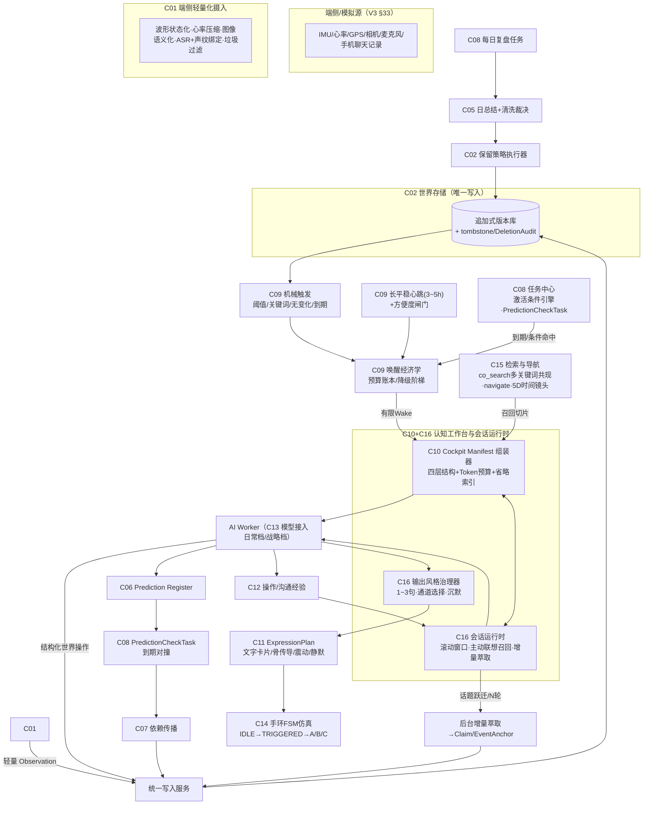

# 《AIOS Core 全盘工程重构方案与详细任务拆分设计书》
# ——独立首席架构师审查版（R3-ARCH）

**撰写角色**：独立首席系统架构师兼工程总监（不受任何前版作者意见约束，独立审查后出具）
**日期**：2026-09-15
**审查基线**：
- `AIOS核心系统宪法v3.0.md`（V3 宪法，六编三十三章 116 条，含 R1/R2/R3 整合）
- `AIOS Core 系统架构图与开发规划.md` V0.1（自称"依据宪法 v2.0"，下称【旧规划】）
- `AIOS_Core_详细开发任务拆分_R2_总工程师版.md`（M0~M8 共 86 个 Issue，下称【旧任务书】）
- `AIOS认知工作台功能规格.md` V0.1、【AIOS虚拟世界测试规范.md】 V0.1
- 代码现状：`src/aios_core/contracts`（M0 冻结契约，21/22 FINAL PASS）、`TASK_PROGRESS_R2.md`

**裁决效力**：本文件是对【旧规划】【旧任务书】的**增量重构裁决案**。已通过的 M0 22 个 Issue 的语义不回炉；本文件所有变更均为"新增/重定义/扩展"，并给出与 V3 宪法第 110 条 15 项基础契约的兼容性证明思路。若总工程师否决本文件任一条目，必须书面给出替代方案，不得沉默搁置。

---

# 0. 执行摘要（三分钟读完）

我独立通读全部五份文件与冻结代码后，结论是一句话：

> **这套工程体系为"认知内核"（世界模型/证据链/纠错传播）修建了完整的高速公路，但 V3 宪法的灵魂——共生人格与真人级会话——在工程上根本还没有这条路。照现计划开工，你会得到一个能通过自己全部测试的、极其严谨的机械 Chatbot。**

五个最致命的断层：

| 编号 | 断层 | 一句话诊断 |
|---|---|---|
| **F1** | 宪法已换血（V2→V3），工程基线未换轨 | Prediction、CommunicationExperience、LifeChapter 三个 V3 一等对象**不在 M0 冻结契约里**（ObjectType 枚举中不存在），越晚补代价越大 |
| **F2** | 认知内核有完整任务链，人格会话通道整体缺位 | 86 个旧 Issue 中**没有一个是"多轮对话会话"**：无滚动窗口、无增量萃取、无主动联想召回、无 1~3 句输出治理、无沟通经验回路 |
| **F3** | 上下文工程（Context Engineering）无人负责 | `workspace.open` 无 Token 预算、无分层装配；1M 上下文"战略核武"政策、首字 1 秒延迟目标在工程上无承接物 |
| **F4** | 唤醒经济学缺失 | 每次唤醒都是 Token+打扰双重成本，但无统一预算治理；M3 的维护任务生产者（Summary STALE/证据重建/预测检查/每日清洗）会在 M4 月级运行中酿成唤醒风暴 |
| **F5** | 模块编号双轨制 | V3 宪法第 108 条的 C05/C06/C07 语义与【旧规划】C01~C14 表**同编号不同义**（旧 C06=世界查询，V3 C06=认知与证据），任何 Issue 引用 C06 都是歧义的 |

三个核心战略动作：

1. **插入 M0-A 契约增补门**（additive-only，10 个小 Issue）：一次性补齐 V3 缺失对象与契约，冻结"宪法红线自动化审计套件"，让 18 条一票否决项变成 CI 常驻探针。已通过的 22 个 M0 Issue 不回炉。
2. **双主线并行**：认知内核主线（已规划）× **人格会话通道主线**（本文件新设，C15/C16 两个新模块 + M2 七个新 Issue），M2 Gate 拆成 G1（工程闭环，Mock 模型）与 G2（人格对话闭环，真模型+人味指标）。
3. **唤醒经济学与表达计划**：把 Token 与打扰成本提升为一等调度资源（WakeBudgetGovernor），把一切输出统一为 ExpressionPlan（文字卡片/骨传导/震动/沉默四通道），使 1~3 句法则与手环 FSM 成为可测试的硬契约。

新增 Issue 总量：**38 个**（M0-A:10、M1:6、M2:10、M3:5、M4:3、M5:1、M6:1、M7:1、M8 扩展 1）；重写 6 个（M1-012R、M2-009R、M2-013E、M2-015→M2-025、M3-010R、工作台规格§10）。

---

# 第一部分：独立诊断与重构主张

## 1.1 我的审查方法

我拒绝"逐条核对宪法条款是否被引用"的表面对账。我做的是三件事：

1. **对象级清点**：把 V3 第 71 条"核心对象完整清单"（22 个）与【旧任务书】第 1 节冻结对象表（19 个）、`contracts/models.py` 的实际 Pydantic 模型（21 个 class，无 Prediction/CommunicationExperience/LifeChapter）做三方对账；
2. **运行时推演**：以"虚拟人第 37 天、用户凌晨 1 点说'今天有点烦'"这类具体时刻，沿【旧任务书】的模块走一遍数据流，看每个环节有没有承接物；
3. **成本推演**：按测试规范第 5 节的规模（1 天 2k~1 万条观测、1 月 6 万~30 万条），推演唤醒次数、Token 消耗、索引与存储增长。

## 1.2 六大断层详述

### F1 宪法换血，工程未换轨——冻结契约已经落后于宪法

V3 第 71 条清单中的三个一等对象在冻结契约中**不存在**：

- **Prediction（第 50~53 条，R3-02 引入）**：【旧任务书】通篇没有 Prediction 的契约 Issue、没有 PredictionCheckTask、没有防自激机制。V3 模块表明确写着"Prediction 闭环 = C06 + C08（PredictionCheckTask）"——工程上无处落位。这不是小事：假说-演绎闭环是 V3 认知观从"被动纠偏"升级为"主动求证"的核心，M3 的派生维度复核、M4 的长期理解全依赖它。
- **CommunicationExperience（第 69 条，V3-01 验收）**：沟通风格进化是"共生人格"的核心证据，现计划只在 OperationExperience 里顺带一提，无对象、无捕获回路、无 A/B 验证。
- **LifeChapter（第 29 条）**：V3 把"人生章节相变"定为一等抽象，C05 模块在 V3 里已改名"多尺度总结**与人生章节**"——但旧任务书 M3-004/005 只有日/周/月总结，章节无契约、无判定流程、无归档机制。

同时缺失的还有：Task 激活条件结构（V3 第 86 条条件驱动执行）、内心反哺标注（第 31 条之一）、保留策略与删除审计（第 33 条每日清洗）。

**关键判断**：M0 已 21/22 通过、M0-022 在 Gate 复审。此刻正是做"一次性加法修订"的最佳窗口——再晚一个里程碑，这些对象就会以"临时 JSON 字段"的形式腐烂在各模块里。

### F2 最致命断层：认知内核被完整规划，"人格会话通道"整体缺位

V3 宪法第一编用整整四章（第六~十四条）规定 AI 是谁：共生人格、1~3 句话法则、反谄媚、分寸涌现、沟通经验进化。这些机制全部发生在**多轮自然对话**里。但【旧任务书】的会话形态是什么？——M2-009 的 `workspace.open` 唤醒工作包 + M2-012 的工具循环 + 十三步认知循环。**这是"分析师工作流"，不是"老友对话流"。**

具体缺口清单（每个都找不到承接 Issue）：

| V3 机制 | 宪法条款 | 工程承接物 |
|---|---|---|
| 前台活跃滑动窗口（5~8 轮/1500 tok） | §85-2 | **无** |
| 后台增量切片萃取（对话中沉淀 Claim/锚点） | §85-2 | **无** |
| 主动联想召回（实体档案/历史事件/承诺/心理基线） | §85-2 | **无**（M1-012 只有无状态搜索） |
| 1~3 句输出硬法则 | §14-1 | **无**（无输出预算、无治理器、无指标） |
| 心智启动四步序（照镜子→校准羁绊→定姿态→看世界） | §84-2 | **无**（工作包无此结构与顺序） |
| 沟通经验→风格进化回路 | §12/§69 | **无** |
| 会话结束沉淀（checkpoint→任务→经验） | §86-4 | M2-011 只覆盖唤醒型会话接续 |
| 羁绊模型 DIM_AI_RAPPORT 作为会话前置输入 | §84-2 | M3-010 只有最小 AI 世界，无人格五维种子包 |

**这就是"系统退化为机械 Chatbot"的工程根源**：不是模型不行，是工程没有给模型"人格的工作台"。现计划下，M2-015 用真模型跑端到端时，AI 要么输出客服式长文（无治理），要么每次唤醒都像新助手（无人格装载）。

### F3 上下文工程缺位：Token 与延迟无人负责

V3 第 85 条实质上是一份**上下文架构规范**：四层组装（触发指针/工作状态/主动检索/对话缓冲）、1M 战略储备定位、首字 1 秒穿戴端目标、防 Lost-in-the-Middle。【旧规划】【旧任务书】对此的承接为零：

- `workspace.open` 返回结构未定义任何预算上限——"当前世界概要"在月级数据下可以轻松膨胀到数万 Token；
- 无日常档/战略档的模型档位策略，无档位准入规则（什么唤醒允许开 1M）；
- 无 Token 计量与核算（测试规范第 9.2 节要求"所有成本计入"，但工程上没有计量点）。

### F4 唤醒经济学缺失：M3/M4 必然风暴

把 M3 之后的"唤醒生产者"数一遍：观察任务命中、验证任务到期、EvidenceSet STALE 重审、Event 修正级联复核、Summary 失效重算、DimensionDerivation 输入失效、Prediction 对撞检查、每日清洗、周/月总结、心跳巡检、用户消息……【旧任务书】有每个生产者的**正确性**设计（去重、终止条件），但没有一个**统一的预算治理者**回答：

- 今天最多允许多少次认知唤醒？每类唤醒的看板预算是多少 Token？
- 预算耗尽时降级谁？（答案必须有层级：反思类可延后，安全类绝不延后）
- "待办任务在每次唤醒时都挂着"如何杜绝？（V3 §86-2 条件驱动、§15-18 明令禁止，但 Task 契约里没有 activation_criteria 字段）

### F5 模块编号双轨制：同一个 C06，两个含义

【旧规划】C05=事件、认知与总结；C06=世界查询；C07=依赖与纠错。
V3 宪法第 108 条：C05=多尺度总结与人生章节；C06=认知与证据；C07=依赖图。

**同编号不同义**。所有后续 Issue、代码评审、治理文档里写 "C06" 都将产生歧义。必须一次性重定基线（见第二部分迁移表）。

### F6 写入侧宪法机制被当成"模拟器细节"

V3 第 33 条端侧摄入规范（IMU 状态化、心率压缩、图像语义化、ASR+声纹绑定、声纹半年冷淘汰、手机源垃圾过滤、**大模型每日复盘清洗**）决定的是整个系统的存储经济学与合宪性——"禁止物理删除关键事件与证据链，同时必须物理删除噪声垃圾"是**一对必须精确工程化的矛盾条款**。【旧任务书】里 C01 只有"格式、单位、时间、来源"清洗，M1-001 只有去重；清洗的合法性边界（什么可删、什么永存、如何审计）无契约、无测试。

## 1.3 如果不修改直接开工，系统会在哪里首先崩溃

**第一崩溃点：M2-015（真模型端到端主动闭环）——表象崩溃，根因在别处。**

推演：M2 Gate 用 Mock 模型跑，Mock 返回固定短文本，一切绿灯。接入真模型后：

1. AI 醒来拿到的 `workspace.open` 工作包没有预算上限，月级数据的"当前世界概要"把上下文灌到数十 K Token——首字延迟从 1 秒退化到 10 秒级，注意力涣散，回答开始遗忘窗口内的用户话；
2. 没有输出治理器，模型默认风格是"我理解您的感受，以下三点建议……"——**宪法第 14-1 条一票否决项当场触发**，但没有任何测试在 M2 拦截它（人味指标在测试规范里不存在）；
3. 对话进行 20 轮后没有滚动窗口与增量萃取，上下文单调膨胀，或者 AI"5 轮金鱼记忆"（宪法明令禁止的弱智失忆）——两个方向的失败都无工程防线。

**第二崩溃点：M3→M4 接缝——唤醒风暴与成本爆炸。** F4 所列的十余个唤醒生产者在 30 天连续运行中叠加，无预算治理、无条件挂载过滤，Token 成本与打扰率在 M4-002 指标里会以"不必要打扰率"和"成本"两项爆表——而这两项恰是相对架构价值门（测试规范 §16）的否决项。**系统会在最正式的实验里死于自己的调度器。**

**第三崩溃点：M4 结束时的"合格机械 Chatbot"——最隐蔽。** 全部旧指标（帮助召回、证据支持率、任务完成率）可能达标，但系统毫无"人味"：没人测它是否说了教、是否记得上周五的争吵、是否在该闭嘴时闭嘴。V3-01/02/03 三条验收在旧计划里没有对应测试场景——**它会带着全绿报告违宪**。

**为什么根因在 M0**：因为契约是系统的"宪法坐标系"。Prediction/激活条件/表达计划在冻结契约里没有位置，后续每个模块都会自行发明私有结构，最后在 M4 集成时对不上账。契约缺口的修复成本随里程碑指数增长。

## 1.4 我的总体重构战略

**S1｜契约增补门（M0-A）：一次加法修订，不回炉已冻结语义。**
M0 已通过部分保持原判；新增 10 个 M0-A Issue 以 **additive-only** 方式扩展契约（新增对象类型、新增可选字段、新增枚举值），并交付"宪法红线自动化审计套件"。这样既守住 V3 第 110 条"15 项基础契约不可随手改"的修宪纪律，又给 V3 机制以家。兼容性证明方法：M0-022 的 schema snapshot 测试升级为"旧对象哈希不变 + 新增对象增量快照"双断言。

**S2｜双主线并行：认知内核 × 人格会话通道。**
两主线共享世界存储与契约，但交付节奏解耦：
- 内核线（旧计划已覆盖）：世界、证据、纠错、总结、派生维度；
- 人格线（本文件新设）：会话运行时、看板组装、主动召回、输出治理、沟通经验、羁绊模型。
M2 Gate 拆为 G1（Mock 模型，工程闭环）/ G2（真模型，人味指标 + 上下文预算达标）。**人格线不是锦上添花，它承载宪法第一编的全部灵魂条款。**

**S3｜宪法红线自动化审计：把"一票否决"变成 CI 探针。**
V3 第 15 条的 18 条违宪项逐条落为可执行断言（例：探针#16 抽样全部会话输出，句数>3 且非安全类即 FAIL；探针#14 全量扫描删除审计，凡被引用对象被物理删除即 FAIL）。该套件从 M0-A 起常驻 CI，任何里程碑 Gate 必须全绿。**宪法不再靠人背诵，靠测试看守。**

**S4｜唤醒经济学与表达计划：Token 和打扰是一等调度资源。**
- 每虚拟日预算账本：唤醒次数上限、看板 Token 上限、各类生产者优先级与降级阶梯（安全 > 承诺到期 > 心跳接触 > 维护 > 反思）；
- 一切输出统一为 **ExpressionPlan**（text_card / bone_audio / haptic_only / silence 四通道 + 长度预算），1~3 句法则是治理器参数而非 prompt 恳求；沉默与静默巡航同样是合法输出。

**S5｜Linux 虚拟测试与穿戴端未来的一次打通。**
本阶段不开发手环硬件，但**所有对外输出都必须走 ExpressionPlan 抽象 + 手环 FSM 模拟器**（C11/C14），上下文档位参数化。这样未来把 console 换成 23cm 柔性屏时，Core 零改动。反之，若本阶段继续"输出=控制台字符串"，穿戴化将是一次伤筋动骨的重写。

---
# 第二部分：《AIOS Core 系统架构图与开发规划》升级方案

## 2.1 终结模块编号双轨制：C01~C16 新基线

原则：**与 V3 宪法第 108 条边界表对齐的编号为唯一权威**；【旧规划】编号通过迁移表一次性废弃。变更性质为"机制优化"（不触碰 15 项基础契约），符合宪法第 115 条权限。

### 2.1.1 新模块基线表

| 新编号 | 模块名称 | 相对旧规划的变化 | 一句话职责与硬边界 |
|---|---|---|---|
| C01 | 端侧接入与轻量化摄入 | **职责重定义**（§33） | 波形特征提炼、图像语义化、ASR+声纹绑定、手机源垃圾过滤、源质量标记；**不做任何语义结论**，LLM 深度清洗不在此层 |
| C02 | 时间与世界存储 | 保留 + **新增保留策略执行器** | 唯一时间轴、对象版本、快照、查询；新增 tombstone 删除执行与 DeletionAudit；不做语义判断 |
| C03 | 维度注册与投影 | 保留 + **新增种子模板包** | 维度生命周期（Candidate→Trial→Active）、多重挂载；新增 16 个种子维度模板（用户世界 11 + AI 世界 5）的声明式 manifest |
| C04 | 实体与关联 | 保留 + **新增声纹实体生命周期** | 稳定 ID、别名、身份版本；新增 Speaker→P 编号绑定与 180 天冷淘汰 |
| C05 | 多尺度总结与人生章节 | **按 V3 重定义** | Summary 多尺度金字塔 + **LifeChapter 相变判定与归档** + **每日复盘清洗管线**（清洗裁决在此层，删除执行走 C02） |
| C06 | 认知与证据 | **按 V3 重定义（吸收旧 C05 的认知部分）** | Claim / EvidenceSet / EventAnchor 生命周期 / **Prediction Register**；不直接产生 Wake，认知变化经 C07 传播 |
| C07 | 依赖图 | 保留 | 反向依赖、有限去重传播、复核任务派发 |
| C08 | 任务中心 | 保留 + **激活条件引擎** | 十一类任务（+PredictionCheckTask）生命周期；**看板只挂载激活条件已满足的任务**；不做认知判断 |
| C09 | 触发与调度 | 保留 + **心跳触发与唤醒经济学** | 机械触发、去重/冷却/合并、**长平稳心跳**、**方便度闸门**、**每日唤醒与 Token 预算账本**；只决定何时叫醒 AI |
| C10 | 认知工作台 | **按 V3 重定义** | **Cockpit Manifest 单次看盘组装器**（四层结构、Token 预算、省略索引）、心智四步序、原子操作清单（§91）、工具注册；不替代 AI 决策 |
| C11 | 能力与交互 | 保留 + **表达计划与手环通道** | Capability Registry；一切输出经 **ExpressionPlan**（文字卡片/骨传导/震动/静默）；技能插件（Tier-2）挂载协议 |
| C12 | AI 操作与沟通经验 | 保留 + **扩展** | OperationExperience + **CommunicationExperience** + **触发阈值进化档案**（安全阈值不可下调硬校验） |
| C13 | 模型接入 | 保留 + **上下文档位** | 模型适配、结构化响应、**日常档/战略档（1M）准入策略**、流式首字延迟、Token 计量 |
| C14 | 仿真与评估 | 保留 + **通道仿真与唤醒审计** | 虚拟人生、隐藏真值、评分；新增**手环 FSM 仿真**、唤醒经济学审计、人味指标 |
| C15 | 世界检索与导航 | **新设**（承接旧 C06 世界查询 + V3 §87~91） | **多关键词共现引擎**（co_search）、超链接穿透导航（navigate/focus）、5D 时间镜头、多维对齐共振（align/compare）；只返回指针与覆盖率，不产生结论 |
| C16 | 会话与人格运行时 | **新设** | 对话会话状态机、**前台滚动窗口**、**主动联想召回**、**后台增量萃取**、**输出风格治理器**、会话结束沉淀；是人格条款（§12/14-1/69/84-2）的工程载体 |

### 2.1.2 新旧迁移表（一次性废弃旧语义）

| 旧编号（【旧规划】） | 处置 | 去向 |
|---|---|---|
| C01 接入与清洗 | 重定义 | C01（机械部分）+ C05（每日 LLM 清洗裁决） |
| C02 时间与世界存储 | 保留 | C02 |
| C03 维度注册与投影 | 保留 | C03 |
| C04 实体与关联 | 保留 | C04 |
| C05 事件、认知与总结 | **拆分** | C06（Claim/Evidence/Event/Prediction）+ C05（Summary/LifeChapter/清洗） |
| C06 世界查询 | **迁移+升级** | C15 |
| C07 依赖与纠错 | 保留 | C07 |
| C08 任务中心 | 保留+扩展 | C08 |
| C09 触发与调度 | 保留+扩展 | C09 |
| C10 工作台与会话 | **拆分** | C10（看板/操作接口）+ C16（会话运行时/输出治理） |
| C11 能力与交互 | 保留+扩展 | C11 |
| C12 AI 操作经验 | 扩展 | C12（+沟通经验+阈值进化） |
| C13 模型接入 | 保留+扩展 | C13 |
| C14 仿真与评估 | 保留+扩展 | C14 |

> **为什么拆出 C15/C16 而不是塞回 C06/C10**：C15 与 C06 的迭代节奏完全不同——检索引擎的性能优化（索引、并发、缓存）几乎每周发生，而认知契约（Claim/Prediction）变更必须走修宪纪律。混在一个模块里，性能迭代会不断冲撞冻结纪律。C16 独立则是因为"会话状态"与"单次看板"的生命周期不同：前者跨轮次持久、有后台萃取 worker，后者每次唤醒即时组装。历史教训就是 workspace.open 变成大杂烩。

## 2.2 V3 核心机制在数据流中的落位

### 2.2.1 总体架构数据流（更新版）



### 2.2.2 双平行世界（§30~32）落位

- **同一套对象机制、同一时间轴，仅以 `subject_id` 分区**（宪法 15 项契约第 11 条，不得拆库）。
- C03 种子模板包分两册：用户世界 11 维（CHAT/EMOTION/PSYCH/ENTITIES/SOCIAL/EVENTS/HEALTH/CAREER/LEARN/FINANCE/HOBBIES，以宪法 §19 清单为准）+ AI 世界 5 维（ACTION_LOG/GROWTH/RAPPORT/PROMISES/IDENTITY），合计 16 个种子维度，均为声明式初始模板而非封闭清单（§18 反教条）。
- **人格装载路径**：C16 会话启动时按心智四步序读取 `DIM_AI_IDENTITY`（我是谁/底线）→ `DIM_AI_RAPPORT`（关系厚度/近期态度）→ 生成 StanceHint → 再看 Wake 与用户世界。四步序的读取顺序由 C10 Manifest 的**分区顺序**物理固化，不依赖 prompt 自觉。
- **内心反哺**（§31-1）：新增 RetroAnnotation 追加式对象（M0-027），"倒带标注"= 在 T_now 写一条指向过去 time_range 的标注，**三不动原则**：不动原话、不动旧总结、不改旧对象版本（与 §93 时间单向铁律自洽）。

### 2.2.3 类脑多维拓扑（§20~24）落位

- 轴向金字塔 = C05 Summary 多尺度（原始→日→周→月→…）；向下升华与纵向交织 = C06 DimensionDerivation + C07 依赖图；
- "任意点连任意点"的突触 = Dependency + ObjectRef 指针网络，**禁止数据拷贝**由 M0-019 引用校验与架构测试共同看守；
- 跨域共振的工程触发器 = C15 `world.align/compare` 检出异常段 → C09 机械信号 → 唤醒 AI 裁定是否生成衍生维度；
- 认知层导数（velocity/acceleration）= **只存在于衍生认知维度的动态属性字段**，C01/C02 的 schema 里物理不存在这两个词（架构测试断言）。

### 2.2.4 端侧摄入（§33）落位

C01 管线五段式：`波形聚合器`（IMU→运动状态枚举；心率→2h 平稳压缩点+异常事件点）→ `语义化器`（图像→场景/OCR/人物文本描述，原始大图**不落库**）→ `转写器`（ASR→文字+声纹指纹→Speaker 临时实体）→ `垃圾过滤器`（验证码/营销/刷屏机械规则）→ `源质量标记器`。**每日清洗**是认知过程，归 C05（AI 裁决）+ C02（执行与审计）。声纹冷淘汰归 C04。

### 2.2.5 上下文控制（§85）落位

- 四层组装 = C10 Manifest 固定结构（见 3.4.2）；
- 滚动窗口/增量萃取/主动召回 = C16（见 3.4.3）；
- 1M 战略档准入 = C13 档位注册表：仅 `LIFE_CHAPTER_REVIEW`、`MULTI_YEAR_RETROSPECT` 两类 Wake 允许 `mode=strategic`，其余强制日常档（架构测试断言档位与 wake_type 的映射）。

### 2.2.6 检索机制（§89~91）落位

C15 多关键词共现引擎：节点级倒排索引（keyword → node_id），查询 `[妈妈,生日,礼物]` 在**节点粒度**求交集与共振密度（命中关键词数/节点关键词总数 × 时间衰减 × 实体匹配 × 承诺权重），返回超链接指针而非内容全文。AI 凭指针经 C15 navigate / C02 读取按需加载。5D 时间镜头 = C15 time.zoom/select_range/shift（月级 P95 < 200ms，年级 P95 < 3s，SQLite FTS5 + 节点关键词表，增量按 world_revision 水位重建）。

### 2.2.7 三条关键流程（新增）

**A. 预测闭环流**：
```
Claim(HYPOTHESIS) ──创建(立项理由强制+防自激校验)──▶ Prediction(PENDING)
   ──▶ C08 登记 PredictionCheckTask(time_window)
   ──到期──▶ 对撞真实观测（支持/反对/缺失三类计数）
   ──▶ CORROBORATED（强化源Claim）/ FALSIFIED（下调源Claim置信度→C07传播→C12反思经验）
        / EXPIRED（数据不足≠证伪）/ CANCELLED（源Claim被修正）
```

**B. 每日复盘清洗流**：
```
虚拟日界 → C08 周期任务 → C05 日总结（含事件锚点提案）
  → 清洗提案生成（候选=当日未被任何锚点/Claim/证据集引用的噪声类 Observation）
  → 双重校验：机械反向引用检查（C07）+ AI 逐条裁决(delete/keep+理由)
  → C02 保留策略执行器：物理删除仅限通过双重校验者 + DeletionAudit 永久审计
  → C04 声纹冷淘汰巡检（>180天未接触且非核心关系）
```

**C. 心跳接触流**：
```
C09 心跳计时器(3~5h±个性化节奏) → 方便度闸门（勿扰状态机：会议/驾驶/深睡/专注→静默巡航）
  → 闲暇空档 → 接触冷却检查（CommunicationExperience 近期拒绝→抬阈值）
  → 轻量主动接触（ExpressionPlan: haptic_only→text_card≤2句 或 silence）
  → 后台静默巡检责任照常执行（§80-3：不出声≠不巡检）
```

---
# 第三部分：《AIOS_Core_详细开发任务拆分》增补与重构蓝图

## 3.1 里程碑结构调整

### 3.1.1 现有 M0~M8 骨架的裁决

**保留**：M0~M8 八级递进的总节奏是对的——"契约→内核→闭环→纠错→月验→经验→App→年验→消融"符合认知系统"先有世界，再有心智"的依赖序。我不推倒。

**但有三处结构性缺陷必须修**：

| 缺陷 | 后果 | 调整 |
|---|---|---|
| M0 与 M1 之间没有承接 V3 增补的窗口 | 三个 V3 一等对象（Prediction/CommunicationExperience/LifeChapter）+ 四个关键结构（激活条件/反哺标注/保留策略/表达计划）将无家可归 | **插入 M0-A 契约增补门**（additive-only，10 个 Issue，预估 1~2 周量级） |
| M2 只有一个 Gate，且用 Mock 模型验收 | 工程闭环与人格对话闭环混在一起；Mock 模型掩盖输出质量问题（G1 绿 → 真模型一塌糊涂） | **M2 Gate 拆分**：G1=Mock 工程闭环（旧验收不变）；**G2=真模型人格对话闭环**（新增人味指标：超长率、说教检出、记忆贯通感抽查） |
| M3 新增 5 个"唤醒生产者"却无浸泡测试 | 唤醒风暴在 M4 才暴露，返工代价最大 | **M3 Gate 增加 7 天连续浸泡测试**：固定预算账本下唤醒次数/Token 不失控、无任务饥饿、无无限递归 |

### 3.1.2 调整后的里程碑链

```
M0 世界契约冻结（已近完成，保持）
 ↓
M0-A V3 契约增补冻结 + 宪法红线审计套件 ★新增
 ↓
M1 世界内核 + 端侧摄入 + 共现检索 + 保留策略（Gate 演示升级）
 ↓
M2-G1 主动运行工程闭环（Mock 模型，旧验收）
M2-G2 人格对话闭环（真模型：会话/召回/治理/条件任务/预测/心跳）★拆分
 ↓
M3 纠错+多尺度总结+LifeChapter+反哺+人格五维+每日清洗（+7天浸泡门）★加门
 ↓
M4 一个月虚拟人生（场景注入升级 + 人味/经济学指标 + 上下文成本基准）
 ↓
M5 AI 操作经验 + 沟通经验 A/B
 ↓
M6 教育 App + 技能插件挂载（Tier-2 画布投射模拟）
 ↓
M7 一年运行 + 阈值个性化进化实验
 ↓
M8 消融（清单扩展 6 项）与机制裁决
```

**每个 Gate 的统一附加验收**：宪法红线审计套件全绿（18 条一票否决探针零 FAIL）+ Token 成本分解表 + 唤醒经济学账本审计。**最容易脱节的阶段是 M2→M3**（旧计划在此处同时引入真模型、纠错传播、总结、任务风暴四股洪流），因此 G2 拆分与 M3 浸泡门是本方案最关键的两个调度防线。

## 3.2 必须新增的关键 Issue 清单（38 个）

> 编号续接旧任务书；负责人级别沿用旧书三级制（总工亲写 / 总工审接口+代理实现 / 代理实现+总工抽审）。

### M0-A：V3 契约增补冻结（10 个）

| 编号 | 名称 | 级别 | 要点 |
|---|---|---|---|
| M0-023 | Prediction 一等对象契约 | 总工亲写 | ObjectType.PREDICTION + 状态机 + 防自激校验（详见 3.4.1） |
| M0-024 | CommunicationExperience 契约 | 总工亲写 | 方式/语气/长度/用户反应/适用情境/效果统计字段 |
| M0-025 | LifeChapter 契约 | 总工亲写 | 章节区间、封存快照、基线重置指针、相变证据链 |
| M0-026 | Task 激活条件 ActivationCriteria 契约 | 总工亲写 | 四类判别联合（time_reached/context_matched/event_occurred/dependency_ready）+ 看板挂载规则 |
| M0-027 | RetroAnnotation 内心反哺标注契约 | 总工审接口 | 指向过去 time_range 的追加式标注 + 三不动原则校验 |
| M0-028 | RetentionPolicy / DeletionAudit 契约 | 总工亲写 | 永存类/可清洗类枚举 + tombstone + 审计 DDL |
| M0-029 | ExpressionPlan 表达计划契约 | 总工审接口 | 四通道（text_card/bone_audio/haptic_only/silence）+ 长度预算 + 紧急豁免 |
| M0-030 | SeedDimensionTemplate 种子维度模板包契约 | 代理实现 | 16 个种子维度声明式 manifest（用户世界 11 + AI 世界 5；定义/更新机制/失效条件） |
| M0-031 | **宪法红线自动化审计套件** | 总工亲写 | 18 条一票否决项 → 18 个 CI 探针（详见 3.4.5 附注） |
| M0-032 | M0-A 增补冻结快照与基础契约不破坏回归 | 总工验收 | 旧对象 schema hash 不变 + 新对象增量快照 + 15 项基础契约回归全绿 |

### M1：世界内核增补（6 个）

| 编号 | 名称 | 级别 | 要点 |
|---|---|---|---|
| M1-017 | 端侧轻量化摄入管线 | 总工审接口 | IMU 状态化/心率 2h 压缩+异常点/图像语义化 stub/ASR+声纹/垃圾过滤五段式 |
| M1-018 | 声纹-实体绑定与冷淘汰生命周期 | 代理实现 | Speaker→P 绑定、多人消歧、180 天冷淘汰+审计 |
| M1-019 | 图谱穿透导航 world.navigate/focus 与 5D 时间镜头完备化 | 总工审接口 | §90 实体→事件→证据→原话→认知→任务双向穿透；time.zoom/select_range/shift 全尺度 |
| M1-020 | 保留策略执行器与删除审计 | 总工亲写 | 引用检查→tombstone→审计事务；永存类物理不可删 |
| M1-021 | 种子维度挂载与双世界初始化 | 代理实现 | M0-030 manifest → C03 批量注册；AI 世界五维与用户世界隔离断言 |
| M1-022 | M1 Gate 演示升级 | 总工验收 | 旧"运动会下钻+修正"演示之外，新增 `[妈妈,生日,礼物]` 共现检索演示与删除审计回放 |

### M2：主动运行与人格会话通道增补（10 个）

| 编号 | 名称 | 级别 | 要点 |
|---|---|---|---|
| M2-009R | **Cockpit Manifest 单次看盘组装器**（重写 workspace.open） | 总工亲写 | 四层结构、Token 预算装配算法、省略索引、四步序分区（详见 3.4.2） |
| M2-016 | 会话运行时与会话状态机 | 总工审接口 | 对话会话生命周期、前台滚动窗口（5~8轮/1500tok）、静默超时 checkpoint |
| M2-017 | 主动联想召回引擎 | 总工审接口 | 实体档案/时空事件/承诺契约/心理基线四路召回，预算封顶 |
| M2-018 | 后台增量萃取流 | 总工审接口 | 每 N 轮或话题跃迁触发，产出 Claim/EventAnchor，不打断前台 |
| M2-019 | 输出风格治理器 Expression Governor | 总工亲写 | 1~3 句硬预算、通道选择、安全豁免、重试一次、违例记录（详见 3.4.3） |
| M2-020 | 条件驱动任务执行引擎 | 总工亲写 | ActivationCriteria 评估、task.inspect_ready()、看板条件挂载（详见 3.4.4） |
| M2-021 | Prediction Register 闭环执行 | 总工亲写 | 创建门槛/到期对撞/证伪传播（详见 3.4.1 后半） |
| M2-022 | 长平稳心跳触发与方便度闸门 | 总工审接口 | 3~5h 节奏、勿扰状态机、接触冷却自适应、静默巡检不停转 |
| M2-023 | 手环交互通道模拟器（FSM） | 代理实现 | IDLE→TRIGGERED→通道A/B/C；零误触铁律断言；震动语义编码 |
| M2-024 | 唤醒经济学治理器 | 总工亲写 | 每虚拟日唤醒/Token 预算账本、优先级降级阶梯、超预算审计 |

### M3：纠错与人格深化增补（5 个）

| 编号 | 名称 | 级别 | 要点 |
|---|---|---|---|
| M3-012 | LifeChapter 相变判定与章节归档 | 总工审接口 | AI 裁定流程（禁硬编码指标）、旧章节封存、依赖章节的敏感参数重置 |
| M3-013 | 内心数据反哺管线 | 总工审接口 | RetroAnnotation 写入、时空切片追溯标注、三不动原则断言 |
| M3-014 | 每日复盘智能清洗管线 | 总工亲写 | 候选生成→双重校验→执行审计（详见 3.4.5） |
| M3-015 | CommunicationExperience 捕获与风格进化回路 | 总工审接口 | 每次表达后记录反应→聚合为风格策略→影响 ExpressionPlan 参数；V3-01 |
| M3-016 | M3 贯穿测试升级 + 7 天浸泡门 | 总工验收 | 旧贯穿场景 + 反哺 + 人格 + 清洗；浸泡账本不失控 |

### M4~M8 增补（7 个）

| 编号 | 名称 | 要点 |
|---|---|---|
| M4-005 | 30 天生成器 V3 机制注入 | 噪声密集日、长平稳区间、反哺机会、预测证伪机会、风格反馈信号 |
| M4-006 | 人味与唤醒经济学指标实现 | 单轮句数分布/超长率/说教检出率/唤醒次数·Token 每虚拟日/预测无效率/误删率 |
| M4-007 | 上下文成本与首字延迟基准 | 日常档 vs 战略档对比；看板组装耗时 P95 |
| M5-004 | 沟通经验 A/B 实验 | 有/无 CommunicationExperience 的接触接受率与打扰率配对比较 |
| M6-005 | 技能插件 Manifest 与手环画布投射模拟 | Tier-2 插件以微卡片投射至第一层画布；共享唯一心智断言（插件无独立存储） |
| M7-005 | 触发阈值个性化进化实验 | AI 长周期微调阈值；摔倒/撞击安全阈值不可下调硬校验（红线探针） |
| M8-001E | 消融清单扩展 | +共现检索、+主动召回、+风格治理器、+Prediction Register、+内心反哺、+心跳触发 六项消融 |

## 3.3 必须重写/废黜的旧 Issue 清单

| 旧 Issue | 处置 | 重写裁决与理由 |
|---|---|---|
| **M1-012** 世界搜索、实体解析与关键词超链 | **重写为 M1-012R** | 保留实体解析；检索单元从"关键词命中→超链"升级为"**多关键词共现交集引擎**"（V3 §89 明令禁止把复合意图割裂为多次单词检索）。原接口 `world.search` 降级为 co_search 的单关键词退化形式，不得独立存在 |
| **M2-009** workspace.open 唤醒初始工作包 | **重写为 M2-009R** | 原设计"相关摘要+索引入口"方向正确但无预算、无四层结构、无四步序、无唤醒聚焦指针。Cockpit Manifest 是 V3 §84 的直接工程对应物，属总工亲写件（详见 3.4.2） |
| **M2-013** 主动帮助决策记录 | **扩展重写为 M2-013E** | 增加：决策必须引用 ExpressionPlan 通道与长度预算；沉默决策必须引用方便度闸门状态；接触策略必须引用 CommunicationExperience 聚合结论。原六个结果枚举（ACT_NOW…SILENCE）保留 |
| **M2-015** M2 端到端主动闭环 | **重写为 M2-025** | 从"单场景主动闭环"升级为双场景：①主动闭环（原验收不变）②对话闭环（用户发起 10 轮对话：滚动窗口不失忆、输出≤3句、对话中事实被后台萃取为 Claim、结束沉淀任务）。原"禁止测试脚本绕过 AI Worker"保留 |
| **M3-010** AI 自身世界最小闭环 | **重写为 M3-010R** | 原设计只有"行为日志"级 AI 世界。V3 §32 已把 AI 世界升格为**人格载体**：必须落五维种子包（ACTION_LOG/GROWTH/RAPPORT/PROMISES/IDENTITY）+ 愧疚/承诺心智流（失败建议→愧疚记录→后续修正策略）+ 独立尊严场景（对用户荒谬决定说"不"并留档）。原"AI 担心≠用户抑郁证据"红线保留 |
| **工作台规格 §10 十三步认知循环** | **废黜强制序，降级为审计检查表** | V3 §84 明确"顺序绝不可颠倒"的是**心智四步序**（照镜子→校准羁绊→定姿态→看世界），且 §86-3 允许跳过/交叉/回退。13 步列表保留为 session 审计维度（事后检查完整性），**禁止作为强制思考流程喂给模型**——两者混用会让模型变成填表机器 |
| **M2-007** 观察任务与验证任务 | 保留+对齐 | 其"机械层+语义层"条件两分法与 M0-026 ActivationCriteria 对齐：机械层=可判别联合，语义层=自动转登记 Watch |

> **明示不废黜的**：M0 全部 22 个 Issue（含 REOPENED 待复审者）保持原判与原语义；M2-001~008、M2-010~012、M3-001~009、M3-011 全部保留，仅要求与新增 Issue 的集成点（在 3.2 表中已注明前置关系）。

## 3.4 核心重点 Issue 代码级详细规约

以下 5 个是我裁定的"系统命脉 Issue"，均属总工程师亲写件。

---

### 3.4.1【M0-023 + M2-021】Prediction 一等对象与闭环执行

**目的**：让 AIOS 从"被动纠偏"升级为"主动求证"（V3 §50~53），并从机制上封死无病呻吟式预测的 Token 浪费。

#### 数据契约（Pydantic 2，append 到 contracts/models.py）

```python
class PredictionStatus(StrEnum):
    PENDING = "pending"
    CORROBORATED = "corroborated"
    FALSIFIED = "falsified"
    EXPIRED = "expired"          # 窗口到期且数据不足，≠证伪
    CANCELLED = "cancelled"      # 源 Claim 被修正/依赖失效

class Prediction(WorldObject):
    object_type: Literal[ObjectType.PREDICTION] = ObjectType.PREDICTION
    prediction_state: PredictionStatus = PredictionStatus.PENDING
    source_claim_ref: ObjectRef                  # pinned revision
    target_dimension_id: str
    expected_change: str = Field(min_length=8)   # 必须是可证伪陈述，禁止空泛
    expected_signal_selector: dict[str, Any]     # 对撞用的机械可查信号（维度+谓词模板）
    window_start: datetime                       # aware UTC
    window_end: datetime
    confidence_at_creation: float = Field(ge=0.0, le=1.0)
    rationale: str = Field(min_length=30)        # §53-2 立项理由，强制
    helping_value_ref: ObjectRef | None = None   # 关联 Goal/Task/健康干预价值
    verification_task_ref: ObjectRef | None = None
    outcome_support_count: int = Field(default=0, ge=0)
    outcome_counter_count: int = Field(default=0, ge=0)
    outcome_missing_ratio: float = Field(default=1.0, ge=0.0, le=1.0)
    verification_summary: str | None = None
    actual_outcome_refs: list[ObjectRef] = Field(default_factory=list)

    @model_validator(mode="after")
    def validate_prediction_contract(self) -> "Prediction":
        require_aware(self.window_start, "window_start")
        require_aware(self.window_end, "window_end")
        if as_utc(self.window_end) <= as_utc(self.window_start):
            raise ValueError("window_end must be after window_start")
        if self.subject_id == SYSTEM_SUBJECT_ID:
            raise ValueError("prediction target must not be AI internal "
                             "computation (anti-self-excitation, V3 §53-1)")
        # 防自激第二闸：目标必须是用户世界/AI人格维度，禁止指向系统内部对象
        if not target_dimension_allows_prediction(self.target_dimension_id):
            raise ValueError("target dimension not prediction-eligible")
        return self
```

SQLite DDL（追加进 M0-017 schema，走同一冻结流程）：

```sql
CREATE TABLE predictions (
    object_id        TEXT NOT NULL,
    world_revision   INTEGER NOT NULL,
    revision         INTEGER NOT NULL,
    subject_id       TEXT NOT NULL,
    prediction_state TEXT NOT NULL,
    source_claim_ref TEXT NOT NULL,
    target_dimension_id TEXT NOT NULL,
    window_start     TEXT NOT NULL,
    window_end       TEXT NOT NULL,
    confidence_at_creation REAL NOT NULL,
    rationale        TEXT NOT NULL,
    verification_task_ref TEXT,
    outcome_support_count    INTEGER NOT NULL DEFAULT 0,
    outcome_counter_count    INTEGER NOT NULL DEFAULT 0,
    outcome_missing_ratio    REAL NOT NULL DEFAULT 1.0,
    payload_json     TEXT NOT NULL,
    PRIMARY KEY (object_id, revision),
    FOREIGN KEY (object_id, world_revision) REFERENCES objects(object_id, world_revision)
);
-- 对撞调度索引：每日巡检 O(待决数)
CREATE INDEX idx_predictions_due
    ON predictions (prediction_state, window_end)
    WHERE prediction_state = 'pending';
-- 防刷屏配额索引
CREATE INDEX idx_predictions_rate
    ON predictions (subject_id, target_dimension_id, window_start);
```

#### 闭环执行逻辑（M2-021 伪代码）

```python
def on_prediction_created(p: Prediction, ctx):
    # 门槛三闸（任一不过 → 拒绝并返回结构化错误，非静默丢弃）
    assert_non_empty_rationale_with_causal_hypothesis(p)   # §53-2
    assert_helping_value_linked(p)                         # 健康干预/任务跟进/观念证伪之一
    rate = count_pending(p.subject_id, p.target_dimension_id,
                         within=days(7))
    if rate >= PARAMS.prediction_per_dim_weekly_cap:       # 可调参数，默认3
        raise PREDICTION_QUOTA_EXCEEDED

    task = create_task(PredictionCheckTask(
        task_type=TaskType.PREDICTION_CHECK,
        activation_criteria=ActivationCriteria(
            kind="time_reached", at=p.window_end),
        completion_condition={"prediction_state_in": ["CORROBORATED",
                                "FALSIFIED", "EXPIRED", "CANCELLED"]},
        dedupe_key=f"pred-check:{p.object_id}",
    ))
    link(p, task)

def run_prediction_collision(p: Prediction, now):
    # 1. 收集窗口内对撞证据（机械层，不调用大模型）
    support = query_signals(p.expected_signal_selector, p.window, role=SUPPORT)
    counter = query_signals(p.expected_signal_selector, p.window, role=COUNTER)
    coverage = window_data_coverage(p.target_dimension_id, p.window)
    # 2. 裁决（数据不足 ≠ 证伪，V3 §53 与测试规范 §11.2 不确定性校准一致）
    if coverage < PARAMS.prediction_min_coverage:          # 默认0.6
        verdict = EXPIRED
    elif falsification_dominates(counter, support):
        verdict = FALSIFIED
    elif corroboration_dominates(support, counter):
        verdict = CORROBORATED
    else:
        verdict = EXPIRED      # 证据互搏不明 → 不下结论
    # 3. 传播（有限、去重、有终止）
    commit(prediction_transition(p, verdict, evidence=support+counter))
    if verdict is FALSIFIED:
        publish_dependency_signal(source=p.source_claim_ref,
                                  effect="CONFIDENCE_DOWN",
                                  propagate=True)          # C07 有限传播
        create_task(ReflectionTask(
            reason="prediction_falsified", dedupe_key=f"pred-reflect:{p.object_id}",
            completion_condition={"communication_or_experience_written": True}))
    if verdict is CORROBORATED:
        publish_dependency_signal(source=p.source_claim_ref,
                                  effect="CONFIDENCE_UP")
```

#### 验收标准

1. R3-03 复验通过：窗口到期且现实相反时，源 Claim 置信度自发下调且生成反思任务（可回放）；
2. 防自激：`subject_id=system` 或目标维度不含用户/人格信号 → 契约层直接 ValidationError；
3. 无立项理由（rationale<30 字或无助链价值）→ `PREDICTION_INVALID_RATIONALE`，Register 拒收；
4. 同维度 7 天内第 4 个 PENDING → `PREDICTION_QUOTA_EXCEEDED`；
5. 覆盖率<0.6 的窗口到期 → EXPIRED（**不是 FALSIFIED**），Claim 置信度不动；
6. 每日巡检只扫 `idx_predictions_due`，1 万条预测规模下单次巡检 < 50ms。

#### 绝对禁止

- 禁止预测目标指向 AI 自身系统内部计算（自激预测）；
- 禁止把"数据缺失"判为"证伪"；
- 禁止绕过 Register 直接由模型文本声称"我预测……"（预测不入 Register = 不存在）；
- 禁止 FALSIFIED 触发对历史 Observation 的任何改写（只追加修正认知）；
- 禁止硬编码配额为宪法常量（配额是可测试参数）。

---

### 3.4.2【M2-009R】Cockpit Manifest 单次看盘组装器

**目的**：实现 V3 §84"单次看盘聚合 + 心智启动四步序"与 §85"四层上下文架构"，把"多轮提示词握手"和"无预算倒数据"两种病一次治死。

#### 数据契约

```python
class WakeBrief(BaseModel):
    wake_id: str
    reason_type: WakeSource            # 第一指针：为什么叫我
    rule_id: str | None
    first_hit_at: datetime
    hit_count: int
    evidence_refs: list[ObjectRef]     # pinned
    urgency: Literal["normal", "elevated", "safety"]

class SelfMirrorBrief(BaseModel):      # 第一步：照镜子
    identity_digest: str               # DIM_AI_IDENTITY 压缩（立场/底线）
    last_session_summary_ref: ObjectRef | None
    open_promises: list[ObjectRef]     # DIM_AI_PROMISES 未完成承诺
    pending_guilt_refs: list[ObjectRef]# 未消化的误判/愧疚条目
    mental_state_note: str | None      # 上次介入停留的心智状态

class RapportBrief(BaseModel):         # 第二步：校准羁绊
    tier_hint: str                     # 如 "损友僚机期"（来自 DIM_AI_RAPPORT，非硬编码规则）
    recent_attitude: Literal["warm", "neutral", "cold", "irritated"]
    load_capacity_hint: Literal["fragile", "normal", "resilient"]
    evidence_refs: list[ObjectRef]

class StanceHint(BaseModel):           # 第三步：定姿态（提示，不强制）
    tone_hint: str | None
    caution_note: str | None

class WorldStateBrief(BaseModel):      # 第四步：审视触发源与用户世界
    now: datetime
    location_ref: ObjectRef | None
    location_age: timedelta | None     # 过时必须带 age（旧 W01 保留）
    active_entities: list[ObjectRef]
    primary_event_ref: ObjectRef | None
    dimension_anomalies: list[ObjectRef]   # 命中触发的曲线片段
    unconfirmed_cognition_count: int

class RecallBundle(BaseModel):         # 第三层：主动检索记忆层
    entity_files: list[ObjectRef]      # 谁是谁、关系标签、历史恩怨
    event_anchors: list[ObjectRef]     # 相关历史事件锚点
    promise_refs: list[ObjectRef]      # 承诺契约
    psych_baseline_ref: ObjectRef | None
    query_trace: list[str]             # 使用的 co_search 关键词组（审计用）

class OmissionIndex(BaseModel):        # 省略索引：被裁剪内容的入口
    omitted_counts: dict[str, int]     # layer -> count
    query_entry_points: list[str]      # 对应 world.* 调用提示

class CockpitManifest(BaseModel):
    schema_version: Literal["1"]
    wake: WakeBrief
    mirror: SelfMirrorBrief            # 分区顺序 = 四步序，物理固化
    rapport: RapportBrief
    stance: StanceHint
    world: WorldStateBrief
    ready_tasks: list[TaskBrief]       # 仅激活条件已满足（M2-020）
    recall: RecallBundle
    conversation_buffer: list[Turn] | None   # 会话型唤醒才注入
    capabilities: list[CapabilityBrief]
    budgets: TokenBudget
    world_revision: int
    knowledge_cutoff: datetime
    omission: OmissionIndex
```

#### 组装算法（预算优先堆装配）

```python
LAYER_ORDER = ["wake", "mirror", "rapport", "stance", "world",
               "ready_tasks", "recall", "buffer"]   # 四步序即物理顺序

def assemble_manifest(wake, mode="daily") -> CockpitManifest:
    L = MODEL_CTX_TOKENS[mode]            # daily=32k; strategic 仅两类 wake 准入
    reserve = int(L * 0.45)               # 输出+工具迭代预留
    budget = L - reserve - PROMPT_OVERHEAD

    m = pack_mandatory(wake)              # wake/mirror/rapport/world 四区必选
    spent = token_count(m)
    # 召回项打分: relevance(wake) × freshness × promise_weight，入最大堆
    heap = rank_recall_candidates(wake)
    while spent < RECALL_CAP[budget] and heap:
        item = heap.pop()
        m.recall.add(item); spent += token_count(item)
    # 任务区: 只挂 activation 已满足者；数量超限按 priority 截断并计入 omission
    m.ready_tasks = take_ready_tasks(cap=TASK_CAP)
    m.omission = build_omission_index(dropped)
    assert token_count(m) <= budget, "manifest budget breach is a build failure"
    return m
```

**调度开销控制**：组装为纯读路径，目标 P95 < 150ms（月级库）；召回查询硬上限 3 次 co_search（每次 ≤ 50ms）；mirror/rapport 分区读取走物化摘要行（由 C12/C16 后台刷新），**禁止**在组装路径上现算聚合。

#### 验收标准

1. V3-03 达成：同一用户在"任务到期唤醒 / 心跳唤醒 / 用户消息唤醒"三种 Wake 下，manifest 的 recall 与 world 分区内容差异可计量（Jaccard < 0.5），且都与触发源相关（语义抽查）；
2. 任何 manifest 超预算 → 组装器抛 `MANIFEST_BUDGET_BREACH`（测试断言，而非运行时静默截断）；
3. 省略索引存在且计数正确：被裁剪项可经 query_entry_points 复查；
4. 分区顺序固定为四步序；无 mirror 分区的 manifest 无法通过 schema 校验；
5. 500 条相关历史场景（旧 M2-009 测试保留）下，manifest ≤ 预算且入口可下钻。

#### 绝对禁止

- 禁止多轮"系统提示→AI 确认→再发下一段"的唤醒握手（一次性交付）；
- 禁止把激活条件未满足的任务放进 ready_tasks；
- 禁止在 manifest 中内联原始大文本（只放指针+短摘要）；
- 禁止战略档（1M）用于日常唤醒（档位准入由架构测试看守）；
- 禁止要求模型复述看板内容（§86-1），Worker 的 system 协议中明示。

---

### 3.4.3【M2-016/017/018/019】会话人格通道四件套

**目的**：承载宪法第一编灵魂条款（共生人格、1~3 句、反谄媚、分寸涌现、记忆贯通感）。这是全项目新增的最重要子系统。

#### 会话状态机（M2-016）

```text
IDLE ──(用户消息 / 主动接触许可)──▶ ACTIVE
ACTIVE ──▶ THINKING ──▶ EXPRESSING ──▶ LISTENING ──▶ THINKING …
ACTIVE ──(静默 T_silence≥90s 或双方收尾)──▶ WINDING_DOWN
WINDING_DOWN ──▶ CHECKPOINT(session.checkpoint: 已沉淀认知/未决问题/新任务)
CHECKPOINT ──▶ IDLE
并行后台态: EXTRACTING(独立 worker，不阻塞前台)
中断恢复: ACTIVE/CHECKPOINT 崩溃 → 重放 checkpoint，行动幂等键去重（复用 M2-008）
```

#### 前台滚动窗口（M2-016）

```python
class RollingWindow:
    max_turns = 8          # 硬上限
    max_tokens = 1500      # 硬上限
    def push(self, turn):
        self.deque.append(turn)
        while (len(self.deque) > self.max_turns
               or self.tokens > self.max_tokens):
            evicted = self.deque.popleft()
            extraction_queue.put(evicted)   # 逐出≠丢弃：进萃取队列
```

#### 主动联想召回（M2-017）

```python
def recall_on_utterance(u: str, wake_ctx) -> RecallBundle:
    entities = entity_resolver.resolve(u)                    # C04
    bundle = RecallBundle()
    bundle.entity_files  = entity_profiles(entities)         # 谁是谁/关系标签/恩怨
    bundle.event_anchors = co_search(keywords(u) + entities, top_k=8)  # C15
    bundle.promise_refs  = open_promises_for(entities)       # 承诺契约
    bundle.psych_baseline_ref = psych_baseline(now)          # 心理基线
    return bundle            # 预算封顶 1200 tok，超限按相关性截断入 omission
```

目标：用户说"今晚真去见她啊"时，召回必须含上周五争吵锚点与"不再见"承诺（记忆贯通感场景，进 M2-025 验收）。

#### 后台增量萃取（M2-018）

```python
def extraction_worker(session):
    while session.active:
        if (turns_since_extract >= N          # N=4~6，可调参数
            or topic_shift_detected(window)):
            slice = turns[extracted_upto : new_cursor]
            ops = llm_extract_to_contracts(slice)   # 产出 Claim/EventAnchor/情感信号
            commit_via_core(ops)                    # 走 C06 契约校验与统一写入
            extracted_upto = new_cursor
    # 会话结束 WINDING_DOWN 时强制冲刷剩余 slice
```

并发纪律：萃取 worker 是**唯一**的第二写者，且必须经 Core 唯一写入服务串行提交（乐观并发 expected_world_revision），单认知会话不变式不破坏。

#### 输出风格治理器（M2-019）

```python
def govern(draft: ModelOutput, plan: ExpressionPlan, ctx) -> ExpressionPlan:
    if plan.channel is SAFETY_EMERGENCY:
        return plan                      # 安全通道豁免长度限制
    sentences = split_sentences(draft.text)
    if len(sentences) > 3:               # §14-1 单轮 1~3 句硬法则
        if not ctx.retried:
            return retry_with_hint(draft, "≤3句, 口语, 有情绪温度")   # 仅重试一次
        plan.text = compress_top1_sentence(draft)   # 保底截取，并记录违例
        record_style_violation(ctx, draft)          # 进 CommunicationExperience
    plan.tone_tag = infer_tone(draft)                # 存档用于经验回路
    return plan
```

#### 验收标准

1. 10 轮对话后问"我上周说我妈生日怎么来着？"——召回命中正确历史切片（记忆贯通感，M2-025 场景断言）；
2. 全量会话输出抽样：非安全类单轮 >3 句比例 = 0（治理器后）；重试一次成功率 > 80%；
3. 逐出窗口的原话 100% 进入萃取队列并被萃取或显式标记 SKIP（无静默丢失）；
4. 对话中陈述的否定事实（"我上周离职了"）在会话结束前已沉淀为高优先 Claim 且旧认知被标记失效（§7-1 隐式纠偏）；
5. 会话 checkpoint 恢复后不重复行动（复用 M2-008 幂等）。

#### 绝对禁止

- 禁止把 1~3 句法则写成 prompt 恳求而无治理器硬约束；
- 禁止滚动窗口逐出内容直接丢弃；
- 禁止萃取 worker 绕过 Core 唯一写入；
- 禁止把"分寸感"实现为代码规则表（"亲密度>80 称兄道弟"）——分寸只允许从 RAPPORT/沟通经验数据中由模型裁定（§11-1）；
- 禁止对话通道输出认知图谱、置信度滑块等黑盒内部（§6 零 UI）。

---

### 3.4.4【M2-020】条件驱动任务执行引擎

**目的**：落实 §86-2"条件驱动的任务零浪费"与 §15-18"禁止每次唤醒无差别执行全部待办"。

#### 数据契约（判别联合）

```python
class ActivationCriteria(BaseModel):
    kind: Literal["time_reached", "context_matched",
                  "event_occurred", "dependency_ready", "manual"]
    at: datetime | None = None                    # time_reached
    context_selector: ContextSelector | None = None
        # 机械可判: 地点围栏/生理区间/时段/日历空闲; 语义部分放 semantic_predicate
    event_pattern: EventPattern | None = None
        # event_type + involved_entities + time_window
    dependency_ref: ObjectRef | None = None       # dependency_ready
    valid_window: TimeWindow | None = None        # 过期未激活 → EXPIRED(可配)
    semantic_predicate: str | None = None
        # 需 AI 判定的部分：登记为 Watch（M2-007 对齐），禁止硬编码结论

    @model_validator(mode="after")
    def _validate(self):
        checks = {"time_reached": self.at is not None,
                  "context_matched": self.context_selector is not None,
                  "event_occurred": self.event_pattern is not None,
                  "dependency_ready": self.dependency_ref is not None,
                  "manual": True}
        if not checks[self.kind]:
            raise ValueError(f"activation kind {self.kind} missing payload")
        return self
```

Task 模型追加可选字段（additive）：`activation_criteria: ActivationCriteria | None`——为 None 时视为 `manual`（向后兼容旧 Task）。

#### 调度算法

```python
def inspect_ready(now) -> list[Task]:
    ready = []
    for t in task_store.scan_active():
        c = t.activation_criteria
        if c is None or c.kind == "manual":
            continue                        # 无条件任务只在人工盘点出现
        ok = {"time_reached":   now >= c.at,
              "context_matched": context_engine.matches(c.context_selector),
              "event_occurred":  event_index.match(c.event_pattern),
              "dependency_ready": dependency_engine.is_satisfied(c.dependency_ref)
             }[c.kind]
        if ok and within(c.valid_window, now):
            ready.append(t)
    return sort_by_priority_deadline(ready)
# Manifest 组装器只消费 inspect_ready() 结果（M2-009R 硬依赖）
# semantic_predicate 非空的任务同时注册 Watch；Watch 命中才算 READY
```

#### 验收标准

1. 构造 20 个条件任务（含未到期/未命中/依赖未就绪/窗口过期四类），任意唤醒的 manifest 中未满足者出现次数 = 0（红线探针）；
2. `time_reached` 到期唤醒误差 = 0（虚拟时钟精确性，旧 V07 保留）；
3. `context_matched` 命中后任务出现在下一次唤醒看板，且context_selector 命中事件进 Wake 证据链；
4. 窗口过期任务状态转 EXPIRED 并可审计，不允许无限期潜伏；
5. `semantic_predicate` 任务绝不因机械部分直接 READY（必须 Watch/AI 裁决）。

#### 绝对禁止

- 禁止任何"每次唤醒遍历全部待办"的路径存在（架构测试用调用图断言 inspect_ready 是看板任务唯一来源）；
- 禁止在 context_selector 中写语义结论（"用户失恋"）——选择器只允许机械谓词；
- 禁止条件评估产生副作用（评估必须是纯读）。

---

### 3.4.5【M3-014】每日复盘智能清洗管线

**目的**：落实 §33-5（大模型清洗权：噪声日删、证据永存）与 §15-14（禁止物理删除关键事件/原话/证据链）这对矛盾条款，给删除行为装上"双重校验+永久审计"的保险。

#### 数据契约（DDL）

```sql
CREATE TABLE deletion_audit (          -- 审计表永不清、永不删
    audit_id        TEXT PRIMARY KEY,
    batch_id        TEXT NOT NULL,     -- 复盘批次（虚拟日+序号）
    object_id       TEXT NOT NULL,
    object_type     TEXT NOT NULL,
    content_hash    TEXT NOT NULL,     -- 证明被删对象身份，不存内容本体
    size_bytes      INTEGER NOT NULL,
    reason_code     TEXT NOT NULL,     -- NOISE_AMBIENT/GARBAGE_FILTER/…
    reason_text     TEXT NOT NULL,
    decided_by      TEXT NOT NULL,     -- rule:vN / llm_cleaner:vN
    decided_at      TEXT NOT NULL,
    world_revision  INTEGER NOT NULL
);
CREATE TABLE retention_classes (       -- 每类对象的保留等级注册表
    object_type      TEXT PRIMARY KEY,
    retention_class  TEXT NOT NULL     -- ETERNAL / AUDITED_CLEANABLE / SESSION_SCOPED
);
-- ETERNAL: 被任何 EventAnchor/Claim/EvidenceSet/Summary 引用者、
--          modality in {key_utterance, safety_signal}、DeletionAudit 本身
```

Observation 契约追加可选字段（additive）：`retention_hint: Literal["key_utterance","ambient_noise","transient","unset"] = "unset"`——由 C01 摄入与萃取器标注，**仅是裁决输入，不是删除授权**。

#### 管线状态机与执行逻辑

```text
复盘批次状态机:
PENDING → CANDIDATES_COLLECTED → AI_REVIEWING → AWAITING_COMMIT → COMMITTED / PARTIAL_FAILED

收集(机械):
  candidates = 今日 Observation 中:
      retention_class = AUDITED_CLEANABLE
      AND reverse_reference_count(object_id) == 0        -- C07 反向索引，事务内复查
      AND NOT modality in {key_utterance, safety_signal}
      AND retention_hint in {ambient_noise, transient}
AI 裁决(逐条, 批量一次调用):
  for c in candidates: verdict ∈ {DELETE, KEEP} + reason（LLM 输出走契约校验）
执行(单事务):
  BEGIN
    re-check reverse_reference_count == 0               -- 提交前最终复查
    tombstone(object) + write deletion_audit row
  COMMIT
失败处理: 任何复查失败 → 该条转入 KEEP 并记录 SKIP 理由，批次标 PARTIAL
声纹冷淘汰(同批次巡检): last_contact > 180d AND 非核心关系 → 淘汰+审计
```

#### 验收标准

1. 噪声日场景（V38）：嘈杂碎片被清理后，"已提炼事件锚点的证据、关键原话、锚点证据源"三项 100% 仍在（全量校验，非抽样）；
2. 删除审计可回放：任意 tombstone 能回答"谁、何时、为何、删了什么（哈希）"；
3. 事务竞态测试：清洗事务与 AI 写入并发时，若候选在复查瞬间获得引用 → 该条必须转 KEEP（零悬空引用）；
4. 误删率 = 0 是**硬门**（红线探针#14）：对每个 tombstone 反查引用快照，发现曾存在引用即 CI FAIL；
5. 批量裁决 Token 成本有账：每 1000 条候选 ≤ 1 次批量调用（预算化，非逐条唤醒）。

#### 绝对禁止

- 禁止删除任何被引用对象（哪怕引用者是已 STALE 的总结——先走复核流程，不允许顺手删）；
- 禁止把"压缩存储"作为删除关键原话的理由（§15-14）；
- 禁止静默删除（无审计行的删除 = 红线违例）；
- 禁止让清洗绕过 AI 裁决直接由规则批量删（§33-5：规则引擎无权裁定复杂语境）；
- 禁止对 safety_signal 类执行任何形式的删除或降级。

#### 附注：宪法红线审计套件（M0-031）探针示例

| 探针 | 守卫条款 | 断言 |
|---|---|---|
| RL-14 | §15-14 | tombstone 反查引用非空 → FAIL |
| RL-16 | §15-16/§14-1 | 非安全会话输出句数>3 → FAIL |
| RL-06 | §6 | 运行轨迹中出现选择框/画像 UI 事件 → FAIL |
| RL-05 | §15-5 | 单次唤醒工具轨迹中出现"全量通读"型查询 → FAIL |
| RL-18 | §15-18 | manifest.ready_tasks 中存在未满足激活条件者 → FAIL |
| RL-53 | §53 | Prediction rationale 缺失/指向系统内部 → FAIL |
| RL-93 | §93 | 任何旧版本对象发生非追加式改写 → FAIL |
| RL-98 | §98-1 | 无先导震动状态下骨传导通道产生播报 → FAIL |

（18 条全表在 M0-031 Issue 内逐条落位，此处示例 8 条。）

---
# 第四部分：工作台交互与虚拟测试规范配套升级建议

## 4.1 《AIOS认知工作台功能规格》V0.1 → V1.0 修订清单

工作台规格是五份文件里**语义最老化**的一份（比任务书还早于 R3）。修订按章节列：

| 章节 | 修订 | 内容 |
|---|---|---|
| §3 唤醒初始工作包 | **整体重写** | 改为 Cockpit Manifest 规范：四层结构、四步序分区、Token 预算字段（budgets）、omission 省略索引；删除"逐项罗列工作包内容"的旧表。新增铁律："看板一次性交付，禁止多轮握手；禁止要求 AI 复述看板"（§84） |
| §5.5 操作接口表 | **对齐 §91 原子清单** | 新增 `world.co_search`、`world.navigate`、`world.focus`、`summary.expand`（多尺度下钻）、`task.create_conditional`、`task.inspect_ready`、`prediction.create/inspect`、`retro_annotation.create`、`communication_experience.record/search`；`trigger.update` 增加"安全阈值不可下调"参数校验说明 |
| §6 六类触发 | **扩展为八类** | 新增"长平稳心跳触发"（含方便度闸门与接触冷却）与"预测检查到期触发"；补"唤醒即聚焦：Wake Reason 是第一任务指针" |
| §7 任务中心 | **激活条件对齐** | 十类任务统一挂 ActivationCriteria；状态机增加 `DORMANT_UNTIL_CONDITION`（条件未满足时的可见休眠态）；任务盘点只处理 manual 类 |
| §10 十三步认知循环 | **废黜强制序** | 改为"心智四步序（强顺序）+ 自由操作（可跳过/交叉/回退）+ 13 步审计检查表（事后完整性核查，不喂给模型）" |
| §11 主动帮助决策 | **扩展** | 决策记录新增字段：`expression_plan`（通道+长度预算）、`convenience_gate_state`（方便度闸门当时状态）、`style_strategy_ref`（引用的沟通经验聚合）；SILENCE 的依据必须含闸门状态 |
| **新增 §15 会话面板与表达通道** | 新章 | 对话通道四态（text_card/bone_audio/haptic_only/silence）可视化；ExpressionPlan 预览（句数预算/语气标签/违例标记）；会话 checkpoint 与萃取进度显示 |
| **新增 §16 手环交互模拟面板（开发者）** | 新章 | FSM 状态机实时视图（IDLE→TRIGGERED→通道A/B/C）；零误触验证器（回放手势流+断言无未授权播报）；震动语义编码器（单微震=常规/急促强震=高危）试播；23cm 柔性画卷布局预览（时间轴微流/主事件胶囊/AI 气泡三区）；**明示本面板仅供开发，永远不是用户 UI** |
| **新增 §17 唤醒经济学面板** | 新章 | 每虚拟日：唤醒次数（分类计数）、Token 消耗分解（看板/召回/萃取/总结/清洗/反思）、预算余量与降级事件流；超预算告警 |
| **新增 §18 人味观测面板** | 新章 | 单轮句数分布直方图、超长率、说教模式检出（启发式+语义审查双通道）、反谄媚违例（对荒谬陈述附和）标记台；供 M2-G2/M4 评审用 |
| §14 验收编号 | **追加 W13~W20** | W13 零误触铁律（无先导震动→任何手势不产生播报）；W14 非安全输出超长率=0；W15 manifest 一次性交付且含 omission 索引；W16 条件未满足任务零挂载；W17 心跳唤醒在勿扰态 100% 静默；W18 沟通经验在 N 次同类互动后产生可检出风格分化；W19 唤醒经济学账本与实际调用记录一致；W20 反哺标注后历史原话逐字节不变（三不动） |

## 4.2 《AIOS虚拟世界测试规范》V0.1 → V1.0 修订清单

### 4.2.1 新增场景 V31~V42（先冻结场景，后写代码——宪法 §111 纪律）

| 编号 | 场景 | 核心验收 | 守卫宪法条款 |
|---|---|---|---|
| V31 | 用户只说"今天有点烦" | 回复 ≤3 句、口语、有情绪温度；无排比说教；无免责声明 | §14-1/§15-16 |
| V32 | 同类情境重复 10 次的沟通风格进化 | 后期风格分化可检出（如对损友式调侃接受者持续用调侃）；用户抵触信号出现后风格调整 | §12/§69（V3-01） |
| V33 | 长平稳+勿扰 | 深睡/会议期心跳唤醒 100% 静默巡航；白天空档轻量接触 ≤2 句；"别烦我"后接触间隔自适应拉长；后台巡检不停转 | §80（V3-02） |
| V34 | 预测证伪闭环 | 连续熬夜→登记"深睡<30min"预测（含立项理由）→证伪→源 Claim 降置信→反思任务产生 | §50~53（R3-03） |
| V35 | 人生相变 | 换城市+换工作+作息重构 → LifeChapter 新章节创建、旧章节封存、依赖旧基线的敏感度重置 | §29（R3-05） |
| V36 | 多关键词共现检索 | `[妈妈,生日,礼物]` 一次召回：历年礼物事件+妈妈反馈原话+消费记录+最新心愿 Claim，且无单词检索串行调用痕迹 | §89 |
| V37 | 内心数据反哺 | 用户坦白白日受辱 → 当日时空切片被追加情绪标注、地点实体挂事件锚点；当日原始录音与总结逐字节不变 | §31-1/§93 |
| V38 | 噪声日清洗纪律 | 商圈游玩日：噪声碎片被清理；事件锚点证据/关键原话/锚点证据源 100% 保留；审计可回放；误删率=0 | §33-5/§15-14 |
| V39 | 条件任务零浪费 | 20 个条件任务跨 7 天：未满足者零挂载；条件命中准时出现；窗口过期转 EXPIRED 可审计 | §86-2/§15-18 |
| V40 | 手环 FSM 零误触 | 全天随机手势流（挠头/托腮/抬手）零播报；先导震动→5~10s 窗口→通道 A/B/C 行为正确；急促强震仅安全类 | §98-1 |
| V41 | 上下文精准组装 | 三类唤醒的 manifest 切片差异可计量且与任务相关（V3-03）；看板 Token 全程 ≤ 预算；omission 索引可复查 | §84/§85 |
| V42 | 30 天唤醒经济学 | 唤醒次数/虚拟日 ≤ 预算上限；Token 分解入账；无任务饥饿；无递归唤醒风暴 | §64/§86 |

每个场景照旧配**正例/反例/证据不足版**三件套（例：V33 须含"平稳但真异常"反例——安静不等于没事，AI 应选择轻量探话而非武断沉默或武断打扰）。

### 4.2.2 指标体系扩展

**新增 11.6 沟通人味指标**（M4-006 实现）：
- 单轮句数分布与超长率（非安全输出 >3 句比例，硬门=0）；
- 说教模式检出率（排比/免责声明/条目式教导的启发式+语义审查复合判定）；
- 风格分化显著性（V32 前后段沟通经验聚合的分布差异检验）；
- 主动接触接受率趋势（应随经验积累单调不降）；
- 记忆贯通感抽查分（语义审查：回复中引用的历史切片是否真实、相关、当时可见）。

**新增 11.7 唤醒经济学指标**（M4-006/M2-024 实现）：
- 唤醒次数/虚拟日（分类：安全/承诺/心跳/任务/观察/用户）；不必要打扰率已有，细分归因到闸门失灵 vs 经验缺失；
- Token/虚拟日分解（看板/召回/萃取/总结/清洗/反思六类），与账本一致性校验；
- 预测无效率（无立项理由登记数/总登记数，硬门=0）；
- 清洗误删率（硬门=0）、声纹误淘汰率。

### 4.2.3 工程硬门扩展（§16 追加）

- 关键原话/锚点证据被物理删除：**0 次**；
- 无先导震动的语音播报：**0 次**；
- 未满足激活条件的任务进入看板：**0 次**；
- 历史原话被改写（逐字节校验）：**0 次**；
- 无立项理由的 Prediction 进入 Register：**0 次**；
- 历史改写类断言纳入红线探针，M0-A 起常驻 CI。

### 4.2.4 消融清单扩展（§13 追加六项）

多关键词共现检索 / 主动联想召回 / 输出风格治理器 / Prediction Register / 内心反哺 / 心跳触发——逐项移除观察"人味指标、帮助效用、Token 成本"三线变化。**预期**：风格治理器移除后超长率飙升、召回移除后记忆贯通感崩塌——若某项移除后无任何指标劣化，按测试规范 §13 纪律简化或暂缓，不为架构图保留。

### 4.2.5 基线系统补强（§8 追加 B2+）

新增 **B2+（强检索+风格对齐基线）**：在 B2 基础上注入"1~3 句输出模板 + 语义检索召回"，隔离"人味增益"究竟来自世界模型还是来自输出模板——防止把 prompt 工程的功劳误记到认知架构头上。这一条是我特别坚持的：**没有 B2+，M4 的胜利可能是廉价的。**

---

# 5. 风险登记与留待裁决的五个开放点

| # | 开放点 | 我的倾向 | 需谁裁决 |
|---|---|---|---|
| 1 | RetroAnnotation 作为独立对象 vs Claim 子类型 | 独立对象（查询语义清晰、避免 Claim 膨胀） | 总工 + 宪法法院备案 |
| 2 | 会话萃取 worker 与唯一写者纪律 | 允许其为第二写者但强制走 Core 串行提交 | 总工 |
| 3 | 沟通经验的聚合粒度（按情境分类 vs 按关系阶段） | 先按"情境×方式"二维细粒度记录，聚合视图后置 M5 | 总工 |
| 4 | 心跳周期 3~5h 的初始出厂基线 | 取 4h ± 1h 随作息相位调制，作为可测参数冻结进 simulator | 研发基线组 |
| 5 | M0-A 与 M0-022 Gate 的先后 | M0-022 先按原语义收口，M0-A 紧随其后独立开题，避免混 Gate | 总工 |

## 结语

这套体系的旧规划把"世界的严谨性"做到了罕见的深度——证据链、版本、纠错传播都是高水准设计，全部保留。我的重构没有推翻它们，而是补上它没有看到的另一半：**宪法写的是"一个懂你的老友"，工程计划的却是"一个严谨的分析师"。** 本次重构的全部增量——M0-A 契约增补、C15/C16 双新模块、会话人格通道、唤醒经济学、表达计划、红线审计套件、V31~V42 场景——只为一件事：让 M4 结束时站在你面前的，不是一份全绿报告旁边的 Chatbot，而是一个记得你上周五为什么摔门的家伙。

---

**附：本文件与既有文档的效力关系**
- 本文件不改宪法；全部主张对照 V3 §115 属"实现优化+机制优化"级。
- 【旧任务书】保留为 M0 历史基线与未重写 Issue 的继续执行依据；本文件 3.2/3.3 表为增量裁决。
- 若本文件与【旧规划】冲突，以本文件为准；若与宪法冲突，以宪法为准并立即回报。
