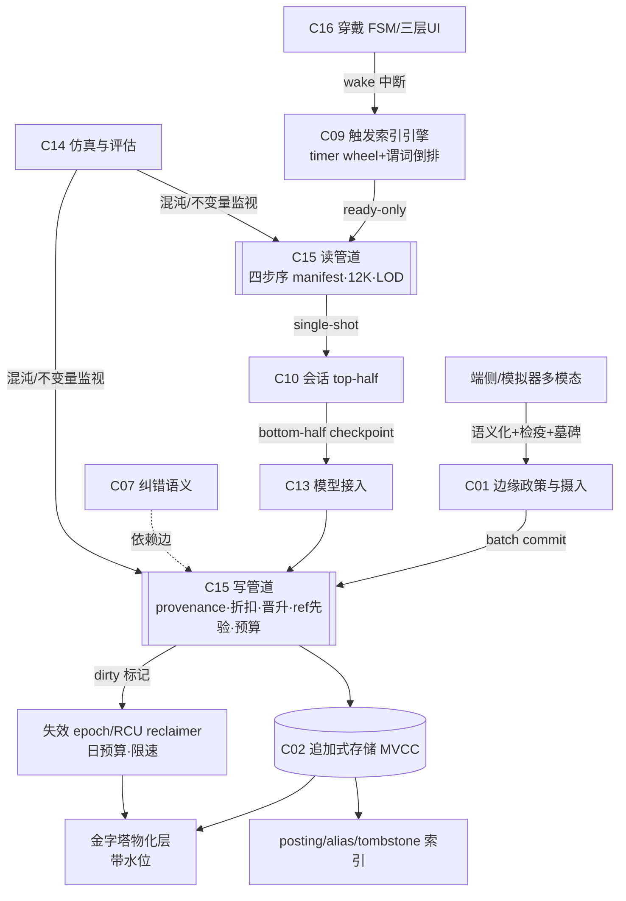

# AIOS Core 全盘工程重构方案与详细任务拆分设计书（独立首席架构师版）

> 作者角色：Independent Chief Systems Architect & Engineering Director
> 基线：`aios-2.0` @ `f210765`（M0 16/22 FINAL PASS）× 【V3宪法】× 旧规划 C01~C14 × 旧任务书 M0~M8 × 工作台/测试规范 V0.1
> 立场声明：本方案不继承任何外部评审的既有框架；与并行模型结论相同处属独立收敛，不同处以本文为准
> 日期：2026-09-16

---

## 一、独立诊断与重构主张（Core Architectural Diagnosis）

### 1.1 最致命的断层不是"缺功能"，而是"分解轴错了"

旧任务书沿**对象名词**分解（Observation、Claim、EvidenceSet、Task……每个对象一个 Issue），而 V3 宪法的十项机制几乎全部是**横切的写/读政策**：provenance 折扣、晋升门槛、失效传播预算、token 硬预算、就绪过滤、物化纪律、检疫 TTL。**名词在 M0 冻结了，政策却没有所有者。** 按现规划开工，政策会在 M2/M3 被各服务就地发明、互相矛盾——这才是比"缺某个 Issue"深一个量级的断层。

> 我的重构一句话：**政策与机制分离（policy/mechanism split），像操作系统内核那样。** M0 的追加式存储=机制；新增 M0.5「认知政策内核」=政策；所有里程碑只消费内核、不得自造政策。AIOS 既然叫 OS，就该用 OS 最老的智慧。

### 1.2 第一个崩溃点：两处，一静一响

- **静崩（M1，第 1 个模拟月内）**：后台萃取器开始写 provisional claim、金字塔开始沉淀时，无 provenance 折扣与晋升门槛 →  introspection 链自我确权，**测试全绿但世界已慢性投毒**。旧测试断言形状不断言认识论，所以无人看见。这比任何延迟问题都致命：它摧毁的是"共生心智"的信任根基。
- **响崩（M2-014/015 E2E）**：三级流水线缺失 + 就绪过滤无强制 → 50 轮对话上下文爆炸、wake 风暴、token 空转，主动闭环验收必红。

并行模型给的"M2 卡死"只对了一半：**M2 是第一个响的，M1 是第一个死的。**

### 1.3 总体战略：内核化 + 仿真先行 + 硬件迟绑定

1. **内核化**：M0.5 政策内核（写管道/读管道/预算表/失效 epoch），契约级冻结，CI 守门。
2. **OS 原生模式映射**（我的设计品味：不发明轮子，用 Linux 三十年的答案）：
   - Wake = **中断**：top half（manifest 分诊，≤150ms）/ bottom half（深度调查，checkpoint 续办）；合并=中断 coalescing；单飞=IRQ disable。
   - 失效传播 = **RCU/MVCC**：读者持 epoch、写者标 dirty、后台 reclaimer 带日预算回收；STALE 照返+横幅=grace period 读语义。
   - 看板 = **上下文切换**：12K token = 固定寄存器文件，四步序 = 段寄存器装载顺序，一次 forward 完成。
   - 就绪索引 = **epoll ready-list + timer wheel**：只返回就绪，O(ready)。
   - 时间金字塔 = **带水位的物化视图**：滑动条只读 rollup。
3. **仿真先行、硬件迟绑定**：内核在 Linux 虚拟世界与未来手环上跑同一套契约；穿戴层（FSM/三层 UI/音频预算）以契约+模拟器通道落在 M2，硬件驱动永不进关键路径。

---

## 二、架构规划升级方案（C01~C14 → C01~C17）

### 2.1 模块调整总表

| 动作 | 模块 | 新职责边界 | 理由 |
|---|---|---|---|
| 重定义 | **C01 边缘政策与摄入** | 原清洗职责 + modality 政策：语义化契约、原始件检疫 TTL、声纹墓碑、波形保留窗、合批带宽预算 | 旧 C01 对 §33 零承载 |
| 重定义 | **C06 检索脊柱与 LOD** | co_occur 倒排交集、≤3 跳有界扩展、rollup 读写、query_plan/watermark 出参 | 旧 C06 是单搜+在线聚合 |
| 升级 | **C09 触发索引引擎** | TriggerExpression AST 三值逻辑 + timer wheel + 谓词倒排 + hysteresis/debounce + zombie TTL | §86 就绪过滤无所有者 |
| 拆分 | **C10 → C10 会话与 manifest 装配（产品路径）** + **C17 开发者控制台** | 产品路径只出 single-shot manifest；面板/按钮/回放归 C17，明确"非产品 UI" | 旧 C10 把开发工具与产品交互混为一谈，是"桌面化"错觉的根源 |
| 新设 | **C15 认知政策内核** | 写管道（provenance/折扣/晋升/ref 先验）、读管道（manifest 预算、LOD 选择）、预算表、失效 epoch/reclaimer | 政策无所有者=本方案核心 |
| 新设 | **C16 穿戴交互契约** | 马达先导 FSM、三层 UI 契约、骨传导电源态、音频链路延迟预算；本阶段=契约+sim 通道 | §98/104 零任务 |
| 收编 | C07 依赖与纠错 | 语义重审任务归 C07；**失效机制（dirty/epoch/回收）上缴 C15** | 机制与政策分离 |
| 保持 | C02/C03/C04/C05/C08/C11/C12/C13/C14 | 边界不变，全部改为"经 C15 读写" | M0 资产保护 |

### 2.2 更新后的关键数据流



---

## 三、任务拆分重构蓝图（M0 → M8）

### 3.1 里程碑结构调整

| 调整 | 内容 | 理由 |
|---|---|---|
| **增设 M0.5 政策内核** | 6 个 Issue（下），M1 全部前置依赖 M0.5 | 政策先于实例；否则 M1 静崩 |
| **M1 拆为 M1a/M1b** | M1a 摄入与身份（modality 政策、墓碑重识别）；M1b 检索脊柱 | 摄入与检索失败模式不同，验收分离 |
| **M1b 末增设规模探针门** | 10万/100万/360万 fixture 进 CI | 性能第一次被看不得在 M7 |
| **增设 M2.5 会话流水线与 SLO** | 三级流水线、12K 预算、V3-04 延迟门、音频链路 | §85 零承载必须独立里程碑 |
| **M3 增设混沌门** | 循环依赖图/超级节点/换措辞重试 故障注入 | 纠错机制不压测=没写 |
| **M4 验收改绑** | V21~V30 三版本 + 风格门 + 静默场景 | 旧 V01~V20 全绿≠宪法验收 |
| M5~M8 | 保持，但每里程碑入口读 M1b 探针基线 | 防退化 |

### 3.2 必须新增的 Issue 清单

| 编号 | 名称 | 核心交付 |
|---|---|---|
| M0.5-001 | provenance 与晋升政策内核（NK-01，见 3.4） | 写管道、折扣代数、晋升门槛 |
| M0.5-002 | typed-ref 先验收集（修 E-B12） | ref 收集先于 normalization；Any 容器保留类型信息或显式拒收 |
| M0.5-003 | 失效 epoch 与 RCU reclaimer（NK-02） | dirty_set、日预算回收、STALE 读语义 |
| M0.5-004 | 预算表与计量器 | write qps/日写上限/token 表/wake 日预算；所有管道读表行事 |
| M0.5-005 | wake 单飞与 coalescing | 同主体模态分桶合并、single-flight 令牌、重入抑制 |
| M0.5-006 | 宪法不变量属性测试 harness | 无自晋升/无 eager 级联/预算不超/无跨模态吞证，逐 M 门运行 |
| M1a-002+ | 声纹墓碑与回归重识别 | 128 维 tombstone 24 个月；回归近邻命中→恢复实体合并归属 |
| M1b-018 | 规模探针门 | 360万 fixture、中文分词回归、WAL checkpoint 监控进 CI |
| M2.5-001 | 三级流式心智流水线 | 1500-token 窗口组装器、后台增量萃取（watermark）、联想异步预取 |
| M2.5-002 | 延迟 SLO 遥测（V3-04） | ASR-final→首 token；p50≤1.0/p95≤1.5 暖；三档网络抖动基线 |
| M2.5-003 | 音频链路预算 | 双工打断、骨传导上电≤200ms、超时断电 |
| M1-017 | Prediction/LifeChapter/CommunicationExperience 契约落地 | 旧任务书 0 命中的三个一等对象 |

### 3.3 必须重写/废黜的旧 Issue

| 旧项 | 处置 | 原因与重写要点 |
|---|---|---|
| M2-009 workspace.open | **重写**为 NK-04 上下文切换 manifest | 四步序硬序+12K 寄存器文件+单 forward；旧"初始工作包"无预算无姿态 |
| M1-012 世界搜索 | **重写**为 NK-03 检索脊柱 | 串联过滤→posting 交集；补版本化中文分词；≤3 跳 |
| M1-010 时间镜头 | **重写**物化纪律 | 5D 只读 rollup、下钻分页、水位横幅 |
| M1-001 摄入 | **重写**加 modality 政策 | 语义化契约/72h 检疫/墓碑/波形保留/合批 |
| M2-005/006 Task Center | **升级** NK-05 触发 AST+ready 索引 | 条件文法受限谓词；禁 LLM 热路径条件 |
| M2-003 Wake 合并 | **升级**模态分桶 | 跨模态合并不吞语音证据 |
| 工作台 §10 十三步序 | **降级**为审计记录清单；启动序=四步序 | 序相反且缺姿态 |
| 工作台"全面板"假设 | **废黜**产品 UI 语义，迁 C17 | 桌面化错觉 |
| §18"禁止冗余拷贝"字面解释 | **修宪**为"规范事实单一真源+允许可重建、带水位的派生物化" | 字面执行=禁止索引 |
| 测试规范 V0.1 验收门 | **升级** V1.0（见四） | V20 上限+无风格门 |

### 3.4 核心重点 Issue 代码级规约（5 项）

#### NK-01 · M0.5-001 provenance 与晋升内核

```python
class ProvenanceClass(str, Enum):
    OBSERVATION="observation"; EXTERNAL="external"
    INFERENCE="inference"; INTROSPECTION="introspection"

class SourceEnvelope(BaseModel):
    channel: Literal["sensor","user_speech","user_text","third_party","model"]
    speaker_ref: str|None; trust: float=Field(ge=0,le=1); quality: float=Field(ge=0,le=1)
    model_version: str|None; content_hash: str        # 语义化前原始件 sha256

class ClaimV3(Claim):
    provenance: ProvenanceClass; envelope: SourceEnvelope
    derived_from: list[ObjectRef] = []                # 置信=Π(父置信×因子)，单调不增
    promotion: Literal["provisional","candidate","fact"] = "provisional"
```

```text
kernel_write(objs, req):
  for o in objs:
    o.confidence = min(o.confidence, Π_discount(o.derived_from))   # 乘性折扣，禁重置
    if o.promotion=="fact" and o.provenance in (INFERENCE,INTROSPECTION)
       and not has_external_co_occurrence(o): raise PolicyViolation   # 禁自晋升
    refs = collect_typed_refs(o)                    # 先于 normalization（E-B12）
    validate_refs_visibility(refs, cutoff)          # 缺失/未来不可见 → 写前失败
  budget_gate(write_qps, daily_cap)
  return store.commit(objs, req)                    # 机制归 M0 存储
```

**验收**：随机 introspection 链属性测试永不产生 fact；置信单调；E-B12 七例回归全红转绿。**禁止**：绕过内核写；置信重置；normalization 先于 ref 收集；把 opaque 字典事后" reinterpret 为 ref"。

#### NK-02 · M0.5-003 失效 epoch / RCU reclaimer

```sql
CREATE TABLE dirty_set(
  root_id TEXT, dependent_id TEXT, depth INT CHECK(depth<=3),
  marked_epoch INT, status TEXT DEFAULT 'tainted',   -- tainted/revalidated/deferred
  PRIMARY KEY(root_id, dependent_id));
CREATE TABLE recompute_budget(day TEXT PRIMARY KEY, used INT, cap INT DEFAULT 50);
```

```text
read(id, sess_epoch):                      # RCU 读语义
  if tainted(id): return Stale(obj, banner="基于旧世界版本")   # 照返，禁内联重算
  return obj
reclaimer():                               # bottom-half，单并发
  batch = pop_tainted(min(cap-used, 10))   # 指纹 coalescing，幂等
  revalidate(batch); budget.used += len(batch)
  if used>=cap: defer_rest(TOMORROW)
expand(root): BFS over Dependency, visited/SCC 去重, depth≤3,
  degree>500 → circuit breaker → 仲裁任务（超级节点不自动级联）
```

**验收**：翻转 200 依赖 hub：当日重算≤50、交互读 p99 无尖峰、循环图 fixture 无无限 wake。**禁止**：eager 递归；交互路径内联重算；无界队列。

#### NK-03 · M1b-012 检索脊柱

```sql
CREATE TABLE token_posting(term TEXT, tok_ver INT, object_id TEXT,
  occurred_day TEXT, positions BLOB, PRIMARY KEY(term,tok_ver,object_id));
CREATE TABLE rollup(dim_id TEXT, grain TEXT, bucket TEXT,
  stats BLOB, watermark_rev INT, PRIMARY KEY(dim_id,grain,bucket));
```

```text
co_occur(keys, trange):
  L = [posting(k, TOK_VER) pruned by trange for k in keys]   # 版本化中文分词
  hit = intersect_smallest_first(L)                          # O(min·log)
  causal = bounded_expand(hit, depth=3)                      # 超级节点 breaker
  return QueryPlan(tok_ver, truncated), hit, causal
slider(dim, span): assert plan.source=="rollup"; 读 rollup; 水位滞后→横幅
drill(bucket): 分页读 raw，禁 GROUP BY 现算
```

**验收**：360万 fixture 三词 p95≤50ms、rollup 读 0.135ms 量级复现；`unicode61` 零命中回归用例必须 fail CI。**禁止**：交互路径 raw 聚合；无版本分词；§18 字面化禁物化。

#### NK-04 · M2-009 重写 上下文切换 manifest

```python
class CockpitManifest(BaseModel):
    wake_id: str
    seg1_mirror:  dict      # 照镜子：自省/底线/承诺（本地小切片）
    seg2_bonds:   dict      # 羁绊厚度/冷战 delta
    seg3_stance:  dict      # 姿态=规则表(羁绊delta×触发类)推导，禁模型调用
    seg4_world:   dict      # ready-only 索引入口 + stale 横幅
    tokens_total: int = Field(le=12000)
    assembled_ms: int = Field(le=150)
```

**验收**：首 token 前 LLM 往返=1（manifest 为单 prompt 段序）；"冷战用户+亲密语气" fixture 必 fail；装配 p95≤150ms。**禁止**：≥2 次串行调用先于首字；段序可配置；纯自然语言大摘要入口。

#### NK-05 · M2-005 升级 触发 AST + ready 索引

```python
Trigger = And|Or|Not|TimeReached(at|rrule)|ContextMatched(tag,hysteresis)|EventOccurred(type,entity)
# 索引：timer wheel(TimeReached) + tag 倒排(Context) + 订阅表(Event)
inspect_ready(now) -> list[task_id]   # O(ready+logN)，zombie TTL review_interval
```

**验收**：10万 task 仅 10 ready：inspect 不随 N 线性；模态分桶 fixture：GPS 合并不吞语音证据。**禁止**：LLM 条件进热路径；线性遍历；跨模态同桶合并。

---

## 四、工作台与虚拟测试规范配套升级

### 4.1 穿戴交互（C16）

FSM 状态表（sim 先行）：

| 状态 | 进入 | 超时/退出 | 电源 |
|---|---|---|---|
| IDLE | 默认 | — | 骨传导断电 |
| VIBRATE_PILOT | 安全类事件(强震,不可抑制)/普通(微震) | 5~10s 窗 | 断 |
| BONE_ON | 窗内触摸耳骨 | 会话结束→IDLE | 上电≤200ms |
| SILENCE_HOLD | 情境静默(会议/驾驶/深夜) | 情境退出 | 断 |

三层 UI 契约：L0 体态交互（ shake/触摸编码）→ L1 23cm 态势画布（**仅 ≤3 句口语 + rollup 卡片，禁长文**）→ L2 挂载技能（AppManifest 投影到画布，共享单一认知脑）。工作台规格：十三步降为审计清单；启动序=四步序；面板/回放整体迁 C17。

### 4.2 测试规范 V1.0

1. **V21~V30 三版本**（正例/反例/证据不足）：身份高阶反转、长对话因果穿透、静默心跳抑制、投毒对话、共振爆炸预算、预测被述为事实、Goal/Task 分离、跨年承诺、风格进化、上下文精准组装。
2. **风格门（计量式）**：主动开口 ≤3 句断言；说教分类器 fixture；谄媚探针；分寸自适应（冷战/盛怒/喜庆三态语气差）。
3. **宪法不变量监视器**：M0.5-006 harness 逐门运行（无自晋升/无 eager/预算/分桶/STALE 语义）。
4. **规模与延迟门**：M1b 探针进 CI；V3-04 延迟三档抖动；M7 只做复验。
5. **防退化红线**：任一 V 场景"旧测试全绿+新门红"即阻断合入——专门防"机械 Chatbot 化"。

---

## 五、一句话终判

旧规划把 AIOS 当"对象数据库工程"在建，V3 宪法要的是"带政策的认知操作系统"。**本方案以 M0.5 政策内核为枢轴，用 OS 原生模式（中断/RCU/上下文切换/ready-list/物化视图）把十项宪法机制一一落位为可验收契约**；M1 防静崩、M2 防响崩、M4 防假通过。按此 R3 路线图，v3.0 可在不重写 M0 资产的前提下，从"方向对护栏缺"推进到"可冻结施工"。

— Independent Chief Systems Architect, 2026-09-16
