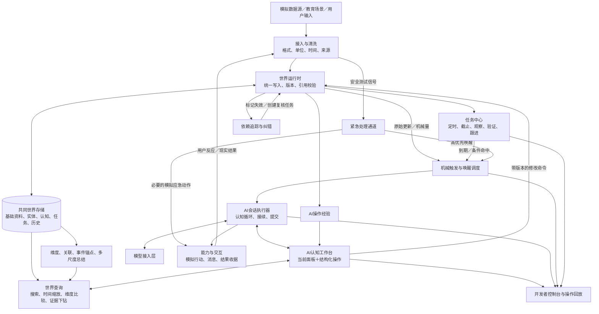

# 第一份：《AIOS Core 系统架构图与开发规划》

**版本**：V0.1  
**日期**：2026-09-14  
**依据**：《AIOS核心系统宪法v3.0》（已对齐 v3.0 条款编号）  
**状态**：供确认的开发规格；接口和验收编号用于后续任务拆分。

---

## 1. 系统必须实现什么

AIOS Core 持续维护用户世界和 AI 世界，使 AI 能够：
1. 在用户没有提问时，根据多源变化、定时任务和观察条件自主进入工作。
2. 自主选择时间范围、观察维度和查询路径。
3. 形成带证据、带不确定性的事件与认知。
4. 决定帮助、继续调查、安排未来任务或保持沉默。
5. 根据新证据和行动结果修正自身理解。
6. 积累使用世界的经验，使后续调查和帮助更有效。

第一阶段使用虚拟人、模拟数据和模拟行动。教育作为第一个场景适配器，贯穿测试。

第一阶段的完整交付是：  
**世界运行时 + 认知工作台 + 任务与唤醒 + AI会话执行 + 纠错与成长 + 虚拟世界评估。**  
Linux 桌面、驱动、实体手环、应用商店不进入本阶段关键路径。

---

## 2. 总体架构图

图中的“开发者控制台”是工作台操作的可视化表现。AI 通过结构化接口操作世界，两者共用同一套服务。  
测试真值与评分器位于另一侧，只接收运行轨迹，不向 AI 提供隐藏答案。

---

## 3. 模块边界与唯一责任

这里定义逻辑模块，不要求每个模块立即拆成独立进程。

| 编号 | 模块 | 主要职责及产物 | 明确边界 |
| :--- | :--- | :--- | :--- |
| C01 | 接入与清洗 | 接收多源资料，校验时间、单位、来源、重复包，生成 Observation | 不判断情绪、关系、人生事件 |
| C02 | 时间与世界存储 | 唯一时间基准、稳定ID、版本、提交日志、快照 | 统一保存资料，不规定 AI 如何理解 |
| C03 | 维度注册与投影 | 维度类型、定义、生命周期、节点挂载、跨主体引用 | 不把所有维度变成曲线，不复制底层事实 |
| C04 | 实体与关联 | 未知对象、别名、身份认定、关系版本、关联导航 | 字符串相同不自动合并身份 |
| C05 | 事件、认知与总结 | 保存 AI 提出的主张、事件锚点、解释、总结和证据 | 最终语义由大模型产生；每项主张独立标注 |
| C06 | 世界查询 | 时间镜头、全文与语义检索、筛选、聚合、比较、下钻 | 不根据关键词命中直接确立结论 |
| C07 | 依赖与纠错 | 反向依赖、失效传播、重审任务、修正历史 | 不机械替 AI 生成新的语义结论 |
| C08 | 任务中心 | 十类任务、时间规则、状态、依赖、执行记录 | 到期唤醒不等于任务完成 |
| C09 | 触发与调度 | 六类触发、去重、冷却、队列、抢占、预算、续办 | 只决定什么时候调用 AI，不判断用户需不需要帮助 |
| C10 | 工作台与会话 | 面板、工具协议、十三步循环、检查点、上下文接续 | 系统检查流程完整性，不强制固定检索顺序 |
| C11 | 能力与交互 | 教育工具、模拟行动、消息、回执、结果追踪 | 发出消息与帮助成功分开记录 |
| C12 | AI操作经验 | 查询经验、错误经验、介入策略、工具改进提案 | 不自行改写程序，不把一次成功升级成永久规则 |
| C13 | 模型接入 | 模型调用、结构化响应、错误、超时、调用账单 | 模型供应商不拥有长期世界 |
| C14 | 仿真与评估 | 人生生成、虚拟时钟、故障注入、对照运行、评分 | 隐藏真值与生产查询严格隔离 |

教育等 App 通过 C01 输入资料，通过 C06 读取允许的信息，通过 C11 提供工具，并使用 C08 管理任务。App 不拥有独立的用户记忆库或 AI 人格。

---

## 4. 第一版实现形态

建议采用：
- **Core**：Python 模块化单体。
- **持久化**：SQLite，配合事务、明确的唯一写入服务和可重建索引。
- **检索**：时间、主体、实体索引与全文搜索作为基础；语义召回使用可替换适配器。
- **控制台**：浏览器界面，展示同一套工作台接口与操作轨迹。
- **模型**：先提供 Mock 适配器，再接入一个真实模型；协议保留多模型替换能力。
- **仿真器与评分器**：独立进程、独立存储、独立访问权限。

选择这一形态的目的是降低第一轮整合成本。模块职责先分清，只有出现吞吐或隔离的实际需求时才拆服务。

部署单元建议为四个：
1. **Core**：世界、任务、触发、查询和统一写入。
2. **AI Worker**：调用模型，经 Core 接口读写。
3. **控制台**：供开发者查看和操作。
4. **Simulator/Evaluator**：推进虚拟生活与评估。

AI Worker 不直接连接数据库。所有修改经过 Core 校验与提交。

---

## 5. 共同数据契约

### 5.1 所有长期对象的公共字段
至少包含：
`object_id`、`object_type`、`subject_id`、`revision`、`occurred_at`或`time_range`、`learned_at`、`recorded_at`、`source_refs`、`created_by`、`status`。

其中：
- `subject_id` 区分用户、AI、其他实体；共用一套时间机制。
- `occurred_at` 是事情发生时间。
- `learned_at` 是系统首次获得该版本信息的时间。
- `recorded_at` 是本次写入时间。
- 时间可以是范围、未知或单侧边界，不能编造精确值。
- `revision` 用于修正与回放；对象稳定 ID 不随名称变化。

### 5.2 核心对象

| 对象 | 必需内容 |
| :--- | :--- |
| Observation | 来源、模态、原始值或资料引用、时间、数据质量 |
| Entity | 稳定ID、候选身份、别名、身份主张与证据 |
| DimensionDefinition | 主体、数据形态、含义、来源、更新方式、生命周期、价值说明 |
| DimensionMembership | 维度ID、对象引用、适用时间、挂载依据 |
| Claim | 一项具体主张、知识状态、置信度、证据、未知项、支持与反对依据 |
| EventAnchor | 事件解释、发生区间、参与对象、资料与主张引用 |
| Relation | 两端对象、关系类型、有效期、证据、确定程度 |
| Summary | 主体、维度、范围、粒度、来源版本、覆盖情况、结论 |
| Dependency | 依赖方、被依赖对象及版本、依赖类型 |
| Task | 目标、类型、触发/截止规则、状态、完成条件、结果 |
| Wake | 触发原因、引用、首次/最后命中时间、合并次数、优先级 |
| Session | 唤醒、世界快照、步骤、操作轨迹、提交、检查点 |
| Action/Outcome | 行动内容、执行ID、回执、结果状态、证据 |
| OperationExperience | 适用问题、使用路径、成本、遗漏、结果、有效范围 |
| ToolProposal | 缺失能力、使用案例、现有工具不足、预期收益、验证方案 |

原型可用结构化载荷保存不同维度的数据，但对象身份、版本、引用和时间字段必须统一。

### 5.3 知识状态
建议使用：
`OBSERVED` / `REPORTED` / `INFERRED` / `HYPOTHESIS` / `UNKNOWN` / `CONFLICT`。

这是主张的性质，不是自动分配置信度的规则。

例如：
- “用户说过明天生日”：一项关于话语的观测。
- “用户生日在明天”：另一项需要证据的主张。
- “用户希望得到祝福”：又是一项解释性推断。

引用用户原话，不会自动使原话描述的未来事件成为事实。

---

## 6. 世界写入、纠错与一致性

### 6.1 修改方式
AI 提交修改意图，Core 检查：
1. 对象与字段是否合法。
2. 引用是否存在、是否在本次可见范围内。
3. 证据版本是否匹配。
4. 新版本是否与并发修改冲突。
5. 是否形成不允许的自我证明依赖。
6. 操作是否具有对应权限。

通过后，统一事务写入对象版本、依赖关系和待投递通知。  
结构校验通过不等于语义正确。语义正确性由证据复核、结果验证和测试共同检验。

### 6.2 修改传播
当身份或主张发生变化：
- 新证据进入 → 新版本认定 → 找到依赖对象 → 标记待复核 → 建立复核任务 → AI重审 → 写入修正版

例如“P001 是爸爸”被纠正：
- P001 的稳定 ID 保留。
- 旧身份主张保留历史版本。
- 使用该身份的事件、总结、提醒和高阶认知被标记。
- 未执行且依赖旧身份的行动先暂停，等待复核。
- 已执行的行动不能通过改数据库撤回，只能追加结果解释或补救任务。
- AI 世界记录错误原因及后续教训。

普通语义关联允许形成网络；“某结论的证据来源”必须能追到独立依据，不能靠循环引用提高可信度。

### 6.3 区间证据
“过去两周睡眠下降”不能只保存一个会随时间变化的查询字符串。  
必须记录：
- 查询时间范围与筛选条件。
- 当时可见的信息截止时间。
- 数据成员或可重建成员清单的版本。
- 统计方法与版本。
- 覆盖率、缺失情况。
- 支撑结论的具体资料引用。

迟到数据或修正进入时，相关区间结论会进入复核。

### 6.4 索引与总结
索引属于可重建的查询设施。每个查询结果必须返回索引水位和世界版本，避免把旧索引表现成最新事实。  
总结标注：
`CURRENT` / `STALE` / `PARTIAL` / `MISSING`。

如果某个月没有总结，查询必须说明缺口，并允许下钻已有节点或创建总结任务。不能临时编造一个摘要来填满面板。

---

## 7. 两条持续运行的主链

### 7.1 世界变化与主动认知
新资料 → 更新基础世界 → 机械触发/到期/巡检 → 唤醒AI → 自主调查 → 形成认知 → 判断帮助 → 行动或沉默 → 留下后续任务  
**这条链必须在没有用户提问的情况下成立。**

### 7.2 结果与持续成长
行动/观察结果 → 核对原判断 → 修正依赖认知 → 更新任务 → 记录AI经验 → 改善后续查询与介入  
“成长”在原型中表现为可检查的持久经验及其使用效果，不宣称模型参数发生训练更新。

---

## 8. 调度、并发与恢复

第一版每个虚拟人默认只有一个普通认知会话负责世界语义修改，减少并发冲突。后台查询、索引和不同虚拟人可并行。

必须支持：
- **重复触发合并**：同主体、同规则、同连续情境可以合并，证据不丢失。
- **冷却结束后的复查**：保留命中次数、最新状态和待复查标记，不能永久压住变化。
- **AI忙时入队**：普通触发等待；强时效和安全触发进入高优先队列。
- **安全旁路**：模拟安全流程不等待普通模型推理完成。
- **防止队列饿死**：长期等待的任务随等待时间提升调度优先级。
- **检查点接续**：保存已完成步骤、世界修改、未解决问题、下一步。
- **行动去重**：使用稳定执行ID；模型重试不能重复发消息或重复执行任务。
- **结果未知**：调用超时不能直接判定失败并重做，先查询执行收据。
- **提交可靠性**：世界修改和待投递记录一起提交，再重试投递。

不承诺网络调用天然“恰好执行一次”。通过执行ID、回执和状态核对实现可恢复行为。

---

## 9. 工具与策略的成长边界

AI 可以：
- 保存经过评估的查询方法。
- 提出维度候选。
- 调整允许调整的触发参数。
- 提出新工具或组合查询流程。
- 根据反馈降低某类非安全提醒的频率。

每条经验需要记录适用条件、正反案例、成本和失效条件。

原型中允许经过校验的已有工具组合；新增可执行程序进入开发任务，由测试验证后注册。AI 不通过“工具成长”获得任意修改系统代码的权力。  
人身安全阈值按宪法保持不可由 AI 修改。测试中使用人工定义的合成阈值，不作为真实医疗标准。

---

## 10. 开发阶段与交付门

| 阶段 | 核心任务 | 必须展示的结果 |
| :--- | :--- | :--- |
| M0 契约与测试种子 | 数据对象、操作协议、虚拟时钟、最小案例、基础对照系统 | 同一案例可重放；隐藏真值不进入AI |
| M1 共同世界 | 接入、时间、版本、维度、实体、引用、查询 | 从月视图下钻到原话；区分当时已知与后来得知 |
| M2 主动闭环 | 六类触发、任务、工作台、真实模型、模拟行动 | 无用户提问，自主发现并处理一项帮助机会 |
| M3 纠错与成长 | 依赖传播、总结失效、AI经验、动态维度 | 身份纠正能影响旧认知和未来任务；经验可用于下一次查询 |
| M4 一个月验证 | 教育场景、跟进、偏好变化、对照实验 | 持续帮助、合理沉默、承诺完成、学习效果可评估 |
| M5 一年验证 | 长期漂移、跨App、恢复、预算压力、盲测 | 完整年度闭环与公平基线比较报告 |
| M6 机制裁决 | 消融、失败归因、简化或补强架构 | 有证据决定保留哪些机制、进入何种下一阶段 |
| M7 规模压测与 SLO | 验证规模、长期漂移与 SLO | 规模压测与 SLO报告 |
| M8 端侧适配与硬件对接 | 真实硬件适配与接入 | 硬件对接方案与演示 |

工作台的最小界面从 M1 开始；评估器和基线从 M0 开始。不能等全部功能完成后再补测试。  
在 M0/M1 获得真实开发速度、调用成本和吞吐数据之前，不给固定交付日期。每阶段以退出条件验收。

---

## 11. 建议任务包

| 任务包 | 交付物 | 前置依赖 |
| :--- | :--- | :--- |
| P01 | 对象协议、时间规则、错误码、操作轨迹协议 | 无 |
| P02 | 世界存储、版本、统一提交、查询快照 | P01 |
| P03 | 虚拟时钟、可见性隔离、一天生成器 | P01 |
| P04 | 维度、实体、索引、时间镜头 | P02 |
| P05 | 任务中心、触发调度、紧急旁路 | P02、P03 |
| P06 | 工作台协议、会话接续、模型适配 | P04、P05 |
| P07 | 控制台、操作回放、模拟能力 | P06 |
| P08 | 认知、事件锚点、总结、纠错传播 | P02、P04、P06 |
| P09 | AI经验、维度生命周期、工具提案 | P08 |
| P10 | 教育适配器、月/年生成器、闭环结果模型 | P03、P06 |
| P11 | 强基线、盲测、消融、成本与效用报告 | 从P03开始，随阶段扩展 |

每个任务包必须交付：代码、接口说明、对应测试、运行证据、已知限制和剩余事项。

---

## 12. 第一份规格的验收

- **ARCH-01**：同一基础资料可被多个维度引用，底层事实不复制。
- **ARCH-02**：用户世界与 AI 世界使用同一时间和对象机制。
- **ARCH-03**：未知实体改名后，旧引用仍能解析。
- **ARCH-04**：修正一项底层主张，能找到受影响认知和任务。
- **ARCH-05**：查询可重建“某时刻系统当时知道什么”。
- **ARCH-06**：重复投递、重启和模型重试不产生重复行动。
- **ARCH-07**：无用户提问时能够触发、调查、决策、任务化。
- **ARCH-08**：用户接受、执行成功、目标改善三个结果分别记录。
- **ARCH-09**：所有关键修改和外部模拟动作具有可回放轨迹。
- **ARCH-10**：任何运行接口都不能读到测试隐藏真值。

满足这些条件才能称为 Core 基础闭环完成。
