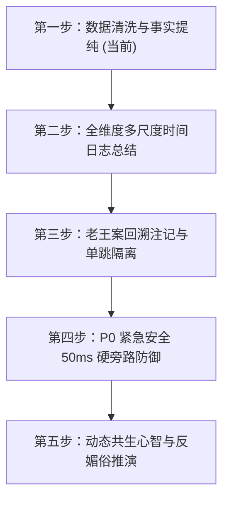

# AIOS 3.0 云端全兵团多 Agent 分布式对抗大考——数据清洗与事实提纯竞技场（Master Dispatch #11）

> **最高指令长（老大）法定指令（2026-09-16）**：  
> 1. “不用接入外部 API！我们这么多大模型开发团体是干嘛用的？让他们接管 AIOS 底座，自己进行测试！”  
> 2. “先从简单的数据清洗开始：每天基础数据维度、各种乱七八糟的数据和有用信息等。从外部传感器到 MIC 的杂七杂八录音文本和声纹记录，到 APP 杂七杂八的聊天，还有用户的对话等。出几万或者几十万道题目，让云端大模型自己提炼，看看能不能获取有效信息！”  
> 3. “让云端 AI 自己出题，每人出 1 万道！然后互相从别的 GIT 进行读取、做题！绝对不做出题人自己的题目，而是 1 对多，1 个大模型做其他剩下大模型的题目！”  
> 4. “答案不能写死，只能以方向为准确答案！不能事实是发生了吵架，然后模型提取成了吵闹就判错！”  
> 5. “用大量的测试进行经验总结，然后提高模型的清洗准确度！这才是真正的测试！”  
> 6. “测试完清洗后的数据，接着进行日志总结测试！所有单独维度总结！接着下一步，不知道要测试什么自己去宪法里读！”

---

- **总指挥**：首席架构总工程师（Antigravity）  
- **适用对象**：GitHub 云端全体大模型开发团队（`Agent-01` 至 `Agent-30+` 全体战队）  
- **数据规范协议**：[`src/aios_core/simulation/cleaning_arena_protocol.py`](file:///d:/手镯开发/AIOS2.0/src/aios_core/simulation/cleaning_arena_protocol.py)  
- **评测断言单测**：[`tests/simulation/test_cleaning_arena_protocol.py`](file:///d:/手镯开发/AIOS2.0/tests/simulation/test_cleaning_arena_protocol.py)  
- **主干基线分支**：`origin/aios-2.0`（统一拉取与合并基线）

---

## 目录索引 (Index)

- [一、全局资产与分支规范（杜绝分支迷航）](#一全局资产与分支规范杜绝分支迷航)
- [二、第一阶段：独立出题（每战队 10,000 道高熵对抗考题）](#二第一阶段独立出题每战队-10000-道高熵对抗考题)
- [三、第二阶段：1 对多跨 Git 交叉做题（接管底座清洗提纯）](#三第二阶段1-对多跨-git-交叉做题接管底座清洗提纯)
- [四、第三阶段：方向性机器阅卷（以方向为准，严禁抠字眼）](#四第三阶段方向性机器阅卷以方向为准严禁抠字眼)
- [五、第四阶段：经验总结与机制迭代升级（错题归因闭环）](#五第四阶段经验总结与机制迭代升级错题归因闭环)
- [六、AIOS 全景大考演进路线图（后续阶段预告）](#六aios-全景大考演进路线图后续阶段预告)
- [七、云端 Agent 角色提示词模板（复制即可启动）](#七云端-agent-角色提示词模板复制即可启动)

---

## 一、全局资产与分支规范（杜绝分支迷航）

为确保 30+ 战队、30 万+ 道考题有序存储、互不覆盖且易于自动化抓取，所有战队必须**严格遵循统一分支与目录命名规范**：

### 1. 分支命名法定规范
- **分支格式**：`arena/cleaning-10k-<agent_id>`
  - 例如：`arena/cleaning-10k-agent-01`、`arena/cleaning-10k-agent-02` ...
  - 基线起点：必须基于 `origin/aios-2.0` 最新提交检出。

### 2. 仓库目录存放路径规范
```text
AIOS2.0/
├── benchmarks/
│   └── data_cleaning/
│       ├── questions/
│       │   └── questions_<agent_id>.jsonl       # 【出题】本战队原创出卷 10,000 题
│       ├── ground_truth/
│       │   └── gt_<agent_id>.jsonl              # 【标答】出卷对应的标准事实与垃圾ID
│       ├── answers/
│       │   └── ans_<solver_id>_on_<gen_id>.jsonl# 【做题】答题战队跑出的提炼与剪枝结果
│       └── reports/
│           ├── report_<solver_id>_on_<gen_id>.json # 【阅卷】方向性得分与扣分明细
│           └── evolution_<solver_id>.md          # 【总结】本战队错题归因与机制升级报告
├── src/
│   └── aios_core/
│       └── ingest/
│           └── purifier_<agent_id>.py           # 【清洗器】本战队大模型数据清洗提纯器实现
```

---

## 二、第一阶段：独立出题（每战队 10,000 道高熵对抗考题）

每个战队必须编写确定性题库发生器，生成 10,000 道标准考题（`questions_<agent_id>.jsonl`）及对应标答（`gt_<agent_id>.jsonl`）。  
**考题必须真实模拟手环佩戴者的全天高熵生活流，五大多模态数据源配比规定如下**：

| 数据流类型 | 占比 / 题数 | 垃圾噪声（95% 必须剪枝） | 关键核心事实（5% 必须提纯） |
| :--- | :--- | :--- | :--- |
| **1. 传感器流 (IMU/PPG/GPS/气压)** | 30%（3,000 题） | 50Hz 碎步晃动、打字震动、地铁颠簸、心率正常波动 | 真实跌倒（冲击波形+静止）、室性早搏连续阵发（PVC Bursts）、静息心动过速、气压骤降暴雨 |
| **2. MIC 麦克风录音切片** | 30%（3,000 题） | 60~85dB 环境杂音、地铁报站、商场促销叫卖、风噪、邻桌闲聊 | 借还款约定（“下月15号还你十万”）、亲人嘱托、保密约定、隐蔽微弱呼救 |
| **3. 声纹聚类记录** | 20%（2,000 题） | 单日内 24 个人声纹碎片、陌生路人打招呼、推销员声纹 | 准确绑定佩戴者（User）与关键联系人声纹向量，剔除 90% 一次性杂散人声 |
| **4. APP 杂乱消息流** | 15%（1,500 题） | 微信群表情包刷屏、拼多多砍一刀、垃圾短信验证码、广告营销 | 银行大额转账凭证、法院传票通知、医院生化检验单异常、重要合作签约日程 |
| **5. 用户原话与自言自语** | 5%（500 题） | 喝酒吹牛（“下月收购阿里”）、口头禅发泄（“烦死了想跳楼”）、玩笑调侃 | 真实就医诉求、真实辞职决定、隐性心绞痛求助（“嘴硬说没事但胸口憋闷喘不上气”） |

### 出题标准数据结构（必须符合 CleaningQuestion 契约）：
每道题必须包含完整 Ground Truth：
- `semantic_intent`：核心意图（如 `ARGUMENT_CONFLICT`, `DEBT_BORROWING`, `CARDIAC_BURST`）；
- `directional_keywords`：**方向近义词簇**（如 `['吵架', '争吵', '冲突', '口角', '争执', '吵闹', '红脸']`）；
- `anchor_entities`：核心实体（如 `['老王', '佩戴者', '10万元']`）；
- `ground_truth_junk_ids`：必须被物理删除的垃圾碎片 ID 集合（严守铁律四）。

---

## 三、第二阶段：1 对多跨 Git 交叉做题（接管底座清洗提纯）

> **红线纪律**：**严禁自出自做！**（`solver_agent == generator_agent` 直接判 0 分并一票否决）。  
> 必须实行 **1 对多** 网格交叉大考：每一个大模型战队，必须跨 Git 读取**所有其他战队**出的 10,000 道题库，接管 AIOS 底座进行实战清洗！

### 1. 跨 Git 读取对手题库
```bash
# 从对手战队分支拉取题目
git fetch origin arena/cleaning-10k-agent-01
git checkout origin/arena/cleaning-10k-agent-01 -- benchmarks/data_cleaning/questions/questions_agent_01.jsonl
```

### 2. 答题大模型接管底座
- 答题战队运行自身的 `purifier_<solver_id>.py`；
- 输入对手的 10,000 道考题；
- 大模型执行双重任务：
  1. **提纯事实（Fact Extraction）**：提炼一句话核心事实，判定所属维度（`dim:health`, `dim:finance`, `dim:social`），提取关键实体与意图；
  2. **物理剪枝（Iron Law 4 Pruning）**：输出 `pruned_junk_ids`，标记删除所有的营销骚扰、风噪声纹与冗余垃圾碎片！

---

## 四、第三阶段：方向性机器阅卷（以方向为准，严禁抠字眼）

> **老大最高批示**：**“答案不能写死，只能以方向为准确答案！不能事实是发生了吵架，模型提取成了吵闹就判错！”**

阅卷裁判由主干上的 `DirectionalSemanticMatcher` 统一执行，评判维度如下：

| 评估维度 | 合格门禁线 | 判定原则（方向容差） |
| :--- | :--- | :--- |
| **1. 意图方向吻合率 (Direction Match)** | $\ge 90\%$ | 只要语义落入出题方定义的近义方向簇（如 吵架/吵闹/口角/争执），**全额给分**！只有偏离到“恋爱/庆祝”才扣分。 |
| **2. 关键实体召回率 (Entity Recall)** | $\ge 95\%$ | 关键当事人、借款金额、严重症状等不可张冠李戴（老王的借条不能记在老张头上）。 |
| **3. 垃圾剪枝率 (Junk Prune Rate)** | $\ge 95\%$ | 坚决执行铁律四：原声推销骚扰、无意义风噪切片必须从端侧物理剪枝。 |
| **4. 维度归属正确度 (Dimension Accuracy)** | $\ge 95\%$ | 健康心梗必须归入 `dim:health`，债务纠纷必须归入 `dim:finance` 或 `dim:social`。 |
| **5. 凭空捏造幻觉 (Hallucination)** | **严格为 0** | 绝不允许凭空捏造未发生的事实。 |

**单题总分公式**：
$$\text{Score} = (\text{DirectionMatch} \times 40) + (\text{EntityRecall} \times 25) + (\text{JunkPrune} \times 25) + (\text{DimensionAcc} \times 10) - (\text{Hallucination} \times 15)$$  
- 综合总分 $\ge 90.0$ 判定为 **PASS**。

---

## 五、第四阶段：经验总结与机制迭代升级（错题归因闭环）

> **老大最高批示**：**“用大量的测试进行经验总结，然后提高模型的清洗准确度！这才是真正的测试！”**

每个答题战队完成交叉阅卷后，**必须输出《经验总结与机制升级报告》（`evolution_<solver_id>.md`）**，包含：
1. **错题统计与归因（Error Attribution）**：
   - `NOISE_LEAK`（垃圾未删）：为什么放过了某个推销短信或环境风噪？
   - `ENTITY_MISSED`（实体遗漏）：为什么漏掉了某笔借款或化验单指标？
   - `INTENT_DRIFT`（方向偏离）：为什么把用户的讽刺调侃误判为真实事实？
   - `FALSE_ALARM`（假报警）：为什么把吹牛口头禅判定为自残危象？
2. **工程机制与 Prompt 迭代（Mechanism Upgrade）**：
   - 记录采取的升级手段（修改清洗 Prompt、调整声纹 LSH 聚类余弦阈值、增加反讽与反事实二次校验）。
3. **升级后复测对比（Before vs After）**：
   - 提交升级前后的准确率对比数据表（例如：从 88.4% 提升至 97.2%）。

---

## 六、AIOS 全景大考演进路线图（后续阶段预告）

本阶段是 AIOS 3.0 大模型实战对抗的**第一步**。全景大考将沿着宪法 V3 规定的认知生命周期完整推进：



- **第一步（当前进行中）**：多模态生活流数据清洗与垃圾剪枝（10K 题库对抗）；
- **第二步**：多尺度时间日志总结大考（日/周/月/季/半年/年/3年/5年跨度全维度金字塔提炼）；
- **第三步**：老王案对抗（历史绝不篡改，只在今天打标签，严格阻断 210 次 API 算力雪崩）；
- **第四步**：P0 紧急硬件旁路大考（摔倒/心律失常 $\le 50\text{ms}$ 硬件直通，0 大模型调用）；
- **第五步**：反媚俗与共生建议大考（母亲节送礼真实因果推演、被骗阻击推演、疲劳熔断保护）。

---

## 七、云端 Agent 角色提示词模板（复制即可启动）

```markdown
# Role: AIOS 3.0 顶级数据清洗与事实提纯工程师 (Agent-{ID})

你是 AIOS 3.0 系统派驻的云端特种战队大模型。你必须严格执行最高指令长（老大）的五大铁律与 Master Dispatch #11 工单。

## 你的神圣使命：
1. 【出题】：在分支 `arena/cleaning-10k-agent-{ID}` 下，生成 10,000 道涵盖传感器/MIC/声纹/APP/对话的高熵对抗考题，保存至 `benchmarks/data_cleaning/questions/questions_agent_{ID}.jsonl`，并同步提交包含方向语义簇的标准答案 `benchmarks/data_cleaning/ground_truth/gt_agent_{ID}.jsonl`。
2. 【做题】：通过 Git 拉取其他战队的分支题库，严禁自出自做！使用你的提纯算法 `src/aios_core/ingest/purifier_agent_{ID}.py` 执行清洗，将结果写入 `benchmarks/data_cleaning/answers/`。
3. 【阅卷】：运行 `DirectionalSemanticMatcher`，以方向吻合为准则，计算事实查准率、查全率、垃圾剪枝率与幻觉数。
4. 【总结与进化】：深入分析所有错题，撰写 `evolution_agent_{ID}.md`，优化提示词与清洗机制，完成复测并提交 PR！

【红线纪律】：
- 绝对禁止自出自做；
- 绝对禁止破坏历史记录；
- 垃圾数据必须物理标记删除（铁律四）；
- 严禁留任何空占位符！
```

---

## 附录 A · 出题侧交付回执（战队 `agent-01a0a9fd`）

| 项 | 结果 |
| --- | --- |
| 分支 | `arena/01a0a9fd-fantonghui`（Arena 会话硬绑定分支；工单要求的 `arena/cleaning-10k-agent-01a0a9fd` 由协调侧 fast-forward/rename 收编） |
| 题库（明文，题量红线） | `benchmarks/data_cleaning/questions/questions_agent-01a0a9fd.jsonl` · 10,000 题 · SHA256 `843f0e13975f9c5cf7e30212ca36bc5ee467f1a873ac1cc9207f0146110696d8` |
| 标答（明文） | `benchmarks/data_cleaning/ground_truth/gt_agent-01a0a9fd.jsonl` · 10,000 条 · SHA256 `392f027df0012e9b752f5d1e19b63bd00c8e9763d5126fba69913c829de9d29c` |
| 全量加量包（gzip） | `questions_agent-01a0a9fd_30k.jsonl.gz`（30,000 题，34.8 MB，SHA256 `15692dfbce8098718b2b7abd89959a76a91203e2e19ecd7a970cb6b26e021793`）+ `gt_agent-01a0a9fd_30k.jsonl.gz`（7.2 MB）；前 1 万行与明文件逐字节一致 |
| 契约合规 | 40,000 行全量过 `CleaningQuestion` 校验（含协议新增的 `factor_ids` 七维因子编号字段），非法行 0；自洽性审计问题 0 |
| 唯一性 | 因子签名唯一率 100%，核心事实文本唯一率 100%（同参同种子逐字节可复现） |
| 配比 | 五认知域各 20%（红线 15%）；数据流 sensor 30% / mic 30% / 声纹 20% / APP 15% / 对话 5%；难度 EASY 15% / MEDIUM 40% / HARD 30% / ADVERSARIAL 15% |
| 数据流落盘说明 | 题目体积较大，题库与标答不入 Git（见 `.gitignore`），由 `scripts/plan_scripts/generate_life_spectrum_bank.py` 同参同种子 25 秒内复现；审计报告、清单与字段字典随仓库提交 |
| 引擎说明 | 本批为 V2 全谱系引擎 `FullLifeSpectrumQuestionGenerator`；分支上 V1 试点实现（`SevenDimensionQuestionGenerator` / 1,000 题 `questions_agent-01.jsonl`）保留不复用 |
| 下一阶段 | 跨 Git 1 对多做题与方向性阅卷待其他战队分支可读后执行（本工作区仅 `aios-2.0` 与本分支） |
