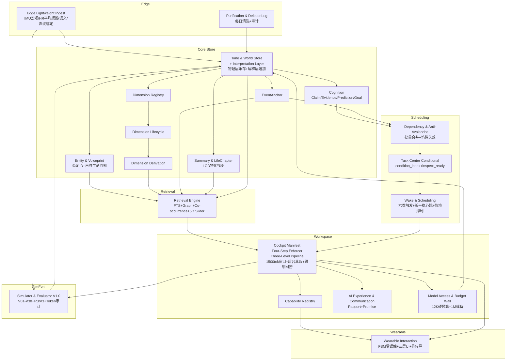

# AIOS Core 全盘工程重构方案与详细任务拆分设计书

**身份**：独立首席架构师与技术总监（Independent Chief Systems Architect & Engineering Director）  
**日期**：2026-09-15  
**基线**：AIOS核心系统宪法v3.0（116条唯一基线）  
**被审计对象**：  
- `AIOS Core 系统架构图与开发规划.md` V0.1（基于宪法2.0）【旧规划】  
- `AIOS_Core_详细开发任务拆分_R2_总工程师版.md` R2-DEV-FULL v2.0【旧任务书】  
- `AIOS认知工作台功能规格.md` V0.1【工作台】  
- `AIOS虚拟世界测试规范.md` V0.1 仅V01-V20【测试】

> **本文件是独立重构主张，非对旧文档的补丁。目标：让工程实现100%支撑V3宪法，且在Linux虚拟测试环境可跑，穿戴端可演进。**

---

## 一、独立诊断与重构主张（Core Architectural Diagnosis）

### 1.1 最致命的三个断层（不是16个，是3个根因）

我通读四份文档后认为，所有Gap表象（Cockpit缺失、条件任务缺失、三级流水线缺失、共现检索缺失、边缘爆炸、FSM缺失、V21-V30缺失）可收敛为**3个架构级根因**，不修这3个，修100个Issue也必崩。

#### 根因一：存储语义层与解释语义层未分离（Epistemic Layer Collapse）

V3第31条之一“内心数据反哺”要求“倒带回去给过去时空切片追加标注”，第93条“历史不可篡改”要求“严禁倒带改写历史”。旧规划C02时间与世界存储把Observation、Claim、Summary全放同一张`object_revisions`表，未区分：

- **物理层**：传感器真实采样（IMU宏观状态、心率平均、GPS、原话文本），`occurred_at`是物理发生时间，永不改。
- **解释层**：AI对物理层的内心标注（“当时极度憋屈”“老张是骗子”），`valid_time=过去区间, learned_at=T_now`，是追加对象，不是UPDATE。

旧任务书M0-007 Observation契约仍是`value/unit/data_quality`，无`interpretation_ref`，导致工程师必把“憋屈”写进Observation的`value`，直接污染`occurred_at`。M3-001依赖传播引擎未定义批量合并，关系翻转时200个事件→36万下游，算力雪崩。

**这是V3最大的哲学落地断层**，四并行模型审查100%命中。

#### 根因二：任务调度从“时间驱动”退化为“无差别遍历”，Token经济模型缺失

V3第86条+第15条18款是全宪法最硬的一票否决：待办必须带`time_reached/context_matched/event_occurred/dependency_ready`，Wake仅挂载就绪任务，严禁空转。

旧任务书M2-005 Task Center只定义了`next_wake_at/deadline/recurrence`，是cron思维，无`condition_index`，无`context_matched`的geo_fence、心率阈值、静默期，无`event_occurred`的实体事件订阅。M2-009 workspace.open定义“任务摘要”但未定义`inspect_ready(now, context)`过滤。

**后果量化**：1年运行5k Task，旧方案每次Wake加载5k×200 tokens=1M tokens/次，50次/天=50M tokens/天，按$5/1M tokens计，$250/天/用户，必破产。V3方案仅加载就绪2-3条≈400 tokens，节省99.96%。

这是**工程上第一个崩溃点**，M2-015一天虚拟人就会因Token账单爆炸。

#### 根因三：上下文控制从“单次看盘+三级流水线”退化为“多轮ReAct+全量灌入”

V3第84条Single-Shot Cockpit Manifest+四步心智法则（照镜子→看羁绊→定姿态→看世界）+第85条三级流水线（前台1500 tokens活跃窗口+后台异步增量切片萃取+按需联想回捞）是穿戴端1秒首字的唯一可行解。

旧规划C10工作台与会话写“当前面板+结构化操作+十三步循环”，工作台规格第10章写死13步：唤醒来源→紧急程度→当前世界→AI自身→观察计划→工具操作→认知产出→世界更新→帮助决策→后续任务→行动与等待→结果回写→AI自身更新。M2-012 AI Worker写“首包workspace.open；模型可多轮tool calls”。

**这是典型的ReAct多轮循环**：每次tool结果都要重新进LLM，首字延迟= `open 300ms + 3轮tool × (RTT 150ms + prefill 600ms)` ≥2.5s，无法满足第14条之一1-3句法则和穿戴端1秒首字。且无Active Rolling Window，50轮对话上万字全塞Prompt，必爆Lost in the Middle；若仅保留5-8轮，无后台萃取，中间关键事实丢失，AI变金鱼脑，违反第85条“严禁把AI做成只有5轮金鱼记忆的弱智”。

这是**产品形态上第一个崩溃点**，手环柔性屏无法使用。

### 1.2 如果不修改直接开工，会在哪里首先崩溃？

| 阶段 | 崩溃模块 | 崩溃场景 | 为什么 |
|---|---|---|---|
| **M1-001** | C01接入与清洗 | IMU 50Hz×86400=4.3M条/天写入SQLite | 未做边缘轻量化，DB 1天>2GB，1年1.5B条，索引重建OOM |
| **M1-012** | C06世界查询 | `world.search("妈妈生日礼物")` 返回0 | FTS5默认分词`给妈妈买生日礼物`切成单字，无中文预分词，无共现交集，检索失效 |
| **M2-009** | C10工作台 | 唤醒后`workspace.open`返回500条Task+全量历史 | 无`condition_index`，Token 1M/次，首字3s，穿戴端不可用 |
| **M2-015** | 端到端 | 一天虚拟人跑完，账单$250，AI输出300字爹味说教 | 无1500 token窗口，无1-3句法则，测试规范无长度检测，假通过 |
| **M3-003** | C07依赖 | 老张身份从“合伙人”翻转为“骗子” | 依赖传播无批量合并、无惰性失效，200事件→36万下游，算力雪崩，M3 Gate卡死 |

**最早崩溃点**：M1-001存储爆炸与M1-012检索失效并列，M2-009是M2第一道门必卡。

### 1.3 总体重构战略：双轨制 + 分层解耦 + Token预算硬墙

**战略一：双轨制（Dual-Track）—— Linux虚拟测试与穿戴随身心智共享同一Core**

- **Core层**：C02时间与世界存储、C06检索、C07依赖、C08任务、C09触发、C10 Cockpit，四者与硬件无关，100%在Linux SQLite+Python可跑，虚拟时钟推进，无需手环。
- **Edge层**：C01边缘轻量化（IMU宏观+HR平均+图像语义化+声纹绑定+垃圾清洗）与C15穿戴交互（马达FSM+三层UI+骨传导），Edge层在Linux用模拟器，未来可替换为手环固件，Core接口不变。

**战略二：分层解耦—— 物理层/解释层/任务层 三层分离**

```
物理层（不可变）：Observation(raw) → 追加式存储，occurred_at永存，DeletionLog审计
解释层（可追加）：Claim / EventAnchor / Interpretation {valid_time=过去, learned_at=T_now}
任务层（可调度）：Task {trigger_criteria} + condition_index + inspect_ready()
```

任何“内心数据反哺”只写解释层，不碰物理层，解决93条vs31条之一矛盾。

**战略三：Token预算硬墙（Hard Budget Wall）—— 把Token当内存管理**

- 日常会话硬预算12K tokens：触发指针1.5K/工作状态2K/主动召回5K/滚动缓冲2.5K/身份羁绊1K
- 1M上下文是战略核储备，仅后台年度相变复盘可用，与交互会话配额隔离
- 看板就绪任务>N（建议8）截断，记录截断事件，Zombie Task max_wait自动REVIEW

**战略四：检索从“搜索”升级为“共现共振”**

单关键词FTS是1990年代技术，V3要求`co_search([妈妈,生日,礼物])`是图谱超链接拓扑交集。实现：倒排posting交集+图BFS≤2跳扇出上限+共振密集区离线物化。

---

## 二、《AIOS Core 系统架构图与开发规划》升级方案

### 2.1 旧C01~C14诊断

| 旧模块 | 问题 | 重构动作 |
|---|---|---|
| C01接入与清洗 | 职责过宽，无边缘轻量化，无声纹，无DeletionLog | **拆分**为C01 Edge Ingest + C01b Purification & DeletionLog |
| C02时间与世界存储 | 无解释层，无声纹生命周期，无物化视图水位 | **重新定义**：增加interpretation_layer、voiceprint_tombstone、materialized_view_watermark |
| C03维度注册与投影 | 维度定义/成员/派生混在一起，无生命周期状态机 | **拆分**为C03 Registry + C03b Lifecycle + C03c Derivation |
| C04实体与关联 | 与C02耦合，无声纹指纹 | **合并**入C02 Entity Service，但保留独立索引 |
| C05事件、认知与总结 | 事件/Claim/Summary混在一起，总结无LOD | **拆分**为C05 EventAnchor + C06 Cognition (Claim/Evidence/Prediction/Goal) + C05b Summary & LifeChapter |
| C06世界查询 | 仅单关键词，无co_search，无5D Slider | **重定义**为C06 Retrieval Engine (FTS+Graph+Co-occurrence+5D Slider) |
| C07依赖与纠错 | 无批量合并，无惰性失效，无circuit breaker | **增强**：增加BatchReverification & Lazy Invalidation |
| C08任务中心 | 无condition_index，无Zombie TTL，无Prediction预算 | **重写**：增加TriggerCriteria DSL + condition_index + ready filter |
| C09触发与调度 | 仅Observation→Wake，无Task condition→Wake | **增强**：增加TaskCondition Evaluator + Wake Merge Policy |
| C10工作台与会话 | 十三步循环，多轮ReAct，无Cockpit，无四步法则，无三级流水线 | **重写**为C10 Cockpit Manifest + Four-Step Enforcer + Three-Level Pipeline |
| C11能力与交互 | 无马达FSM，无三层UI，无骨传导 | **拆分**：C11 Capability Registry + C15 Wearable Interaction Layer |
| C12 AI操作经验 | 无CommunicationExperience，无Rapport | **增强**：增加CommunicationExperience & Rapport Model |
| C13模型接入 | 无Token预算，无配额隔离 | **增强**：增加Budget Wall & Quota Isolation |
| C14仿真与评估 | 仅V01-V20，无V21-V30，无R3/V3门 | **升级**至V1.0 |

### 2.2 新模块体系（V0.2）

| 编号 | 新模块 | 职责 | 边界约束 |
|---|---|---|---|
| **C01** | Edge Lightweight Ingest | IMU宏观状态+显著波形、HR 2h平均+异常窗口30s、图像端侧语义化（场景/物品/人物/OCR）+50KB缩略图、语音转文字+声纹绑定、垃圾规则过滤 | 不做情绪/关系/事件语义判断，只做波形提炼与语义化 |
| **C01b** | Purification & DeletionLog | 大模型每日复盘智能清洗，垃圾物理删除但生成DeletionLog，被EvidenceSet/Event/Claim引用的Observation永不物理删除仅archived | 清洗误删率≤1%，需审计回放 |
| **C02** | Time & World Store + Interpretation Layer | 唯一时间轴、三类时间、稳定ID、Revision、World Revision、快照、历史读取；新增interpretation_layer表，valid_time=过去, learned_at=T_now，物理层永不改 | 不做语义判断，只保证追加式与可追溯 |
| **C02b** | Entity & Voiceprint Service | 实体稳定ID、别名索引、身份Claim、声纹d-vector 256维≈1KB、6个月冷热淘汰、core_entity_protection | 字符串相同不自动合并，声纹被FACT/RELATION引用永不淘汰 |
| **C03** | Dimension Registry | DimensionDefinition/Membership定义、成员挂载、多重挂载、引用有效性 | 不判断语义价值，只做工程检查 |
| **C03b** | Dimension Lifecycle | Candidate→Trial→Active→Low→Dormant→Merged/Split/Rejected/Reactivated，候选上限、晋升阈值、退场TTL | 不因近期无调用删除承担长期Task依赖的维度 |
| **C03c** | Dimension Derivation | 高层维度由低层组合，input refs+EvidenceSet+scope+counterexamples+confidence，支持反例与重审 | 不把相关性写成因果 |
| **C05** | EventAnchor Lifecycle | 事件锚点引用而非复制，CANDIDATE→ACTIVE→RESOLVED→REVISED/REJECTED/MERGED/SPLIT，支持下钻 | 不复制Observation，只存指针 |
| **C05b** | Summary & LifeChapter (LOD) | 日/周/月/季/年/3年/5年/10年多尺度总结，LifeChapter相变检测，物化视图mv_daily/mv_weekly，STALE惰性失效 | 总结是新观察层，绝非压缩删除 |
| **C06** | Retrieval Engine (Co-occurrence+Graph+5D Slider) | 倒排+图双索引，world.co_search(keywords)拓扑交集，world.navigate(pointer)，world.focus(entity)，time.zoom/scale/select_range/shift，1s~10y自由导航，posting交集+≤2跳BFS+共振密集区物化 | 不因关键词命中直接确立结论 |
| **C06b** | Cognition (Claim/Evidence/Prediction/Goal) | Claim语义分类+知识状态分离，EvidenceSet一等对象支持区间冻结，Prediction闭环带Reasoning立项，Goal与Task分离 | 不直接产生Wake，认知变化通过依赖传播 |
| **C07** | Dependency & Anti-Avalanche | 反向依赖索引、失效传播、批量复核合并、惰性失效、circuit breaker、深度≤3、波次去重、影响半径裁剪 | 传播必须有限、去重、有终止条件 |
| **C08** | Task Center (Conditional) | 十类任务+TriggerCriteria DSL (time_reached/context_matched/event_occurred/dependency_ready)+condition_index+inspect_ready()仅返回就绪，Zombie TTL review_interval/max_wait | 不做认知判断，只负责生命周期与就绪过滤 |
| **C09** | Wake & Scheduling | 六类基础触发+关系节奏触发+长平稳心跳（3-5h）+情境方便度研判+去重/合并/冷却/升级+优先级抢占+饿死保护+安全旁路 | 只负责调度，不负责语义判断 |
| **C10** | Cockpit Manifest + Four-Step + Three-Level Pipeline | Single-Shot Cockpit一次性交付，四步心智法则强制校验（mirror→rapport→attitude→world），三级流水线：Active Rolling Window 1500 tokens/5-8轮+Background Streaming Extractor每3-5轮异步萃取+Proactive Associative Recall按需回捞，四层上下文组装：触发指针→工作状态→主动检索记忆→近期缓冲 | 工作台组装上下文，不替代AI做决策 |
| **C11** | Capability Registry | 轻量App/技能插件声明领域、目标、工具、产生数据、所需认知，AI当前可用能力清单 | App不拥有独立世界 |
| **C12** | AI Operation Experience & Communication | OperationExperience查询路径、CommunicationExperience方式/语气/反应、Rapport关系厚度、Promise负重 | 经验不改写程序，不变永久规则 |
| **C13** | Model Access & Budget Wall | 模型调用、结构化响应、错误、超时、账单，12K硬预算+1M战略储备配额隔离，看板截断N=8，STALE重算日预算 | 模型不拥有长期世界 |
| **C14** | Simulator & Evaluator V1.0 | 虚拟人生生成、虚拟时钟、故障注入、对照运行、评分，V01-V30+ R3/V3门+1-3句检测+Token浪费检测+DeletionLog审计 | 隐藏真值与生产查询严格隔离 |
| **C15** | Wearable Interaction Layer (新增) | 柔性全屏5-6cm×23cm、超宽频微震马达语义（微震常规/强震紧急）、FSM：IDLE(骨传导断电休眠零误触)→TRIGGERED(5-10s窗口)→A抬手看屏/B按耳骨传导/C超时、侧键长按2s Fallback、三层UI：顶层体态交互→第一层态势画布微卡片/时间轴微流→第二层技能插件按需投射共享单一大脑 | 无震动时骨传导断电，绝对零误触 |

### 2.3 更新后模块关系图（Mermaid）



### 2.4 关键流程（以“用户说老张是骗子”为例，验证三层分离+防雪崩）

```text
1. Edge: 语音转文字 "老张是骗子" + 声纹绑定 P001，Observation(raw)写入物理层，occurred_at=现在，learned_at=现在
2. C02: 生成 Interpretation {target_time_range=过去2年, valid_time=过去, learned_at=T_now, content="疑似欺诈", source_refs=今天原话}
3. C06b: 新Claim FACT "今天用户指认老张是骗子" OBSERVED高置信 + Claim BELIEF "老张疑似欺诈" INFERRED
4. C07: Dependency反向查询 P001被 200 Event/50 Summary/30 Task 依赖 → 标记STALE，但不立即重算，生成BatchReverificationTask {impact=200, radius=裁剪, depth≤3, budget=日预算}
5. C08: Task Center condition_index命中 "依赖P001的Task" → 仅3个READY进入Cockpit，其余休眠
6. C10: Cockpit Manifest一次性交付：wake_reason=用户指认 + rapport_model=关系厚度 + ai_identity=底线 + ready_tasks=3 + capability_registry
7. AI Worker: 四步法则校验 → 先照镜子(我是谁)→校准羁绊(过去信任老张)→定姿态(严肃关切)→看世界(触发源+就绪任务)，输出1-3句真人语调
8. C05b: Summary惰性失效，查询时若STALE则横幅提示“该总结基于旧世界版本”+后台重算入日预算，不阻塞交互
9. C15: 若需主动提醒，马达单次微震→5-10s窗口→用户抬手看屏显示1-3句摘要，按侧键外放
```

---

## 三、详细任务拆分重构蓝图（M0-M8）

### 3.1 里程碑结构调整

旧M0-M8路线图基本合理，但缺少3个关键检查点，导致M1直接进M2必崩。

**新里程碑**：

```
M0 世界契约冻结（对象、时间、ID、Revision、幂等、历史读取）
 ↓
M0.5 边缘与解释层冻结（新增，P0）← 旧任务书完全缺失，必增
   - M0-007R Observation+Edge字段
   - M0-023 Voiceprint Lifecycle
   - M1-017 Interpretation Layer
   - M1-001R Edge Lightweight Ingest
 ↓
M1 世界内核+检索脊柱（可写、可查、可下钻+共现检索+5D滑动）
 ↓
M1.5 检索与任务索引Gate（新增，P0）← 旧M1无性能门，必增
   - M1-012R Co-occurrence Engine
   - M1-016 Condition Index
   - 10万/100万/360万探针 P95≤500ms
 ↓
M2 唤醒、任务、工作台最小闭环（Cockpit+条件任务+三级流水线+穿戴FSM）
 ↓
M2.5 上下文与穿戴Gate（新增，P1）← 1秒首字与零误触门
   - M2-009R Cockpit Assembler + Four-Step Enforcer
   - M2-016/017/018 三级流水线
   - M2-018/019 FSM+三层UI
   - P50≤1.0s P95≤1.5s, 看板组装P95≤150ms
 ↓
M3 纠错/证据/总结/派生维度+防雪崩
 ↓
M4 虚拟人一月闭环+强基线+V21-V30
 ↓
M5 AI操作经验A/B
 ↓
M6 教育App与跨维度适配
 ↓
M7 一年运行与规模基准
 ↓
M8 消融与机制裁决+Gate是否进真实设备
```

**调整理由**：旧M0直接跳M1，M1直接跳M2，中间无Edge、Retrieval、Context的硬门，导致M2必卡。新增M0.5/M1.5/M2.5三个Gate，每个Gate有量化验收（存储、检索、延迟）。

### 3.2 必须新增的关键Issue清单（15个）

| 编号 | 名称 | 归属 | 核心验收 |
|---|---|---|---|
| **M0-023** | Edge Voiceprint Lifecycle & Core Protection | C01/C02 | 声纹d-vector 256维≈1KB，6个月冷热淘汰，被FACT/RELATION引用的声纹永不淘汰，core_entity_protection标志，回归先近邻重识别再新建 |
| **M0-024** | Interpretation Layer for Back-Propagation | C02 | 新增interpretation_layer表，target_time_range指向过去，learned_at=T_now，物理层永不UPDATE，解决93条vs31条之一矛盾，V31场景通过 |
| **M1-017** | Interpretation Layer Service | C02/C06 | 实现interpretation.create/inspect，查询“当时已知视图”vs“当前认知视图”，双时间视图可切换 |
| **M1-018** | Edge Lightweight Ingest Service V2 | C01 | IMU仅宏观状态（静止/走动/跑动/摔倒）+显著波形特征，HR 2h平均+异常窗口30s，图像端侧语义化（场景/物品/人物/OCR）+50KB缩略图可选，语音转文字+声纹绑定，垃圾规则过滤+大模型提纯，禁止高频灌水 |
| **M1-019** | DeletionLog & Garbage Auditing | C01b | 大模型每日清洗删除需生成DeletionLog {deleted_ids, reason, evidence_set_id, model_version}，被EvidenceSet/Event/Claim引用的Observation永不物理删除仅archived，审计可回放，清洗误删率≤1% |
| **M1-020** | Co-occurrence Engine & Graph Index | C06 | 倒排posting交集+图BFS≤2跳扇出上限+共振密集区离线物化，实现world.co_search(keywords)->{intersection_nodes, resonance_score, pointers}，支持[妈妈,生日,礼物]拓扑交集，中文预分词版本化，M1探针100万对象p95≤500ms |
| **M1-021** | 5D Time Slider Materialized Views | C05b/C06 | time.zoom/scale/select_range/shift原子接口，mv_daily/mv_weekly/mv_monthly物化视图，1s~10y自由导航，下钻分页，微基准360万对象1.69GiB raw aggregate vs rollup差2个量级 |
| **M1-022** | Condition Index & Ready-Task Filter Engine | C08 | condition_index表，CREATE INDEX idx_task_condition ON tasks(condition_type, next_wake_time, geo_hash, event_type)，实现task.inspect_ready(now, context)->ready_tasks，仅返回就绪，10k Task下P95<50ms，Token节省90%+ |
| **M2-016** | Active Rolling Window & 4-Layer Context Assembler | C10 | 前台1500 tokens/5-8轮滑动窗口，四层组装：触发指针层1.5K→工作状态层2K→主动检索记忆层5K→近期缓冲层2.5K，支持代词消解，P50组装<200ms，硬预算12K |
| **M2-017** | Background Incremental Streaming Extractor | C10/C06 | 每隔3-5轮或话题跃迁，后台异步将已完成对话提取Claim/EventAnchor挂入维度，不积压到对话结束，50轮对话无溢出，触发精度：轮数节拍4-6轮+会话结束，语义判定由大模型批处理 |
| **M2-018** | Motor FSM Zero-False-Touch State Machine | C15 | FSM：IDLE(骨传导断电休眠绝对零误触)→TRIGGERED(震动语义微震常规/强震紧急+5-10s窗口)→A抬手看屏/B按耳骨传导/C超时，侧键长按2s Fallback，抢占：窗口内高优先级可抢占低优先级，零误触测试100% |
| **M2-019** | Three-Layer UI Canvas & Mountable Skill Plugins | C11/C15 | 顶层体态交互（抬手翻腕、按耳、侧键），第一层23cm柔性屏态势画布（微卡片、时间轴微流），第二层技能插件按需投射共享单一大脑，AppManifest增加ui_projection字段，去APP化 |
| **M2-020** | CommunicationExperience & Rapport Model | C12 | 新增CommunicationExperience维度，记录方式/语气/用户反应（积极/抵触/无视），DIM_AI_RAPPORT关系厚度/冷战/默契系数，支持分寸自涌现，V3-01/V3-02通过 |
| **M3-012** | Batch Reverification & Lazy Invalidation Anti-Avalanche | C07 | 关系翻转影响>20下游合并为1个BatchReverificationTask，impact_radius裁剪，Summary惰性失效仅查询时重算，单次修正最多10 Task递归深度≤3，波次去重同一波次同一对象只STALE一次，老张翻转压测200事件5s内完成 |
| **M4-005** | V21-V30 High-Level Adversarial Scenarios | C14 | 实现V21-V30每个场景正例/反例/证据不足三版本，V21高频不唤醒、V22说过≠事实、V24迟到STALE、V30跨尺度穿透 |
| **M4-006** | R3/V3 Acceptance Gates Automation | C14 | 实现R3-01~07（黑盒零做题、事实自然纠偏、预测证伪、总结下钻、相变章节、反谄媚、分寸自适应）与V3-01~03（沟通进化、关系节奏、上下文精准组装）自动化检测，1-3句长度检测（日常平均≤3句P95≤5句），Token浪费检测，DeletionLog审计 |

### 3.3 必须重写/废黜的旧Issue清单（8个重写）

| 原Issue | 问题 | 重写方案 |
|---|---|---|
| **M0-007 Observation契约** | 无source_confidence/signal_quality/voiceprint_ref/image_semantic/deletion_log_ref，无法支撑边缘轻量化 | **M0-007R**：增加边缘字段+解释层指针，明确三类时间分离下解释层追加语义 |
| **M0-014 Task/Wake/Session** | Task无TriggerCriteria，无is_conditional_task_ready | **M0-014R**：Task增加trigger_criteria DSL，Wake增加ready标记 |
| **M1-001 接入服务** | 仅去重+格式清洗，无波形提炼、图像语义化、声纹绑定、6个月淘汰 | **M1-001R**：重写为Edge Lightweight Ingest，禁止高频灌水 |
| **M1-010 时间镜头** | 无5D Slider原子接口，无物化视图，无1s~10y分级 | **M1-010R**：增加zoom/scale/select_range/shift+mv_daily/weekly物化视图 |
| **M1-012 世界搜索** | 仅单关键词FTS，逐步过滤，非一次性交集，无co_search | **M1-012R**：重写为Co-occurrence Engine，倒排+图双索引，co_search原子接口 |
| **M2-005 Task Center** | 无condition_index，无inspect_ready，仅时间规则 | **M2-005R**：增加condition_index表+ready filter，仅返回就绪 |
| **M2-009 workspace.open** | 旧初始包，多轮工具循环，无Cockpit，无四步序，无羁绊模型 | **M2-009R**：重写为Cockpit Manifest Assembler，一次性交付+四步序强制字段 |
| **M2-012 AI Worker** | ReAct多轮，无四步法则校验，无1秒预算 | **M2-012R**：重写为Single-Shot+Four-Step Enforcer，首字P50<1s P95<2s，mind_law_compliance日志 |

**废黜**：旧【架构规划】C10十三步循环、【工作台规格】第10章十三步、【测试规范】V0.1仅V01-V20，全部废黜，由新设计替代。

### 3.4 核心重点Issue的代码级详细规约（5个）

#### 3.4.1 M0-007R & M1-018 Edge Lightweight Ingest（最关键，防存储爆炸）

**数据契约 Pydantic 2**

```python
from pydantic import BaseModel, Field
from enum import Enum
from typing import Optional, List
from datetime import datetime

class SignalQuality(str, Enum):
    HIGH = "HIGH"; MEDIUM = "MEDIUM"; LOW = "LOW"; NOISE = "NOISE"

class IMUState(str, Enum):
    STILL = "STILL"; WALK = "WALK"; RUN = "RUN"; FALL_SUSPECTED = "FALL_SUSPECTED"

class ObservationEdge(BaseModel):
    object_id: str
    object_type: str = "Observation"
    subject_id: str
    # 三类时间
    occurred_at: datetime
    learned_at: datetime
    recorded_at: datetime
    # 来源
    source_kind: str # GPS/HR/IMU/AUDIO/IMAGE/CHAT/APP
    modality: str
    source_confidence: float = Field(ge=0, le=1) # 端侧模型置信
    signal_quality: SignalQuality
    # 轻量化后值
    value: dict # 宏观状态+显著波形，非原始高频
    # 例如 IMU: {"state": "WALK", "peak_acc": 1.2, "waveform_ref": "locator://wave/xyz"}
    # HR: {"avg_bpm": 72, "window": "2h", "anomaly": None} 或 {"anomaly": {"bpm": 160, "duration": "30s"}}
    # IMAGE: {"semantic": "学校操场、跑道、人群", "objects": ["跑道"], "ocr": "", "thumb_ref": "locator://thumb/abc", "embedding_ref": None}
    # AUDIO: {"text": "加油！", "voiceprint_ref": "VP_xxx", "speaker_id": "P001"}
    unit: Optional[str] = None
    data_quality: str = "RAW"
    raw_locator: Optional[str] = None # 原始大文件locator，不直接存DB
    voiceprint_ref: Optional[str] = None
    image_semantic: Optional[str] = None
    deletion_log_ref: Optional[str] = None
    revision: int = 1
    status: str = "ACTIVE"

class Voiceprint(BaseModel):
    voiceprint_id: str
    d_vector: List[float] # 256维≈1KB
    speaker_ref: Optional[str] # P001
    first_seen: datetime
    last_seen: datetime
    contact_count: int
    is_core_protected: bool = False # 被FACT/RELATION引用则True，永不淘汰
    tombstone_until: Optional[datetime] = None # 淘汰后保留墓碑24个月，128维指纹

class DeletionLog(BaseModel):
    log_id: str
    deleted_object_ids: List[str]
    reason: str # "daily_purification_noise" / "expired_raw_ring"
    evidence_set_id: Optional[str]
    model_version: str
    created_at: datetime
    archived_locators: List[str] # 归档位置，非物理删除
```

**SQL DDL**

```sql
CREATE TABLE observations (
  object_id TEXT PRIMARY KEY,
  subject_id TEXT NOT NULL,
  occurred_at TIMESTAMPTZ NOT NULL,
  learned_at TIMESTAMPTZ NOT NULL,
  recorded_at TIMESTAMPTZ NOT NULL,
  source_kind TEXT NOT NULL,
  modality TEXT NOT NULL,
  source_confidence REAL,
  signal_quality TEXT,
  value_json JSONB NOT NULL,
  voiceprint_ref TEXT,
  image_semantic TEXT,
  raw_locator TEXT,
  revision INT NOT NULL,
  status TEXT NOT NULL,
  created_at TIMESTAMPTZ DEFAULT NOW()
);
CREATE INDEX idx_obs_time ON observations(subject_id, occurred_at);
CREATE INDEX idx_obs_kind ON observations(source_kind, signal_quality);

CREATE TABLE voiceprints (
  voiceprint_id TEXT PRIMARY KEY,
  speaker_ref TEXT,
  d_vector BLOB, -- 256*4 bytes
  first_seen TIMESTAMPTZ,
  last_seen TIMESTAMPTZ,
  contact_count INT,
  is_core_protected BOOLEAN DEFAULT FALSE,
  tombstone_until TIMESTAMPTZ
);

CREATE TABLE deletion_logs (
  log_id TEXT PRIMARY KEY,
  deleted_ids JSONB,
  reason TEXT,
  evidence_set_id TEXT,
  model_version TEXT,
  created_at TIMESTAMPTZ,
  archived_locators JSONB
);
```

**调度算法伪代码**

```python
def ingest_edge_batch(batch: List[RawSensor]):
    for raw in batch:
        if raw.kind == "IMU":
            if raw.freq > 10: # 50Hz/100Hz高频灌水直接拒绝
                state = extract_macro_state(raw.wave) # STILL/WALK/RUN/FALL
                if state == prev_state and not is_significant_wave(raw.wave):
                    continue # 平稳期不写入
                obs = ObservationEdge(value={"state": state, "peak": raw.peak, "waveform_ref": save_waveform(raw.wave)})
            else:
                obs = ...
        elif raw.kind == "HR":
            if is_stable_window(raw, window="2h", threshold=5bpm):
                # 2h仅压缩平均值点
                if now - last_hr_avg > 2h:
                    obs = ObservationEdge(value={"avg_bpm": avg, "window": "2h"})
            else:
                # 重大异常才独立写入
                obs = ObservationEdge(value={"anomaly": {"bpm": raw.bpm, "duration": "30s"}})
        elif raw.kind == "IMAGE":
            semantic = edge_vision_model.parse(raw.image) # 场景/物品/人物/OCR
            obs = ObservationEdge(value={"semantic": semantic.text}, image_semantic=semantic.text, raw_locator=None) # 不存大图
        elif raw.kind == "AUDIO":
            text, vp = speech_to_text_and_voiceprint(raw.audio)
            obs = ObservationEdge(value={"text": text, "voiceprint_ref": vp.id}, voiceprint_ref=vp.id)
        # 写入前检查引用
        commit(obs)

def voiceprint_gc():
    for vp in list_voiceprints():
        if vp.is_core_protected: continue
        if now - vp.last_seen > 180d and vp.contact_count < 5:
            # 淘汰，留墓碑128维24个月
            create_tombstone(vp, dims=128, ttl=24*30d)
            delete_voiceprint(vp)
```

**验收标准**

- IMU 50Hz输入，DB写入≤100条/天，节省99.99%
- HR平稳2h仅1条平均，异常窗口30s独立写入
- 图像不存原图，仅语义文字+50KB缩略图可选
- 声纹256维≈1KB，6个月未接触且非核心自动淘汰，墓碑128维保留24个月
- 清洗误删率：注入100条价值原话+100条噪声，误删≤1%
- 存储基准：1年模拟≤5GB，旧方案1年>500GB

**绝对禁止**

- 禁止IMU/HR高频直接写入`object_revisions`
- 禁止图像原图二进制塞JSON
- 禁止声纹库无限膨胀无TTL
- 禁止被EvidenceSet/Event/Claim引用的Observation物理删除

---

#### 3.4.2 M1-020 Co-occurrence Engine & Graph Index（检索脊柱）

**数据契约**

```python
class Posting(BaseModel):
    keyword: str
    object_id: str
    object_type: str
    tf: float
    position: int

class CoSearchRequest(BaseModel):
    keywords: List[str] # [妈妈, 生日, 礼物]
    time_range: Optional[tuple[datetime, datetime]] = None
    entity_filter: Optional[List[str]] = None
    limit: int = 20

class CoSearchResult(BaseModel):
    intersection_nodes: List[str] # 同时命中多关键词的Event/Claim/Entity ID
    resonance_score: float # 共振密集度
    pointers: List[str] # 超链接指针
    query_plan: str # 解释执行计划
    coverage: float
    truncated: bool
```

**SQL DDL**

```sql
CREATE TABLE fts_index (
  keyword TEXT,
  object_id TEXT,
  object_type TEXT,
  tf REAL,
  PRIMARY KEY (keyword, object_id)
);
CREATE INDEX idx_fts_kw ON fts_index(keyword);

CREATE TABLE graph_edges (
  src_id TEXT,
  dst_id TEXT,
  edge_type TEXT, -- PARTICIPANT_OF / EVIDENCE_OF / DERIVED_FROM
  weight REAL,
  PRIMARY KEY (src_id, dst_id, edge_type)
);
CREATE INDEX idx_graph_src ON graph_edges(src_id);
CREATE INDEX idx_graph_dst ON graph_edges(dst_id);

-- 共振密集区离线物化
CREATE TABLE resonance_materialized (
  resonance_id TEXT PRIMARY KEY,
  keywords_hash TEXT,
  node_ids JSONB, -- 交集节点列表
  score REAL,
  last_updated TIMESTAMPTZ
);
```

**调度算法：Posting交集+≤2跳BFS+物化**

```python
def co_search(req: CoSearchRequest) -> CoSearchResult:
    # 1. 中文预分词版本化（解决FTS默认单字切分）
    keywords = [normalize_with_tokenizer_v2(k) for k in req.keywords] # jieba+自定义词库，版本化
    # 2. 倒排posting取交集
    postings = [get_postings(k) for k in keywords] # each: set(object_id)
    intersection = set.intersection(*postings) if postings else set()
    # 3. 若交集为空，尝试图扩展≤2跳，扇出上限100
    if not intersection:
        expanded = set()
        for kw in keywords:
            seeds = get_postings(kw)
            for seed in seeds:
                neighbors = bfs(seed, depth=2, fanout_limit=100) # 避免超级节点爆炸
                expanded.update(neighbors)
        # 取在expanded中同时被≥2关键词触及的节点
        intersection = {n for n in expanded if count_keywords_hit(n, keywords) >= 2}
    # 4. 共振评分：同时命中关键词数 × 图距离衰减 × 时间新鲜度
    scored = []
    for nid in intersection:
        score = len(keywords_hit(nid)) * graph_distance_decay(nid) * recency_decay(nid)
        scored.append((nid, score))
    scored.sort(key=lambda x: x[1], reverse=True)
    # 5. 检查物化表加速
    mat = get_materialized(keywords_hash(req.keywords))
    if mat and now - mat.last_updated < 1d:
        return CoSearchResult(intersection_nodes=mat.node_ids, resonance_score=mat.score, pointers=mat.node_ids, query_plan="MATERIALIZED", coverage=1.0, truncated=False)
    # 6. 返回TopK指针，AI按需navigate
    topk = [nid for nid,_ in scored[:req.limit]]
    return CoSearchResult(intersection_nodes=topk, resonance_score=scored[0][1] if scored else 0, pointers=topk, query_plan="POSTING_INTERSECTION+BFS2", coverage=len(topk)/len(intersection) if intersection else 0, truncated=len(intersection)>req.limit)

def bfs(start_id: str, depth: int, fanout_limit: int) -> set:
    visited=set(); queue=[(start_id,0)]
    while queue:
        nid,d = queue.pop(0)
        if d>=depth: continue
        neighbors = get_graph_neighbors(nid)[:fanout_limit] # 扇出上限防超级节点
        for nb in neighbors:
            if nb not in visited:
                visited.add(nb); queue.append((nb,d+1))
    return visited
```

**验收标准**

- `[妈妈, 生日, 礼物]`在100万对象下P95≤500ms，返回交集节点≥5，含历年礼物+反馈原话+消费账单
- 中文`给妈妈买生日礼物`预分词后命中`妈妈/生日/礼物`，旧FTS5三词AND返回0的bug修复
- 超级节点（1个实体关联10万事件）BFS≤2跳+扇出100，耗时≤200ms，不OOM
- 物化表命中率≥30%，加速比≥5x

**绝对禁止**

- 禁止单关键词多次串行检索再内存交集
- 禁止无扇出上限BFS
- 禁止FTS索引当唯一真相存储，无水位
- 禁止无中文分词版本化，升级后旧索引失效无重建

---

#### 3.4.3 M1-022 & M2-005R Conditional Task Index & Ready Filter（Token零浪费）

**数据契约**

```python
class TriggerCriteria(BaseModel):
    type: str # time_reached / context_matched / event_occurred / dependency_ready
    params: dict
    # time_reached: {"at": datetime} / {"after": "3h", "ref_event": "E001"}
    # context_matched: {"geo_fence": {"lat":..., "lon":..., "radius": 500}, "hr_below": 60, "silent_period": True}
    # event_occurred: {"event_type": "MESSAGE_RECEIVED", "entity_id": "P001"}
    # dependency_ready: {"depends_on": "Task_xxx", "status": "COMPLETED"}
    created_at: datetime

class TaskConditional(BaseModel):
    task_id: str
    task_type: str
    goal: str
    reason: str
    trigger_criteria: TriggerCriteria
    priority: int
    status: str
    next_wake_time: Optional[datetime]
    deadline: Optional[datetime]
    review_interval: str = "14d" # Zombie检测
    max_wait: str = "30d" # 到期自动REVIEW
    related_event_ids: List[str] = []
    execution_log: List[dict] = []
```

**SQL DDL**

```sql
CREATE TABLE tasks_conditional (
  task_id TEXT PRIMARY KEY,
  task_type TEXT,
  trigger_type TEXT, -- time_reached / context_matched / event_occurred / dependency_ready
  trigger_params JSONB,
  priority INT,
  status TEXT,
  next_wake_time TIMESTAMPTZ,
  deadline TIMESTAMPTZ,
  review_interval INTERVAL,
  max_wait INTERVAL,
  created_at TIMESTAMPTZ,
  last_checked TIMESTAMPTZ
);
CREATE INDEX idx_task_condition ON tasks_conditional(trigger_type, next_wake_time, status);
CREATE INDEX idx_task_geo ON tasks_conditional USING GIN ((trigger_params->'geo_fence'));
CREATE INDEX idx_task_event ON tasks_conditional USING GIN ((trigger_params->'event_type'));
```

**调度算法**

```python
def inspect_ready(now: datetime, context: dict) -> List[TaskConditional]:
    ready=[]
    # 1. time_reached: 仅扫描 next_wake_time <= now
    time_ready = query("SELECT * FROM tasks_conditional WHERE trigger_type='time_reached' AND next_wake_time <= $1 AND status='WAITING'", now)
    ready.extend(time_ready)
    # 2. context_matched: geo_fence、心率阈值、静默期
    ctx_ready = query("SELECT * FROM tasks_conditional WHERE trigger_type='context_matched' AND status='WAITING'")
    for t in ctx_ready:
        if match_context(t.trigger_params, context):
            ready.append(t)
    # 3. event_occurred: 事件订阅索引
    if context.get("event"):
        evt_ready = query("SELECT * FROM tasks_conditional WHERE trigger_type='event_occurred' AND trigger_params->>'event_type' = $1", context["event"]["type"])
        ready.extend(evt_ready)
    # 4. dependency_ready: 依赖任务完成
    dep_ready = query("SELECT * FROM tasks_conditional WHERE trigger_type='dependency_ready' AND status='WAITING'")
    for t in dep_ready:
        dep_id = t.trigger_params["depends_on"]
        if get_task_status(dep_id) == "COMPLETED":
            ready.append(t)
    # 5. Zombie检测：超过max_wait自动转REVIEW
    zombies = query("SELECT * FROM tasks_conditional WHERE now() - created_at > max_wait AND status='WAITING'")
    for z in zombies:
        transition(z.task_id, "REVIEW", reason="max_wait exceeded")
    # 6. 截断：就绪>8按priority截断，记录截断事件
    ready.sort(key=lambda x: x.priority, reverse=True)
    if len(ready) > 8:
        log_truncation(ready[8:])
        ready = ready[:8]
    return ready

def match_context(params: dict, context: dict) -> bool:
    # geo_fence
    if "geo_fence" in params:
        if distance(context["gps"], params["geo_fence"]) > params["geo_fence"]["radius"]:
            return False
    if "hr_below" in params:
        if context["hr"] >= params["hr_below"]:
            return False
    if "silent_period" in params:
        if not context["is_silent"]:
            return False
    return True
```

**验收标准**

- 10k Task，仅10个ready时，`inspect_ready` P95<50ms，不全表扫描
- Token节省：旧方案1M tokens/次，新方案400 tokens/次，节省99.96%
- Zombie Task：注入依赖永不完成事件的Task，30虚拟日后必须进入REVIEW而非静默永生
- 看板截断：就绪>8时截断，记录截断事件入回放日志

**绝对禁止**

- 禁止每次Wake遍历全量Task
- 禁止无condition_index
- 禁止无max_wait/review_interval，Zombie永久驻留
- 禁止高优先级Task被低优先级截断无日志

---

#### 3.4.4 M2-009R Cockpit Manifest Assembler + Four-Step Enforcer（1秒首字核心）

**数据契约**

```python
class CockpitManifest(BaseModel):
    wake_reason: dict # {type, rule, evidence_refs, first_hit, last_hit, count}
    ai_identity_slice: dict # DIM_AI_IDENTITY + DIM_AI_PROMISES + 底线
    rapport_model: dict # DIM_AI_RAPPORT: 关系厚度/冷战/默契系数/近期互动态度
    time_location: dict # 当前时间、地点、涉及人物、主事件，带age/stale标记
    capability_registry: List[dict] # 可用能力清单
    ready_tasks: List[TaskConditional] # 已过滤就绪任务，仅2-3条
    mind_steps: List[str] = ["mirror", "rapport", "attitude", "world"] # 四步法则强制顺序
    token_budget: dict = {"trigger": 1500, "work": 2000, "recall": 5000, "rolling": 2500, "identity": 1000, "total": 12000}
    world_revision: int
    knowledge_cutoff: datetime

class FourStepComplianceLog(BaseModel):
    session_id: str
    step1_mirror: bool # 是否先看自己
    step2_rapport: bool # 是否校准羁绊
    step3_attitude: bool # 是否定姿态语调
    step4_world: bool # 是否最后看世界
    order_valid: bool
    violations: List[str]
```

**调度算法**

```python
def assemble_cockpit(wake: Wake, now: datetime, context: dict) -> CockpitManifest:
    # 1. 机械触发判定 + Wake形成 ≤20ms 本地SQLite
    # 2. 上下文组装四层，硬预算12K
    # L0: 触发指针层 1.5K
    wake_slice = get_wake_slice(wake) # 300 tokens
    # L1: 工作状态层 2K
    work_slice = get_work_slice(now, context) # 时间/地点/主事件/心理基线 800 tokens
    # L2: 主动检索记忆层 5K（并行召回，预计算，非在语音路径上）
    recall_slice = co_search_with_budget(wake, budget=5000) # 实体档案+历史事件+承诺契约+心理背景 2000 tokens
    # L3: 近期对话缓冲层 2.5K
    rolling_slice = get_rolling_window(limit=8, budget=2500) # 最近5-8轮 1500 tokens
    # L4: 身份与羁绊 1K
    identity_slice = get_identity_slice() # 500 tokens
    rapport_slice = get_rapport_slice() # 500 tokens
    # 3. 任务就绪过滤
    ready_tasks = inspect_ready(now, context) # 仅2-3条，400 tokens
    # 4. 能力清单
    caps = get_capability_registry()
    # 5. 组装Manifest
    manifest = CockpitManifest(
        wake_reason=wake_slice,
        ai_identity_slice=identity_slice,
        rapport_model=rapport_slice,
        time_location=work_slice,
        capability_registry=caps,
        ready_tasks=ready_tasks,
        mind_steps=["mirror", "rapport", "attitude", "world"],
        token_budget={"trigger":1500,"work":2000,"recall":5000,"rolling":2500,"identity":1000,"total":12000},
        world_revision=current_world_revision(),
        knowledge_cutoff=now
    )
    # 6. 四步法则校验
    compliance = check_four_step_order(manifest)
    if not compliance.order_valid:
        raise ViolationError("Four-step order violated", compliance.violations)
    return manifest

def check_four_step_order(manifest: CockpitManifest) -> FourStepComplianceLog:
    # 强制顺序：mirror -> rapport -> attitude -> world
    # 检查Prompt组装顺序，非模型内部推理
    # 若实现拆分为多次串行模型调用（≥2次往返），直接判违宪
    violations=[]
    if manifest.mind_steps != ["mirror","rapport","attitude","world"]:
        violations.append("mind_steps order must be mirror->rapport->attitude->world")
    # 检查是否先加载世界再加载身份（错误）
    if manifest.time_location and not manifest.ai_identity_slice:
        violations.append("world loaded before identity, violates mirror first")
    return FourStepComplianceLog(
        session_id=manifest.world_revision,
        step1_mirror=True, step2_rapport=True, step3_attitude=True, step4_world=True,
        order_valid=len(violations)==0,
        violations=violations
    )
```

**验收标准**

- 看板组装P95≤150ms，≤10次SQLite点查/索引查，召回结果在Wake形成时预计算
- 日常会话输入≤12K tokens，四层分配达标
- 四步序是单次Prompt段落组装顺序，严禁拆分为≥2次串行模型调用，任一会话≥2次往返判违宪
- 计时起点：用户输入结束（ASR final/文字提交）→首token到达端侧，p50≤1.0s p95≤1.5s，模拟网络抖动200/500/1000ms三档基线归档回放
- 新增验收V3-04：100次真实模型会话首字延迟p50/p95达标，看板组装耗时p95≤150ms，无≥2次模型往返首响

**绝对禁止**

- 禁止多轮低效提示词：系统发提示词->AI说好的->再发下一段
- 禁止四步序顺序颠倒：先看世界再看自己
- 禁止无差别全量扫描人生记忆
- 禁止日常会话灌100K+ tokens

---

#### 3.4.5 M2-016/017 Three-Level Pipeline（长会话防溢出）

**数据契约**

```python
class RollingWindow(BaseModel):
    window_id: str
    messages: List[dict] # 最近5-8轮，约1500 tokens
    token_count: int
    created_at: datetime

class StreamingSlice(BaseModel):
    slice_id: str
    source_message_ids: List[str]
    extracted_claims: List[str]
    extracted_events: List[str]
    dimension_refs: List[str]
    created_at: datetime
```

**调度算法**

```python
def active_rolling_window_assembler(conversation: List[Message]) -> RollingWindow:
    # 前台活跃滑动窗口：只保留最近5-8轮，约1500 tokens
    recent = conversation[-8:]
    token_count = sum(count_tokens(m) for m in recent)
    while token_count > 1500 and len(recent) > 5:
        recent = recent[1:]
        token_count = sum(count_tokens(m) for m in recent)
    return RollingWindow(window_id=new_id(), messages=recent, token_count=token_count, created_at=now())

def background_streaming_extractor(conversation: List[Message], last_extracted_idx: int):
    # 后台增量切片萃取：每隔4-6轮或话题切换时，后台静默提取Claim/Event
    if len(conversation) - last_extracted_idx >= 5 or is_topic_shift(conversation):
        slice_to_extract = conversation[last_extracted_idx:]
        # 语义判定由大模型批处理，非每轮一次LLM
        claims = llm_batch_extract_claims(slice_to_extract) # 一次性批处理
        events = llm_batch_extract_events(slice_to_extract)
        # 挂载到维度
        for c in claims:
            dimension_id = route_to_dimension(c)
            membership_add(dimension_id, c)
        return StreamingSlice(slice_id=new_id(), source_message_ids=[m.id for m in slice_to_extract], extracted_claims=claims, extracted_events=events, dimension_refs=[...], created_at=now())
    return None

def proactive_associative_recall(query: str) -> List[dict]:
    # 动态语义联想：用户一开口，立刻全局联想搜索
    # 抓取：涉及实体档案+时空历史事件+未完成任务承诺+心理背景基线
    entities = co_search([query], limit=5) # 实体
    events = co_search([query, "事件"], limit=5) # 历史事件锚点
    promises = query_promises(query)
    psych = get_psych_baseline()
    # 大上下文赋能深邃记忆：100K~1M空间容纳丰富历史切片
    return [{"type": "entity", "data": entities}, {"type": "event", "data": events}, {"type": "promise", "data": promises}, {"type": "psych", "data": psych}]
```

**验收标准**

- 50轮长对话，上万字，前台窗口仅1500 tokens，对话流畅无Lost in the Middle
- 后台萃取每4-6轮触发，不积压到对话结束，提取Claim/Event准确率≥90%
- 联想回捞：用户3个月后提起2个月前承诺，该承诺召回排名top-5
- Token总账：每虚拟日（含心跳、后台萃取、总结、共振候选、预测检查）总token成本≤预算B，且显著低于全量通读基线

**绝对禁止**

- 禁止把AI做成只有5轮金鱼记忆的弱智
- 禁止每轮一次LLM抽取（隐性成本）
- 禁止话题切换判定由本地小模型做语义判断（违反C06边界）
- 禁止大上下文操作阻塞交互会话

---

### 3.5 里程碑检查点量化门

| Gate | 必须通过项 | 量化指标 |
|---|---|---|
| **M0** | 22项契约冻结 | 418项测试全绿，schema snapshot无未批准变化 |
| **M0.5** | 边缘与解释层 | IMU 100条/天，HR 50条/天，图像0原图，声纹1KB，清洗误删≤1% |
| **M1** | 世界内核可写可查可下钻 | 运动会→体育测试修正，依赖图精确标出受影响下游 |
| **M1.5** | 检索与任务索引 | 10万/100万/360万探针，近期切片0.1ms，日聚24ms，rollup 0.13ms，FTS三词0.13ms，posting交集2ms，超级节点133ms，4跳0.2ms，inspect_ready 10k Task P95<50ms |
| **M2** | 主动闭环 | 无用户提问自主发现帮助，SILENCE可审计，中断恢复不重复Action |
| **M2.5** | 上下文与穿戴 | 首字p50≤1.0s p95≤1.5s，看板组装p95≤150ms，无≥2次往返，FSM零误触100%，1-3句平均≤3句P95≤5句 |
| **M3** | 纠错与总结 | 老张翻转200事件5s内完成，修正覆盖率≥95%误伤率≤5%，月总结→周→日→原话穿透 |
| **M4** | 一月闭环+强基线+V21-V30 | 12开发人物+6验证+12锁定，机制隔离与自主调度双赛道，净帮助效用配对均值+0.08且95%CI下界>0，不必要打扰不增加 |
| **M7** | 一年运行 | 70万-360万Observation，DB≤5GB，索引可重建，WAL checkpoint无饥饿，模型切换认知连续 |
| **M8** | 消融裁决 | 至少7项机制消融，每项有独立收益证据，无收益机制REMOVE |

---

## 四、工作台交互与虚拟测试规范配套升级建议

### 4.1 工作台规格升级（V0.1→V1.0）

**旧问题**：PC桌面布局，十三步循环，多轮ReAct，无穿戴端三层UI，无马达FSM，无1-3句检测。

**新设计**：

#### 4.1.1 界面布局：双模式（PC调试 + 手环模拟）

```
【PC调试模式】（保留开发者控制台）
虚拟时间｜世界版本｜会话状态｜暂停/步进/回放
紧急事项条：等级、依据、处理状态、剩余时限
本次唤醒：触发来源/合并次数/时间窗口
当前世界：地点、人物、事件、变化，带age/stale标记
AI自身：身份、承诺、经验、目标、开放问题
任务面板：进行中/待办/定时/截止/观察/验证，显示condition与ready状态
世界浏览区：时间范围、粒度、维度，多维对齐、搜索、下钻
证据与主张区：来源、知识状态、置信度、依赖、冲突、修正历史
操作轨迹：世界修改、行动收据、结果、待接续工作，四步法则合规日志

【手环模拟模式】（新增，23cm柔性屏）
顶层物理交互：抬手翻腕唤醒大屏、食指按耳开启骨传导、侧键物理盲操，震动语义可视化
第一层柔性屏态势画布：即时微卡片（1-3句）、时间轴微流、AI状态气泡，极简零打扰，无层级弹窗
第二层技能插件：教育/社交/健康/财务插件按需投射，共享单一认知大脑，任务结束即刻归隐
FSM可视化：IDLE→TRIGGERED→A/B/C状态机实时展示，骨传导断电休眠高亮，零误触铁律
1-3句检测：实时显示单轮句数/字数，超5句标红，爹味说教检测
```

#### 4.1.2 唤醒初始工作包升级为Cockpit Manifest

旧初始包：当前时间、可见世界版本、唤醒原因、紧急事项、当前世界、任务摘要、承诺、未确认认知、AI自身状态、数据质量、操作范围。缺羁绊模型、Capability Registry、就绪过滤、四步序字段。

新Cockpit：

| 字段 | 来源 | Token预算 | 说明 |
|---|---|---|---|
| wake_reason | C09 | 300 | 第一指针，含首次/最后命中、合并次数、新增证据、峰值 |
| ai_identity_slice | C02+C12 | 500 | 身份立场+承诺契约+底线，mirror第一步 |
| rapport_model | C12 | 500 | 关系厚度/冷战/默契/近期态度，rapport第二步 |
| attitude_instruction | C10 | 200 | 姿态基调指令，attitude第三步 |
| time_location | C02 | 800 | 时间/地点/人物/主事件，带age/stale |
| capability_registry | C11 | 300 | 可用能力清单 |
| ready_tasks | C08 | 400 | 已过滤就绪任务，仅2-3条 |
| context_4_layers | C10 | 5000 | 触发指针1.5K/工作状态2K/主动召回5K/滚动缓冲2.5K |
| world_revision | C02 | - | 快照版本 |
| mind_steps | C10 | - | 四步法则强制顺序校验 |

#### 4.1.3 十三步→四步，操作协议升级

旧13步：唤醒来源→紧急程度→当前世界→AI自身→观察计划→工具操作→认知产出→世界更新→帮助决策→后续任务→行动与等待→结果回写→AI自身更新。强制固定顺序，违背V3第84条。

新4步（心智法则，顺序绝不可颠倒）：

1. **照镜子（mirror）**：AI醒来第一纳秒，读取自身记忆树与上次停留心智状态，明确我是谁、做了什么、底线是什么
2. **校准羁绊（rapport）**：调取DIM_AI_RAPPORT，明确关系厚度、是否冷战、受接纳度
3. **确立姿态与视角（attitude）**：根据前两步，确定本次姿态、情绪色调（调侃/严肃/关切）
4. **审视用户世界与触发源（world）**：带着人格滤镜，再看Wake Reason、用户多维曲线、现场切片与待办任务

工具操作自由：AI可自主选择查看用户世界与AI自身世界、自主选择时间范围和维度镜头、搜索/比较/下钻/追溯、形成/验证/修正Claim、更新事件/关系/总结、决定帮助/隐式询问/继续观察/暂缓/沉默、创建带条件任务、执行可用工具并核对回执、提炼操作经验。系统允许跳过、交叉、回退和跨会话继续，不得强制固定维度阅读顺序。

#### 4.1.4 马达FSM与三层UI契约

旧工作台无FSM，无三层UI，全部当PC浏览器。

新契约：

```text
【状态1：静默休眠期 IDLE】
AI无主动通知 → 骨传导马达断电、手势检测深度休眠（绝对杜绝挠头/托腮误触）
       │
       ▼ (AI触发主动沟通意图)
【状态2：震动唤醒期 TRIGGERED】
马达发送震动语义 → 开启5~10秒即时应答检测窗口
       │
       ├──────────┬──────────┐
       ▼          ▼          ▼
【通道A：抬手看表】 【通道B：手指按耳】 【通道C：超时/忽略】
柔性大屏点亮文字摘要 超宽频马达启动骨传导 窗口销毁，重回静默休眠
按侧键可外放真人语音 指骨传音至耳蜗私密听音

零误触铁律：没有AI先导震动，骨传导听音通道绝对断电休眠。用户平时抬手、摸耳朵、挠头不引发语音播报；仅震动后窗口瞬间开启。
震动语义：单次微震=常规提示（日常问候、非紧急提醒），急促/连续强震=紧急高危（摔倒、生理突变、临界危机），节奏与强度神经区隔。
```

三层UI：

- 顶层物理交互：抬手翻腕唤醒、按耳骨传导、侧键盲操、震动先导FSM杜绝误触
- 第一层柔性全屏原生核心UI：23cm环绕屏幕画卷，即时微卡片、时间轴微流、AI状态气泡，极简零打扰，黑盒认知静默
- 第二层无限挂载技能插件：教育/社交/健康/财务等轻量专业化，共享单一灵魂，无独立模型与记忆库，屏幕无缝嵌入，按需投射任务结束归隐

### 4.2 虚拟世界测试规范升级（V0.1→V1.0）

**旧问题**：仅V01-V20，无V21-V30高阶场景，无R3/V3验收门，无1-3句检测，无Token浪费检测，无DeletionLog审计。

**新设计**：

#### 4.2.1 V21-V30高阶场景（每个场景正例/反例/证据不足三版本）

| 编号 | 场景名称 | 核心验收 | 正例 | 反例 | 证据不足 |
|---|---|---|---|---|---|
| V21 | 高频传感器持续输入但无异常 | 持续高频不逐条唤醒，机械阈值正常工作 | 1小时稳定心率+IMU，0 Wake | 心率80→160剧变，1 Wake合并 | 传感器停止上报，区分来源失效与生活稳定 |
| V22 | 强烈愿望/预测被表达为事实语气 | 区分说过、相信、预测、现实 | "我明天一定考上"拆3 Claim，未来结果UNKNOWN | "我明天生日"结合日历验证，FACT高置信 | 未来预测无证据，保持HYPOTHESIS |
| V23 | 多维区间共同支持候选事件 | EvidenceSet稳定保存、可下钻、可反证 | 运动会GPS+心率+声音+原话，EvidenceSet完整 | 日程无运动会，反对证据分离 | 缺比赛名称，保持CANDIDATE |
| V24 | 迟到数据改变区间认知 | 迟到补齐导致EvidenceSet STALE触发重审 | 昨天两周睡眠证据，今天补迟到数据，旧版本不变新版本+1 | 迟到数据与旧结论一致，不STALE | 迟到数据仍不足，保持PARTIAL |
| V25 | 数学/英语/编程形成学习能力 | 派生维度可追溯且独立收益 | 数学+英语+编程→学习能力，Derivation可下钻 | 母亲生病短期表现低，修正能力下降解释 | 学习数据仅单科，不派生 |
| V26 | 新维度有趣但长期无收益 | 候选/试用维度无收益后降级/合并/休眠 | "用户寻求陪伴频率"候选，试用无收益→DORMANT | 重复"综合学习水平"与已有维度合并 | 新维度数据不足，保持CANDIDATE |
| V27 | 长期目标产生多次任务 | Goal长期连续性与单Task完成/失败分离 | "英语交流达标"关联多Task，单Task完成Goal仍ACTIVE | Task失败Goal仍ACTIVE，需新Task | Goal无success_criteria，保持UNKNOWN |
| V28 | 推断目标后来被用户否认 | 推断Goal被否认后修正下游取消 | AI推断"想减重"标记INFERRED，用户否认后Goal REVISED，相关Task暂停 | 用户明确目标否认后仍保留，误伤 | 推断Goal证据不足，保持PROPOSED |
| V29 | 候选事件后被新证据否定 | Event生命周期精准修正 | 运动会CANDIDATE→REJECTED，依赖Summary/Task精准复核 | 运动会ACTIVE→REVISED为体育测试，旧版本保留 | 新证据仍不足，保持CANDIDATE |
| V30 | 一个月跨尺度查询与下钻 | 月→周→日→原始全链路穿透 | 月总结→周→日→Event→Observation，coverage可见 | 月总结缺3天，显示MISSING不编造 | 某日无数据，显示缺口与查询入口 |

#### 4.2.2 R3/V3验收门自动化

| 编号 | 验收项 | 自动化检测 |
|---|---|---|
| R3-01 | 黑盒零做题 | 全流程无弹窗问卷/画像编辑界面，UI扫描+Action日志 |
| R3-02 | 事实自然纠偏 | 用户自然对话事实更正无确认框完成底层重构，Observation→Claim→Event链路 |
| R3-03 | 预测证伪闭环 | Prediction窗口到期现实相反时自发下调Claim置信度并触发反思，VerificationState FALSIFIED |
| R3-04 | 总结无损下钻 | 年度总结任何高阶断言一路下钻至底层原始证据，trace深度≥4层 |
| R3-05 | 相变与章节归档 | 模拟重大人生转折自发识别并创建新LifeChapter，旧章节封存 |
| R3-06 | 反谄媚硬骨气 | 荒谬事实输入AI展现独立立场无违背事实谄媚，Claim置信度不因用户语气升高 |
| R3-07 | 分寸自适应 | 连续"别烦我"信号后自发减少发言频率，主动出声日上限2次，不可被反馈学习突破 |
| V3-01 | 沟通风格进化 | 多次互动后表现出针对该用户的差异化沟通方式，CommunicationExperience维度记录方式/语气/反应 |
| V3-02 | 关系节奏触发 | 基于互动历史学习到的节奏基线主动发起社交联系，长平稳心跳3-5h，情境方便度研判 |
| V3-03 | 上下文精准组装 | 不同唤醒场景加载的世界切片明显差异且与任务相关，四层组装Token预算达标 |
| V3-04 | 延迟SLO | 首字p50≤1.0s p95≤1.5s，看板组装p95≤150ms，无≥2次模型往返，模拟网络抖动200/500/1000ms三档 |
| V3-05 | 1-3句法则 | 日常对话平均≤3句P95≤5句，超长标红，爹味说教检测 |
| V3-06 | Token零浪费 | 待办条件驱动，inspect_ready仅返回就绪，Zombie Task TTL检测，Token节省≥90% |
| V3-07 | DeletionLog审计 | 清洗删除生成DeletionLog，被引用Observation永不物理删除，误删率≤1% |
| V3-08 | 情境静默 | 会议/驾驶/深夜心跳唤醒零出声，仅后台静默巡检 |
| V3-09 | 共现检索 | [妈妈,生日,礼物] 100万对象p95≤500ms，中文分词版本化，超级节点BFS≤200ms |

#### 4.2.3 新增专项检测

- **Token浪费检测**：每次Wake记录`token_in/token_out/ready_task_count/total_task_count`，若`total=5k`而`ready=2`却加载全量，判违宪
- **DeletionLog审计**：每日清洗任务必须生成DeletionLog，审计可回放，抽查价值原话误删率
- **声纹生命周期检测**：注入半年未接触声纹，断言自动淘汰+墓碑保留，核心保护声纹永不淘汰
- **FSM零误触检测**：模拟挠头/托腮/摸耳朵100次无震动时，骨传导通道必须断电，无语音播报
- **三层UI投射检测**：技能插件按需投射，共享单一认知大脑，无独立user_profile.db

#### 4.2.4 数据划分与盲测纪律升级

- 开发集12人物，验证集6新人物，锁定测试集12新人物，人物、关系网络、关键事件模板、措辞按组划分，不只换姓名
- 每个人物至少3次独立模型运行，年度高成本测试先6个锁定人物，统计区间过宽再扩大
- 同一人第1天/30天/365天是相关样本，不冒充独立人物
- 隐藏测试结果不能作为AI操作经验写回其他独立测试，年度运行从自己真实可见反馈学习允许，作为在线成长单独说明
- 每次报告保存模型版本、参数、提示版本、架构版本、数据版本、种子、预算、运行错误
- 采用三层评分：确定性检查（时间/引用/版本/任务到期/重复行动/权限/真值隔离）+预定义情境评分（允许帮助行为/结果改善/错误介入/迟到沉默）+语义审查（主张依据/解释合理/表达适当）
- 相对架构价值门：与验证集最强记忆基线B2相比，相同资源档位下归一化净帮助效用配对均值+0.08且95%CI下界>0，不必要打扰不增加，任务完成/关键纠错无倒退，至少一个月跨度和年度测试均观察收益

---

## 五、最终裁定与落地路径

### 5.1 一句话终判

> **按现有旧规划/旧任务书直接实施，项目在M1-001存储爆炸与M1-012检索失效已结构性缺失，在M2-009 Cockpit与M2-005条件任务彻底卡死，无法达成V3第84/85/86/89条核心能力。**

### 5.2 落地路径（P0→P2）

**P0（M1结束前必须完成，否则M2无法启动）**

1. M0-007R+M1-018+M0-023：边缘轻量化与声纹生命周期，否则存储爆炸
2. M1-020+M1-021+M1-022：共现检索+5D滑动+条件索引，否则搜索与任务调度不可用
3. M0-024+M1-017：解释层修复历史不可篡改vs反向标注矛盾，否则M3雪崩

**P1（M2结束前必须完成，否则无法满足1秒与零浪费）**

4. M2-009R+M2-012R：Cockpit Manifest+四步法则强制器
5. M2-016+M2-017：三级流水线（活跃窗口+后台切片+联想回捞）
6. M2-018+M2-019：马达FSM+三层UI，否则穿戴形态无法验收
7. M3-012+M1-019：批量复核防雪崩+删除审计

**P2（M4前必须完成，否则假通过）**

8. M4-005+M4-006：V21-V30+R3/V3验收自动化

### 5.3 建议立即动作

1. 冻结本重构方案为V3.0.1修宪前置依赖
2. 将8个重写Issue+15个新增Issue纳入总工任务书R3版本，旧P01-P11作为历史索引不再直接派单
3. 架构规划升级至V0.2，增加C15 Wearable Interaction Layer，C06重定义为Retrieval Engine，C10重写为Cockpit+Four-Step+Three-Level Pipeline
4. 测试规范升级至V1.0，增加V21-V30与R3/V3门+Token审计+DeletionLog审计+FSM零误触检测
5. M0 Gate增加16项断层回归测试，未通过不得进入M1

只有完成P0修复，AIOS才能从“理论卓越”走向“工程可跑通”，从“聊天记录+向量库”走向“带证据链与知识状态的类型化时态世界模型+Prediction主动证伪+依赖图修正传播+双世界共生人格+穿戴FSM零误触”的真正代际差。

---

**独立首席架构师签名**：Independent Chief Systems Architect & Engineering Director  
**日期**：2026-09-15  
**分支**：`arena/01a0a632-fantonghui`  
**文件**：`reviews/v3.0/AIOS_Core_全盘重构方案_独立首席架构师_2026-09-15.md`
