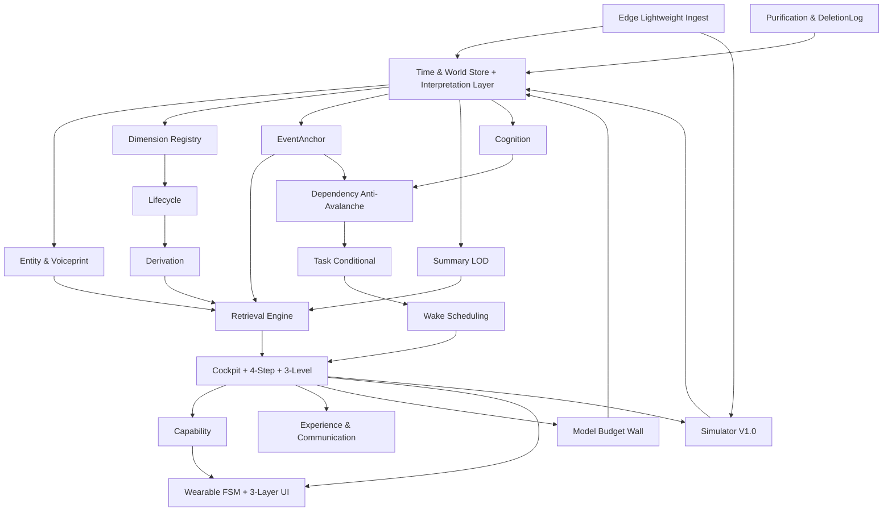

# AIOS Core 架构 V0.2 升级方案（C01-C15）

**基于**：V3宪法116条 + 独立重构方案  
**目标**：替换旧V0.1（基于宪法2.0）的C01-C14，100%支撑V3

---

## 1. 旧C01-C14问题根因回顾

- C01接入与清洗：仅“校验时间单位来源重复包”，无边缘轻量化，无声纹，无DeletionLog，IMU 50Hz直接灌水
- C02时间与世界存储：无解释层，物理层与内心标注混在一起，93条vs31条之一必冲突
- C03维度：定义/成员/派生混一张表，无Candidate→Trial→Active状态机
- C04实体：与C02耦合，无声纹指纹
- C05事件认知总结：事件/Claim/Summary混在一起，总结无LOD物化视图
- C06查询：仅单关键词FTS，无co_search，无5D Slider
- C07依赖：无批量合并，无惰性失效，无circuit breaker
- C08任务：无condition_index，无Zombie TTL，cron思维
- C09触发：仅Observation→Wake，无Task condition→Wake
- C10工作台：十三步循环，多轮ReAct，无Cockpit，无四步法则，无三级流水线
- C11能力：无马达FSM，无三层UI
- C12经验：无CommunicationExperience，无Rapport
- C13模型：无Token预算硬墙
- C14仿真：仅V01-V20，无V21-V30，无R3/V3门

---

## 2. 新C01-C15定义（V0.2）

### C01 Edge Lightweight Ingest（新增核心）

**职责**：IMU宏观状态+显著波形、HR 2h平均+异常窗口30s、图像端侧语义化（场景/物品/人物/OCR）+50KB缩略图可选、语音转文字+声纹绑定、垃圾规则过滤（验证码/营销/群刷屏）

**边界**：不做情绪、关系、事件语义判断，只做波形提炼与语义化

**数据流**：
```
RawSensor(50Hz IMU, 1Hz HR, 5MB Image, Audio) 
  → extract_macro_state / stable_window_avg / vision_parse / speech_to_text+voiceprint
  → ObservationEdge {value=宏观/语义, signal_quality, source_confidence, voiceprint_ref, image_semantic}
  → C02物理层追加存储
```

**存储节省**：IMU 4.3M条/天→100条/天，HR 86k→50条，Image 50MB→10条×200B，99.99%

### C01b Purification & DeletionLog（新增）

**职责**：大模型每日复盘智能清洗，垃圾物理删除但生成DeletionLog，被EvidenceSet/Event/Claim引用的Observation永不物理删除仅archived

**验收**：清洗误删率≤1%，注入100价值+100噪声，审计可回放

### C02 Time & World Store + Interpretation Layer（重定义）

**职责**：唯一时间轴、三类时间、稳定ID、Revision、World Revision、快照、历史读取；新增interpretation_layer表，`target_time_range=过去, valid_time=过去, learned_at=T_now, asserted_at=T_now, recorded_at=T_now`，物理层永不UPDATE

**解决**：93条历史永存 vs 31条之一反向标注矛盾，物理层字节级不动，解释层追加Annotation对象，双时间视图：当时已知视图（knowledge_cutoff=当时） vs 当前认知视图（knowledge_cutoff=now）

**SQL**：
```sql
CREATE TABLE interpretation_layer (
  interpretation_id TEXT PRIMARY KEY,
  target_object_id TEXT, -- 指向过去时空切片
  target_time_range TSTZRANGE,
  content JSONB, -- "极度憋屈与愤怒"
  valid_time TSTZRANGE, -- 过去区间
  learned_at TIMESTAMPTZ, -- T_now
  asserted_at TIMESTAMPTZ,
  recorded_at TIMESTAMPTZ,
  source_refs JSONB, -- 今天原话
  created_by TEXT
);
```

### C02b Entity & Voiceprint Service（合并+增强）

**职责**：实体稳定ID、别名索引、身份Claim、声纹d-vector 256维≈1KB、6个月冷热淘汰、core_entity_protection、墓碑128维24个月

**规则**：被FACT/RELATION引用的声纹永不淘汰，回归先近邻重识别（cosine>0.85）再决定恢复/新建实体

### C03 Dimension Registry（拆分）

**职责**：DimensionDefinition/Membership定义、成员挂载、多重挂载、引用有效性

**边界**：不判断语义价值，只做工程检查：结构合法、引用有效、更新机制可执行、不与现有稳定ID冲突、资源预算允许

### C03b Dimension Lifecycle（新增）

**职责**：Candidate→Trial→Active→Low→Dormant→Merged/Split/Rejected/Reactivated

**预算**：候选上限（每虚拟日≤2）、晋升阈值（共振计数≥N且跨源≥2）、退场TTL（Trial 14d无收益→Low）

### C03c Dimension Derivation（拆分）

**职责**：高层维度由低层组合，input refs+EvidenceSet+scope+counterexamples+confidence+update_policy，支持反例与重审

**示例**：数学+英语+编程→学习能力，input_dimension_ids=[DIM_MATH,DIM_ENGLISH,DIM_CODE]，evidence_set_ids=[...]，scope=用户，confidence=0.7，counterexamples=[母亲生病期]

### C05 EventAnchor Lifecycle（拆分）

**职责**：事件锚点引用而非复制，CANDIDATE→ACTIVE→RESOLVED→REVISED/REJECTED/MERGED/SPLIT，支持下钻，Event不复制Observation只存指针

### C05b Summary & LifeChapter LOD（新增）

**职责**：日/周/月/季/年/3年/5年/10年多尺度总结，LifeChapter相变检测（多维度基线结构性断裂），物化视图mv_daily/mv_weekly/mv_monthly，STALE惰性失效仅查询时重算+日预算

**物化**：
```sql
CREATE MATERIALIZED VIEW mv_daily AS
SELECT subject_id, dimension_id, date_trunc('day', occurred_at) as day, avg(value), count(*)
FROM observations WHERE signal_quality!='NOISE' GROUP BY 1,2,3;
```

### C06 Retrieval Engine（重定义，脊柱）

**职责**：倒排+图双索引，world.co_search(keywords)拓扑交集，world.navigate(pointer)，world.focus(entity)，time.zoom/scale/select_range/shift，1s~10y自由导航，posting交集+≤2跳BFS扇出上限100+共振密集区离线物化，中文预分词版本化

**原子接口**：
- `world.co_search(keywords=[妈妈,生日,礼物], time_range?, entity_filter?) -> {intersection_nodes, resonance_score, pointers, query_plan, coverage, truncated}`
- `world.navigate(pointer) -> object`
- `world.focus(entity_id) -> related events`
- `time.zoom(scale: 1s|10s|1min|1h|1d|1w|1m|1y|10y)`
- `time.select_range(start,end)`
- `time.shift(offset)`

**性能**：100万对象p95≤500ms，超级节点BFS≤200ms，物化命中率≥30%加速比≥5x

### C06b Cognition（Claim/Evidence/Prediction/Goal）（拆分）

**职责**：Claim语义分类+知识状态分离，EvidenceSet一等对象支持区间冻结，Prediction闭环带Reasoning立项理由（防无病呻吟），Goal与Task分离

**Prediction立项理由强制**：`reasoning`字段必须阐述“为什么预测+健康/任务/观念价值”，无价值预测拒绝登记

### C07 Dependency & Anti-Avalanche（增强）

**职责**：反向依赖索引、失效传播、批量复核合并、惰性失效、circuit breaker、深度≤3、波次去重、影响半径裁剪

**算法**：
```
change event → reverse dependency query → 按type标STALE → 若影响>20合并为BatchReverificationTask → 暂停未执行高风险Task → AI重审后新revision
传播限制：深度≤3，同一波次同一对象只STALE一次，取最高severity，circuit breaker若1s内STALE>1000则熔断转后台队列
```

### C08 Task Center Conditional（重写）

**职责**：十类任务+TriggerCriteria DSL (time_reached/context_matched/event_occurred/dependency_ready)+condition_index+inspect_ready()仅返回就绪，Zombie TTL review_interval/max_wait

**DSL**：
```json
{"type": "context_matched", "params": {"geo_fence": {"lat":39.9,"lon":116.3,"radius":500}, "hr_below":60, "silent_period": true}}
{"type": "event_occurred", "params": {"event_type": "MESSAGE_RECEIVED", "entity_id": "P001"}}
{"type": "dependency_ready", "params": {"depends_on": "Task_xxx", "status": "COMPLETED"}}
```

**索引**：
```sql
CREATE INDEX idx_task_condition ON tasks_conditional(trigger_type, next_wake_time, status);
CREATE INDEX idx_task_geo ON tasks_conditional USING GIN ((trigger_params->'geo_fence'));
```

**Token节省**：10k Task仅10 ready时P95<50ms，不全表扫描，节省99.96%

### C09 Wake & Scheduling（增强）

**职责**：六类基础触发+关系节奏触发+长平稳心跳（3-5h）+情境方便度研判（工作/会议/驾驶/深夜绝对不宜打扰）+去重/合并/冷却/升级+优先级抢占+饿死保护+安全旁路

**长平稳心跳**：用户所有曲线长时间平稳本身就是事件，每3-5h触发轻量心跳，驱动AI主动探寻内心数据，但触发≠必须出声，需情境研判

**去重**：dedupe_key=subject+rule+context window，保存first/last/count/evidence refs/peak/是否强度升级，新independent source或severity升级产生新wake

### C10 Cockpit Manifest + Four-Step + Three-Level Pipeline（重写，核心）

**职责**：Single-Shot Cockpit一次性交付，四步心智法则强制校验（mirror→rapport→attitude→world），三级流水线：Active Rolling Window 1500 tokens/5-8轮+Background Streaming Extractor每3-5轮异步萃取+Proactive Associative Recall按需回捞，四层上下文组装：触发指针1.5K→工作状态2K→主动检索记忆5K→近期缓冲2.5K，硬预算12K

**Cockpit字段**：wake_reason(第一指针)+ai_identity_slice+rapport_model+time_location+capability_registry+ready_tasks(已过滤)+mind_steps+token_budget+world_revision

**四步法则**：
1. 照镜子：我是谁、做了什么、底线
2. 校准羁绊：关系厚度/冷战/默契
3. 定姿态：调侃/严肃/关切
4. 看世界：Wake Reason+用户多维+待办

**三级流水线**：
- 前台活跃窗口：最近5-8轮1500 tokens，保证代词指代
- 后台增量萃取：每4-6轮或话题切换，LLM批处理提取Claim/Event挂入维度
- 按需联想回捞：用户一开口立刻全局联想搜索实体档案+历史事件+承诺契约+心理基线，100K~1M战略储备容纳

**1秒首字预算**：
```
ASR final 200-500ms + 机械触发≤20ms + 上下文组装≤150ms + 网络RTT≤150ms + LLM prefill 300-600ms (≤12K tokens) + 首token 100-300ms = 750ms~1.4s p50达标
```

### C11 Capability Registry（保留）

**职责**：轻量App/技能插件声明领域、目标、工具、产生数据、所需认知，AI当前可用能力清单，App不拥有独立世界

### C12 AI Experience & Communication（增强）

**职责**：OperationExperience查询路径、CommunicationExperience方式/语气/反应、Rapport关系厚度、Promise负重、Growth沟通风格进化

**CommunicationExperience**：记录方式（损友/正经/幽默）、语气、用户反应（积极/抵触/无视/大笑/反感），长期积累形成最有效沟通策略

### C13 Model Access & Budget Wall（增强）

**职责**：模型调用、结构化响应、错误、超时、账单，12K硬预算+1M战略储备配额隔离，看板截断N=8，STALE重算日预算，每虚拟日总账

**配额隔离**：交互会话与后台大上下文任务（年度相变复盘）配额隔离，大上下文操作异步队列，不得阻塞交互

### C14 Simulator & Evaluator V1.0（升级）

**职责**：虚拟人生生成、虚拟时钟、故障注入、对照运行、评分，V01-V30+R3/V3门+1-3句检测+Token浪费检测+DeletionLog审计

**V21-V30**：每个正例/反例/证据不足三版本，V21高频不唤醒、V22说过≠事实、V24迟到STALE、V30跨尺度穿透

**R3/V3门**：R3-01黑盒零做题~07分寸自适应，V3-01沟通进化~09共现检索，1-3句平均≤3句P95≤5句

### C15 Wearable Interaction Layer（新增，穿戴形态）

**职责**：柔性全屏5-6cm×23cm、超宽频微震马达语义（微震常规/强震紧急）、FSM：IDLE(骨传导断电休眠零误触)→TRIGGERED(5-10s窗口)→A抬手看屏/B按耳骨传导/C超时、侧键长按2s Fallback、三层UI：顶层体态交互→第一层态势画布微卡片/时间轴微流→第二层技能插件按需投射共享单一大脑

**零误触铁律**：无AI先导震动，骨传导听音通道绝对断电休眠，用户平时抬手/摸耳朵/挠头不引发语音播报，仅震动后窗口瞬间开启

**三层UI**：
- 顶层：抬手翻腕唤醒、按耳骨传导、侧键盲操、震动先导FSM
- 第一层：23cm环绕屏幕画卷，即时微卡片、时间轴微流、AI状态气泡，极简零打扰
- 第二层：无限挂载技能插件，教育/社交/健康/财务等，按需投射共享单一大脑，任务结束归隐，去APP化

---

## 3. 模块关系图



---

## 4. 与V3宪法条款映射

| V3条款 | 落位模块 |
|---|---|
| 16/17唯一时间轴三类时间 | C02 |
| 18-24维度拓扑 | C03/C03b/C03c |
| 30-32双世界+33边缘轻量化 | C01/C02/C02b/C06b |
| 31-1反向标注+93不可篡改 | C02 Interpretation Layer |
| 33声纹6个月淘汰 | C02b |
| 38-45 Claim/EvidenceSet | C06b |
| 46-49 EventAnchor | C05 |
| 50-53 Prediction | C06b+C08 |
| 59 Summary+29 LifeChapter | C05b |
| 72-76维度生命周期 | C03b |
| 78-83触发与心跳 | C09 |
| 84 Cockpit+四步序 | C10 |
| 85三级流水线+四层组装 | C10 |
| 86条件任务 | C08 |
| 87 5D滑动条 | C05b+C06 |
| 88多维共振 | C06+C03c |
| 89共现检索 | C06 |
| 98-1 FSM零误触+104-1三层UI | C15 |
| 12沟通进化+69沟通经验 | C12 |
| 108 14组件 | C01-C15 |

---

**结论**：V0.2新增C01b/C02b/C03b/C03c/C05b/C06b/C15，共15模块，旧13步循环废黜，检索从FTS升级为共现共振，任务从cron升级为条件驱动，上下文从多轮ReAct升级为Single-Shot Cockpit+三级流水线，存储从高频灌水升级为边缘轻量化+DeletionLog，100%支撑V3。
